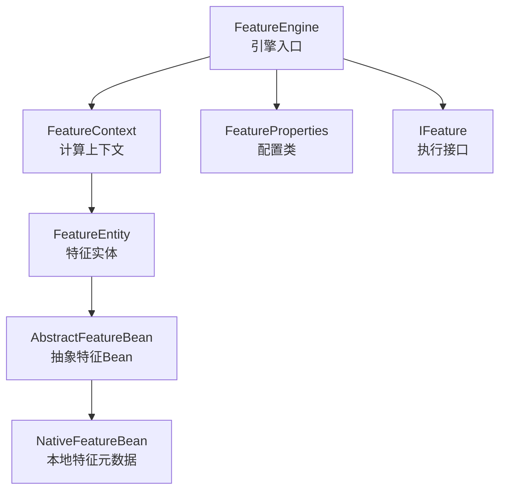
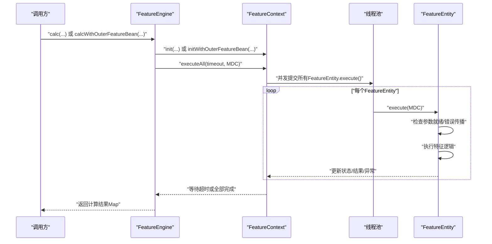
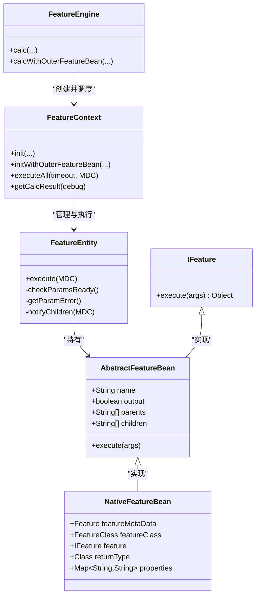

# API参考

<cite>
**本文引用的文件**
- [FeatureEngine.java](file://src/main/java/com/github/zh/engine/FeatureEngine.java)
- [FeatureContext.java](file://src/main/java/com/github/zh/engine/co/FeatureContext.java)
- [FeatureEntity.java](file://src/main/java/com/github/zh/engine/co/FeatureEntity.java)
- [FeatureProperties.java](file://src/main/java/com/github/zh/engine/properties/FeatureProperties.java)
- [Feature.java](file://src/main/java/com/github/zh/engine/annotation/Feature.java)
- [FeatureClass.java](file://src/main/java/com/github/zh/engine/annotation/FeatureClass.java)
- [AbstractFeatureBean.java](file://src/main/java/com/github/zh/engine/co/AbstractFeatureBean.java)
- [NativeFeatureBean.java](file://src/main/java/com/github/zh/engine/co/bean/NativeFeatureBean.java)
- [IFeature.java](file://src/main/java/com/github/zh/engine/clz/IFeature.java)
- [FeatureEngineTest.java](file://src/test/java/com/github/zh/FeatureEngineTest.java)
- [Test.java](file://src/test/java/com/github/zh/feature/Test.java)
- [OuterFeatureBean.java](file://src/test/java/com/github/zh/bean/OuterFeatureBean.java)
- [application.yml](file://src/test/resources/application.yml)
</cite>

## 目录
1. [简介](#简介)
2. [项目结构](#项目结构)
3. [核心组件](#核心组件)
4. [架构总览](#架构总览)
5. [详细组件分析](#详细组件分析)
6. [依赖分析](#依赖分析)
7. [性能考虑](#性能考虑)
8. [故障排查指南](#故障排查指南)
9. [结论](#结论)
10. [附录](#附录)

## 简介
本API参考文档面向特征计算引擎的使用者与维护者，系统性梳理FeatureEngine的核心API、注解体系（@Feature、@FeatureClass）、配置类（FeatureProperties）以及运行期上下文与实体模型。文档严格依据源码实现，给出参数类型、返回值、异常与错误码、使用示例与最佳实践，帮助读者在不深入源码的情况下正确使用该引擎。

## 项目结构
- 引擎入口：FeatureEngine 提供对外计算API（calc、calcWithOuterFeatureBean），负责初始化线程池与调度上下文。
- 注解体系：@Feature、@FeatureClass 定义特征元数据与输出控制。
- 配置类：FeatureProperties 提供线程池大小、计算超时等可配置项。
- 运行时模型：FeatureContext、FeatureEntity、AbstractFeatureBean/NativeFeatureBean 组成计算图与执行单元。
- 处理器：NativeFeatureProcessor 扫描并注册本地特征Bean，构建执行实例与依赖关系。
- 异常：CalculateException、FeatureCreationException 提供统一的异常语义。



**图表来源**
- [FeatureEngine.java:58-308](file://src/main/java/com/github/zh/engine/FeatureEngine.java#L58-L308)
- [FeatureContext.java:43-383](file://src/main/java/com/github/zh/engine/co/FeatureContext.java#L43-L383)
- [FeatureEntity.java:48-214](file://src/main/java/com/github/zh/engine/co/FeatureEntity.java#L48-L214)
- [AbstractFeatureBean.java:39-71](file://src/main/java/com/github/zh/engine/co/AbstractFeatureBean.java#L39-L71)
- [NativeFeatureBean.java:43-106](file://src/main/java/com/github/zh/engine/co/bean/NativeFeatureBean.java#L43-L106)
- [IFeature.java:7-17](file://src/main/java/com/github/zh/engine/clz/IFeature.java#L7-L17)

**章节来源**
- [FeatureEngine.java:58-308](file://src/main/java/com/github/zh/engine/FeatureEngine.java#L58-L308)
- [FeatureProperties.java:16-52](file://src/main/java/com/github/zh/engine/properties/FeatureProperties.java#L16-L52)

## 核心组件
- FeatureEngine：提供九种计算入口，支持本地特征与外部特征Bean混合计算；内置线程池默认按CPU核数动态配置；支持超时控制与调试模式。
- FeatureContext：一次请求的计算上下文，负责构建计算图、并发调度、超时与失败处理、结果收集。
- FeatureEntity：单个特征的执行单元，封装状态机、父子依赖、结果与异常传播。
- FeatureProperties：读取配置前缀com.github.zh.engine.feature下的线程池与超时参数。
- 注解体系：@Feature（方法级）、@FeatureClass（类型级）控制特征命名、输出与描述。
- 异常体系：CalculateException用于计算阶段的业务异常；FeatureCreationException用于特征构造阶段的异常。

**章节来源**
- [FeatureEngine.java:71-222](file://src/main/java/com/github/zh/engine/FeatureEngine.java#L71-L222)
- [FeatureContext.java:16-383](file://src/main/java/com/github/zh/engine/co/FeatureContext.java#L16-L383)
- [FeatureEntity.java:18-214](file://src/main/java/com/github/zh/engine/co/FeatureEntity.java#L18-L214)
- [FeatureProperties.java:16-52](file://src/main/java/com/github/zh/engine/properties/FeatureProperties.java#L16-L52)
- [Feature.java:13-28](file://src/main/java/com/github/zh/engine/annotation/Feature.java#L13-L28)
- [FeatureClass.java:13-17](file://src/main/java/com/github/zh/engine/annotation/FeatureClass.java#L13-L17)

## 架构总览
下图展示从调用方到执行单元的整体流程，包括本地特征与外部Bean的混合计算路径。



**图表来源**
- [FeatureEngine.java:243-264](file://src/main/java/com/github/zh/engine/FeatureEngine.java#L243-L264)
- [FeatureContext.java:75-87](file://src/main/java/com/github/zh/engine/co/FeatureContext.java#L75-L87)
- [FeatureEntity.java:89-164](file://src/main/java/com/github/zh/engine/co/FeatureEntity.java#L89-L164)

## 详细组件分析

### FeatureEngine API 参考

#### 主要方法汇总
- 基础计算方法
  - calc(originDataMap, calcFeatures)
    - 参数：originDataMap（原始输入数据映射）、calcFeatures（待计算特征名集合）
    - 返回：计算结果映射（键为特征名，值为计算结果）
    - 行为：使用默认超时与线程池，非调试模式
  - calc(originDataMap, calcFeatures, timeout)
    - 参数：在上述基础上增加超时毫秒数
    - 返回：同上
  - calc(originDataMap, calcFeatures, debug)
    - 参数：在上述基础上增加调试开关
    - 返回：若debug=true则包含所有特征结果，否则仅返回标记为输出的特征
  - calc(originDataMap, calcFeatures, timeout, calculcatePool, debug)
    - 参数：显式传入线程池与超时
    - 返回：同上

- 外部Bean计算方法
  - calcWithOuterFeatureBean(originDataMap, calcFeatures, outerFeatureBean)
    - 参数：在上述基础上增加外部特征Bean映射
    - 返回：同上
  - calcWithOuterFeatureBean(originDataMap, calcFeatures, outerFeatureBean, timeout)
    - 参数：在上述基础上增加超时
    - 返回：同上
  - calcWithOuterFeatureBean(originDataMap, calcFeatures, outerFeatureBean, debug)
    - 参数：在上述基础上增加调试
    - 返回：同上
  - calcWithOuterFeatureBean(originDataMap, calcFeatures, outerFeatureBean, timeout, calculatePool, debug)
    - 参数：显式传入线程池与超时
    - 返回：同上

#### 方法详细说明

**基础计算方法**
- calc(originDataMap, calcFeatures)
  - 使用默认超时时间（来自FeatureProperties）
  - 返回标记为output=true的特征结果
  - 适用于简单场景，无需外部Bean

- calc(originDataMap, calcFeatures, timeout)
  - 自定义超时时间（毫秒）
  - 其他行为与基础方法相同

- calc(originDataMap, calcFeatures, debug)
  - debug=true时返回所有特征结果（包括中间结果）
  - debug=false时仅返回output=true的特征
  - 适用于调试和问题排查

- calc(originDataMap, calcFeatures, timeout, calculcatePool, debug)
  - 完整自定义版本
  - 可同时指定超时、线程池和调试模式

**外部Bean计算方法**
- calcWithOuterFeatureBean(...)系列方法
  - 支持同时使用本地特征和外部Bean
  - 外部Bean通过Map<String, AbstractFeatureBean>传入
  - 支持所有重载形式的timeout、线程池和debug选项

#### 使用示例

**基础使用**
```java
@Autowired
private FeatureEngine featureEngine;

// 最简单的使用方式
Set<String> features = Set.of("feature1", "feature2");
Map<String, Object> result = featureEngine.calc(originDataMap, features);
```

**带超时控制**
```java
// 设置5秒超时
Map<String, Object> result = featureEngine.calc(originDataMap, features, 5000L);
```

**调试模式**
```java
// 获取所有中间结果
Map<String, Object> result = featureEngine.calc(originDataMap, features, true);
```

**外部Bean集成**
```java
// 创建外部Bean
Map<String, OuterFeatureBean> outerBeans = new HashMap<>();
outerBeans.put("customFeature", new OuterFeatureBean("customFeature", args -> args[0]));

// 混合本地和外部Bean计算
Map<String, Object> result = featureEngine.calcWithOuterFeatureBean(
    originDataMap, features, outerBeans);
```

**最佳实践**
- 优先使用默认线程池；若需自定义，请通过构造或Setter注入ThreadPoolExecutor
- 对于大规模特征计算，合理设置超时以避免阻塞；调试模式有助于定位问题
- 外部Bean应实现AbstractFeatureBean并提供parents/children依赖声明

**异常处理**
- IllegalArgumentException：当calcFeatures为null或空时抛出
- CalculateException：计算超时或失败时抛出
- 建议在调用方捕获并处理这些异常

**章节来源**
- [FeatureEngine.java:71-222](file://src/main/java/com/github/zh/engine/FeatureEngine.java#L71-L222)
- [FeatureEngineTest.java:25-190](file://src/test/java/com/github/zh/FeatureEngineTest.java#L25-L190)

### 注解体系参考

#### @Feature（方法级）
- 属性
  - name: String，默认空串。若为空则使用方法名作为特征名
  - output: boolean，默认true。控制该特征是否出现在最终结果中（调试模式除外）

- 使用规则
  - 必须与@FeatureClass配合使用，标注在被扫描类的方法上
  - 方法参数名即为依赖的上游特征名
  - output=false表示该特征仅作为中间计算步骤

- 示例
```java
@FeatureClass
@Component
public class MyFeatures {
    @Feature(output = false)
    public Integer intermediateCalc(Integer input) {
        return input + 1;
    }
    
    @Feature
    public Integer finalResult(Integer intermediateCalc) {
        return intermediateCalc * 2;
    }
}
```

**章节来源**
- [Feature.java:13-28](file://src/main/java/com/github/zh/engine/annotation/Feature.java#L13-L28)
- [Test.java:28-67](file://src/test/java/com/github/zh/feature/Test.java#L28-L67)

#### @FeatureClass（类型级）
- 属性
  - description: String，默认空串。用于描述该特征类的作用或分组信息

- 使用规则
  - 与@Feature配合，标注在包含@Feature方法的类上
  - 通常需要配合@Component使用以被Spring容器管理

**章节来源**
- [FeatureClass.java:13-17](file://src/main/java/com/github/zh/engine/annotation/FeatureClass.java#L13-L17)
- [Test.java:20-23](file://src/test/java/com/github/zh/feature/Test.java#L20-L23)

### 配置类 FeatureProperties
- 配置前缀: com.github.zh.engine.feature
- 关键参数
  - featureThreadPoolSize: 默认为CPU核心数×2，用于初始化内部线程池
  - featureThreadPoolMaxSize: 默认与featureThreadPoolSize相同
  - calcTimeout: 默认10000ms，用于计算超时控制
  - threadPoolNamePrefix: 默认"feature-pool-"，用于线程命名

- 示例配置
```yaml
com:
  github:
    zh:
      engine:
        feature:
          featureThreadPoolSize: 4
          featureThreadPoolMaxSize: 8
          calcTimeout: 10000
```

**章节来源**
- [FeatureProperties.java:16-52](file://src/main/java/com/github/zh/engine/properties/FeatureProperties.java#L16-L52)
- [application.yml:4-9](file://src/test/resources/application.yml#L4-L9)

### 运行时模型与执行流程

#### FeatureContext（计算上下文）
- 职责
  - 初始化输入数据、本地与外部特征实体
  - 构建依赖关系与中间依赖队列，进行环分析预留
  - 并发调度所有FeatureEntity，等待完成或超时
  - 收集结果，支持调试模式与输出过滤

- 关键行为
  - executeAll(timeout, MDC): 并发执行，超时抛出计算异常
  - getCalcResult(debug): 按调试模式返回全量或仅输出特征结果

**章节来源**
- [FeatureContext.java:64-87](file://src/main/java/com/github/zh/engine/co/FeatureContext.java#L64-L87)
- [FeatureContext.java:356-367](file://src/main/java/com/github/zh/engine/co/FeatureContext.java#L356-L367)

#### FeatureEntity（特征实体）
- 状态机
  - INIT → PROCESSING → SUCCESS/FAILED
  - isEndStates()用于判断是否结束态

- 依赖与执行
  - 检查父节点是否全部完成；若父节点失败则记录根因并快速失败
  - 执行特征逻辑（调用AbstractFeatureBean.execute），更新结果与状态
  - 通知子节点继续执行

**章节来源**
- [FeatureEntity.java:69-164](file://src/main/java/com/github/zh/engine/co/FeatureEntity.java#L69-L164)

#### Bean模型
- AbstractFeatureBean：抽象特征Bean，包含name、output、parents、children字段
- NativeFeatureBean：本地特征Bean，扩展了元数据（@Feature、@FeatureClass）、执行器（IFeature）、返回类型、属性映射等
- IFeature/AbstractFeature：特征执行接口与抽象实现，用于承载具体计算逻辑

**章节来源**
- [AbstractFeatureBean.java:39-71](file://src/main/java/com/github/zh/engine/co/AbstractFeatureBean.java#L39-L71)
- [NativeFeatureBean.java:43-106](file://src/main/java/com/github/zh/engine/co/bean/NativeFeatureBean.java#L43-L106)
- [IFeature.java:7-17](file://src/main/java/com/github/zh/engine/clz/IFeature.java#L7-L17)

### 类关系图（代码级）


**图表来源**
- [FeatureEngine.java:71-222](file://src/main/java/com/github/zh/engine/FeatureEngine.java#L71-L222)
- [FeatureContext.java:102-124](file://src/main/java/com/github/zh/engine/co/FeatureContext.java#L102-L124)
- [FeatureEntity.java:89-164](file://src/main/java/com/github/zh/engine/co/FeatureEntity.java#L89-L164)
- [AbstractFeatureBean.java:39-71](file://src/main/java/com/github/zh/engine/co/AbstractFeatureBean.java#L39-L71)
- [NativeFeatureBean.java:83-106](file://src/main/java/com/github/zh/engine/co/bean/NativeFeatureBean.java#L83-L106)
- [IFeature.java:7-17](file://src/main/java/com/github/zh/engine/clz/IFeature.java#L7-L17)

## 依赖分析
- 组件耦合
  - FeatureEngine对FeatureContext、FeatureProperties有直接依赖
  - FeatureContext对FeatureEntity、FeatureEnums、FeatureStates、CountDownLatch、线程池有直接依赖
  - FeatureEntity对AbstractFeatureBean、IFeature有直接依赖

- 外部依赖
  - Spring容器生命周期事件（ContextRefreshedEvent）用于完成依赖关系填充
  - MDC日志上下文传递，便于链路追踪

**章节来源**
- [FeatureEngine.java:61-69](file://src/main/java/com/github/zh/engine/FeatureEngine.java#L61-L69)
- [FeatureContext.java:222-238](file://src/main/java/com/github/zh/engine/co/FeatureContext.java#L222-L238)

## 性能考虑
- 线程池规模
  - 默认按CPU核心数×2配置，适合大多数IO密集型特征计算场景
  - 可通过配置项调整；过大可能导致上下文切换开销上升

- 超时控制
  - calcTimeout用于整体计算超时；建议根据特征复杂度与依赖深度合理设置

- 并发策略
  - FeatureEntity基于状态机与原子引用保证并发安全；父节点完成后异步通知子节点

- 调试模式
  - 开启debug会返回全部特征结果，便于排障但可能带来额外内存与序列化成本

## 故障排查指南
- 常见异常与错误码
  - 计算异常（CalculateException）
    - 抛出场景：无待计算变量、计算超时、缺少依赖特征、执行过程中发生异常
    - 相关位置：executeAll方法、FeatureContext初始化检查
  - 参数异常（IllegalArgumentException）
    - 抛出场景：calcFeatures为null或空集合
    - 相关位置：doCalc方法参数校验

- 错误定位建议
  - 使用调试模式获取全量结果，结合日志定位失败特征
  - 通过getRootErrorFeature获取根错误特征名，快速定位源头

- 配置校验
  - 确认线程池大小与超时设置满足业务负载
  - 检查编译参数-maven-parameters是否正确配置

**章节来源**
- [FeatureEngine.java:246-248](file://src/main/java/com/github/zh/engine/FeatureEngine.java#L246-L248)
- [FeatureContext.java:76-86](file://src/main/java/com/github/zh/engine/co/FeatureContext.java#L76-L86)
- [FeatureContext.java:331-341](file://src/main/java/com/github/zh/engine/co/FeatureContext.java#L331-L341)

## 结论
本文档基于源码实现了对特征计算引擎的完整API参考，覆盖引擎入口、注解体系、配置参数、运行时模型与异常机制，并提供了流程图与类图帮助理解。建议在生产环境中结合配置文件与调试模式进行压测与验证，确保线程池规模与超时设置满足业务需求。

## 附录

### 使用示例与最佳实践

**基础特征计算**
```java
@Autowired
private FeatureEngine featureEngine;

// 准备输入数据与待计算特征集合
Map<String, Object> originData = new HashMap<>();
originData.put("input1", 100);
Set<String> features = Set.of("featureA", "featureB");

// 基础计算
Map<String, Object> result = featureEngine.calc(originData, features);
```

**外部Bean集成示例**
```java
// 创建自定义外部Bean
public class CustomFeatureBean extends AbstractFeatureBean {
    @Override
    public Object execute(Object[] args) {
        return args[0].toString() + "_processed";
    }
}

// 注册并使用
Map<String, OuterFeatureBean> outerBeans = new HashMap<>();
outerBeans.put("customFeature", new CustomFeatureBean("customFeature", args -> args[0]));
Map<String, Object> result = featureEngine.calcWithOuterFeatureBean(
    originData, features, outerBeans);
```

**配置最佳实践**
- 线程池配置：根据CPU核心数和业务特性调整featureThreadPoolSize
- 超时设置：根据特征计算复杂度设置合理的calcTimeout
- 调试模式：开发环境开启，生产环境关闭

**异常处理建议**
```java
try {
    Map<String, Object> result = featureEngine.calc(features, timeout);
} catch (CalculateException e) {
    // 处理计算异常（超时、依赖缺失等）
    log.error("Feature calculation failed", e);
} catch (IllegalArgumentException e) {
    // 处理参数异常
    log.error("Invalid parameters", e);
}
```

**章节来源**
- [FeatureEngineTest.java:25-190](file://src/test/java/com/github/zh/FeatureEngineTest.java#L25-L190)
- [Test.java:28-67](file://src/test/java/com/github/zh/feature/Test.java#L28-L67)
- [OuterFeatureBean.java:10-16](file://src/test/java/com/github/zh/bean/OuterFeatureBean.java#L10-L16)