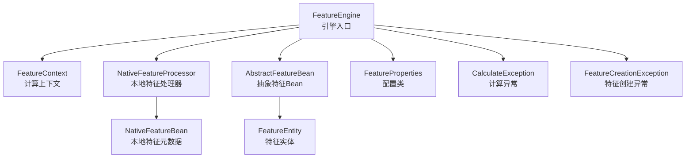
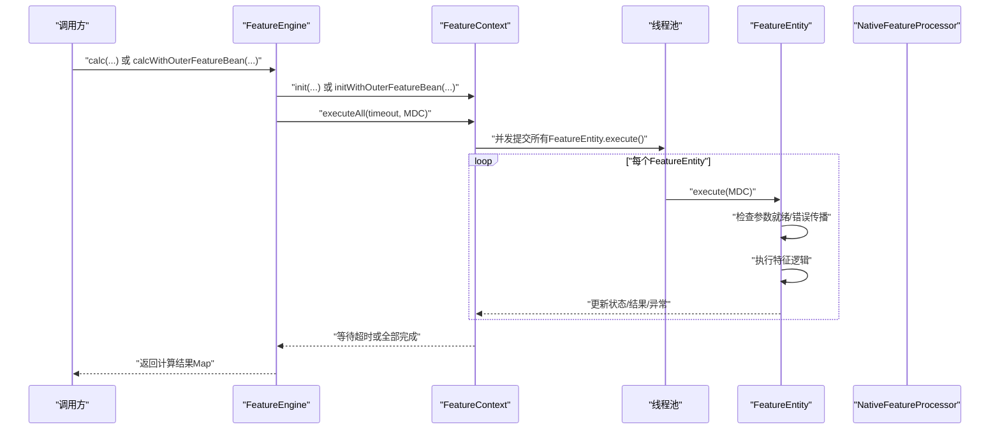
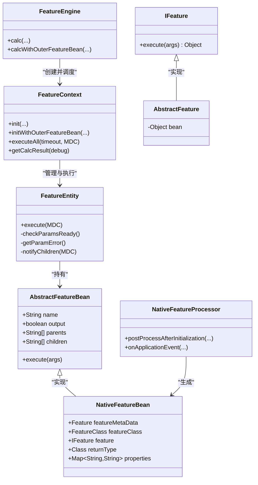
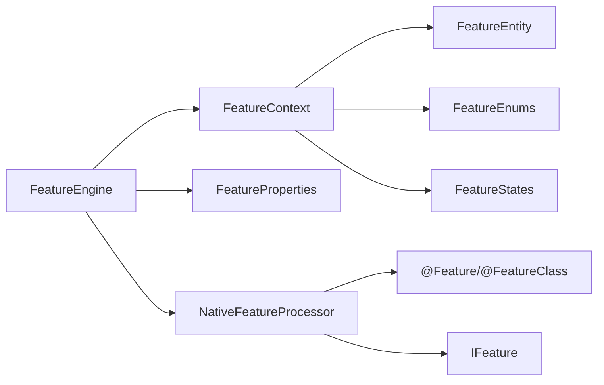

# API参考

<cite>
**本文引用的文件**
- [FeatureEngine.java](file://src/main/java/com/github/zh/engine/FeatureEngine.java)
- [Feature.java](file://src/main/java/com/github/zh/engine/annotation/Feature.java)
- [FeatureClass.java](file://src/main/java/com/github/zh/engine/annotation/FeatureClass.java)
- [FeatureProperties.java](file://src/main/java/com/github/zh/engine/properties/FeatureProperties.java)
- [FeatureContext.java](file://src/main/java/com/github/zh/engine/co/FeatureContext.java)
- [FeatureEntity.java](file://src/main/java/com/github/zh/engine/co/FeatureEntity.java)
- [AbstractFeatureBean.java](file://src/main/java/com/github/zh/engine/co/AbstractFeatureBean.java)
- [NativeFeatureBean.java](file://src/main/java/com/github/zh/engine/co/bean/NativeFeatureBean.java)
- [NativeFeatureProcessor.java](file://src/main/java/com/github/zh/engine/processor/NativeFeatureProcessor.java)
- [IFeature.java](file://src/main/java/com/github/zh/engine/clz/IFeature.java)
- [AbstractFeature.java](file://src/main/java/com/github/zh/engine/clz/AbstractFeature.java)
- [FeatureEnums.java](file://src/main/java/com/github/zh/engine/enums/FeatureEnums.java)
- [FeatureStates.java](file://src/main/java/com/github/zh/engine/enums/FeatureStates.java)
- [CalculateException.java](file://src/main/java/com/github/zh/engine/exception/CalculateException.java)
- [FeatureCreationException.java](file://src/main/java/com/github/zh/engine/exception/FeatureCreationException.java)
- [application.yml](file://src/test/resources/application.yml)
- [OuterFeatureBean.java](file://src/test/java/com/github/zh/bean/OuterFeatureBean.java)
</cite>

## 目录
1. [简介](#简介)
2. [项目结构](#项目结构)
3. [核心组件](#核心组件)
4. [架构总览](#架构总览)
5. [详细组件分析](#详细组件分析)
6. [依赖分析](#依赖分析)
7. [性能考虑](#性能考虑)
8. [故障排查指南](#故障排查指南)
9. [结论](#结论)
10. [附录](#附录)

## 简介
本API参考文档面向特征计算引擎的使用者与维护者，系统性梳理FeatureEngine的核心API、注解体系（@Feature、@FeatureClass）、配置类（FeatureProperties）以及运行期上下文与实体模型。文档严格依据源码实现，给出参数类型、返回值、异常与错误码、使用示例与最佳实践，帮助读者在不深入源码的情况下正确使用该引擎。

## 项目结构
- 引擎入口：FeatureEngine 提供对外计算API（calc、calcWithOuterFeatureBean），负责初始化线程池与调度上下文。
- 注解体系：@Feature、@FeatureClass 定义特征元数据与输出控制。
- 配置类：FeatureProperties 提供线程池大小、计算超时等可配置项。
- 运行时模型：FeatureContext、FeatureEntity、AbstractFeatureBean/NativeFeatureBean 组成计算图与执行单元。
- 处理器：NativeFeatureProcessor 扫描并注册本地特征Bean，构建执行实例与依赖关系。
- 异常：CalculateException、FeatureCreationException 提供统一的异常语义。

图表来源
- [FeatureEngine.java:29-171](file://src/main/java/com/github/zh/engine/FeatureEngine.java#L29-L171)
- [FeatureContext.java:23-298](file://src/main/java/com/github/zh/engine/co/FeatureContext.java#L23-L298)
- [NativeFeatureProcessor.java:28-131](file://src/main/java/com/github/zh/engine/processor/NativeFeatureProcessor.java#L28-L131)
- [FeatureProperties.java:16-36](file://src/main/java/com/github/zh/engine/properties/FeatureProperties.java#L16-L36)
- [CalculateException.java:9-19](file://src/main/java/com/github/zh/engine/exception/CalculateException.java#L9-L19)
- [FeatureCreationException.java:11-21](file://src/main/java/com/github/zh/engine/exception/FeatureCreationException.java#L11-L21)

章节来源
- [FeatureEngine.java:29-171](file://src/main/java/com/github/zh/engine/FeatureEngine.java#L29-L171)
- [FeatureProperties.java:16-36](file://src/main/java/com/github/zh/engine/properties/FeatureProperties.java#L16-L36)

## 核心组件
- FeatureEngine：提供两种计算入口，支持本地特征与外部特征Bean混合计算；内置线程池默认按CPU核数动态配置；支持超时控制与调试模式。
- FeatureContext：一次请求的计算上下文，负责构建计算图、并发调度、超时与失败处理、结果收集。
- FeatureEntity：单个特征的执行单元，封装状态机、父子依赖、结果与异常传播。
- NativeFeatureProcessor：扫描标注了@FeatureClass的类中的@Feature方法，生成NativeFeatureBean并注册到全局。
- FeatureProperties：读取配置前缀com.github.zh.engine.feature下的线程池与超时参数。
- 注解体系：@Feature（方法级）、@FeatureClass（类型级）控制特征命名、输出与描述。
- 异常体系：CalculateException用于计算阶段的业务异常；FeatureCreationException用于特征构造阶段的异常。

章节来源
- [FeatureEngine.java:49-161](file://src/main/java/com/github/zh/engine/FeatureEngine.java#L49-L161)
- [FeatureContext.java:49-298](file://src/main/java/com/github/zh/engine/co/FeatureContext.java#L49-L298)
- [FeatureEntity.java:48-155](file://src/main/java/com/github/zh/engine/co/FeatureEntity.java#L48-L155)
- [NativeFeatureProcessor.java:28-131](file://src/main/java/com/github/zh/engine/processor/NativeFeatureProcessor.java#L28-L131)
- [FeatureProperties.java:16-36](file://src/main/java/com/github/zh/engine/properties/FeatureProperties.java#L16-L36)
- [Feature.java:13-27](file://src/main/java/com/github/zh/engine/annotation/Feature.java#L13-L27)
- [FeatureClass.java:13-16](file://src/main/java/com/github/zh/engine/annotation/FeatureClass.java#L13-L16)
- [CalculateException.java:9-19](file://src/main/java/com/github/zh/engine/exception/CalculateException.java#L9-L19)
- [FeatureCreationException.java:11-21](file://src/main/java/com/github/zh/engine/exception/FeatureCreationException.java#L11-L21)

## 架构总览
下图展示从调用方到执行单元的整体流程，包括本地特征与外部Bean的混合计算路径。

图表来源
- [FeatureEngine.java:86-161](file://src/main/java/com/github/zh/engine/FeatureEngine.java#L86-L161)
- [FeatureContext.java:49-90](file://src/main/java/com/github/zh/engine/co/FeatureContext.java#L49-L90)
- [FeatureEntity.java:48-134](file://src/main/java/com/github/zh/engine/co/FeatureEntity.java#L48-L134)
- [NativeFeatureProcessor.java:32-66](file://src/main/java/com/github/zh/engine/processor/NativeFeatureProcessor.java#L32-L66)

## 详细组件分析

### FeatureEngine API 参考
- 方法概览
  - calc(originDataMap, calcFeatures)
    - 参数
      - originDataMap: 原始输入数据映射
      - calcFeatures: 待计算特征名集合
    - 返回: 计算结果映射（键为特征名，值为计算结果）
    - 行为: 使用默认超时与线程池，非调试模式
    - 示例路径: [FeatureEngine.java:49](file://src/main/java/com/github/zh/engine/FeatureEngine.java#L49)
  - calc(originDataMap, calcFeatures, timeout)
    - 参数: 在上述基础上增加超时毫秒数
    - 返回: 同上
    - 示例路径: [FeatureEngine.java:61](file://src/main/java/com/github/zh/engine/FeatureEngine.java#L61)
  - calc(originDataMap, calcFeatures, debug)
    - 参数: 在上述基础上增加调试开关
    - 返回: 若debug=true则包含所有特征结果，否则仅返回标记为输出的特征
    - 示例路径: [FeatureEngine.java:73](file://src/main/java/com/github/zh/engine/FeatureEngine.java#L73)
  - calc(originDataMap, calcFeatures, timeout, calculcatePool, debug)
    - 参数: 显式传入线程池与超时
    - 返回: 同上
    - 示例路径: [FeatureEngine.java:86](file://src/main/java/com/github/zh/engine/FeatureEngine.java#L86)
  - calcWithOuterFeatureBean(originDataMap, calcFeatures, outerFeatureBean)
    - 参数: 在上述基础上增加外部特征Bean映射
    - 返回: 同上
    - 示例路径: [FeatureEngine.java:106](file://src/main/java/com/github/zh/engine/FeatureEngine.java#L106)
  - calcWithOuterFeatureBean(originDataMap, calcFeatures, outerFeatureBean, timeout)
    - 参数: 在上述基础上增加超时
    - 返回: 同上
    - 示例路径: [FeatureEngine.java:120](file://src/main/java/com/github/zh/engine/FeatureEngine.java#L120)
  - calcWithOuterFeatureBean(originDataMap, calcFeatures, outerFeatureBean, debug)
    - 参数: 在上述基础上增加调试
    - 返回: 同上
    - 示例路径: [FeatureEngine.java:134](file://src/main/java/com/github/zh/engine/FeatureEngine.java#L134)
  - calcWithOuterFeatureBean(originDataMap, calcFeatures, outerFeatureBean, timeout, calculatePool, debug)
    - 参数: 显式传入线程池与超时
    - 返回: 同上
    - 示例路径: [FeatureEngine.java:149](file://src/main/java/com/github/zh/engine/FeatureEngine.java#L149)

- 最佳实践
  - 优先使用默认线程池；若需自定义，请通过构造或Setter注入ThreadPoolExecutor。
  - 对于大规模特征计算，合理设置超时以避免阻塞；调试模式有助于定位问题。
  - 外部Bean应实现AbstractFeatureBean并提供parents/children依赖声明。

章节来源
- [FeatureEngine.java:49-161](file://src/main/java/com/github/zh/engine/FeatureEngine.java#L49-L161)

### 注解体系参考

#### @Feature（方法级）
- 属性
  - name: String，默认空串。若为空则使用方法名作为特征名。
  - output: boolean，默认true。控制该特征是否出现在最终结果中（调试模式除外）。
- 使用规则
  - 必须与@FeatureClass配合使用，标注在被扫描类的方法上。
  - 方法参数名即为依赖的上游特征名。
- 示例路径
  - [Feature.java:13-27](file://src/main/java/com/github/zh/engine/annotation/Feature.java#L13-L27)
  - [NativeFeatureProcessor.java:38-66](file://src/main/java/com/github/zh/engine/processor/NativeFeatureProcessor.java#L38-L66)

章节来源
- [Feature.java:13-27](file://src/main/java/com/github/zh/engine/annotation/Feature.java#L13-L27)
- [NativeFeatureProcessor.java:38-66](file://src/main/java/com/github/zh/engine/processor/NativeFeatureProcessor.java#L38-L66)

#### @FeatureClass（类型级）
- 属性
  - description: String，默认空串。用于描述该特征类的作用或分组信息。
- 使用规则
  - 与@Feature配合，标注在包含@Feature方法的类上。
- 示例路径
  - [FeatureClass.java:13-16](file://src/main/java/com/github/zh/engine/annotation/FeatureClass.java#L13-L16)
  - [NativeFeatureProcessor.java:34](file://src/main/java/com/github/zh/engine/processor/NativeFeatureProcessor.java#L34)

章节来源
- [FeatureClass.java:13-16](file://src/main/java/com/github/zh/engine/annotation/FeatureClass.java#L13-L16)
- [NativeFeatureProcessor.java:34](file://src/main/java/com/github/zh/engine/processor/NativeFeatureProcessor.java#L34)

### 配置类 FeatureProperties
- 配置前缀: com.github.zh.engine.feature
- 关键参数
  - featureThreadPoolSize: 默认为CPU核心数×2，用于初始化内部线程池。
  - featureThreadPoolMaxSize: 默认与featureThreadPoolSize相同。
  - calcTimeout: 默认10000ms，用于计算超时控制。
- 示例路径
  - [FeatureProperties.java:16-36](file://src/main/java/com/github/zh/engine/properties/FeatureProperties.java#L16-L36)
  - [application.yml:4-9](file://src/test/resources/application.yml#L4-L9)

章节来源
- [FeatureProperties.java:16-36](file://src/main/java/com/github/zh/engine/properties/FeatureProperties.java#L16-L36)
- [application.yml:4-9](file://src/test/resources/application.yml#L4-L9)

### 运行时模型与执行流程

#### FeatureContext（计算上下文）
- 职责
  - 初始化输入数据、本地与外部特征实体。
  - 构建依赖关系与中间依赖队列，进行环分析预留。
  - 并发调度所有FeatureEntity，等待完成或超时。
  - 收集结果，支持调试模式与输出过滤。
- 关键行为
  - executeAll(timeout, MDC): 并发执行，超时抛出计算异常。
  - getCalcResult(debug): 按调试模式返回全量或仅输出特征结果。
- 示例路径
  - [FeatureContext.java:49-90](file://src/main/java/com/github/zh/engine/co/FeatureContext.java#L49-L90)
  - [FeatureContext.java:277-288](file://src/main/java/com/github/zh/engine/co/FeatureContext.java#L277-L288)

章节来源
- [FeatureContext.java:49-90](file://src/main/java/com/github/zh/engine/co/FeatureContext.java#L49-L90)
- [FeatureContext.java:277-288](file://src/main/java/com/github/zh/engine/co/FeatureContext.java#L277-L288)

#### FeatureEntity（特征实体）
- 状态机
  - INIT → PROCESSING → SUCCESS/FAILED
  - isEndStates()用于判断是否结束态。
- 依赖与执行
  - 检查父节点是否全部完成；若父节点失败则记录根因并快速失败。
  - 执行特征逻辑（调用AbstractFeatureBean.execute），更新结果与状态。
  - 通知子节点继续执行。
- 示例路径
  - [FeatureEntity.java:48-134](file://src/main/java/com/github/zh/engine/co/FeatureEntity.java#L48-L134)
  - [FeatureStates.java:9-32](file://src/main/java/com/github/zh/engine/enums/FeatureStates.java#L9-L32)

章节来源
- [FeatureEntity.java:48-134](file://src/main/java/com/github/zh/engine/co/FeatureEntity.java#L48-L134)
- [FeatureStates.java:9-32](file://src/main/java/com/github/zh/engine/enums/FeatureStates.java#L9-L32)

#### Bean模型
- AbstractFeatureBean：抽象特征Bean，包含name、output、parents、children字段。
- NativeFeatureBean：本地特征Bean，扩展了元数据（@Feature、@FeatureClass）、执行器（IFeature）、返回类型、属性映射等。
- IFeature/AbstractFeature：特征执行接口与抽象实现，用于承载具体计算逻辑。
- 示例路径
  - [AbstractFeatureBean.java:18-27](file://src/main/java/com/github/zh/engine/co/AbstractFeatureBean.java#L18-L27)
  - [NativeFeatureBean.java:24-52](file://src/main/java/com/github/zh/engine/co/bean/NativeFeatureBean.java#L24-L52)
  - [IFeature.java:7-16](file://src/main/java/com/github/zh/engine/clz/IFeature.java#L7-L16)
  - [AbstractFeature.java:7-14](file://src/main/java/com/github/zh/engine/clz/AbstractFeature.java#L7-L14)

章节来源
- [AbstractFeatureBean.java:18-27](file://src/main/java/com/github/zh/engine/co/AbstractFeatureBean.java#L18-L27)
- [NativeFeatureBean.java:24-52](file://src/main/java/com/github/zh/engine/co/bean/NativeFeatureBean.java#L24-L52)
- [IFeature.java:7-16](file://src/main/java/com/github/zh/engine/clz/IFeature.java#L7-L16)
- [AbstractFeature.java:7-14](file://src/main/java/com/github/zh/engine/clz/AbstractFeature.java#L7-L14)

#### 处理器 NativeFeatureProcessor
- 职责
  - 扫描@FeatureClass类中的@Feature方法，生成IFeature执行实例与NativeFeatureBean。
  - 填充parents为方法参数名，children为空列表，后续由上下文补全。
  - 触发后置处理器与注册。
- 示例路径
  - [NativeFeatureProcessor.java:32-131](file://src/main/java/com/github/zh/engine/processor/NativeFeatureProcessor.java#L32-L131)

章节来源
- [NativeFeatureProcessor.java:32-131](file://src/main/java/com/github/zh/engine/processor/NativeFeatureProcessor.java#L32-L131)

### 类关系图（代码级）

图表来源
- [FeatureEngine.java:49-161](file://src/main/java/com/github/zh/engine/FeatureEngine.java#L49-L161)
- [FeatureContext.java:71-128](file://src/main/java/com/github/zh/engine/co/FeatureContext.java#L71-L128)
- [FeatureEntity.java:48-155](file://src/main/java/com/github/zh/engine/co/FeatureEntity.java#L48-L155)
- [AbstractFeatureBean.java:18-27](file://src/main/java/com/github/zh/engine/co/AbstractFeatureBean.java#L18-L27)
- [NativeFeatureBean.java:24-52](file://src/main/java/com/github/zh/engine/co/bean/NativeFeatureBean.java#L24-L52)
- [IFeature.java:7-16](file://src/main/java/com/github/zh/engine/clz/IFeature.java#L7-L16)
- [AbstractFeature.java:7-14](file://src/main/java/com/github/zh/engine/clz/AbstractFeature.java#L7-L14)
- [NativeFeatureProcessor.java:28-131](file://src/main/java/com/github/zh/engine/processor/NativeFeatureProcessor.java#L28-L131)

## 依赖分析
- 组件耦合
  - FeatureEngine对FeatureContext、NativeFeatureProcessor、FeatureProperties有直接依赖。
  - FeatureContext对FeatureEntity、FeatureEnums、FeatureStates、CountDownLatch、线程池有直接依赖。
  - NativeFeatureProcessor对FeatureClass、Feature、Property等注解与IFeature有直接依赖。
- 外部依赖
  - Spring容器生命周期事件（ContextRefreshedEvent）用于完成依赖关系填充。
  - MDC日志上下文传递，便于链路追踪。
- 依赖可视化

图表来源
- [FeatureEngine.java:32-40](file://src/main/java/com/github/zh/engine/FeatureEngine.java#L32-L40)
- [FeatureContext.java:25-41](file://src/main/java/com/github/zh/engine/co/FeatureContext.java#L25-L41)
- [NativeFeatureProcessor.java:34-101](file://src/main/java/com/github/zh/engine/processor/NativeFeatureProcessor.java#L34-L101)

章节来源
- [FeatureEngine.java:32-40](file://src/main/java/com/github/zh/engine/FeatureEngine.java#L32-L40)
- [FeatureContext.java:25-41](file://src/main/java/com/github/zh/engine/co/FeatureContext.java#L25-L41)
- [NativeFeatureProcessor.java:34-101](file://src/main/java/com/github/zh/engine/processor/NativeFeatureProcessor.java#L34-L101)

## 性能考虑
- 线程池规模
  - 默认按CPU核心数×2配置，适合大多数IO密集型特征计算场景。
  - 可通过配置项调整；过大可能导致上下文切换开销上升。
- 超时控制
  - calcTimeout用于整体计算超时；建议根据特征复杂度与依赖深度合理设置。
- 并发策略
  - FeatureEntity基于状态机与原子引用保证并发安全；父节点完成后异步通知子节点。
- 调试模式
  - 开启debug会返回全部特征结果，便于排障但可能带来额外内存与序列化成本。

[本节为通用性能建议，无需特定文件引用]

## 故障排查指南
- 常见异常与错误码
  - 计算异常（CalculateException）
    - 抛出场景：无待计算变量、计算超时、缺少依赖特征、执行过程中发生异常。
    - 相关位置：[FeatureContext.java:51](file://src/main/java/com/github/zh/engine/co/FeatureContext.java#L51)、[FeatureContext.java:59](file://src/main/java/com/github/zh/engine/co/FeatureContext.java#L59)、[FeatureContext.java:237](file://src/main/java/com/github/zh/engine/co/FeatureContext.java#L237)、[FeatureEntity.java:108-115](file://src/main/java/com/github/zh/engine/co/FeatureEntity.java#L108-L115)
  - 特征创建异常（FeatureCreationException）
    - 抛出场景：扫描@Feature方法生成执行实例或构造NativeFeatureBean失败。
    - 相关位置：[NativeFeatureProcessor.java:61](file://src/main/java/com/github/zh/engine/processor/NativeFeatureProcessor.java#L61)
- 错误定位建议
  - 使用调试模式获取全量结果，结合日志定位失败特征。
  - 通过getRootErrorFeature获取根错误特征名，快速定位源头。
- 配置校验
  - 确认线程池大小与超时设置满足业务负载；参考配置文件示例：[application.yml:4-9](file://src/test/resources/application.yml#L4-L9)

章节来源
- [CalculateException.java:9-19](file://src/main/java/com/github/zh/engine/exception/CalculateException.java#L9-L19)
- [FeatureCreationException.java:11-21](file://src/main/java/com/github/zh/engine/exception/FeatureCreationException.java#L11-L21)
- [FeatureContext.java:51-59](file://src/main/java/com/github/zh/engine/co/FeatureContext.java#L51-L59)
- [FeatureContext.java:237](file://src/main/java/com/github/zh/engine/co/FeatureContext.java#L237)
- [FeatureEntity.java:108-115](file://src/main/java/com/github/zh/engine/co/FeatureEntity.java#L108-L115)
- [application.yml:4-9](file://src/test/resources/application.yml#L4-L9)

## 结论
本文档基于源码实现了对特征计算引擎的完整API参考，覆盖引擎入口、注解体系、配置参数、运行时模型与异常机制，并提供了流程图与类图帮助理解。建议在生产环境中结合配置文件与调试模式进行压测与验证，确保线程池规模与超时设置满足业务需求。

[本节为总结性内容，无需特定文件引用]

## 附录

### 使用示例与最佳实践
- 使用本地特征计算
  - 准备输入数据与待计算特征集合，调用calc(...)或带超时/调试参数的重载版本。
  - 示例路径: [FeatureEngine.java:49](file://src/main/java/com/github/zh/engine/FeatureEngine.java#L49)
- 使用外部特征Bean
  - 实现AbstractFeatureBean并提供parents/children依赖声明，通过calcWithOuterFeatureBean(...)传入。
  - 示例路径: [OuterFeatureBean.java:10-15](file://src/test/java/com/github/zh/bean/OuterFeatureBean.java#L10-L15)
- 自定义线程池与超时
  - 通过构造函数或Setter注入ThreadPoolExecutor；或在配置文件中设置featureThreadPoolSize与calcTimeout。
  - 示例路径: [FeatureEngine.java:36-37](file://src/main/java/com/github/zh/engine/FeatureEngine.java#L36-L37)、[FeatureProperties.java:31-35](file://src/main/java/com/github/zh/engine/properties/FeatureProperties.java#L31-L35)、[application.yml:4-9](file://src/test/resources/application.yml#L4-L9)
- 最佳实践
  - 将@Feature方法的参数名作为依赖标识，保持简洁且语义明确。
  - 对于复杂特征，建议拆分为多个@Feature方法并通过参数名串联依赖。
  - 生产环境开启日志与监控，结合调试模式定位问题。

章节来源
- [FeatureEngine.java:49-161](file://src/main/java/com/github/zh/engine/FeatureEngine.java#L49-L161)
- [OuterFeatureBean.java:10-15](file://src/test/java/com/github/zh/bean/OuterFeatureBean.java#L10-L15)
- [FeatureProperties.java:31-35](file://src/main/java/com/github/zh/engine/properties/FeatureProperties.java#L31-L35)
- [application.yml:4-9](file://src/test/resources/application.yml#L4-L9)