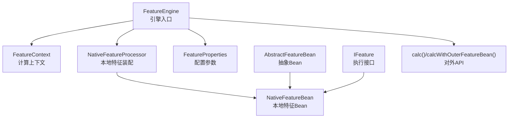
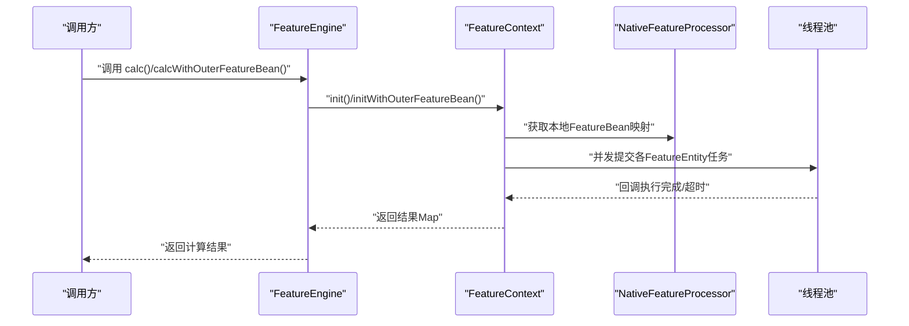
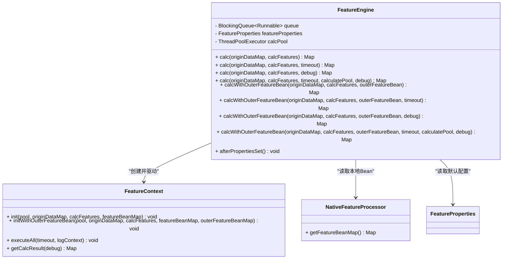
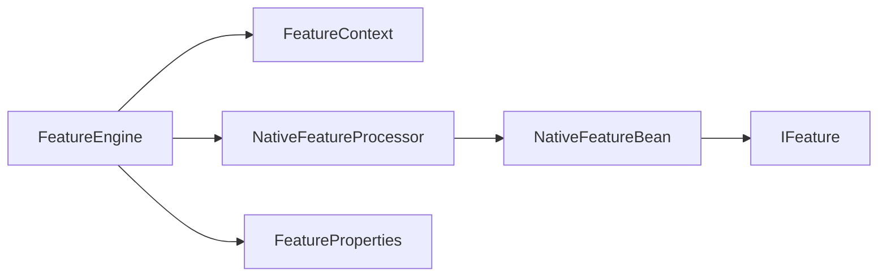

# FeatureEngine核心API

<cite>
**本文引用的文件**
- [FeatureEngine.java](file://src/main/java/com/github/zh/engine/FeatureEngine.java)
- [FeatureContext.java](file://src/main/java/com/github/zh/engine/co/FeatureContext.java)
- [NativeFeatureProcessor.java](file://src/main/java/com/github/zh/engine/processor/NativeFeatureProcessor.java)
- [FeatureProperties.java](file://src/main/java/com/github/zh/engine/properties/FeatureProperties.java)
- [AbstractFeatureBean.java](file://src/main/java/com/github/zh/engine/co/AbstractFeatureBean.java)
- [NativeFeatureBean.java](file://src/main/java/com/github/zh/engine/co/bean/NativeFeatureBean.java)
- [IFeature.java](file://src/main/java/com/github/zh/engine/clz/IFeature.java)
- [FeatureEnums.java](file://src/main/java/com/github/zh/engine/enums/FeatureEnums.java)
- [FeatureStates.java](file://src/main/java/com/github/zh/engine/enums/FeatureStates.java)
- [README.md](file://README.md)
- [OuterFeatureBean.java](file://src/test/java/com/github/zh/bean/OuterFeatureBean.java)
- [Test.java](file://src/test/java/com/github/zh/feature/Test.java)
</cite>

## 目录
1. [简介](#简介)
2. [项目结构](#项目结构)
3. [核心组件](#核心组件)
4. [架构总览](#架构总览)
5. [详细组件分析](#详细组件分析)
6. [依赖分析](#依赖分析)
7. [性能考虑](#性能考虑)
8. [故障排查指南](#故障排查指南)
9. [结论](#结论)
10. [附录](#附录)

## 简介
本文件面向FeatureEngine核心API，系统性梳理calc()系列与calcWithOuterFeatureBean()系列方法的重载、参数、返回值、使用场景与性能特性；详解外部特征Bean的传入与集成方式；提供基础用法、超时控制、调试模式等完整使用示例；说明线程池参数对计算性能的影响及调优建议；并给出异常处理与最佳实践。

## 项目结构
- 引擎入口：FeatureEngine
- 计算上下文：FeatureContext（负责DAG构建、并发执行、超时与结果收集）
- 本地特征装配：NativeFeatureProcessor（扫描注解、生成NativeFeatureBean）
- 配置参数：FeatureProperties（线程池大小、计算超时）
- 特征Bean抽象：AbstractFeatureBean、NativeFeatureBean、IFeature
- 枚举：FeatureEnums、FeatureStates
- 测试样例：OuterFeatureBean、Test

图表来源
- [FeatureEngine.java:29-172](file://src/main/java/com/github/zh/engine/FeatureEngine.java#L29-L172)
- [FeatureContext.java:23-298](file://src/main/java/com/github/zh/engine/co/FeatureContext.java#L23-L298)
- [NativeFeatureProcessor.java:28-131](file://src/main/java/com/github/zh/engine/processor/NativeFeatureProcessor.java#L28-L131)
- [FeatureProperties.java:16-37](file://src/main/java/com/github/zh/engine/properties/FeatureProperties.java#L16-L37)
- [AbstractFeatureBean.java:18-28](file://src/main/java/com/github/zh/engine/co/AbstractFeatureBean.java#L18-L28)
- [NativeFeatureBean.java:24-53](file://src/main/java/com/github/zh/engine/co/bean/NativeFeatureBean.java#L24-L53)
- [IFeature.java:7-17](file://src/main/java/com/github/zh/engine/clz/IFeature.java#L7-L17)

章节来源
- [FeatureEngine.java:29-172](file://src/main/java/com/github/zh/engine/FeatureEngine.java#L29-L172)
- [FeatureContext.java:23-298](file://src/main/java/com/github/zh/engine/co/FeatureContext.java#L23-L298)
- [NativeFeatureProcessor.java:28-131](file://src/main/java/com/github/zh/engine/processor/NativeFeatureProcessor.java#L28-L131)
- [FeatureProperties.java:16-37](file://src/main/java/com/github/zh/engine/properties/FeatureProperties.java#L16-L37)

## 核心组件
- FeatureEngine：对外暴露calc()与calcWithOuterFeatureBean()系列API，封装线程池、超时与调试开关，协调FeatureContext完成计算。
- FeatureContext：构建DAG、注册原始数据、本地与外部特征实体、并发执行、超时等待、结果收集与失败检查。
- NativeFeatureProcessor：扫描@FeatureClass/@Feature注解，生成NativeFeatureBean并填充父子关系。
- AbstractFeatureBean/NativeFeatureBean/IFeature：特征Bean抽象与本地实现，统一执行接口。
- FeatureProperties：线程池大小与计算超时默认值。
- FeatureEnums/FeatureStates：特征类型与状态枚举。

章节来源
- [FeatureEngine.java:29-172](file://src/main/java/com/github/zh/engine/FeatureEngine.java#L29-L172)
- [FeatureContext.java:23-298](file://src/main/java/com/github/zh/engine/co/FeatureContext.java#L23-L298)
- [NativeFeatureProcessor.java:28-131](file://src/main/java/com/github/zh/engine/processor/NativeFeatureProcessor.java#L28-L131)
- [AbstractFeatureBean.java:18-28](file://src/main/java/com/github/zh/engine/co/AbstractFeatureBean.java#L18-L28)
- [NativeFeatureBean.java:24-53](file://src/main/java/com/github/zh/engine/co/bean/NativeFeatureBean.java#L24-L53)
- [IFeature.java:7-17](file://src/main/java/com/github/zh/engine/clz/IFeature.java#L7-L17)
- [FeatureProperties.java:16-37](file://src/main/java/com/github/zh/engine/properties/FeatureProperties.java#L16-L37)
- [FeatureEnums.java:9-26](file://src/main/java/com/github/zh/engine/enums/FeatureEnums.java#L9-L26)
- [FeatureStates.java:9-33](file://src/main/java/com/github/zh/engine/enums/FeatureStates.java#L9-L33)

## 架构总览
FeatureEngine通过FeatureContext串联“原始数据注入—本地特征实体构建—外部特征实体构建—DAG依赖分析—并发执行—结果收集”的完整流程。本地特征由NativeFeatureProcessor装配，外部特征通过传入Map集成。

图表来源
- [FeatureEngine.java:49-161](file://src/main/java/com/github/zh/engine/FeatureEngine.java#L49-L161)
- [FeatureContext.java:49-90](file://src/main/java/com/github/zh/engine/co/FeatureContext.java#L49-L90)
- [FeatureContext.java:100-128](file://src/main/java/com/github/zh/engine/co/FeatureContext.java#L100-L128)
- [NativeFeatureProcessor.java:28-131](file://src/main/java/com/github/zh/engine/processor/NativeFeatureProcessor.java#L28-L131)

## 详细组件分析

### calc()系列API重载详解
- 方法签名与行为
  - calc(originDataMap, calcFeatures)
    - 功能：仅使用本地FeatureBean进行计算
    - 参数：原始数据Map、待计算变量集合
    - 返回：结果Map（默认不输出调试信息）
    - 性能：使用默认超时与默认线程池
  - calc(originDataMap, calcFeatures, timeout)
    - 功能：带超时控制的本地计算
    - 参数：超时时间（毫秒）
    - 返回：同上
    - 性能：超时短可降低资源占用，但可能提前失败
  - calc(originDataMap, calcFeatures, debug)
    - 功能：开启调试模式，返回全部中间结果
    - 参数：调试开关
    - 返回：包含所有变量结果的Map
    - 性能：调试模式会保留中间态，内存与序列化开销略增
  - calc(originDataMap, calcFeatures, timeout, calculatePool, debug)
    - 功能：完全自定义线程池、超时与调试
    - 参数：自定义线程池、超时、调试开关
    - 返回：结果Map
    - 性能：线程池大小直接影响并发度与吞吐；超时影响稳定性与响应时间

- 参数说明
  - originDataMap：原始输入数据，键为变量名，值为对应数据
  - calcFeatures：本次需计算的变量集合
  - timeout：计算超时时间（毫秒），FeatureContext在CountDownLatch等待期间生效
  - calculatePool：自定义线程池，未设置时由FeatureEngine按配置创建
  - debug：是否返回调试信息（包含非输出变量与中间结果）

- 返回值类型
  - Map<String, Object>：默认仅返回标记为输出的变量；调试模式返回全部变量

- 使用场景
  - 仅本地计算：calc(originDataMap, calcFeatures)
  - 需要严格时限：calc(..., timeout)
  - 调试定位：calc(..., debug=true)
  - 生产定制：calc(..., calculatePool, debug)

- 性能特点
  - 并发执行：FeatureContext对每个FeatureEntity异步提交，基于线程池并发
  - 超时控制：通过CountDownLatch与超时参数保证阻塞等待上限
  - 资源占用：线程池越大，CPU并行度越高，但上下文切换与内存占用也相应上升

- 完整使用示例（路径参考）
  - 基础用法：[README.md:122-125](file://README.md#L122-L125)
  - 超时控制：[FeatureEngine.java:61-63](file://src/main/java/com/github/zh/engine/FeatureEngine.java#L61-L63)
  - 调试模式：[FeatureEngine.java:73-75](file://src/main/java/com/github/zh/engine/FeatureEngine.java#L73-L75)

章节来源
- [FeatureEngine.java:49-96](file://src/main/java/com/github/zh/engine/FeatureEngine.java#L49-L96)
- [FeatureContext.java:49-61](file://src/main/java/com/github/zh/engine/co/FeatureContext.java#L49-L61)
- [FeatureContext.java:277-288](file://src/main/java/com/github/zh/engine/co/FeatureContext.java#L277-L288)

### calcWithOuterFeatureBean()系列API详解
- 方法签名与行为
  - calcWithOuterFeatureBean(originDataMap, calcFeatures, outerFeatureBean)
    - 功能：结合本地与外部传入的FeatureBean进行计算
    - 参数：外部Bean映射（键为变量名，值为AbstractFeatureBean子类实例）
    - 返回：结果Map
  - calcWithOuterFeatureBean(..., timeout)
    - 功能：带超时控制
  - calcWithOuterFeatureBean(..., debug)
    - 功能：调试模式
  - calcWithOuterFeatureBean(..., timeout, calculatePool, debug)
    - 功能：完全自定义

- 外部特征Bean的传入与集成
  - 传入方式：以Map<String, ? extends AbstractFeatureBean>形式传入
  - 集成过程：FeatureContext.initWithOuterFeatureBean()将外部Bean注册为OUTER_FEATURE类型实体，并重建依赖关系
  - 执行方式：与本地实体一致，通过线程池并发执行

- 使用场景
  - 需要引入外部逻辑或第三方能力时
  - 将动态函数或策略函数注入到计算图中
  - 与外部系统交互（如远程服务、缓存等）以生成中间变量

- 完整使用示例（路径参考）
  - 外部Bean定义：[OuterFeatureBean.java:10-16](file://src/test/java/com/github/zh/bean/OuterFeatureBean.java#L10-L16)
  - 使用外部Bean计算：[README.md:218-229](file://README.md#L218-L229)

- 性能特点
  - 外部Bean同样参与DAG构建与并发执行，需关注其执行耗时与线程池负载
  - 若外部Bean数量较多且耗时较长，应适当增大线程池或缩短超时

章节来源
- [FeatureEngine.java:106-161](file://src/main/java/com/github/zh/engine/FeatureEngine.java#L106-L161)
- [FeatureContext.java:100-128](file://src/main/java/com/github/zh/engine/co/FeatureContext.java#L100-L128)
- [FeatureContext.java:185-199](file://src/main/java/com/github/zh/engine/co/FeatureContext.java#L185-L199)
- [FeatureContext.java:141-151](file://src/main/java/com/github/zh/engine/co/FeatureContext.java#L141-L151)

### FeatureEngine类图

图表来源
- [FeatureEngine.java:29-172](file://src/main/java/com/github/zh/engine/FeatureEngine.java#L29-L172)
- [FeatureContext.java:23-298](file://src/main/java/com/github/zh/engine/co/FeatureContext.java#L23-L298)
- [NativeFeatureProcessor.java:28-131](file://src/main/java/com/github/zh/engine/processor/NativeFeatureProcessor.java#L28-L131)

## 依赖分析
- 组件耦合
  - FeatureEngine依赖FeatureContext与NativeFeatureProcessor，耦合度低，职责清晰
  - FeatureContext内部管理DAG与并发，避免了FeatureEngine的复杂度扩散
- 外部依赖
  - Spring环境（InitializingBean、组件装配）
  - Javassist用于运行时生成类
- 可能的循环依赖
  - 文档明确指出当前版本无法自动解决循环依赖，需在编码时确保无环或通过原始数据打断

图表来源
- [FeatureEngine.java:29-172](file://src/main/java/com/github/zh/engine/FeatureEngine.java#L29-L172)
- [FeatureContext.java:23-298](file://src/main/java/com/github/zh/engine/co/FeatureContext.java#L23-L298)
- [NativeFeatureProcessor.java:28-131](file://src/main/java/com/github/zh/engine/processor/NativeFeatureProcessor.java#L28-L131)
- [FeatureProperties.java:16-37](file://src/main/java/com/github/zh/engine/properties/FeatureProperties.java#L16-L37)
- [NativeFeatureBean.java:24-53](file://src/main/java/com/github/zh/engine/co/bean/NativeFeatureBean.java#L24-L53)
- [IFeature.java:7-17](file://src/main/java/com/github/zh/engine/clz/IFeature.java#L7-L17)

## 性能考虑
- 线程池参数对性能的影响
  - 核心线程数与最大线程数：决定并发度与CPU利用效率
  - 队列长度：影响背压与内存占用
  - 超时时间：过短可能导致部分任务未完成，过长则影响响应
- 线程池配置建议
  - CPU密集型：线程数≈CPU核数，避免过度上下文切换
  - IO密集型：可适度提高线程数，提升吞吐
  - 混合型：根据实际压测结果微调
- FeatureProperties默认值
  - 线程池大小默认为CPU核心数×2，超时默认5000ms
  - 可通过配置覆盖：feature.featureThreadPoolSize、feature.featureThreadPoolMaxSize、feature.calcTimeout

章节来源
- [FeatureProperties.java:16-37](file://src/main/java/com/github/zh/engine/properties/FeatureProperties.java#L16-L37)
- [FeatureEngine.java:163-170](file://src/main/java/com/github/zh/engine/FeatureEngine.java#L163-L170)
- [README.md:146-162](file://README.md#L146-L162)

## 故障排查指南
- 常见异常与处理
  - 计算超时：FeatureContext在await阶段抛出异常，建议增大超时或优化线程池
  - 无变量需计算：executeAll前校验，确保calcFeatures非空
  - 缺少依赖或输入：putMiddleFeatureEntity阶段检测缺失，需补充原始数据或Bean
  - 调试定位：开启debug模式查看全部中间结果，快速定位失败节点
- 最佳实践
  - 明确输出变量：仅标记需要返回的变量为输出，减少结果Map体积
  - 控制并发度：根据业务特征选择合适的线程池大小
  - 避免循环依赖：编码时确保DAG无环，必要时通过原始数据打断
  - 超时与降级：为关键路径设置合理超时，必要时启用快速失败策略

章节来源
- [FeatureContext.java:49-61](file://src/main/java/com/github/zh/engine/co/FeatureContext.java#L49-L61)
- [FeatureContext.java:231-252](file://src/main/java/com/github/zh/engine/co/FeatureContext.java#L231-L252)
- [FeatureContext.java:277-288](file://src/main/java/com/github/zh/engine/co/FeatureContext.java#L277-L288)
- [README.md:162](file://README.md#L162)

## 结论
FeatureEngine通过清晰的API分层与上下文驱动的并发执行，提供了灵活、可扩展的特征计算能力。calc()系列满足基础与高级需求，calcWithOuterFeatureBean()系列支持外部能力集成。通过合理配置线程池与超时参数，结合调试模式与最佳实践，可在保证性能的同时提升稳定性与可观测性。

## 附录
- API一览（路径参考）
  - calc基础：[FeatureEngine.java:49-51](file://src/main/java/com/github/zh/engine/FeatureEngine.java#L49-L51)
  - 带超时：[FeatureEngine.java:61-63](file://src/main/java/com/github/zh/engine/FeatureEngine.java#L61-L63)
  - 调试模式：[FeatureEngine.java:73-75](file://src/main/java/com/github/zh/engine/FeatureEngine.java#L73-L75)
  - 自定义线程池+超时+调试：[FeatureEngine.java:86-96](file://src/main/java/com/github/zh/engine/FeatureEngine.java#L86-L96)
  - 外部Bean基础：[FeatureEngine.java:106-109](file://src/main/java/com/github/zh/engine/FeatureEngine.java#L106-L109)
  - 外部Bean带超时：[FeatureEngine.java:120-123](file://src/main/java/com/github/zh/engine/FeatureEngine.java#L120-L123)
  - 外部Bean调试：[FeatureEngine.java:134-137](file://src/main/java/com/github/zh/engine/FeatureEngine.java#L134-L137)
  - 外部Bean全量：[FeatureEngine.java:149-161](file://src/main/java/com/github/zh/engine/FeatureEngine.java#L149-L161)
- 示例参考
  - 基础调用：[README.md:122-125](file://README.md#L122-L125)
  - 外部Bean集成：[README.md:218-229](file://README.md#L218-L229)
- 测试样例
  - 外部Bean实现：[OuterFeatureBean.java:10-16](file://src/test/java/com/github/zh/bean/OuterFeatureBean.java#L10-L16)
  - 本地特征示例：[Test.java:23-71](file://src/test/java/com/github/zh/feature/Test.java#L23-L71)