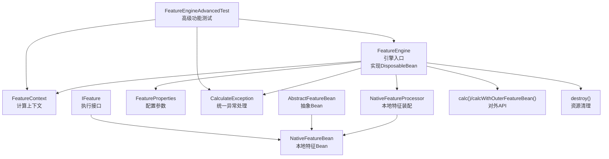
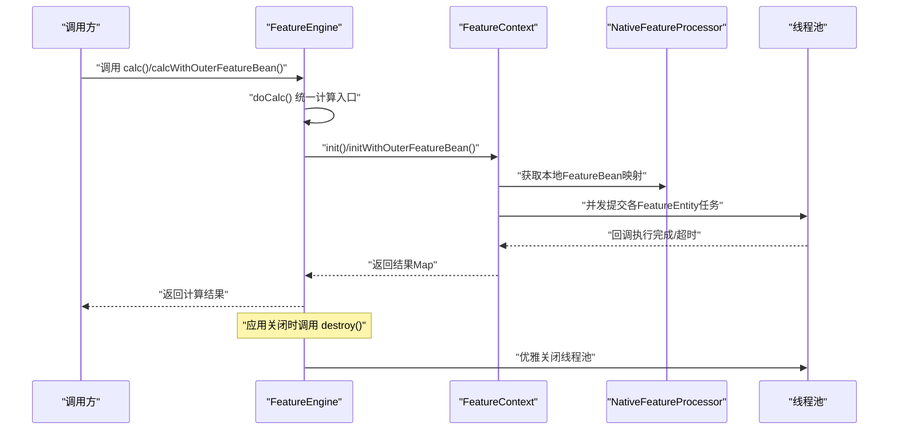
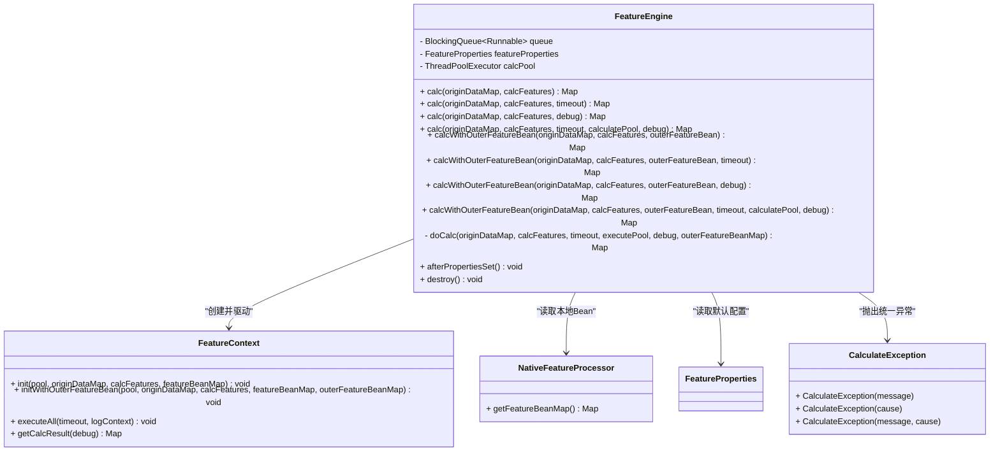
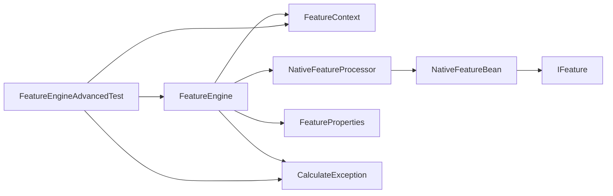

# FeatureEngine核心API

<cite>
**本文引用的文件**
- [FeatureEngine.java](file://src/main/java/com/github/zh/engine/FeatureEngine.java)
- [FeatureContext.java](file://src/main/java/com/github/zh/engine/co/FeatureContext.java)
- [NativeFeatureProcessor.java](file://src/main/java/com/github/zh/engine/processor/NativeFeatureProcessor.java)
- [FeatureProperties.java](file://src/main/java/com/github/zh/engine/properties/FeatureProperties.java)
- [AbstractFeatureBean.java](file://src/main/java/com/github/zh/engine/co/AbstractFeatureBean.java)
- [NativeFeatureBean.java](file://src/main/java/com/github/zh/engine/co/bean/NativeFeatureBean.java)
- [IFeature.java](file://src/main/java/com/github/zh/engine/clz/IFeature.java)
- [FeatureEnums.java](file://src/main/java/com/github/zh/engine/enums/FeatureEnums.java)
- [FeatureStates.java](file://src/main/java/com/github/zh/engine/enums/FeatureStates.java)
- [CalculateException.java](file://src/main/java/com/github/zh/engine/exception/CalculateException.java)
- [FeatureEngineAdvancedTest.java](file://src/test/java/com/github/zh/FeatureEngineAdvancedTest.java)
- [OuterFeatureBean.java](file://src/test/java/com/github/zh/bean/OuterFeatureBean.java)
- [Test.java](file://src/test/java/com/github/zh/feature/Test.java)
- [application.yml](file://src/test/resources/application.yml)
</cite>

## 更新摘要
**变更内容**
- FeatureEngine现在实现DisposableBean接口，增加资源清理功能
- 统一计算方法到doCalc私有方法，增强代码一致性
- 增强错误处理机制，完善异常类型和处理策略
- 改进线程池管理，添加优雅关闭和资源回收
- 新增高级功能测试，涵盖多特征并行计算、调试模式操作、超时处理等高级用法
- 完善异常处理和线程中断处理机制

## 目录
1. [简介](#简介)
2. [项目结构](#项目结构)
3. [核心组件](#核心组件)
4. [架构总览](#架构总览)
5. [详细组件分析](#详细组件分析)
6. [高级功能测试](#高级功能测试)
7. [依赖分析](#依赖分析)
8. [性能考虑](#性能考虑)
9. [故障排查指南](#故障排查指南)
10. [结论](#结论)
11. [附录](#附录)

## 简介
本文件面向FeatureEngine核心API，系统性梳理calc()系列与calcWithOuterFeatureBean()系列方法的重载、参数、返回值、使用场景与性能特性；详解外部特征Bean的传入与集成方式；提供基础用法、超时控制、调试模式等完整使用示例；说明线程池参数对计算性能的影响及调优建议；并给出异常处理与最佳实践。

**更新** 新增资源清理和优雅关闭机制，统一计算方法到doCalc，增强错误处理能力。新增高级功能测试，涵盖多特征并行计算、调试模式操作、超时处理等高级用法的验证。

## 项目结构
- 引擎入口：FeatureEngine（现实现DisposableBean接口）
- 计算上下文：FeatureContext（负责DAG构建、并发执行、超时与结果收集）
- 本地特征装配：NativeFeatureProcessor（扫描注解、生成NativeFeatureBean）
- 配置参数：FeatureProperties（线程池大小、计算超时）
- 特征Bean抽象：AbstractFeatureBean、NativeFeatureBean、IFeature
- 异常处理：CalculateException（统一的计算异常类型）
- 枚举：FeatureEnums、FeatureStates
- 测试样例：OuterFeatureBean、Test、FeatureEngineAdvancedTest

**图表来源**
- [FeatureEngine.java:75-325](file://src/main/java/com/github/zh/engine/FeatureEngine.java#L75-L325)
- [FeatureContext.java:23-400](file://src/main/java/com/github/zh/engine/co/FeatureContext.java#L23-L400)
- [CalculateException.java:43-73](file://src/main/java/com/github/zh/engine/exception/CalculateException.java#L43-L73)
- [FeatureEngineAdvancedTest.java:49-271](file://src/test/java/com/github/zh/FeatureEngineAdvancedTest.java#L49-L271)

**章节来源**
- [FeatureEngine.java:75-325](file://src/main/java/com/github/zh/engine/FeatureEngine.java#L75-L325)
- [FeatureContext.java:23-400](file://src/main/java/com/github/zh/engine/co/FeatureContext.java#L23-L400)
- [CalculateException.java:43-73](file://src/main/java/com/github/zh/engine/exception/CalculateException.java#L43-L73)
- [FeatureEngineAdvancedTest.java:49-271](file://src/test/java/com/github/zh/FeatureEngineAdvancedTest.java#L49-L271)

## 核心组件
- FeatureEngine：对外暴露calc()与calcWithOuterFeatureBean()系列API，实现DisposableBean接口，封装线程池、超时与调试开关，协调FeatureContext完成计算，并提供资源清理功能。
- FeatureContext：构建DAG、注册原始数据、本地与外部特征实体、并发执行、超时等待、结果收集与失败检查。
- NativeFeatureProcessor：扫描@FeatureClass/@Feature注解，生成NativeFeatureBean并填充父子关系。
- AbstractFeatureBean/NativeFeatureBean/IFeature：特征Bean抽象与本地实现，统一执行接口。
- FeatureProperties：线程池大小与计算超时默认值。
- CalculateException：统一的计算异常类型，继承RuntimeException。
- FeatureEnums/FeatureStates：特征类型与状态枚举。
- FeatureEngineAdvancedTest：高级功能测试，验证线程池资源管理、异常处理、返回结果完整性等。

**更新** FeatureEngine现在实现DisposableBean接口，提供afterPropertiesSet()初始化和destroy()资源清理功能。新增FeatureEngineAdvancedTest，涵盖高级功能测试场景。

**章节来源**
- [FeatureEngine.java:75-325](file://src/main/java/com/github/zh/engine/FeatureEngine.java#L75-L325)
- [FeatureContext.java:23-400](file://src/main/java/com/github/zh/engine/co/FeatureContext.java#L23-L400)
- [CalculateException.java:43-73](file://src/main/java/com/github/zh/engine/exception/CalculateException.java#L43-L73)
- [FeatureEngineAdvancedTest.java:49-271](file://src/test/java/com/github/zh/FeatureEngineAdvancedTest.java#L49-L271)

## 架构总览
FeatureEngine通过FeatureContext串联"原始数据注入—本地特征实体构建—外部特征实体构建—DAG依赖分析—并发执行—结果收集"的完整流程。本地特征由NativeFeatureProcessor装配，外部特征通过传入Map集成。FeatureEngine实现DisposableBean接口，提供资源管理和优雅关闭。

**图表来源**
- [FeatureEngine.java:102-281](file://src/main/java/com/github/zh/engine/FeatureEngine.java#L102-L281)
- [FeatureEngine.java:260-281](file://src/main/java/com/github/zh/engine/FeatureEngine.java#L260-L281)
- [FeatureEngine.java:310-325](file://src/main/java/com/github/zh/engine/FeatureEngine.java#L310-L325)

## 详细组件分析

### calc()系列API重载详解
- 方法签名与行为
  - calc(originDataMap, calcFeatures)
    - 功能：仅使用本地FeatureBean进行计算，使用默认超时
    - 参数：原始数据Map、待计算变量集合
    - 返回：结果Map（默认不输出调试信息）
    - 性能：使用FeatureProperties配置的默认超时与线程池
  - calc(originDataMap, calcFeatures, timeout)
    - 功能：带超时控制的本地计算
    - 参数：超时时间（毫秒）
    - 返回：同上
    - 性能：超时短可降低资源占用，但可能提前失败
  - calc(originDataMap, calcFeatures, debug)
    - 功能：开启调试模式，返回全部中间结果
    - 参数：调试开关
    - 返回：包含所有变量结果的Map
    - 性能：调试模式会保留中间态，内存与序列化开销略增
  - calc(originDataMap, calcFeatures, timeout, calculatePool, debug)
    - 功能：完全自定义线程池、超时与调试
    - 参数：自定义线程池、超时、调试开关
    - 返回：结果Map
    - 性能：线程池大小直接影响并发度与吞吐；超时影响稳定性与响应时间

- 参数说明
  - originDataMap：原始输入数据，键为变量名，值为对应数据
  - calcFeatures：本次需计算的变量集合
  - timeout：计算超时时间（毫秒），FeatureContext在CountDownLatch等待期间生效
  - calculatePool：自定义线程池，未设置时由FeatureEngine按配置创建
  - debug：是否返回调试信息（包含非输出变量与中间结果）

- 返回值类型
  - Map<String, Object>：默认仅返回标记为输出的变量；调试模式返回全部变量

- 使用场景
  - 仅本地计算：calc(originDataMap, calcFeatures)
  - 需要严格时限：calc(..., timeout)
  - 调试定位：calc(..., debug=true)
  - 生产定制：calc(..., calculatePool, debug)

- 性能特点
  - 并发执行：FeatureContext对每个FeatureEntity异步提交，基于线程池并发
  - 超时控制：通过CountDownLatch与超时参数保证阻塞等待上限
  - 资源占用：线程池越大，CPU并行度越高，但上下文切换与内存占用也相应上升

- 完整使用示例（路径参考）
  - 基础用法：[README.md:122-125](file://README.md#L122-L125)
  - 超时控制：[FeatureEngine.java:117-119](file://src/main/java/com/github/zh/engine/FeatureEngine.java#L117-L119)
  - 调试模式：[FeatureEngine.java:137-139](file://src/main/java/com/github/zh/engine/FeatureEngine.java#L137-L139)

**更新** 所有calc()方法现在都委托给统一的doCalc()私有方法，增强了代码一致性和维护性。

**章节来源**
- [FeatureEngine.java:102-159](file://src/main/java/com/github/zh/engine/FeatureEngine.java#L102-L159)
- [FeatureEngine.java:260-281](file://src/main/java/com/github/zh/engine/FeatureEngine.java#L260-L281)

### calcWithOuterFeatureBean()系列API详解
- 方法签名与行为
  - calcWithOuterFeatureBean(originDataMap, calcFeatures, outerFeatureBean)
    - 功能：结合本地与外部传入的FeatureBean进行计算
    - 参数：外部Bean映射（键为变量名，值为AbstractFeatureBean子类实例）
    - 返回：结果Map
  - calcWithOuterFeatureBean(..., timeout)
    - 功能：带超时控制
  - calcWithOuterFeatureBean(..., debug)
    - 功能：调试模式
  - calcWithOuterFeatureBean(..., timeout, calculatePool, debug)
    - 功能：完全自定义

- 外部特征Bean的传入与集成
  - 传入方式：以Map<String, ? extends AbstractFeatureBean>形式传入
  - 集成过程：FeatureContext.initWithOuterFeatureBean()将外部Bean注册为OUTER_FEATURE类型实体，并重建依赖关系
  - 执行方式：与本地实体一致，通过线程池并发执行

- 使用场景
  - 需要引入外部逻辑或第三方能力时
  - 将动态函数或策略函数注入到计算图中
  - 与外部系统交互（如远程服务、缓存等）以生成中间变量

- 完整使用示例（路径参考）
  - 外部Bean定义：[OuterFeatureBean.java:27-32](file://src/test/java/com/github/zh/bean/OuterFeatureBean.java#L27-L32)
  - 使用外部Bean计算：[README.md:218-229](file://README.md#L218-L229)

- 性能特点
  - 外部Bean同样参与DAG构建与并发执行，需关注其执行耗时与线程池负载
  - 若外部Bean数量较多且耗时较长，应适当增大线程池或缩短超时

**更新** 所有calcWithOuterFeatureBean()方法现在也委托给统一的doCalc()私有方法，保持代码一致性。

**章节来源**
- [FeatureEngine.java:176-239](file://src/main/java/com/github/zh/engine/FeatureEngine.java#L176-L239)
- [FeatureEngine.java:260-281](file://src/main/java/com/github/zh/engine/FeatureEngine.java#L260-L281)

### 资源清理与生命周期管理
- 初始化机制
  - afterPropertiesSet()：在Bean属性设置完成后初始化线程池
  - 如果未提供自定义线程池，根据FeatureProperties配置创建默认线程池
  - 线程池配置包括核心大小、最大大小、队列长度和线程命名前缀

- 资源清理机制
  - destroy()：优雅关闭线程池，最多等待60秒让现有任务完成
  - 如果超时仍未完成，强制关闭线程池
  - 正确处理中断异常，保持线程安全

- 生命周期管理
  - Spring容器管理FeatureEngine的创建和销毁
  - 应用关闭时自动调用destroy()方法进行资源回收
  - 避免线程池泄漏和资源占用

**新增章节** FeatureEngine现在实现DisposableBean接口，提供完整的资源生命周期管理。

**章节来源**
- [FeatureEngine.java:293-325](file://src/main/java/com/github/zh/engine/FeatureEngine.java#L293-L325)
- [FeatureProperties.java:82-106](file://src/main/java/com/github/zh/engine/properties/FeatureProperties.java#L82-L106)

### 统一计算入口doCalc()
- 设计目的
  - 将所有calc()系列方法的公共逻辑集中在一个私有方法中
  - 减少代码重复，提高维护性
  - 统一错误处理和资源管理

- 核心流程
  - 参数验证：检查calcFeatures是否为空
  - 上下文创建：创建新的FeatureContext实例
  - 数据准备：获取本地FeatureBean映射
  - 执行选择：根据是否有外部Bean选择不同的初始化方法
  - 异常处理：捕获并正确处理InterruptedException
  - 结果返回：根据debug标志返回相应的结果

- 错误处理增强
  - IllegalArgumentException：当calcFeatures为空时抛出
  - InterruptedException：正确处理线程中断并恢复中断状态
  - CalculateException：由FeatureContext在超时或失败时抛出

**新增章节** 所有计算方法现在统一委托给doCalc()私有方法，增强了代码一致性和错误处理能力。

**章节来源**
- [FeatureEngine.java:260-281](file://src/main/java/com/github/zh/engine/FeatureEngine.java#L260-L281)
- [FeatureContext.java:92-104](file://src/main/java/com/github/zh/engine/co/FeatureContext.java#L92-L104)

### FeatureEngine类图

**图表来源**
- [FeatureEngine.java:75-325](file://src/main/java/com/github/zh/engine/FeatureEngine.java#L75-L325)
- [FeatureContext.java:23-400](file://src/main/java/com/github/zh/engine/co/FeatureContext.java#L23-L400)
- [CalculateException.java:43-73](file://src/main/java/com/github/zh/engine/exception/CalculateException.java#L43-L73)

## 高级功能测试

### 线程池资源管理测试
- 测试目标：验证FeatureEngine.destroy()方法正确关闭线程池
- 关键测试点：
  - testDestroyShutdownsThreadPool：验证线程池在destroy()后被正确关闭
  - testDestroyHandlesAlreadyShutdownPool：验证对已关闭线程池的二次destroy不会抛出异常

- 测试方法
  - 创建独立的FeatureEngine实例并设置自定义线程池
  - 调用destroy()方法
  - 验证线程池状态变为shutdown

**章节来源**
- [FeatureEngineAdvancedTest.java:59-101](file://src/test/java/com/github/zh/FeatureEngineAdvancedTest.java#L59-L101)

### 异常处理路径测试
- 测试目标：验证各种异常场景的处理机制
- 关键测试点：
  - testCalcWithMixedExistentAndNonExistentFeatures：混合存在和不存在的特征计算
  - testCalcWithTimeoutShouldCompleteNormally：超时处理机制
  - testCalcInterruptedExceptionHandling：线程中断异常处理

- 测试方法
  - 请求混合特征集合，验证只返回存在的特征
  - 设置极短超时，验证引擎优雅处理超时
  - 中断计算线程，验证异常处理和中断状态保持

**章节来源**
- [FeatureEngineAdvancedTest.java:105-163](file://src/test/java/com/github/zh/FeatureEngineAdvancedTest.java#L105-L163)

### 返回结果完整性测试
- 测试目标：验证调试模式下的结果完整性
- 关键测试点：
  - testCalcReturnAllTrue：debug=true时返回所有中间结果
  - testCalcReturnAllFalse：debug=false时只返回输出特征
  - testCalcWithOriginDataMapNotOverwritten：验证原始数据不被修改

- 测试方法
  - 验证调试模式下包含所有中间特征（包括output=false的特征）
  - 验证非调试模式下只包含输出特征
  - 验证原始数据映射在计算后保持不变

**章节来源**
- [FeatureEngineAdvancedTest.java:167-230](file://src/test/java/com/github/zh/FeatureEngineAdvancedTest.java#L167-L230)

### 配置属性测试
- 测试目标：验证FeatureProperties的默认值和常量
- 关键测试点：
  - testFeaturePropertiesDefaultValues：验证默认配置值
  - testFeaturePropertiesConstants：验证常量值

- 测试方法
  - 验证线程池大小、最大线程数、超时时间、线程池名称前缀的默认值
  - 验证常量DEFAULT_POOL_SIZE_MULTIPLIER、DEFAULT_THREAD_POOL_NAME_PREFIX等

**章节来源**
- [FeatureEngineAdvancedTest.java:234-270](file://src/test/java/com/github/zh/FeatureEngineAdvancedTest.java#L234-L270)

## 依赖分析
- 组件耦合
  - FeatureEngine依赖FeatureContext与NativeFeatureProcessor，耦合度低，职责清晰
  - FeatureContext内部管理DAG与并发，避免了FeatureEngine的复杂度扩散
  - CalculateException作为统一异常类型，简化了异常处理
- 外部依赖
  - Spring环境（InitializingBean、DisposableBean、组件装配）
  - Javassist用于运行时生成类
- 可能的循环依赖
  - 文档明确指出当前版本无法自动解决循环依赖，需在编码时确保无环或通过原始数据打断

**更新** 新增CalculateException依赖，提供统一的异常处理机制。新增FeatureEngineAdvancedTest依赖，展示高级功能测试。

**图表来源**
- [FeatureEngine.java:75-325](file://src/main/java/com/github/zh/engine/FeatureEngine.java#L75-L325)
- [FeatureContext.java:23-400](file://src/main/java/com/github/zh/engine/co/FeatureContext.java#L23-L400)
- [CalculateException.java:43-73](file://src/main/java/com/github/zh/engine/exception/CalculateException.java#L43-L73)
- [FeatureEngineAdvancedTest.java:49-271](file://src/test/java/com/github/zh/FeatureEngineAdvancedTest.java#L49-L271)

## 性能考虑
- 线程池参数对性能的影响
  - 核心线程数与最大线程数：决定并发度与CPU利用效率
  - 队列长度：影响背压与内存占用
  - 超时时间：过短可能导致部分任务未完成，过长则影响响应
- 线程池配置建议
  - CPU密集型：线程数≈CPU核数，避免过度上下文切换
  - IO密集型：可适度提高线程数，提升吞吐
  - 混合型：根据实际压测结果微调
- FeatureProperties默认值
  - 线程池大小默认为CPU核心数×2，超时默认5000ms
  - 可通过配置覆盖：feature.featureThreadPoolSize、feature.featureThreadPoolMaxSize、feature.calcTimeout
- 资源管理优化
  - 优雅关闭机制避免线程池泄漏
  - 合理的超时设置平衡性能与稳定性

**更新** 新增资源管理优化建议，强调优雅关闭和线程池泄漏防护。基于FeatureEngineAdvancedTest的测试结果，验证了线程池资源管理的有效性。

**章节来源**
- [FeatureProperties.java:82-106](file://src/main/java/com/github/zh/engine/properties/FeatureProperties.java#L82-L106)
- [FeatureEngine.java:293-325](file://src/main/java/com/github/zh/engine/FeatureEngine.java#L293-L325)
- [FeatureEngineAdvancedTest.java:59-101](file://src/test/java/com/github/zh/FeatureEngineAdvancedTest.java#L59-L101)

## 故障排查指南
- 常见异常与处理
  - 计算超时：FeatureContext在await阶段抛出CalculateException，建议增大超时或优化线程池
  - 无变量需计算：executeAll前校验，确保calcFeatures非空
  - 缺少依赖或输入：putMiddleFeatureEntity阶段检测缺失，需补充原始数据或Bean
  - 调试定位：开启debug模式查看全部中间结果，快速定位失败节点
  - 线程池异常：优雅关闭失败时检查线程池状态和任务完成情况
  - 线程中断：正确处理InterruptedException并恢复中断状态
- 最佳实践
  - 明确输出变量：仅标记需要返回的变量为输出，减少结果Map体积
  - 控制并发度：根据业务特征选择合适的线程池大小
  - 避免循环依赖：编码时确保DAG无环，必要时通过原始数据打断
  - 超时与降级：为关键路径设置合理超时，必要时启用快速失败策略
  - 资源管理：确保应用正常关闭，让FeatureEngine执行destroy()进行资源清理
  - 异常处理：使用CalculateException统一处理计算异常，避免异常类型混乱

**更新** 新增线程中断处理和资源管理最佳实践。基于FeatureEngineAdvancedTest的测试结果，提供了更完善的异常处理指导。

**章节来源**
- [FeatureContext.java:92-104](file://src/main/java/com/github/zh/engine/co/FeatureContext.java#L92-L104)
- [FeatureEngine.java:310-325](file://src/main/java/com/github/zh/engine/FeatureEngine.java#L310-L325)
- [FeatureEngineAdvancedTest.java:133-163](file://src/test/java/com/github/zh/FeatureEngineAdvancedTest.java#L133-L163)

## 结论
FeatureEngine通过清晰的API分层与上下文驱动的并发执行，提供了灵活、可扩展的特征计算能力。calc()系列满足基础与高级需求，calcWithOuterFeatureBean()系列支持外部能力集成。通过实现DisposableBean接口，FeatureEngine现在具备完整的资源生命周期管理能力，统一的doCalc()方法增强了代码一致性和维护性。基于FeatureEngineAdvancedTest的高级功能测试，验证了线程池资源管理、异常处理、调试模式等功能的可靠性。通过合理配置线程池与超时参数，结合调试模式与最佳实践，可在保证性能的同时提升稳定性与可观测性。

**更新** FeatureEngine现在提供完整的资源管理生命周期，统一的计算入口和增强的异常处理机制，进一步提升了系统的稳定性和可维护性。高级功能测试验证了系统的健壮性和可靠性。

## 附录
- API一览（路径参考）
  - calc基础：[FeatureEngine.java:102-104](file://src/main/java/com/github/zh/engine/FeatureEngine.java#L102-L104)
  - 带超时：[FeatureEngine.java:117-119](file://src/main/java/com/github/zh/engine/FeatureEngine.java#L117-L119)
  - 调试模式：[FeatureEngine.java:137-139](file://src/main/java/com/github/zh/engine/FeatureEngine.java#L137-L139)
  - 自定义线程池+超时+调试：[FeatureEngine.java:157-159](file://src/main/java/com/github/zh/engine/FeatureEngine.java#L157-L159)
  - 外部Bean基础：[FeatureEngine.java:176-179](file://src/main/java/com/github/zh/engine/FeatureEngine.java#L176-L179)
  - 外部Bean带超时：[FeatureEngine.java:192-195](file://src/main/java/com/github/zh/engine/FeatureEngine.java#L192-L195)
  - 外部Bean调试：[FeatureEngine.java:212-215](file://src/main/java/com/github/zh/engine/FeatureEngine.java#L212-L215)
  - 外部Bean全量：[FeatureEngine.java:235-239](file://src/main/java/com/github/zh/engine/FeatureEngine.java#L235-L239)
  - 统一计算入口：[FeatureEngine.java:260-281](file://src/main/java/com/github/zh/engine/FeatureEngine.java#L260-L281)
  - 资源清理：[FeatureEngine.java:310-325](file://src/main/java/com/github/zh/engine/FeatureEngine.java#L310-L325)
- 示例参考
  - 基础调用：[README.md:122-125](file://README.md#L122-L125)
  - 外部Bean集成：[README.md:218-229](file://README.md#L218-L229)
- 测试样例
  - 外部Bean实现：[OuterFeatureBean.java:27-32](file://src/test/java/com/github/zh/bean/OuterFeatureBean.java#L27-L32)
  - 本地特征示例：[Test.java:40-85](file://src/test/java/com/github/zh/feature/Test.java#L40-L85)
  - 高级功能测试：[FeatureEngineAdvancedTest.java:49-271](file://src/test/java/com/github/zh/FeatureEngineAdvancedTest.java#L49-L271)
- 异常处理
  - 统一异常类型：[CalculateException.java:43-73](file://src/main/java/com/github/zh/engine/exception/CalculateException.java#L43-L73)
  - 资源管理：[FeatureEngine.java:293-325](file://src/main/java/com/github/zh/engine/FeatureEngine.java#L293-L325)
- 配置示例
  - 应用配置：[application.yml:4-9](file://src/test/resources/application.yml#L4-L9)