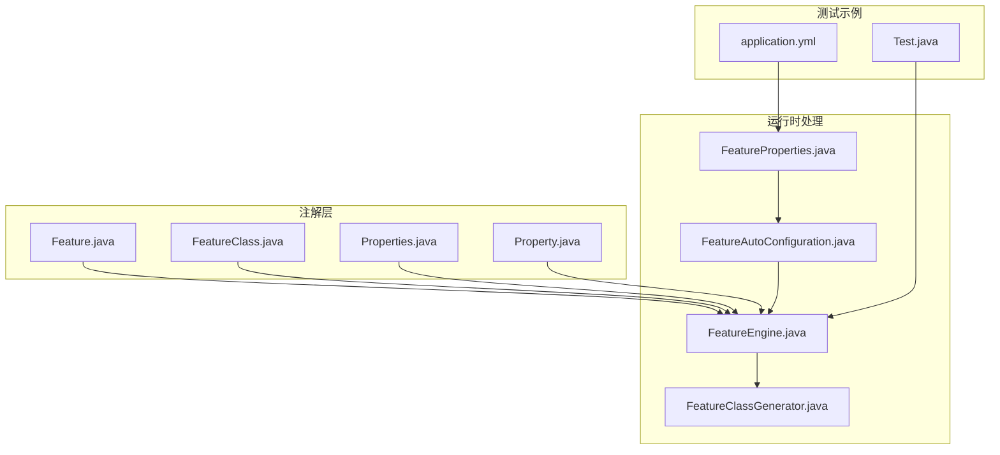
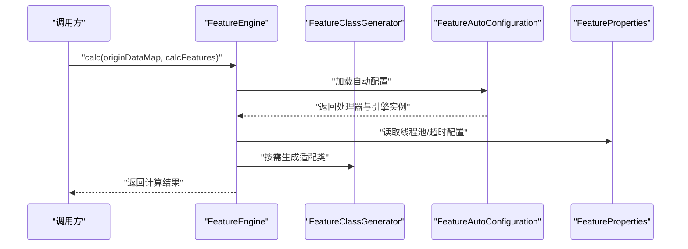
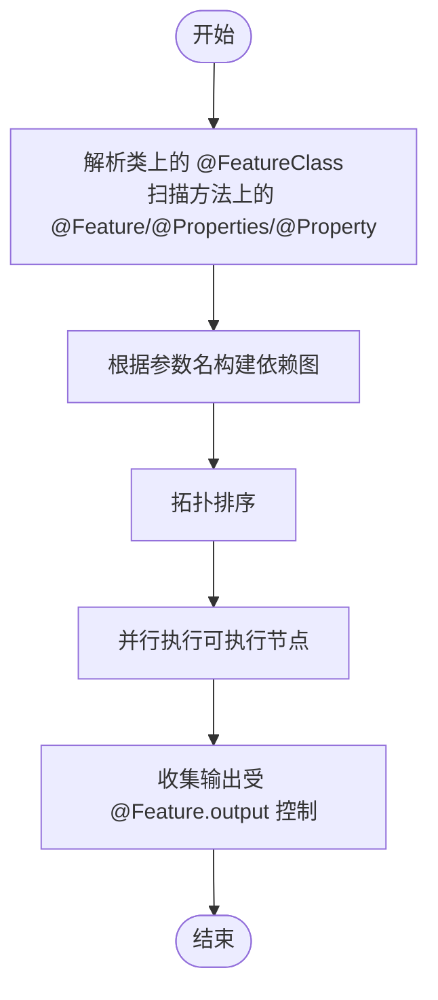

# 注解API

<cite>
**本文引用的文件**
- [Feature.java](file://src/main/java/com/github/zh/engine/annotation/Feature.java)
- [FeatureClass.java](file://src/main/java/com/github/zh/engine/annotation/FeatureClass.java)
- [Properties.java](file://src/main/java/com/github/zh/engine/annotation/properties/Properties.java)
- [Property.java](file://src/main/java/com/github/zh/engine/annotation/properties/Property.java)
- [FeatureEngine.java](file://src/main/java/com/github/zh/engine/FeatureEngine.java)
- [FeatureClassGenerator.java](file://src/main/java/com/github/zh/engine/clz/FeatureClassGenerator.java)
- [FeatureAutoConfiguration.java](file://src/main/java/com/github/zh/engine/config/FeatureAutoConfiguration.java)
- [FeatureProperties.java](file://src/main/java/com/github/zh/engine/properties/FeatureProperties.java)
- [Test.java](file://src/test/java/com/github/zh/feature/Test.java)
- [application.yml](file://src/test/resources/application.yml)
- [README.md](file://README.md)
</cite>

## 目录
1. [简介](#简介)
2. [项目结构](#项目结构)
3. [核心注解](#核心注解)
4. [架构总览](#架构总览)
5. [详细注解分析](#详细注解分析)
6. [依赖关系分析](#依赖关系分析)
7. [性能与配置](#性能与配置)
8. [故障排查指南](#故障排查指南)
9. [结论](#结论)
10. [附录](#附录)

## 简介
本文件面向注解系统的使用者与维护者，系统性梳理并文档化以下注解与相关能力：
- @Feature 注解：用于标识“特征函数”，支持 name 与 output 等属性。
- @FeatureClass 注解：用于标识“特征类”，通常与 Spring 组件注解配合使用。
- @Properties 与 @Property 注解：用于为特征函数附加键值对形式的属性配置，支持重复声明。

文档同时解释注解处理的工作原理、依赖解析机制、配置传递方式，并给出从简单到复杂的使用示例路径与最佳实践建议。

## 项目结构
注解API位于 engine/annotation 与 engine/annotation/properties 子包中；与之配套的运行时处理涉及 FeatureEngine、FeatureClassGenerator、FeatureAutoConfiguration、FeatureProperties 等组件；测试用例展示了典型使用方式。



图表来源
- [Feature.java](file://src/main/java/com/github/zh/engine/annotation/Feature.java)
- [FeatureClass.java](file://src/main/java/com/github/zh/engine/annotation/FeatureClass.java)
- [Properties.java](file://src/main/java/com/github/zh/engine/annotation/properties/Properties.java)
- [Property.java](file://src/main/java/com/github/zh/engine/annotation/properties/Property.java)
- [FeatureEngine.java](file://src/main/java/com/github/zh/engine/FeatureEngine.java)
- [FeatureClassGenerator.java](file://src/main/java/com/github/zh/engine/clz/FeatureClassGenerator.java)
- [FeatureAutoConfiguration.java](file://src/main/java/com/github/zh/engine/config/FeatureAutoConfiguration.java)
- [FeatureProperties.java](file://src/main/java/com/github/zh/engine/properties/FeatureProperties.java)
- [Test.java](file://src/test/java/com/github/zh/feature/Test.java)
- [application.yml](file://src/test/resources/application.yml)

章节来源
- [Feature.java](file://src/main/java/com/github/zh/engine/annotation/Feature.java)
- [FeatureClass.java](file://src/main/java/com/github/zh/engine/annotation/FeatureClass.java)
- [Properties.java](file://src/main/java/com/github/zh/engine/annotation/properties/Properties.java)
- [Property.java](file://src/main/java/com/github/zh/engine/annotation/properties/Property.java)
- [FeatureEngine.java](file://src/main/java/com/github/zh/engine/FeatureEngine.java)
- [FeatureClassGenerator.java](file://src/main/java/com/github/zh/engine/clz/FeatureClassGenerator.java)
- [FeatureAutoConfiguration.java](file://src/main/java/com/github/zh/engine/config/FeatureAutoConfiguration.java)
- [FeatureProperties.java](file://src/main/java/com/github/zh/engine/properties/FeatureProperties.java)
- [Test.java](file://src/test/java/com/github/zh/feature/Test.java)
- [application.yml](file://src/test/resources/application.yml)
- [README.md](file://README.md)

## 核心注解
- @Feature：标注于方法之上，标识该方法为“特征函数”。支持 name 与 output 两个属性：
  - name：指定生成的特征名称（可与方法名不同）。
  - output：控制该特征结果是否输出到最终结果集中。
- @FeatureClass：标注于类之上，标识该类包含特征函数，通常与 Spring 组件注解（如 @Component）共同使用。
- @Properties：方法级容器注解，聚合多个 @Property。
- @Property：方法级注解，声明键值对形式的属性配置，支持重复声明（@Repeatable）。

章节来源
- [Feature.java](file://src/main/java/com/github/zh/engine/annotation/Feature.java)
- [FeatureClass.java](file://src/main/java/com/github/zh/engine/annotation/FeatureClass.java)
- [Properties.java](file://src/main/java/com/github/zh/engine/annotation/properties/Properties.java)
- [Property.java](file://src/main/java/com/github/zh/engine/annotation/properties/Property.java)

## 架构总览
注解驱动的特征函数在运行时由 FeatureEngine 统一编排，通过依赖解析生成 DAG 并并行执行；@Properties/@Property 提供的键值对配置可随特征函数传递到运行时上下文。



图表来源
- [FeatureEngine.java](file://src/main/java/com/github/zh/engine/FeatureEngine.java)
- [FeatureClassGenerator.java](file://src/main/java/com/github/zh/engine/clz/FeatureClassGenerator.java)
- [FeatureAutoConfiguration.java](file://src/main/java/com/github/zh/engine/config/FeatureAutoConfiguration.java)
- [FeatureProperties.java](file://src/main/java/com/github/zh/engine/properties/FeatureProperties.java)

## 详细注解分析

### @Feature 注解
- 作用位置：方法
- 属性
  - name：字符串，默认空串。用于显式指定特征名称，便于跨方法重用或命名规范化。
  - output：布尔，默认 true。控制该特征是否纳入最终结果集。
- 语义与行为
  - 与 @FeatureClass 配合使用，标识该类中的特征函数。
  - 依赖解析基于方法参数名自动完成，无需额外 dependsOn 参数。
- 使用示例（参考路径）
  - 简单特征定义：[Test.java](file://src/test/java/com/github/zh/feature/Test.java)
  - 复杂依赖关系（多参数依赖）：[Test.java](file://src/test/java/com/github/zh/feature/Test.java)
  - 关闭输出（仅作为中间步骤）：[Test.java](file://src/test/java/com/github/zh/feature/Test.java)

章节来源
- [Feature.java](file://src/main/java/com/github/zh/engine/annotation/Feature.java)
- [Test.java](file://src/test/java/com/github/zh/feature/Test.java)

### @FeatureClass 注解
- 作用位置：类
- 属性
  - description：字符串，默认空串。可用于描述该特征类的功能或用途。
- 语义与行为
  - 标识该类包含特征函数，通常与 Spring 组件注解（如 @Component）一起使用，使特征函数被容器管理。
- 使用示例（参考路径）
  - 特征类定义与组合：[Test.java](file://src/test/java/com/github/zh/feature/Test.java)

章节来源
- [FeatureClass.java](file://src/main/java/com/github/zh/engine/annotation/FeatureClass.java)
- [Test.java](file://src/test/java/com/github/zh/feature/Test.java)

### @Properties 与 @Property 注解
- 作用位置：方法
- @Property 属性
  - key：字符串，必填。属性键。
  - value：字符串，必填。属性值。
- @Properties 属性
  - value：@Property 数组，必填。用于聚合多个 @Property。
- 语义与行为
  - 通过 @Repeatable 支持在同一方法上多次声明 @Property。
  - 与特征函数绑定，形成“函数+属性”的配置单元，便于运行时读取与传递。
- 使用示例（参考路径）
  - 单个属性配置：[Test.java](file://src/test/java/com/github/zh/feature/Test.java)
  - 多属性配置：[Test.java](file://src/test/java/com/github/zh/feature/Test.java)

章节来源
- [Properties.java](file://src/main/java/com/github/zh/engine/annotation/properties/Properties.java)
- [Property.java](file://src/main/java/com/github/zh/engine/annotation/properties/Property.java)
- [Test.java](file://src/test/java/com/github/zh/feature/Test.java)

### 依赖解析与执行流程（基于注解）
- 依赖解析
  - 引擎依据方法参数名自动识别依赖关系，参数名即为上游特征名称。
  - 若需要显式命名或跨方法重用，可通过 @Feature 的 name 属性统一命名。
- 执行策略
  - 生成适配类（必要时），并按拓扑序并行执行，避免重复计算。
  - 输出控制由 @Feature 的 output 决定。
- 错误与边界
  - 当前版本无法自动解决循环依赖，应在编码阶段规避，或在环中提供原始数据以打破循环。



图表来源
- [Feature.java](file://src/main/java/com/github/zh/engine/annotation/Feature.java)
- [FeatureClass.java](file://src/main/java/com/github/zh/engine/annotation/FeatureClass.java)
- [Properties.java](file://src/main/java/com/github/zh/engine/annotation/properties/Properties.java)
- [Property.java](file://src/main/java/com/github/zh/engine/annotation/properties/Property.java)
- [FeatureEngine.java](file://src/main/java/com/github/zh/engine/FeatureEngine.java)

## 依赖关系分析
- 注解与运行时的关系
  - @Feature 与 @FeatureClass 标记特征函数与特征类，驱动 FeatureEngine 进行依赖解析与执行。
  - @Properties 与 @Property 为特征函数提供键值对配置，参与运行时上下文构建。
- 自动装配与配置
  - FeatureAutoConfiguration 在满足条件时注册 FeatureEngine 与默认处理器，并启用 FeatureProperties。
  - FeatureProperties 从配置文件读取线程池大小与计算超时等参数。

```mermaid
graph LR
FC["@FeatureClass"] --> FEAT["@Feature"]
FEAT --> PROP["@Properties/@Property"]
FEAT --> ENG["FeatureEngine"]
PROP --> ENG
ENG --> GEN["FeatureClassGenerator"]
CONF["FeatureAutoConfiguration"] --> ENG
CONF --> PROPS["FeatureProperties"]
```

图表来源
- [Feature.java](file://src/main/java/com/github/zh/engine/annotation/Feature.java)
- [FeatureClass.java](file://src/main/java/com/github/zh/engine/annotation/FeatureClass.java)
- [Properties.java](file://src/main/java/com/github/zh/engine/annotation/properties/Properties.java)
- [Property.java](file://src/main/java/com/github/zh/engine/annotation/properties/Property.java)
- [FeatureEngine.java](file://src/main/java/com/github/zh/engine/FeatureEngine.java)
- [FeatureClassGenerator.java](file://src/main/java/com/github/zh/engine/clz/FeatureClassGenerator.java)
- [FeatureAutoConfiguration.java](file://src/main/java/com/github/zh/engine/config/FeatureAutoConfiguration.java)
- [FeatureProperties.java](file://src/main/java/com/github/zh/engine/properties/FeatureProperties.java)

章节来源
- [FeatureAutoConfiguration.java](file://src/main/java/com/github/zh/engine/config/FeatureAutoConfiguration.java)
- [FeatureProperties.java](file://src/main/java/com/github/zh/engine/properties/FeatureProperties.java)
- [FeatureEngine.java](file://src/main/java/com/github/zh/engine/FeatureEngine.java)
- [FeatureClassGenerator.java](file://src/main/java/com/github/zh/engine/clz/FeatureClassGenerator.java)

## 性能与配置
- 线程池与超时
  - 线程池核心/最大大小与计算超时时间可通过配置文件设置，未设置时采用默认值（核心数与默认超时）。
- 配置示例（参考路径）
  - 应用配置样例：[application.yml](file://src/test/resources/application.yml)
  - 配置项说明与默认值：[FeatureProperties.java](file://src/main/java/com/github/zh/engine/properties/FeatureProperties.java)
- 最佳实践
  - 合理设置线程池大小，避免过小导致阻塞、过大导致上下文切换开销。
  - 明确 output 行为，仅保留必要的输出以减少结果集体积。
  - 避免循环依赖，必要时引入原始数据作为断点。

章节来源
- [application.yml](file://src/test/resources/application.yml)
- [FeatureProperties.java](file://src/main/java/com/github/zh/engine/properties/FeatureProperties.java)
- [README.md](file://README.md)

## 故障排查指南
- 常见问题
  - 编译期找不到参数名：需要在编译插件中启用参数名记录（例如添加 -parameters）。
  - 循环依赖导致卡死：请在编码阶段规避，或在环中注入原始数据。
  - 结果缺失：检查 @Feature.output 是否为 false 导致未输出。
- 定位建议
  - 开启调试模式（如有）观察执行序列与依赖图。
  - 核对 @Feature.name 与方法参数名是否一致，避免依赖解析失败。
  - 检查 @Properties/@Property 的 key/value 是否正确传入运行时。

章节来源
- [README.md](file://README.md)

## 结论
- 本注解体系以简洁明了的方式定义特征函数与其配置，结合自动依赖解析与并行执行，能够高效地完成无副作用的函数式计算。
- 建议在团队内统一命名规范（尤其是 @Feature.name），明确 output 策略，并在配置层面合理设置线程池与超时，以获得稳定且高性能的执行效果。

## 附录

### 使用示例（路径索引）
- 简单特征定义：[Test.java](file://src/test/java/com/github/zh/feature/Test.java)
- 复杂依赖关系（多参数依赖）：[Test.java](file://src/test/java/com/github/zh/feature/Test.java)
- 属性配置（单/多键值）：[Test.java](file://src/test/java/com/github/zh/feature/Test.java)
- 特征类定义与组合：[Test.java](file://src/test/java/com/github/zh/feature/Test.java)
- 配置示例（线程池大小）：[application.yml](file://src/test/resources/application.yml)

### API 参考（摘要）
- @Feature
  - 属性：name（字符串）、output（布尔）
  - 作用：标记特征函数，支持命名与输出控制
- @FeatureClass
  - 属性：description（字符串）
  - 作用：标记特征类，常与组件注解配合
- @Properties
  - 属性：value（@Property[]）
  - 作用：聚合多个 @Property
- @Property
  - 属性：key（字符串）、value（字符串）
  - 作用：为特征函数附加键值对配置

章节来源
- [Feature.java](file://src/main/java/com/github/zh/engine/annotation/Feature.java)
- [FeatureClass.java](file://src/main/java/com/github/zh/engine/annotation/FeatureClass.java)
- [Properties.java](file://src/main/java/com/github/zh/engine/annotation/properties/Properties.java)
- [Property.java](file://src/main/java/com/github/zh/engine/annotation/properties/Property.java)
- [Test.java](file://src/test/java/com/github/zh/feature/Test.java)
- [application.yml](file://src/test/resources/application.yml)