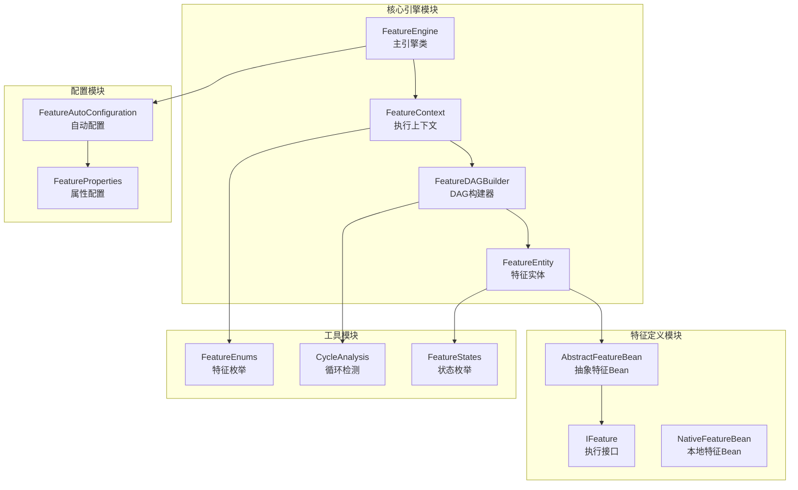
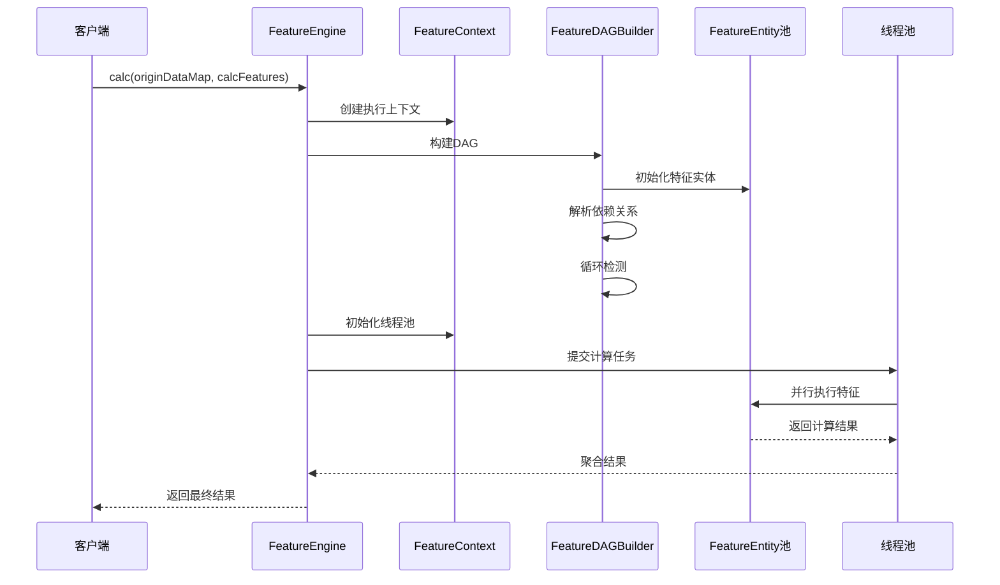
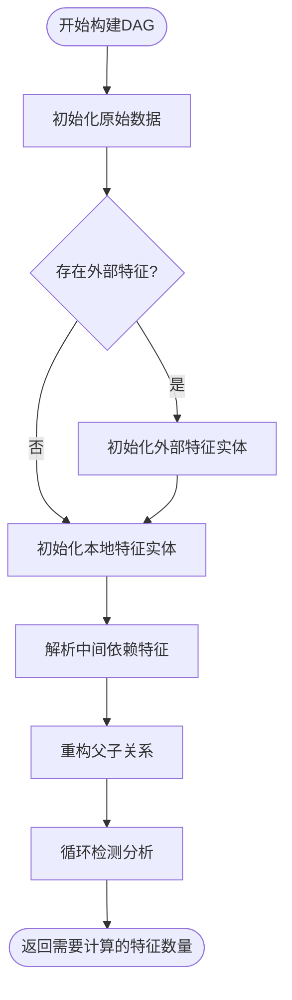
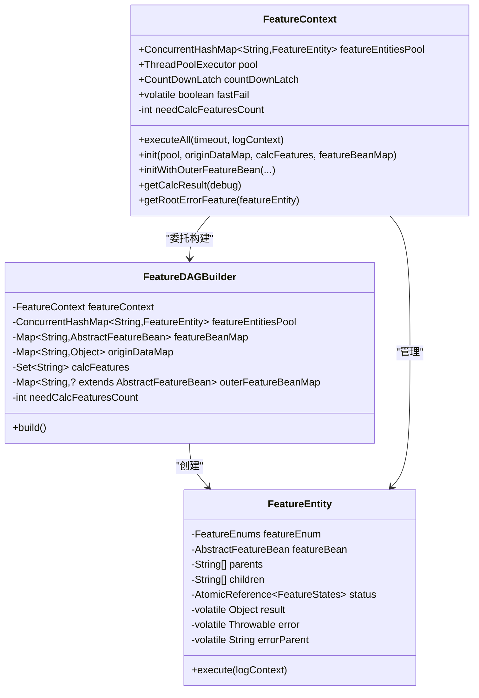
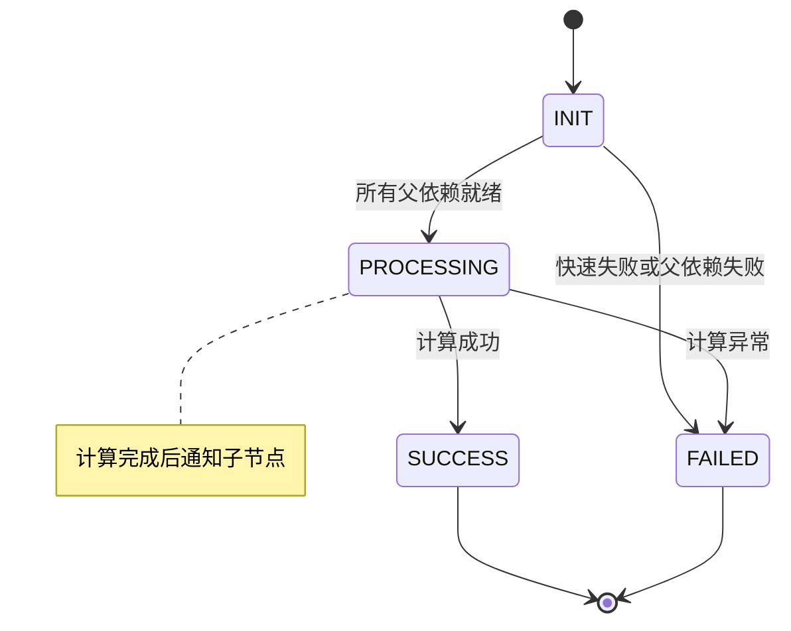
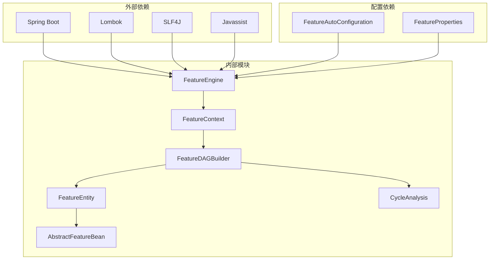

# 特征DAG构建器

<cite>
**本文档引用的文件**
- [FeatureDAGBuilder.java](file://src/main/java/com/github/zh/engine/co/FeatureDAGBuilder.java)
- [FeatureContext.java](file://src/main/java/com/github/zh/engine/co/FeatureContext.java)
- [FeatureEntity.java](file://src/main/java/com/github/zh/engine/co/FeatureEntity.java)
- [FeatureEngine.java](file://src/main/java/com/github/zh/engine/FeatureEngine.java)
- [AbstractFeatureBean.java](file://src/main/java/com/github/zh/engine/co/AbstractFeatureBean.java)
- [IFeature.java](file://src/main/java/com/github/zh/engine/clz/IFeature.java)
- [CycleAnalysis.java](file://src/main/java/com/github/zh/engine/tools/CycleAnalysis.java)
- [FeatureEnums.java](file://src/main/java/com/github/zh/engine/enums/FeatureEnums.java)
- [FeatureStates.java](file://src/main/java/com/github/zh/engine/enums/FeatureStates.java)
- [README.md](file://README.md)
- [spring.factories](file://src/main/resources/META-INF/spring.factories)
- [pom.xml](file://pom.xml)
</cite>

## 目录
1. [简介](#简介)
2. [项目结构](#项目结构)
3. [核心组件](#核心组件)
4. [架构概览](#架构概览)
5. [详细组件分析](#详细组件分析)
6. [依赖关系分析](#依赖关系分析)
7. [性能考虑](#性能考虑)
8. [故障排除指南](#故障排除指南)
9. [结论](#结论)

## 简介

特征DAG构建器是基于有向无环图(DAG)的特征计算引擎的核心组件，负责构建和管理特征之间的依赖关系图。该系统通过声明式的方式定义函数及其依赖关系，自动构建依赖图、智能调度执行顺序、并行化独立任务，同时提供结果缓存以消除重复调用。

该引擎特别适用于需要处理复杂业务逻辑和多层依赖计算的场景，能够显著简化计算流程的编排和管理。

## 项目结构

项目采用标准的Spring Boot项目结构，主要包含以下核心模块：

**图表来源**
- [FeatureEngine.java:1-325](file://src/main/java/com/github/zh/engine/FeatureEngine.java#L1-L325)
- [FeatureContext.java:1-245](file://src/main/java/com/github/zh/engine/co/FeatureContext.java#L1-L245)
- [FeatureDAGBuilder.java:1-293](file://src/main/java/com/github/zh/engine/co/FeatureDAGBuilder.java#L1-L293)

**章节来源**
- [pom.xml:1-172](file://pom.xml#L1-L172)
- [spring.factories:1-2](file://src/main/resources/META-INF/spring.factories#L1-L2)

## 核心组件

### FeatureDAGBuilder - DAG构建器

FeatureDAGBuilder是DAG构建器的核心实现，负责构建特征计算的依赖关系图。它支持多种特征类型：原生特征、外部特征和原始数据。

**主要功能特性：**
- 初始化原生特征实体
- 注入外部特征实体
- 解析中间依赖特征
- 构建父子关系
- 执行循环检测分析

### FeatureContext - 执行上下文

FeatureContext管理单次特征计算请求的生命周期，包括线程池管理、计算完成跟踪和快速失败机制。

**核心职责：**
- 维护特征实体池
- 管理线程池执行
- 跟踪计算完成状态
- 处理快速失败场景

### FeatureEntity - 特征实体

FeatureEntity表示计算过程中的特征实例，封装了依赖关系、计算状态、结果和错误信息。

**执行模型：**
- 异步执行模式
- 波浪式并行执行
- 状态机管理
- 快速失败支持

**章节来源**
- [FeatureDAGBuilder.java:32-58](file://src/main/java/com/github/zh/engine/co/FeatureDAGBuilder.java#L32-L58)
- [FeatureContext.java:36-61](file://src/main/java/com/github/zh/engine/co/FeatureContext.java#L36-L61)
- [FeatureEntity.java:35-61](file://src/main/java/com/github/zh/engine/co/FeatureEntity.java#L35-L61)

## 架构概览

系统采用分层架构设计，通过DAG构建器将声明式的特征定义转换为可执行的计算图：

**图表来源**
- [FeatureEngine.java:260-281](file://src/main/java/com/github/zh/engine/FeatureEngine.java#L260-L281)
- [FeatureContext.java:95-107](file://src/main/java/com/github/zh/engine/co/FeatureContext.java#L95-L107)
- [FeatureDAGBuilder.java:114-138](file://src/main/java/com/github/zh/engine/co/FeatureDAGBuilder.java#L114-L138)

## 详细组件分析

### FeatureDAGBuilder 详细分析

FeatureDAGBuilder实现了完整的DAG构建流程，包含六个主要步骤：

#### 1. 原始数据注入
将传入的原始数据作为预计算特征实体注入到实体池中，状态直接设置为SUCCESS。

#### 2. 外部特征实体注入
处理外部提供的特征Bean，这些特征在运行时动态注入，支持灵活的扩展能力。

#### 3. 本地特征实体初始化
根据请求的特征集合，初始化对应的本地特征实体。

#### 4. 中间依赖特征解析
使用广度优先搜索(BFS)遍历依赖图，添加所有必需的中间特征实体。

#### 5. 父子关系重构
当使用外部特征Bean时，重建父子关系以确保依赖关系正确性。

#### 6. 循环检测分析
执行循环检测以防止计算过程中的无限循环。

**图表来源**
- [FeatureDAGBuilder.java:114-138](file://src/main/java/com/github/zh/engine/co/FeatureDAGBuilder.java#L114-L138)
- [FeatureDAGBuilder.java:215-236](file://src/main/java/com/github/zh/engine/co/FeatureDAGBuilder.java#L215-L236)

**章节来源**
- [FeatureDAGBuilder.java:62-96](file://src/main/java/com/github/zh/engine/co/FeatureDAGBuilder.java#L62-L96)
- [FeatureDAGBuilder.java:147-163](file://src/main/java/com/github/zh/engine/co/FeatureDAGBuilder.java#L147-L163)
- [FeatureDAGBuilder.java:168-182](file://src/main/java/com/github/zh/engine/co/FeatureDAGBuilder.java#L168-L182)
- [FeatureDAGBuilder.java:187-204](file://src/main/java/com/github/zh/engine/co/FeatureDAGBuilder.java#L187-L204)
- [FeatureDAGBuilder.java:215-236](file://src/main/java/com/github/zh/engine/co/FeatureDAGBuilder.java#L215-L236)
- [FeatureDAGBuilder.java:266-276](file://src/main/java/com/github/zh/engine/co/FeatureDAGBuilder.java#L266-L276)
- [FeatureDAGBuilder.java:287-291](file://src/main/java/com/github/zh/engine/co/FeatureDAGBuilder.java#L287-L291)

### FeatureContext 执行上下文

FeatureContext提供了完整的执行生命周期管理：

#### 线程池管理
- 使用ThreadPoolExecutor进行并行计算
- 支持自定义线程池配置
- 提供优雅关闭机制

#### 计算协调
- 使用CountDownLatch跟踪计算完成
- 实现快速失败机制
- 支持超时控制

#### 结果聚合
- 支持调试模式返回所有中间结果
- 过滤输出特征结果
- 错误追踪和根因定位

**图表来源**
- [FeatureContext.java:63-182](file://src/main/java/com/github/zh/engine/co/FeatureContext.java#L63-L182)
- [FeatureDAGBuilder.java:60-96](file://src/main/java/com/github/zh/engine/co/FeatureDAGBuilder.java#L60-L96)
- [FeatureEntity.java:65-231](file://src/main/java/com/github/zh/engine/co/FeatureEntity.java#L65-L231)

**章节来源**
- [FeatureContext.java:63-182](file://src/main/java/com/github/zh/engine/co/FeatureContext.java#L63-L182)
- [FeatureContext.java:193-243](file://src/main/java/com/github/zh/engine/co/FeatureContext.java#L193-L243)

### FeatureEntity 执行模型

FeatureEntity实现了复杂的异步执行模型：

#### 状态机设计
- INIT: 初始状态
- PROCESSING: 计算中
- SUCCESS: 计算成功
- FAILED: 计算失败

#### 执行流程
1. 检查快速失败状态
2. 等待父依赖完成
3. 执行实际计算
4. 通知子节点执行
5. 更新状态并释放锁

**图表来源**
- [FeatureStates.java:37-80](file://src/main/java/com/github/zh/engine/enums/FeatureStates.java#L37-L80)
- [FeatureEntity.java:106-181](file://src/main/java/com/github/zh/engine/co/FeatureEntity.java#L106-L181)

**章节来源**
- [FeatureEntity.java:67-84](file://src/main/java/com/github/zh/engine/co/FeatureEntity.java#L67-L84)
- [FeatureEntity.java:106-181](file://src/main/java/com/github/zh/engine/co/FeatureEntity.java#L106-L181)
- [FeatureEntity.java:191-200](file://src/main/java/com/github/zh/engine/co/FeatureEntity.java#L191-L200)

### 特征类型和状态管理

系统通过枚举类型管理不同类型的特征和计算状态：

#### 特征类型枚举
- ORIGIN_DATA: 计算时提供的原始输入数据
- NATIVE_FEATURE: 本地定义的特征
- OUTER_FEATURE: 运行时外部注入的特征

#### 计算状态枚举
- INIT: 初始状态
- PROCESSING: 正在处理
- SUCCESS: 成功完成
- FAILED: 处理失败

**章节来源**
- [FeatureEnums.java:36-64](file://src/main/java/com/github/zh/engine/enums/FeatureEnums.java#L36-L64)
- [FeatureStates.java:37-80](file://src/main/java/com/github/zh/engine/enums/FeatureStates.java#L37-L80)

## 依赖关系分析

系统采用松耦合的设计，通过接口和抽象类实现模块间的解耦：

**图表来源**
- [pom.xml:114-155](file://pom.xml#L114-L155)
- [spring.factories:1-2](file://src/main/resources/META-INF/spring.factories#L1-L2)

### 关键依赖关系

1. **FeatureEngine** 依赖于 **FeatureContext** 和 **FeatureDAGBuilder**
2. **FeatureContext** 依赖于 **FeatureDAGBuilder** 和 **FeatureEntity**
3. **FeatureDAGBuilder** 依赖于 **FeatureEntity** 和 **CycleAnalysis**
4. **FeatureEntity** 依赖于 **AbstractFeatureBean** 和 **FeatureStates**

**章节来源**
- [FeatureEngine.java:260-281](file://src/main/java/com/github/zh/engine/FeatureEngine.java#L260-L281)
- [FeatureContext.java:170-178](file://src/main/java/com/github/zh/engine/co/FeatureContext.java#L170-L178)
- [FeatureDAGBuilder.java:170-178](file://src/main/java/com/github/zh/engine/co/FeatureDAGBuilder.java#L170-L178)

## 性能考虑

### 并行执行优化

系统通过以下机制实现高效的并行计算：

1. **波浪式执行**: 当父依赖完成后，相关特征立即开始执行
2. **线程池管理**: 可配置的核心线程数和最大线程数
3. **状态同步**: 使用原子引用确保状态变更的线程安全

### 内存管理

1. **实体池管理**: 使用并发哈希表存储特征实体
2. **结果缓存**: 自动缓存计算结果避免重复计算
3. **资源清理**: 优雅关闭线程池防止内存泄漏

### 扩展性设计

1. **外部特征支持**: 允许运行时动态注入特征Bean
2. **后处理器**: 支持特征Bean的后处理扩展
3. **配置灵活**: 支持多种配置参数调整性能

## 故障排除指南

### 常见问题及解决方案

#### 1. 参数名称缺失问题
**症状**: 运行时出现参数名解析错误
**原因**: 编译时未保留方法参数名称
**解决方案**: 在编译插件中启用 `-parameters` 参数

#### 2. 循环依赖检测
**症状**: 启动时检测到循环依赖或计算过程中出现无限循环
**原因**: 特征之间存在循环依赖关系
**解决方案**: 
- 检查特征方法的参数依赖关系
- 通过 `originDataMap` 在循环点提供原始数据

#### 3. 计算超时
**症状**: 计算超时异常
**原因**: 单个特征执行时间过长
**解决方案**:
- 检查单个特征的执行时间
- 调整 `calcTimeout` 配置
- 优化长时间运行的特征实现

#### 4. 线程池配置不当
**症状**: 性能不达标或资源耗尽
**原因**: 线程池大小配置不合理
**解决方案**:
- CPU密集型: 核心线程数 = 最大线程数 = CPU核心数
- IO密集型: 核心线程数 = CPU核心数, 最大线程数 = CPU核心数 × 4

**章节来源**
- [README.md:395-423](file://README.md#L395-L423)
- [FeatureEngine.java:294-323](file://src/main/java/com/github/zh/engine/FeatureEngine.java#L294-L323)

## 结论

特征DAG构建器是一个设计精良的计算引擎，通过以下核心优势解决了复杂业务计算中的关键问题：

### 主要优势

1. **声明式编程**: 通过注解声明特征和依赖关系，无需编写复杂的编排代码
2. **自动DAG构建**: 基于参数名称自动识别依赖关系，构建有向无环图
3. **智能并行执行**: 自动识别独立任务并行执行，最大化利用CPU资源
4. **重复调用消除**: 自动缓存计算结果，避免重复计算
5. **循环依赖检测**: 在启动阶段检测循环依赖，提前暴露问题
6. **无缝集成**: 与Spring Boot无缝集成，零配置即可使用

### 技术特色

- **状态机驱动**: 通过明确的状态转换管理计算生命周期
- **异步执行**: 支持大规模并行计算
- **快速失败**: 发生异常时快速传播失败状态
- **调试友好**: 支持调试模式返回完整计算过程

### 应用场景

该引擎特别适用于需要处理复杂业务逻辑的场景，如：
- 金融风控计算
- 用户画像构建
- 业务指标计算
- 数据挖掘和分析

通过合理配置和使用，可以显著提升计算效率和开发体验，是构建复杂业务计算系统的重要基础设施。