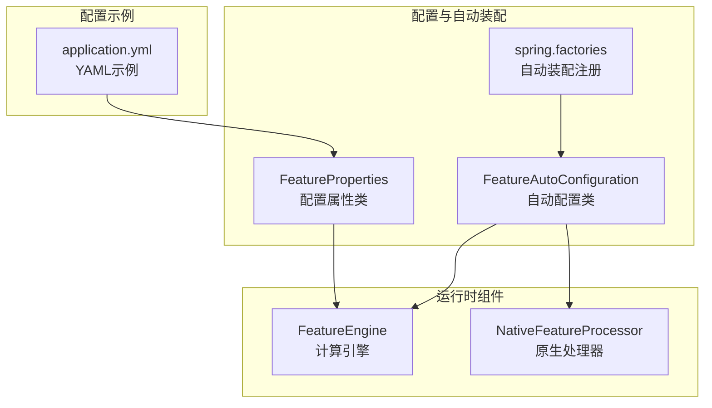
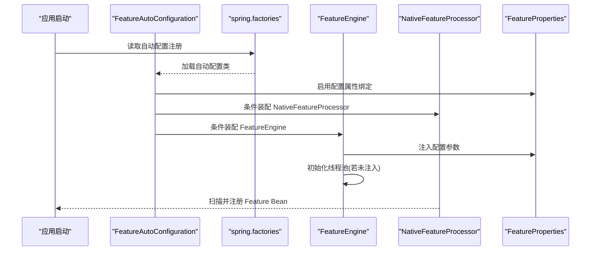
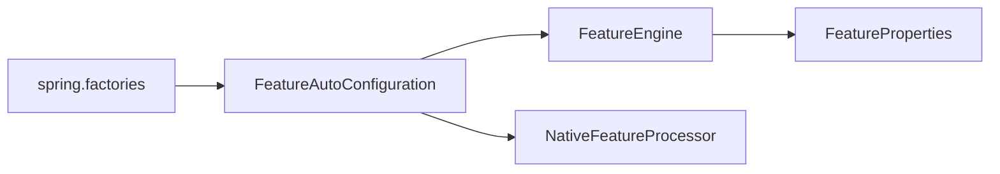

# 配置API

<cite>
**本文引用的文件**
- [FeatureProperties.java](file://src/main/java/com/github/zh/engine/properties/FeatureProperties.java)
- [FeatureAutoConfiguration.java](file://src/main/java/com/github/zh/engine/config/FeatureAutoConfiguration.java)
- [FeatureEngine.java](file://src/main/java/com/github/zh/engine/FeatureEngine.java)
- [NativeFeatureProcessor.java](file://src/main/java/com/github/zh/engine/processor/NativeFeatureProcessor.java)
- [Properties.java](file://src/main/java/com/github/zh/engine/annotation/properties/Properties.java)
- [Property.java](file://src/main/java/com/github/zh/engine/annotation/properties/Property.java)
- [application.yml](file://src/test/resources/application.yml)
- [spring.factories](file://src/main/resources/META-INF/spring.factories)
- [pom.xml](file://pom.xml)
- [README.md](file://README.md)
</cite>

## 更新摘要
**变更内容**
- FeatureProperties类新增详细的默认值管理和配置示例
- 新增threadPoolNamePrefix配置参数，支持线程命名约定
- 增强了配置参数对系统性能的影响分析和调优建议
- 完善了配置验证和故障排查指导

## 目录
1. [简介](#简介)
2. [项目结构](#项目结构)
3. [核心组件](#核心组件)
4. [架构总览](#架构总览)
5. [详细组件分析](#详细组件分析)
6. [依赖分析](#依赖分析)
7. [性能考虑](#性能考虑)
8. [故障排查指南](#故障排查指南)
9. [结论](#结论)
10. [附录](#附录)

## 简介
本文件面向使用者与维护者，系统性梳理配置系统的API与自动装配机制，重点覆盖以下内容：
- FeatureProperties 类的全部配置参数及其默认值、含义与影响范围
- FeatureAutoConfiguration 的自动配置条件、装配流程与扩展方式
- 完整的配置示例（application.yml 与 Java 配置类）
- 参数对系统性能的影响与调优建议
- 配置验证与常见问题排查

## 项目结构
围绕配置系统的关键文件组织如下：
- 配置属性类：com.github.zh.engine.properties.FeatureProperties
- 自动配置类：com.github.zh.engine.config.FeatureAutoConfiguration
- 引擎入口：com.github.zh.engine.FeatureEngine
- 处理器：com.github.zh.engine.processor.NativeFeatureProcessor
- 注解属性：com.github.zh.engine.annotation.properties.Properties、Property
- Spring 自动装配注册：META-INF/spring.factories
- 测试配置样例：application.yml
- 依赖与版本：pom.xml
- 使用与配置说明：README.md



**图表来源**
- [FeatureProperties.java:1-106](file://src/main/java/com/github/zh/engine/properties/FeatureProperties.java#L1-L106)
- [FeatureAutoConfiguration.java:1-94](file://src/main/java/com/github/zh/engine/config/FeatureAutoConfiguration.java#L1-L94)
- [FeatureEngine.java:1-325](file://src/main/java/com/github/zh/engine/FeatureEngine.java#L1-L325)
- [NativeFeatureProcessor.java:1-131](file://src/main/java/com/github/zh/engine/processor/NativeFeatureProcessor.java#L1-L131)
- [spring.factories:1-2](file://src/main/resources/META-INF/spring.factories#L1-L2)
- [application.yml:1-9](file://src/test/resources/application.yml#L1-L9)

**章节来源**
- [FeatureProperties.java:1-106](file://src/main/java/com/github/zh/engine/properties/FeatureProperties.java#L1-L106)
- [FeatureAutoConfiguration.java:1-94](file://src/main/java/com/github/zh/engine/config/FeatureAutoConfiguration.java#L1-L94)
- [spring.factories:1-2](file://src/main/resources/META-INF/spring.factories#L1-L2)

## 核心组件
本节聚焦配置系统的核心类与职责：
- FeatureProperties：承载所有可配置参数，支持从配置源绑定
- FeatureAutoConfiguration：基于条件装配 Bean，启用自动配置
- FeatureEngine：消费配置参数，构建线程池并执行计算
- NativeFeatureProcessor：扫描注解、构造 Feature Bean
- 注解属性：用于在方法上声明属性键值对

**章节来源**
- [FeatureProperties.java:1-106](file://src/main/java/com/github/zh/engine/properties/FeatureProperties.java#L1-L106)
- [FeatureAutoConfiguration.java:1-94](file://src/main/java/com/github/zh/engine/config/FeatureAutoConfiguration.java#L1-L94)
- [FeatureEngine.java:1-325](file://src/main/java/com/github/zh/engine/FeatureEngine.java#L1-L325)
- [NativeFeatureProcessor.java:1-131](file://src/main/java/com/github/zh/engine/processor/NativeFeatureProcessor.java#L1-L131)
- [Properties.java:1-18](file://src/main/java/com/github/zh/engine/annotation/properties/Properties.java#L1-L18)
- [Property.java:1-20](file://src/main/java/com/github/zh/engine/annotation/properties/Property.java#L1-L20)

## 架构总览
自动配置与运行时交互的关键流程如下：



**图表来源**
- [FeatureAutoConfiguration.java:60-62](file://src/main/java/com/github/zh/engine/config/FeatureAutoConfiguration.java#L60-L62)
- [spring.factories:1-2](file://src/main/resources/META-INF/spring.factories#L1-L2)
- [FeatureEngine.java:294-300](file://src/main/java/com/github/zh/engine/FeatureEngine.java#L294-L300)
- [FeatureProperties.java:54-105](file://src/main/java/com/github/zh/engine/properties/FeatureProperties.java#L54-L105)

## 详细组件分析

### FeatureProperties 配置参数详解
- 配置前缀：com.github.zh.engine.feature
- 关键参数
  - featureThreadPoolSize：线程池核心线程数，默认值为 CPU 核心数 × 2
  - featureThreadPoolMaxSize：线程池最大线程数，默认值为 CPU 核心数 × 2
  - calcTimeout：计算超时时间（毫秒），默认值为 10000
  - threadPoolNamePrefix：线程池线程命名前缀，默认值为 "feature-pool-"
- 默认值来源
  - DEFAULT_SYSTEM_CORE_SIZE：通过运行时获取可用处理器数量
  - DEFAULT_CALC_TIMEOUT：固定默认超时时间 10000 毫秒
  - DEFAULT_POOL_SIZE_MULTIPLIER：默认线程池大小乘数 2
  - DEFAULT_THREAD_POOL_NAME_PREFIX：默认线程命名前缀 "feature-pool-"

**更新** 新增了线程池命名前缀配置，支持更好的线程识别和调试

参数与行为映射
- 线程池规模直接影响并发度与资源占用；核心线程数与最大线程数相等时，线程池为固定大小
- 超时时间决定单次计算的最大等待时长，避免长时间阻塞
- 线程命名前缀便于在日志和监控中识别特定的计算线程

**章节来源**
- [FeatureProperties.java:54-105](file://src/main/java/com/github/zh/engine/properties/FeatureProperties.java#L54-L105)

### FeatureAutoConfiguration 自动配置机制与扩展
- 装配条件
  - ConditionalOnProperty：当配置项 enabled.featureEngine 存在且为 true 时生效；若未设置则默认启用
  - ConditionalOnClass：要求 FeatureEngine 与 NativeFeatureProcessor 类存在
  - EnableConfigurationProperties：启用 FeatureProperties 的配置属性绑定
- Bean 装配
  - 若容器中不存在 NativeFeatureProcessor，则自动创建
  - 若容器中不存在 FeatureEngine，则自动创建
- 扩展方式
  - 通过设置 enabled.featureEngine=false 可禁用自动装配
  - 通过在容器中提供自定义的 FeatureEngine 或 NativeFeatureProcessor Bean，可覆盖默认装配
  - 通过实现 FeatureBeanPostProcessor 接口扩展 Bean 初始化后的处理逻辑

**章节来源**
- [FeatureAutoConfiguration.java:60-62](file://src/main/java/com/github/zh/engine/config/FeatureAutoConfiguration.java#L60-L62)
- [spring.factories:1-2](file://src/main/resources/META-INF/spring.factories#L1-L2)

### FeatureEngine 与配置参数的集成
- 线程池初始化
  - 当未显式注入 ThreadPoolExecutor 时，FeatureEngine 在 afterPropertiesSet 中按配置参数创建固定大小线程池
  - 使用配置的线程命名前缀为每个线程设置有意义的名称
- 计算入口
  - 提供多重重载的 calc 与 calcWithOuterFeatureBean 方法，内部统一使用配置中的超时时间与线程池执行任务

**更新** afterPropertiesSet方法中实现了完整的线程池初始化逻辑，包括线程命名

**章节来源**
- [FeatureEngine.java:294-300](file://src/main/java/com/github/zh/engine/FeatureEngine.java#L294-L300)
- [FeatureEngine.java:102-104](file://src/main/java/com/github/zh/engine/FeatureEngine.java#L102-L104)
- [FeatureEngine.java:176-179](file://src/main/java/com/github/zh/engine/FeatureEngine.java#L176-L179)

### NativeFeatureProcessor 与注解属性
- 注解属性
  - @Property：在方法级别声明键值对属性
  - @Properties：聚合多个 @Property
- 处理流程
  - 扫描标注了 @FeatureClass 的类，提取标注了 @Feature 的方法
  - 通过反射与字节码生成，构建 NativeFeatureBean，并将 @Property 的键值对注入到 Bean 元数据中

**章节来源**
- [Property.java:1-20](file://src/main/java/com/github/zh/engine/annotation/properties/Property.java#L1-L20)
- [Properties.java:1-18](file://src/main/java/com/github/zh/engine/annotation/properties/Properties.java#L1-L18)
- [NativeFeatureProcessor.java:32-101](file://src/main/java/com/github/zh/engine/processor/NativeFeatureProcessor.java#L32-L101)

### 配置示例

- application.yml 配置示例
  - 参考路径：[application.yml:8-9](file://src/test/resources/application.yml#L8-L9)
  - 示例片段：feature.featureThreadPoolSize: 2
  - 说明：该示例展示了如何在 YAML 中设置线程池大小；其他参数可按相同层级添加

- 完整配置示例
  ```yaml
  com:
    github:
      zh:
        engine:
          feature:
            featureThreadPoolSize: 16
            featureThreadPoolMaxSize: 32
            calcTimeout: 5000
            threadPoolNamePrefix: "my-feature-pool-"
  ```

- Java 配置类方式
  - 通过 @EnableConfigurationProperties(FeatureProperties.class) 与 @Configuration 组合，结合 @Value 或 @ConstructorBinding 方式自定义绑定
  - 注意：若需完全替换默认装配，可参考自动配置类的条件与装配策略，提供自定义 Bean 并避免与默认 Bean 冲突

- 依赖与编译参数
  - pom.xml 中包含 spring-boot-autoconfigure 依赖与 -parameters 编译参数配置，确保运行时能正确解析方法参数名

**更新** 新增了完整的配置示例，包括新的threadPoolNamePrefix参数

**章节来源**
- [application.yml:1-9](file://src/test/resources/application.yml#L1-L9)
- [pom.xml:114-155](file://pom.xml#L114-L155)
- [pom.xml:157-172](file://pom.xml#L157-L172)

## 依赖分析
- 自动装配注册
  - spring.factories 中注册 FeatureAutoConfiguration，使 Spring Boot 启动时加载
- 组件耦合
  - FeatureEngine 依赖 FeatureProperties 与 NativeFeatureProcessor
  - FeatureAutoConfiguration 依赖 FeatureEngine 与 NativeFeatureProcessor 的存在性与配置属性绑定
- 外部依赖
  - spring-boot-autoconfigure、lombok、javassist、slf4j 等



**图表来源**
- [spring.factories:1-2](file://src/main/resources/META-INF/spring.factories#L1-L2)
- [FeatureAutoConfiguration.java:60-62](file://src/main/java/com/github/zh/engine/config/FeatureAutoConfiguration.java#L60-L62)
- [FeatureEngine.java:78-86](file://src/main/java/com/github/zh/engine/FeatureEngine.java#L78-L86)

**章节来源**
- [spring.factories:1-2](file://src/main/resources/META-INF/spring.factories#L1-L2)
- [FeatureAutoConfiguration.java:60-62](file://src/main/java/com/github/zh/engine/config/FeatureAutoConfiguration.java#L60-L62)
- [FeatureEngine.java:78-86](file://src/main/java/com/github/zh/engine/FeatureEngine.java#L78-L86)

## 性能考虑
- 线程池规模
  - featureThreadPoolSize 与 featureThreadPoolMaxSize 控制并发度；默认按 CPU 核心数 × 2 设置
  - 建议：CPU 密集型任务可适当降低；IO 密集型任务可适度提高；但需关注内存与上下文切换开销
- 超时时间
  - calcTimeout 决定单次计算最长等待时间；过短可能引发超时失败，过长可能导致资源占用
  - 建议：结合业务耗时统计与 SLA 设定，逐步收敛至最优值
- 线程池队列
  - FeatureEngine 使用有界队列（LinkedBlockingQueue）；建议监控队列长度与拒绝策略，避免堆积
- 线程命名
  - threadPoolNamePrefix 支持自定义线程命名，便于在日志和监控中识别特定的计算线程
  - 建议：使用有意义的前缀标识不同的计算实例或环境
- 调优步骤
  - 基准压测：在预生产环境模拟峰值流量，记录平均/99 分位耗时
  - 渐进调整：优先调整线程池大小，其次调整超时时间
  - 观察指标：线程池活跃线程数、队列长度、拒绝次数、超时次数

**更新** 新增了线程命名相关的性能考虑和调优建议

## 故障排查指南
- 自动配置未生效
  - 检查 enabled.featureEngine 配置项是否被设置为 false
  - 确认 FeatureEngine 与 NativeFeatureProcessor 类是否在类路径中
  - 确认 spring.factories 已正确注册自动配置类
- 线程池异常
  - 若自定义注入了 ThreadPoolExecutor，确认其生命周期与关闭策略
  - 监控线程池拒绝与队列堆积情况
  - 检查线程命名前缀是否正确设置，便于问题定位
- 超时问题
  - 提升 calcTimeout 或优化计算逻辑
  - 检查是否存在死循环或阻塞操作
- 循环依赖
  - 当前版本不支持自动解决循环依赖；请在编码阶段规避，或在环中任一节点提供原始数据以打破循环
- 编译参数缺失
  - 若出现参数名解析错误，请在编译插件中添加 -parameters 参数
- 线程命名问题
  - 如果发现线程名称无法识别，检查 threadPoolNamePrefix 配置是否正确
  - 确认线程池初始化时是否正确设置了命名前缀

**更新** 新增了线程命名相关的故障排查指导

**章节来源**
- [FeatureAutoConfiguration.java:60-62](file://src/main/java/com/github/zh/engine/config/FeatureAutoConfiguration.java#L60-L62)
- [spring.factories:1-2](file://src/main/resources/META-INF/spring.factories#L1-L2)
- [README.md:72-91](file://README.md#L72-L91)
- [pom.xml:114-155](file://pom.xml#L114-L155)

## 结论
- FeatureProperties 提供了线程池规模、计算超时和线程命名等关键配置，FeatureAutoConfiguration 则以条件装配的方式无缝接入 Spring Boot 应用
- 通过合理的参数调优与监控，可显著提升计算吞吐与稳定性
- 建议在生产环境中结合压测数据与业务特征，制定分环境差异化配置策略
- 新增的线程命名功能有助于更好的运维监控和问题诊断

**更新** 结论部分新增了关于线程命名功能的价值说明

## 附录

### 配置参数对照表
- 配置前缀：com.github.zh.engine.feature
- 参数
  - featureThreadPoolSize：线程池核心线程数，默认为 CPU 核心数 × 2
  - featureThreadPoolMaxSize：线程池最大线程数，默认为 CPU 核心数 × 2
  - calcTimeout：计算超时时间（毫秒），默认为 10000
  - threadPoolNamePrefix：线程池线程命名前缀，默认为 "feature-pool-"

**更新** 新增了threadPoolNamePrefix参数的默认值说明

**章节来源**
- [FeatureProperties.java:54-105](file://src/main/java/com/github/zh/engine/properties/FeatureProperties.java#L54-L105)

### 自动配置条件与装配清单
- 条件
  - enabled.featureEngine=true（缺省即生效）
  - 存在 FeatureEngine 与 NativeFeatureProcessor 类
- 装配
  - NativeFeatureProcessor（若不存在）
  - FeatureEngine（若不存在）

**章节来源**
- [FeatureAutoConfiguration.java:60-62](file://src/main/java/com/github/zh/engine/config/FeatureAutoConfiguration.java#L60-L62)

### 默认值管理详情
- DEFAULT_SYSTEM_CORE_SIZE：通过 Runtime.getRuntime().availableProcessors() 获取系统核心数
- DEFAULT_CALC_TIMEOUT：固定值 10000 毫秒（10 秒）
- DEFAULT_POOL_SIZE_MULTIPLIER：固定值 2
- DEFAULT_THREAD_POOL_NAME_PREFIX：固定值 "feature-pool-"

**更新** 新增了完整的默认值管理详情

**章节来源**
- [FeatureProperties.java:56-74](file://src/main/java/com/github/zh/engine/properties/FeatureProperties.java#L56-L74)