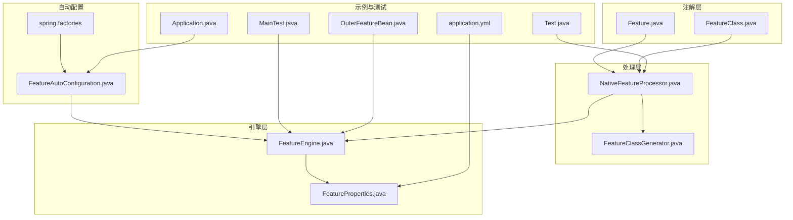
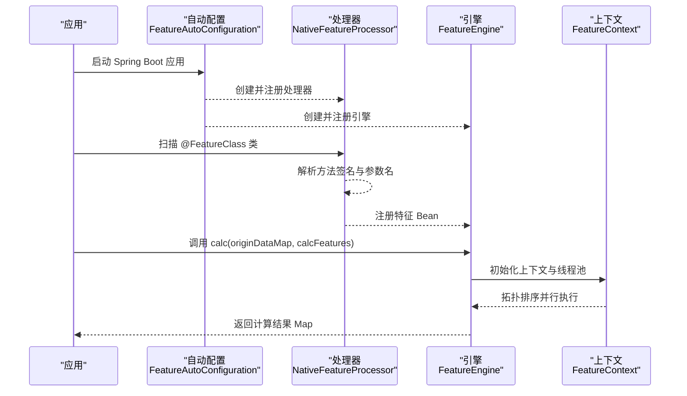
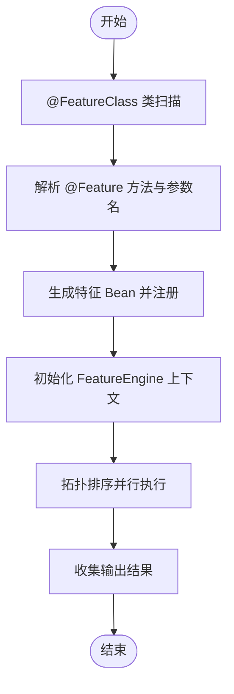
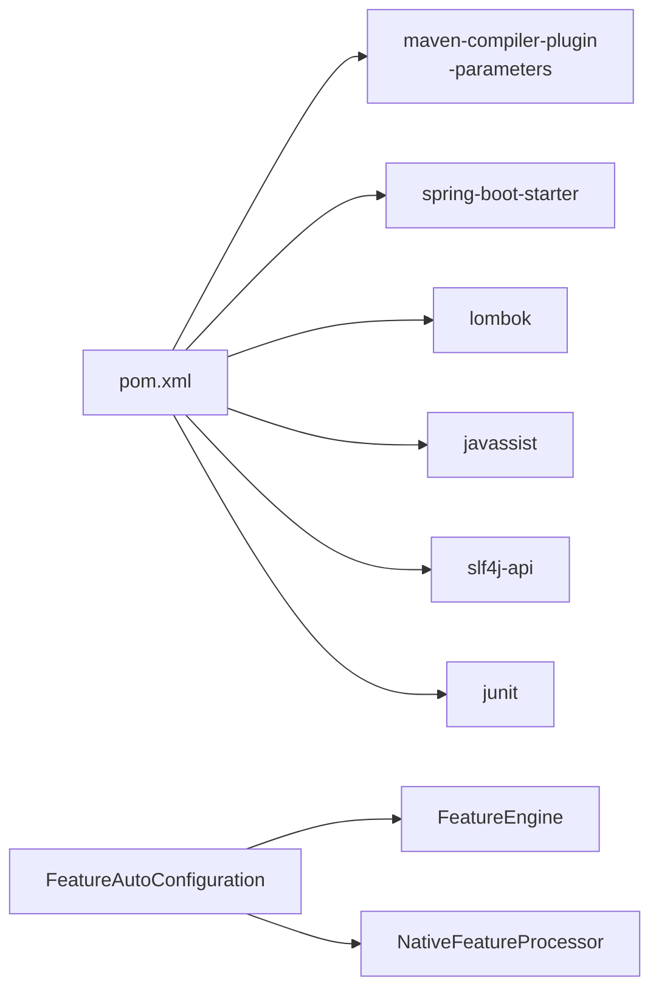

# 快速开始

<cite>
**本文引用的文件**
- [pom.xml](file://pom.xml)
- [README.md](file://README.md)
- [Feature.java](file://src/main/java/com/github/zh/engine/annotation/Feature.java)
- [FeatureClass.java](file://src/main/java/com/github/zh/engine/annotation/FeatureClass.java)
- [FeatureEngine.java](file://src/main/java/com/github/zh/engine/FeatureEngine.java)
- [FeatureAutoConfiguration.java](file://src/main/java/com/github/zh/engine/config/FeatureAutoConfiguration.java)
- [NativeFeatureProcessor.java](file://src/main/java/com/github/zh/engine/processor/NativeFeatureProcessor.java)
- [FeatureClassGenerator.java](file://src/main/java/com/github/zh/engine/clz/FeatureClassGenerator.java)
- [FeatureProperties.java](file://src/main/java/com/github/zh/engine/properties/FeatureProperties.java)
- [spring.factories](file://src/main/resources/META-INF/spring.factories)
- [application.yml](file://src/test/resources/application.yml)
- [Test.java](file://src/test/java/com/github/zh/feature/Test.java)
- [MainTest.java](file://src/test/java/com/github/zh/MainTest.java)
- [Application.java](file://src/test/java/com/github/zh/Application.java)
- [OuterFeatureBean.java](file://src/test/java/com/github/zh/bean/OuterFeatureBean.java)
</cite>

## 目录
1. [简介](#简介)
2. [项目结构](#项目结构)
3. [核心组件](#核心组件)
4. [架构总览](#架构总览)
5. [详细组件分析](#详细组件分析)
6. [依赖分析](#依赖分析)
7. [性能考虑](#性能考虑)
8. [故障排查指南](#故障排查指南)
9. [结论](#结论)
10. [附录](#附录)

## 简介
本指南面向希望快速上手“特征计算引擎”的开发者，目标是在本地完成环境准备、依赖引入、编译参数配置后，编写第一个特征函数并成功调用引擎完成一次计算。内容覆盖：
- 安装与配置：Maven 依赖添加、JDK8 编译参数（-parameters）设置
- 注解使用：@Feature 与 @FeatureClass 的语义与用法
- 基础计算流程：从定义特征类到调用 FeatureEngine 执行计算
- 示例与预期输出：提供可运行示例与预期结果，便于快速验证
- 常见问题与解决方案：编译器参数、Spring Boot 自动装配等

## 项目结构
该项目采用标准 Spring Boot Starter 结构，核心模块位于 engine 包内，测试示例位于 test 目录。关键文件职责如下：
- 注解层：定义 @Feature 与 @FeatureClass，用于声明特征函数及其所属类
- 处理器层：扫描标注的特征类，解析方法签名，生成可执行的特征 Bean
- 引擎层：对外提供计算入口，负责 DAG 排序、并行执行、结果收集
- 自动配置：基于 Spring Boot 条件化装配，简化接入
- 示例与测试：演示最简用法与断言

**图表来源**
- [Feature.java:1-28](file://src/main/java/com/github/zh/engine/annotation/Feature.java#L1-L28)
- [FeatureClass.java:1-17](file://src/main/java/com/github/zh/engine/annotation/FeatureClass.java#L1-L17)
- [NativeFeatureProcessor.java:1-131](file://src/main/java/com/github/zh/engine/processor/NativeFeatureProcessor.java#L1-L131)
- [FeatureClassGenerator.java:1-82](file://src/main/java/com/github/zh/engine/clz/FeatureClassGenerator.java#L1-L82)
- [FeatureEngine.java:1-172](file://src/main/java/com/github/zh/engine/FeatureEngine.java#L1-L172)
- [FeatureProperties.java:1-37](file://src/main/java/com/github/zh/engine/properties/FeatureProperties.java#L1-L37)
- [FeatureAutoConfiguration.java:1-37](file://src/main/java/com/github/zh/engine/config/FeatureAutoConfiguration.java#L1-L37)
- [spring.factories:1-2](file://src/main/resources/META-INF/spring.factories#L1-L2)
- [Test.java:1-71](file://src/test/java/com/github/zh/feature/Test.java#L1-L71)
- [MainTest.java:1-47](file://src/test/java/com/github/zh/MainTest.java#L1-L47)
- [Application.java:1-18](file://src/test/java/com/github/zh/Application.java#L1-L18)
- [application.yml:1-9](file://src/test/resources/application.yml#L1-L9)
- [OuterFeatureBean.java:1-16](file://src/test/java/com/github/zh/bean/OuterFeatureBean.java#L1-L16)

**章节来源**
- [pom.xml:1-100](file://pom.xml#L1-L100)
- [README.md:1-215](file://README.md#L1-L215)

## 核心组件
- 注解
  - @Feature：标记方法为特征函数；name 指定生成后的函数名；output 控制是否纳入最终结果输出
  - @FeatureClass：标记类为特征类，配合 Spring 组件注解使用
- 处理器
  - NativeFeatureProcessor：扫描被 @FeatureClass 标注的类，解析方法签名与参数名，生成可执行的特征 Bean 并注册
- 引擎
  - FeatureEngine：对外提供 calc/calcWithOuterFeatureBean 等计算入口，内部维护线程池与上下文，按拓扑顺序并行执行
- 自动配置
  - FeatureAutoConfiguration：条件装配 FeatureEngine 与处理器，启用配置属性绑定
- 示例
  - Test.java：定义多个相互依赖的特征函数，演示基础用法
  - MainTest.java：集成测试，验证计算流程
  - OuterFeatureBean.java：演示外部特征 Bean 的注入与参与计算

**章节来源**
- [Feature.java:1-28](file://src/main/java/com/github/zh/engine/annotation/Feature.java#L1-L28)
- [FeatureClass.java:1-17](file://src/main/java/com/github/zh/engine/annotation/FeatureClass.java#L1-L17)
- [NativeFeatureProcessor.java:1-131](file://src/main/java/com/github/zh/engine/processor/NativeFeatureProcessor.java#L1-L131)
- [FeatureEngine.java:1-172](file://src/main/java/com/github/zh/engine/FeatureEngine.java#L1-L172)
- [FeatureAutoConfiguration.java:1-37](file://src/main/java/com/github/zh/engine/config/FeatureAutoConfiguration.java#L1-L37)
- [Test.java:1-71](file://src/test/java/com/github/zh/feature/Test.java#L1-L71)
- [MainTest.java:1-47](file://src/test/java/com/github/zh/MainTest.java#L1-L47)
- [OuterFeatureBean.java:1-16](file://src/test/java/com/github/zh/bean/OuterFeatureBean.java#L1-L16)

## 架构总览
下图展示了从应用启动到特征计算完成的端到端流程。

**图表来源**
- [FeatureAutoConfiguration.java:1-37](file://src/main/java/com/github/zh/engine/config/FeatureAutoConfiguration.java#L1-L37)
- [NativeFeatureProcessor.java:1-131](file://src/main/java/com/github/zh/engine/processor/NativeFeatureProcessor.java#L1-L131)
- [FeatureEngine.java:1-172](file://src/main/java/com/github/zh/engine/FeatureEngine.java#L1-L172)

## 详细组件分析

### 安装与配置
- 环境要求
  - JDK 8+、Spring Boot 2.x
- Maven 依赖
  - 在项目中添加 starter 依赖，坐标与版本以仓库为准
- 编译参数
  - 必须开启 -parameters，否则无法解析方法参数名，导致特征依赖关系无法正确建立

建议在 pom.xml 中配置 maven-compiler-plugin，确保包含 -parameters 参数。

**章节来源**
- [pom.xml:10-48](file://pom.xml#L10-L48)
- [README.md:39-73](file://README.md#L39-L73)

### 第一个特征函数：从零到一
- 步骤
  1) 使用 @FeatureClass 标注类，并配合 Spring 组件注解（如 @Component）
  2) 在类中定义 public 方法，使用 @Feature 标注
  3) 方法参数名即为依赖的其他特征函数名（需开启 -parameters）
  4) 通过 FeatureEngine.calc(...) 触发计算，传入待计算函数集合
- 示例参考
  - 测试类示例：[Test.java:20-71](file://src/test/java/com/github/zh/feature/Test.java#L20-L71)
  - 运行入口示例：[Application.java:12-17](file://src/test/java/com/github/zh/Application.java#L12-L17)
  - 集成测试示例：[MainTest.java:28-32](file://src/test/java/com/github/zh/MainTest.java#L28-L32)

提示
- 若方法返回值为复杂类型（如 Map），可在特征函数中构造并返回
- 输出控制：通过 @Feature(output=false) 可将中间结果排除在最终结果之外

**章节来源**
- [Test.java:20-71](file://src/test/java/com/github/zh/feature/Test.java#L20-L71)
- [Application.java:12-17](file://src/test/java/com/github/zh/Application.java#L12-L17)
- [MainTest.java:28-32](file://src/test/java/com/github/zh/MainTest.java#L28-L32)

### 特征计算流程详解
- 特征发现与注册
  - 处理器扫描被 @FeatureClass 标注的类，解析每个 @Feature 方法
  - 依据方法参数名推导依赖关系，生成特征 Bean 并注册
- 计算执行
  - 引擎接收 originDataMap 与 calcFeatures，构建上下文
  - 按拓扑顺序并行执行，等待结果或超时
  - 收集输出标志为 true 的特征结果，返回 Map
- 外部 Bean 参与
  - 可通过 calcWithOuterFeatureBean 注入自定义外部特征 Bean，参与计算

**图表来源**
- [NativeFeatureProcessor.java:33-66](file://src/main/java/com/github/zh/engine/processor/NativeFeatureProcessor.java#L33-L66)
- [FeatureEngine.java:86-96](file://src/main/java/com/github/zh/engine/FeatureEngine.java#L86-L96)

**章节来源**
- [NativeFeatureProcessor.java:1-131](file://src/main/java/com/github/zh/engine/processor/NativeFeatureProcessor.java#L1-L131)
- [FeatureEngine.java:1-172](file://src/main/java/com/github/zh/engine/FeatureEngine.java#L1-L172)

### 外部特征 Bean 的使用
- 场景
  - 当内置特征无法满足需求时，可通过外部 Bean 注入
- 实现
  - 继承 AbstractFeatureBean，实现 execute(args)
  - 通过 calcWithOuterFeatureBean(...) 将外部 Bean 与内置特征共同计算
- 示例参考
  - 外部 Bean 示例：[OuterFeatureBean.java:10-15](file://src/test/java/com/github/zh/bean/OuterFeatureBean.java#L10-L15)
  - 集成测试示例：[MainTest.java:35-45](file://src/test/java/com/github/zh/MainTest.java#L35-L45)

**章节来源**
- [OuterFeatureBean.java:1-16](file://src/test/java/com/github/zh/bean/OuterFeatureBean.java#L1-L16)
- [MainTest.java:35-45](file://src/test/java/com/github/zh/MainTest.java#L35-L45)

### 配置项与线程池
- 配置前缀：com.github.zh.engine.feature
- 关键项
  - featureThreadPoolSize：默认为 CPU 核心数 × 2
  - featureThreadPoolMaxSize：默认与线程池大小一致
  - calcTimeout：默认计算超时时间（毫秒）
- 示例
  - 在 application.yml 中调整线程池大小

**章节来源**
- [FeatureProperties.java:1-37](file://src/main/java/com/github/zh/engine/properties/FeatureProperties.java#L1-L37)
- [application.yml:1-9](file://src/test/resources/application.yml#L1-L9)

## 依赖分析
- 自动装配
  - spring.factories 指定自动配置类，FeatureAutoConfiguration 条件装配引擎与处理器
- 编译期依赖
  - maven-compiler-plugin 需要 -parameters
  - 依赖 Spring Boot、Lombok、Javassist、SLF4J、JUnit 等

**图表来源**
- [pom.xml:52-86](file://pom.xml#L52-L86)
- [FeatureAutoConfiguration.java:1-37](file://src/main/java/com/github/zh/engine/config/FeatureAutoConfiguration.java#L1-L37)
- [spring.factories:1-2](file://src/main/resources/META-INF/spring.factories#L1-L2)

**章节来源**
- [pom.xml:1-100](file://pom.xml#L1-L100)
- [spring.factories:1-2](file://src/main/resources/META-INF/spring.factories#L1-L2)

## 性能考虑
- 并行度
  - 默认线程池大小为 CPU 核心数 × 2，可根据任务特性调整
- 超时控制
  - 通过 calcTimeout 控制整体计算超时，避免长时间阻塞
- 依赖拓扑
  - 引擎按拓扑顺序执行，减少不必要的等待；避免循环依赖

**章节来源**
- [FeatureProperties.java:28-36](file://src/main/java/com/github/zh/engine/properties/FeatureProperties.java#L28-L36)
- [FeatureEngine.java:164-170](file://src/main/java/com/github/zh/engine/FeatureEngine.java#L164-L170)

## 故障排查指南
- 编译报错：找不到参数名（如 arg0）
  - 症状：特征依赖无法解析
  - 解决：确保 maven-compiler-plugin 启用 -parameters
- Spring 未加载自动配置
  - 症状：FeatureEngine 未被实例化
  - 解决：确认 spring.factories 已正确打包，且依赖已添加
- 线程池大小不合适
  - 症状：CPU 利用率低或过高
  - 解决：调整 com.github.zh.engine.feature.featureThreadPoolSize
- 循环依赖
  - 症状：计算卡死或异常
  - 解决：在环中任一节点注入原始数据，打破循环

**章节来源**
- [pom.xml:20-24](file://pom.xml#L20-L24)
- [README.md:54-108](file://README.md#L54-L108)
- [FeatureProperties.java:31-36](file://src/main/java/com/github/zh/engine/properties/FeatureProperties.java#L31-L36)

## 结论
通过本指南，您已经完成了：
- 添加 Maven 依赖与编译参数配置
- 定义第一个特征类与特征函数
- 成功调用 FeatureEngine 完成一次并行计算
- 了解常见问题与优化方向

建议在实际项目中结合业务场景扩展外部特征 Bean，并根据负载调整线程池与超时策略。

## 附录

### 快速验证清单
- 已在 pom.xml 中启用 -parameters
- 已添加 starter 依赖
- 已创建 @FeatureClass + @Component 的特征类
- 已通过 FeatureEngine.calc(...) 触发计算
- 已在 application.yml 中按需调整线程池大小

### 参考示例路径
- 最小示例类：[Test.java:20-71](file://src/test/java/com/github/zh/feature/Test.java#L20-L71)
- 运行入口：[Application.java:12-17](file://src/test/java/com/github/zh/Application.java#L12-L17)
- 集成测试：[MainTest.java:28-45](file://src/test/java/com/github/zh/MainTest.java#L28-L45)
- 外部 Bean 示例：[OuterFeatureBean.java:10-15](file://src/test/java/com/github/zh/bean/OuterFeatureBean.java#L10-L15)