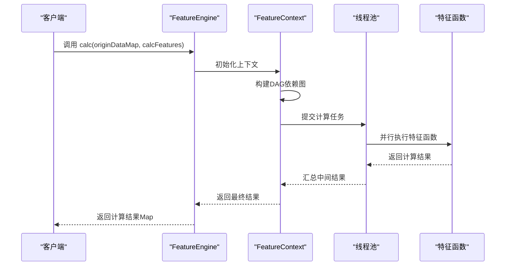
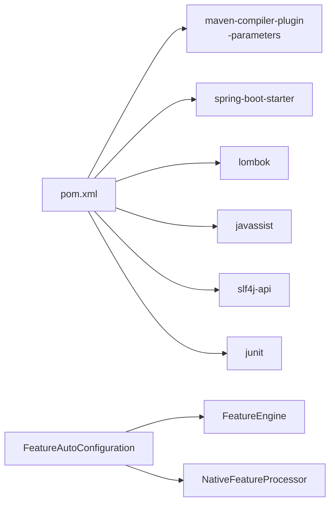

# 快速开始

<cite>
**本文引用的文件**
- [pom.xml](file://pom.xml)
- [README.md](file://README.md)
- [Feature.java](file://src/main/java/com/github/zh/engine/annotation/Feature.java)
- [FeatureClass.java](file://src/main/java/com/github/zh/engine/annotation/FeatureClass.java)
- [FeatureEngine.java](file://src/main/java/com/github/zh/engine/FeatureEngine.java)
- [FeatureAutoConfiguration.java](file://src/main/java/com/github/zh/engine/config/FeatureAutoConfiguration.java)
- [NativeFeatureProcessor.java](file://src/main/java/com/github/zh/engine/processor/NativeFeatureProcessor.java)
- [FeatureClassGenerator.java](file://src/main/java/com/github/zh/engine/clz/FeatureClassGenerator.java)
- [FeatureProperties.java](file://src/main/java/com/github/zh/engine/properties/FeatureProperties.java)
- [spring.factories](file://src/main/resources/META-INF/spring.factories)
- [application.yml](file://src/test/resources/application.yml)
- [Test.java](file://src/test/java/com/github/zh/feature/Test.java)
- [MainTest.java](file://src/test/java/com/github/zh/MainTest.java)
- [Application.java](file://src/test/java/com/github/zh/Application.java)
- [OuterFeatureBean.java](file://src/test/java/com/github/zh/bean/OuterFeatureBean.java)
</cite>

## 更新摘要
**变更内容**
- 新增详细的环境要求说明（JDK 8+、Spring Boot 2.x）
- 新增完整的 Maven 依赖配置指导
- 新增编译参数设置（-parameters）的详细说明和配置示例
- 更新安装配置部分以反映 README.md 中的最新要求
- 增强故障排查指南，包含编译参数相关的常见问题

## 目录
1. [简介](#简介)
2. [环境要求](#环境要求)
3. [Maven 依赖配置](#maven-依赖配置)
4. [编译参数设置](#编译参数设置)
5. [第一个特征函数](#第一个特征函数)
6. [特征计算流程详解](#特征计算流程详解)
7. [外部特征 Bean 的使用](#外部特征-bean-的使用)
8. [配置项与线程池](#配置项与线程池)
9. [依赖分析](#依赖分析)
10. [性能考虑](#性能考虑)
11. [故障排查指南](#故障排查指南)
12. [结论](#结论)
13. [附录](#附录)

## 简介
本指南面向希望快速上手"特征计算引擎"的开发者，目标是在本地完成环境准备、依赖引入、编译参数配置后，编写第一个特征函数并成功调用引擎完成一次计算。内容覆盖：
- **环境要求**：JDK 8+、Spring Boot 2.x 的具体版本要求
- **Maven 依赖**：完整的依赖坐标和版本信息
- **编译配置**：必需的 -parameters 参数设置方法
- **注解使用**：@Feature 与 @FeatureClass 的语义与用法
- **基础计算流程**：从定义特征类到调用 FeatureEngine 执行计算
- **示例与预期输出**：提供可运行示例与预期结果，便于快速验证
- **常见问题与解决方案**：编译器参数、Spring Boot 自动装配等

## 环境要求
在开始使用特征计算引擎之前，需要确保满足以下环境要求：

- **JDK 版本**：JDK 8 或更高版本
- **Spring Boot 版本**：Spring Boot 2.x 系列
- **操作系统**：支持 Java 运行的所有主流操作系统

这些要求确保引擎能够正常工作并充分利用现代 Java 特性。

**章节来源**
- [README.md:57-61](file://README.md#L57-L61)

## Maven 依赖配置
要将特征计算引擎集成到现有项目中，需要在项目的 Maven 配置中添加相应的依赖。以下是完整的依赖配置：

```xml
<dependency>
    <groupId>com.github.zh</groupId>
    <artifactId>feature-spring-boot-starter</artifactId>
    <version>1.0.0</version>
</dependency>
```

**重要说明**：
- 依赖坐标：`com.github.zh:feature-spring-boot-starter`
- 版本号：`1.0.0`
- 这是一个 Spring Boot Starter，会自动引入必要的依赖并启用自动配置

**章节来源**
- [README.md:62-70](file://README.md#L62-L70)
- [pom.xml:83-124](file://pom.xml#L83-L124)

## 编译参数设置
**关键要求**：必须启用 `-parameters` 编译参数，否则引擎无法正确解析方法参数名，导致特征依赖关系无法建立。

### Maven 配置
在 `pom.xml` 中配置 `maven-compiler-plugin`，确保包含 `-parameters` 参数：

```xml
<plugin>
    <groupId>org.apache.maven.plugins</groupId>
    <artifactId>maven-compiler-plugin</artifactId>
    <version>3.8.1</version>
    <configuration>
        <source>8</source>
        <target>8</target>
        <encoding>UTF-8</encoding>
        <!-- 重要：必须添加 -->
        <compilerArgs>
            <arg>-parameters</arg>
        </compilerArgs>
    </configuration>
</plugin>
```

### IDE 配置
如果使用 IntelliJ IDEA，还需要在 IDE 设置中添加编译参数：
- 打开 `Settings` → `Build, Execution, Deployment` → `Compiler` → `Java Compiler`
- 在 `Additional command line parameters` 中添加 `-parameters`

**为什么需要 -parameters 参数**：
- Java 编译器默认不保留方法参数名
- 引擎需要通过参数名来识别特征函数之间的依赖关系
- 缺少此参数会导致运行时抛出参数名解析异常

**章节来源**
- [README.md:72-91](file://README.md#L72-L91)
- [pom.xml:10-25](file://pom.xml#L10-L25)

## 第一个特征函数
现在让我们创建第一个特征函数来体验引擎的强大功能。

### 步骤 1：创建特征类
使用 `@FeatureClass` 和 `@Component` 注解标注类，并在类中定义特征函数：

```java
@FeatureClass
@Component
public class MyFeatureClass {
    
    @Feature
    public Double test4() {
        return 1.0;
    }
    
    @Feature(name = "test5")
    public Double test5(Double test4) {
        return test4 + 1.0;
    }
}
```

### 步骤 2：定义特征函数
- 使用 `@Feature` 注解标记方法
- 方法参数名即为依赖的其他特征函数名
- 可通过 `name` 属性指定不同的函数名
- 通过 `output` 属性控制是否纳入最终结果输出

### 步骤 3：执行计算
通过 `FeatureEngine` 执行特征计算：

```java
@Autowired
private FeatureEngine featureEngine;

public Map<String, Object> calculateFeatures() {
    Map<String, Object> originDataMap = new HashMap<>();
    Set<String> calcFeatures = new HashSet<>(Arrays.asList("test5"));
    return featureEngine.calc(originDataMap, calcFeatures);
}
```

**预期输出**：
```json
{
  "test4": 1.0,
  "test5": 2.0
}
```

**章节来源**
- [README.md:130-145](file://README.md#L130-L145)
- [Test.java:20-68](file://src/test/java/com/github/zh/feature/Test.java#L20-L68)
- [Application.java:12-17](file://src/test/java/com/github/zh/Application.java#L12-L17)

## 特征计算流程详解
特征计算引擎的工作流程可以分为以下几个关键阶段：

### 特征发现与注册
1. **扫描阶段**：处理器扫描被 `@FeatureClass` 标注的类
2. **解析阶段**：解析每个 `@Feature` 方法的方法签名和参数名
3. **依赖分析**：根据参数名自动识别特征函数间的依赖关系
4. **注册阶段**：生成特征 Bean 并注册到容器中

### 计算执行
1. **上下文初始化**：构建 `FeatureContext`，初始化线程池
2. **DAG 构建**：根据依赖关系构建有向无环图
3. **拓扑排序**：确定执行顺序，确保依赖关系得到满足
4. **并行执行**：使用线程池并行执行可执行的特征函数
5. **结果收集**：收集标记为 `output=true` 的特征结果



**图表来源**
- [FeatureEngine.java:85-102](file://src/main/java/com/github/zh/engine/FeatureEngine.java#L85-L102)
- [FeatureEngine.java:243-264](file://src/main/java/com/github/zh/engine/FeatureEngine.java#L243-L264)

**章节来源**
- [FeatureEngine.java:1-308](file://src/main/java/com/github/zh/engine/FeatureEngine.java#L1-L308)

## 外部特征 Bean 的使用
当内置特征无法满足需求时，可以通过外部特征 Bean 注入自定义计算逻辑。

### 自定义外部 Bean
继承 `AbstractFeatureBean` 实现自定义计算逻辑：

```java
public class CustomFeatureBean extends AbstractFeatureBean {
    
    @Override
    public Object execute(Object[] args) {
        // 实现自定义计算逻辑
        return args[0]; // 返回第一个参数
    }
}
```

### 注入外部 Bean
通过 `calcWithOuterFeatureBean` 方法将外部 Bean 与内置特征共同计算：

```java
@Autowired
private FeatureEngine featureEngine;

public Map<String, Object> calculateWithExternalBean() {
    Map<String, Object> originDataMap = new HashMap<>();
    Set<String> calcFeatures = new HashSet<>(Arrays.asList("testF"));
    
    Map<String, OuterFeatureBean> externalBeans = new HashMap<>();
    externalBeans.put("customBean", new CustomFeatureBean());
    
    return featureEngine.calcWithOuterFeatureBean(originDataMap, calcFeatures, externalBeans);
}
```

**章节来源**
- [OuterFeatureBean.java:1-16](file://src/test/java/com/github/zh/bean/OuterFeatureBean.java#L1-L16)
- [MainTest.java:58-80](file://src/test/java/com/github/zh/MainTest.java#L58-L80)

## 配置项与线程池
引擎提供了灵活的配置选项来适应不同的应用场景。

### 配置前缀
- 配置前缀：`com.github.zh.engine.feature`

### 关键配置项
| 配置项 | 默认值 | 说明 |
|--------|--------|------|
| `featureThreadPoolSize` | CPU 核心数 | 线程池核心线程数 |
| `featureThreadPoolMaxSize` | CPU 核心数 × 2 | 线程池最大线程数 |
| `calcTimeout` | 5000 ms | 计算超时时间（毫秒） |

### application.yml 配置示例
```yaml
com:
  github:
    zh:
      engine:
        feature:
          featureThreadPoolSize: 4
          featureThreadPoolMaxSize: 8
          calcTimeout: 10000
```

### 线程池配置建议
- **CPU 密集型**：核心线程数 = CPU 核心数，最大线程数 = CPU 核心数
- **IO 密集型**：核心线程数 = CPU 核心数 × 2，最大线程数 = CPU 核心数 × 4
- **混合型**：核心线程数 = CPU 核心数，最大线程数 = CPU 核心数 × 2

**章节来源**
- [FeatureProperties.java:1-37](file://src/main/java/com/github/zh/engine/properties/FeatureProperties.java#L1-L37)
- [application.yml:1-9](file://src/test/resources/application.yml#L1-L9)
- [README.md:205-223](file://README.md#L205-L223)

## 依赖分析
特征计算引擎的依赖关系相对简洁，主要依赖于 Spring Boot 生态系统。

### 自动装配机制
- `spring.factories` 文件指定了自动配置类
- `FeatureAutoConfiguration` 条件装配引擎与处理器
- 启用配置属性绑定，简化用户配置

### 编译期依赖
- `maven-compiler-plugin` 需要启用 `-parameters` 参数
- 主要运行时依赖：Spring Boot、Lombok、Javassist、SLF4J、JUnit



**图表来源**
- [pom.xml:83-124](file://pom.xml#L83-L124)
- [FeatureAutoConfiguration.java:1-37](file://src/main/java/com/github/zh/engine/config/FeatureAutoConfiguration.java#L1-L37)
- [spring.factories:1-2](file://src/main/resources/META-INF/spring.factories#L1-L2)

**章节来源**
- [pom.xml:1-141](file://pom.xml#L1-L141)
- [spring.factories:1-2](file://src/main/resources/META-INF/spring.factories#L1-L2)

## 性能考虑
特征计算引擎在设计时充分考虑了性能因素，提供了多种优化策略。

### 并行度优化
- **默认线程池大小**：CPU 核心数 × 2，平衡吞吐量和资源消耗
- **动态调整**：可根据任务特性调整线程池大小
- **任务隔离**：每个计算调用使用独立的 `FeatureContext`

### 超时控制
- **全局超时**：通过 `calcTimeout` 控制整体计算超时
- **任务超时**：单个特征函数执行超时保护
- **优雅降级**：超时后释放资源，避免系统阻塞

### 依赖优化
- **DAG 执行**：按拓扑顺序执行，减少不必要的等待
- **结果缓存**：避免重复计算相同特征
- **循环依赖检测**：防止死循环和栈溢出

**章节来源**
- [FeatureProperties.java:28-36](file://src/main/java/com/github/zh/engine/properties/FeatureProperties.java#L28-L36)
- [FeatureEngine.java:164-170](file://src/main/java/com/github/zh/engine/FeatureEngine.java#L164-L170)

## 故障排查指南
在使用过程中可能会遇到各种问题，以下是常见问题及解决方案：

### 编译参数相关问题
**问题**：编译时报错，提示找不到 `arg0`、`arg1` 等参数名
**症状**：运行时抛出参数名解析异常
**原因**：未启用 `-parameters` 编译参数
**解决方案**：
1. 在 `pom.xml` 中添加 `maven-compiler-plugin` 配置
2. 确保包含 `<arg>-parameters</arg>` 参数
3. 如果使用 IntelliJ IDEA，还需在 IDE 设置中添加编译参数

### Spring Boot 自动配置问题
**问题**：FeatureEngine 未被实例化
**症状**：注入失败或空指针异常
**原因**：自动配置未生效
**解决方案**：
1. 确认已添加 `feature-spring-boot-starter` 依赖
2. 检查 `spring.factories` 是否正确打包
3. 确认 Spring Boot 应用主类正确扫描包

### 线程池配置问题
**问题**：CPU 利用率异常或计算超时
**症状**：性能不佳或请求长时间阻塞
**解决方案**：
1. 根据任务类型调整线程池大小
2. 调整 `calcTimeout` 配置
3. 监控线程池状态和任务执行情况

### 循环依赖问题
**问题**：启动时抛出循环依赖异常或计算时死循环
**症状**：应用启动失败或计算卡死
**原因**：特征函数间存在循环依赖关系
**解决方案**：
1. 检查特征函数的参数依赖关系
2. 使用 DAG 可视化工具分析依赖图
3. 在环中任一节点提供原始数据打破循环

**章节来源**
- [README.md:332-400](file://README.md#L332-L400)
- [pom.xml:20-24](file://pom.xml#L20-L24)

## 结论
通过本指南，您已经完成了特征计算引擎的完整安装和配置，包括：
- 满足环境要求（JDK 8+、Spring Boot 2.x）
- 正确配置 Maven 依赖和编译参数
- 定义第一个特征类与特征函数
- 成功调用 FeatureEngine 完成一次并行计算
- 了解常见问题与优化方向

建议在实际项目中：
1. 根据业务场景合理配置线程池大小
2. 结合业务特点扩展外部特征 Bean
3. 建立完善的监控和日志体系
4. 定期评估和优化特征函数的依赖关系

## 附录

### 快速验证清单
- [ ] 已在 `pom.xml` 中启用 `-parameters` 编译参数
- [ ] 已添加 `feature-spring-boot-starter` 依赖
- [ ] 已创建 `@FeatureClass + @Component` 的特征类
- [ ] 已通过 `FeatureEngine.calc()` 触发计算
- [ ] 已在 `application.yml` 中按需调整线程池配置

### 参考示例路径
- **最小示例类**：[Test.java:20-68](file://src/test/java/com/github/zh/feature/Test.java#L20-L68)
- **运行入口**：[Application.java:12-17](file://src/test/java/com/github/zh/Application.java#L12-L17)
- **集成测试**：[MainTest.java:28-80](file://src/test/java/com/github/zh/MainTest.java#L28-L80)
- **外部 Bean 示例**：[OuterFeatureBean.java:10-15](file://src/test/java/com/github/zh/bean/OuterFeatureBean.java#L10-L15)

### 相关文档链接
- **官方文档**：[README.md](file://README.md)
- **源码示例**：[Test.java](file://src/test/java/com/github/zh/feature/Test.java)
- **配置示例**：[application.yml](file://src/test/resources/application.yml)