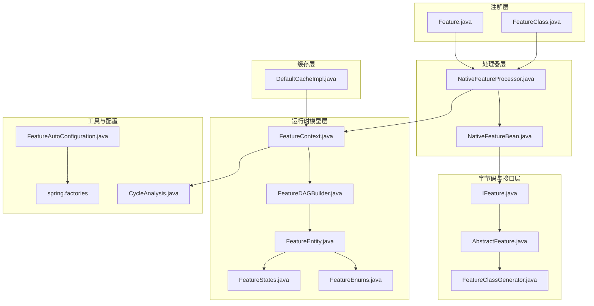
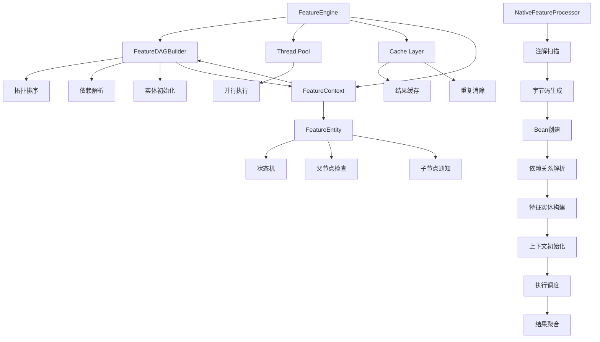
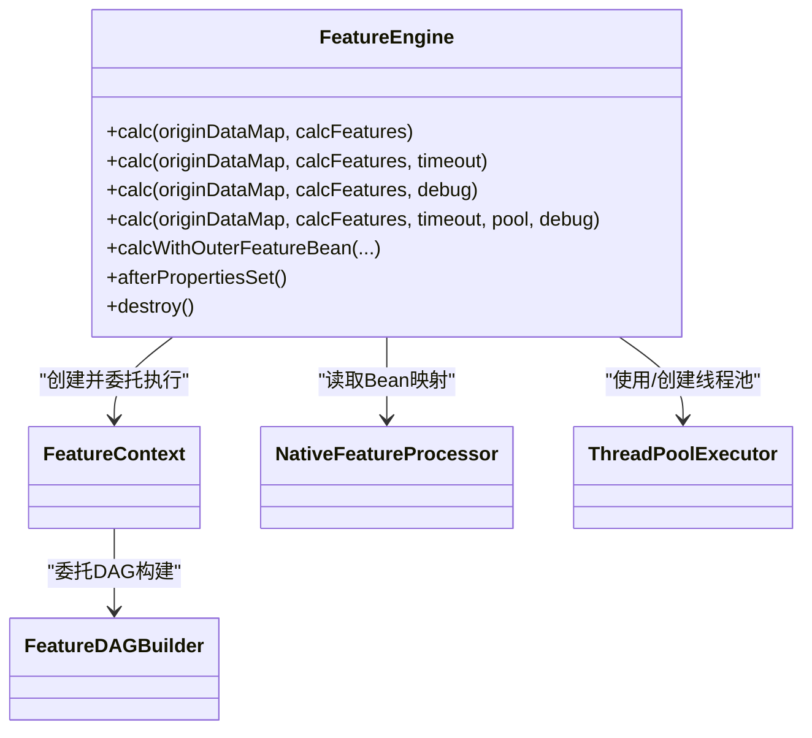
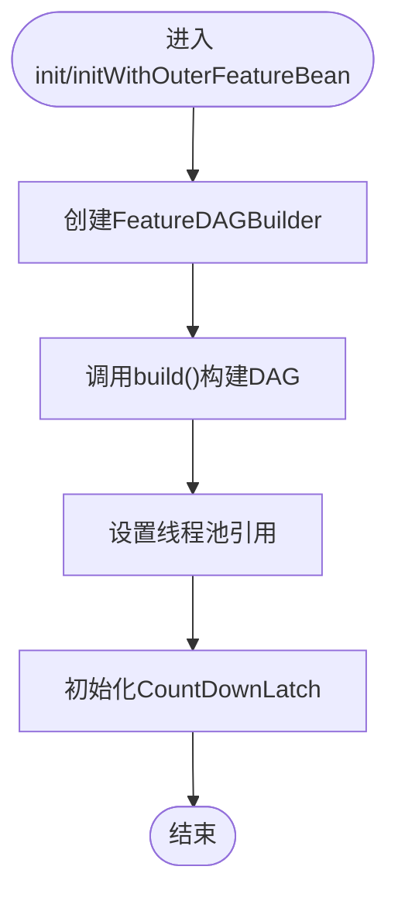
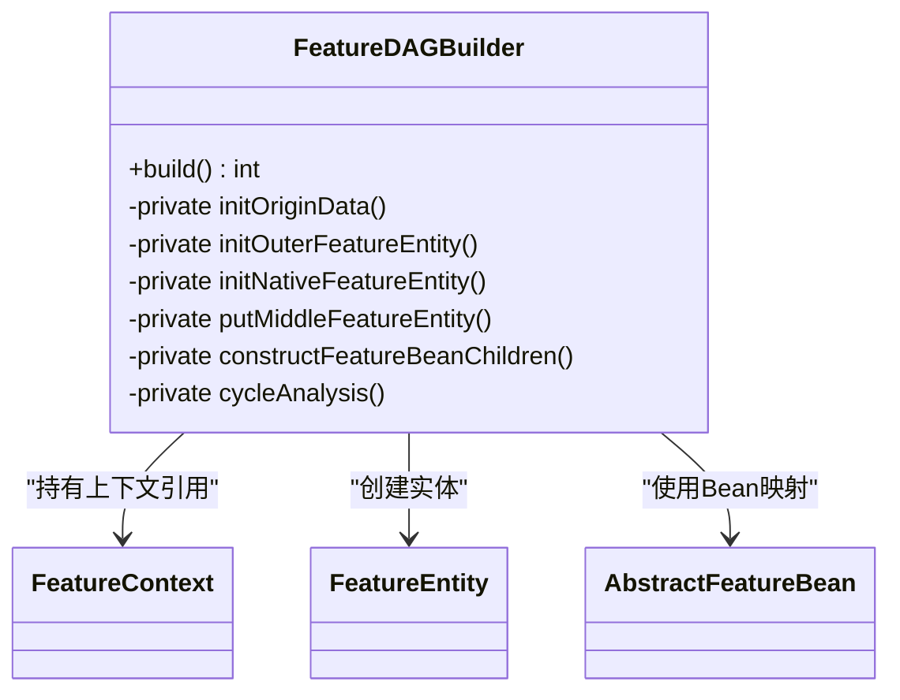
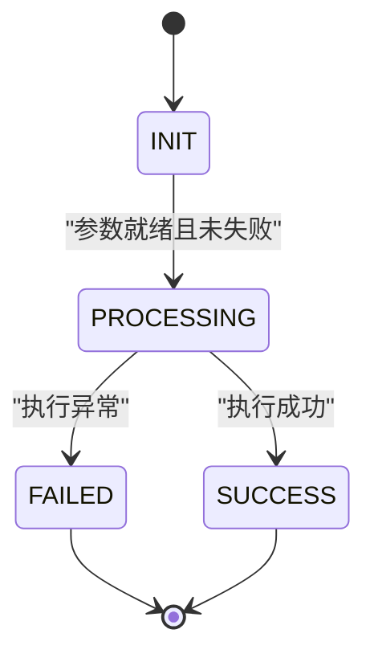
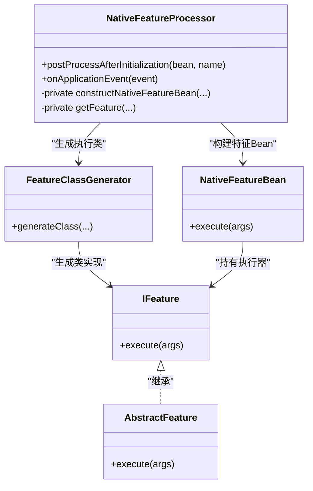
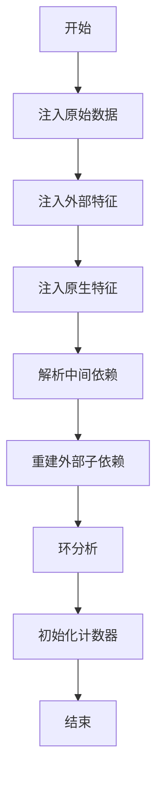
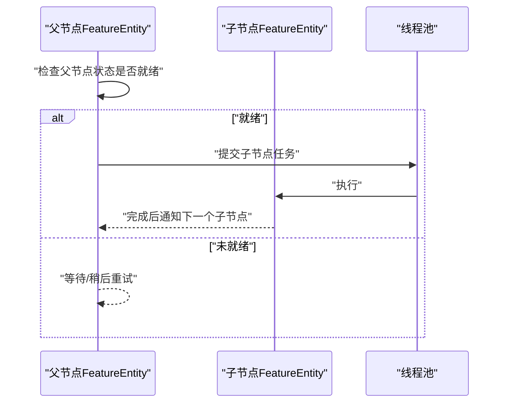
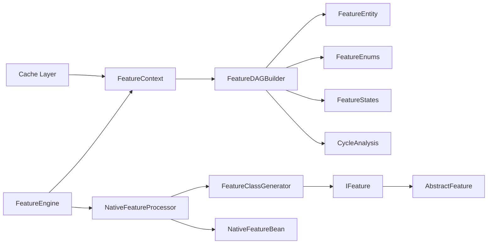

# 核心架构

<cite>
**本文引用的文件**
- [FeatureEngine.java](file://src/main/java/com/github/zh/engine/FeatureEngine.java)
- [FeatureContext.java](file://src/main/java/com/github/zh/engine/co/FeatureContext.java)
- [FeatureDAGBuilder.java](file://src/main/java/com/github/zh/engine/co/FeatureDAGBuilder.java)
- [FeatureEntity.java](file://src/main/java/com/github/zh/engine/co/FeatureEntity.java)
- [NativeFeatureProcessor.java](file://src/main/java/com/github/zh/engine/processor/NativeFeatureProcessor.java)
- [FeatureClassGenerator.java](file://src/main/java/com/github/zh/engine/clz/FeatureClassGenerator.java)
- [IFeature.java](file://src/main/java/com/github/zh/engine/clz/IFeature.java)
- [AbstractFeature.java](file://src/main/java/com/github/zh/engine/clz/AbstractFeature.java)
- [FeatureEnums.java](file://src/main/java/com/github/zh/engine/enums/FeatureEnums.java)
- [FeatureStates.java](file://src/main/java/com/github/zh/engine/enums/FeatureStates.java)
- [CycleAnalysis.java](file://src/main/java/com/github/zh/engine/tools/CycleAnalysis.java)
- [Feature.java](file://src/main/java/com/github/zh/engine/annotation/Feature.java)
- [FeatureClass.java](file://src/main/java/com/github/zh/engine/annotation/FeatureClass.java)
- [NativeFeatureBean.java](file://src/main/java/com/github/zh/engine/co/bean/NativeFeatureBean.java)
- [FeatureAutoConfiguration.java](file://src/main/java/com/github/zh/engine/config/FeatureAutoConfiguration.java)
- [spring.factories](file://src/main/resources/META-INF/spring.factories)
- [DefaultCacheImpl.java](file://src/main/java/com/github/zh/engine/cache/DefaultCacheImpl.java)
</cite>

## 更新摘要
**变更内容**
- FeatureContext重构：移除复杂初始化逻辑，直接委托给FeatureDAGBuilder
- 新增DAG构建器组件：FeatureDAGBuilder作为独立的DAG构建器类
- 优化计算上下文初始化流程：通过DAG构建器简化初始化过程
- 保持线程池管理不变：FeatureEngine继续负责线程池配置和管理
- 更新架构图为反映新的组件关系

## 目录
1. [引言](#引言)
2. [项目结构](#项目结构)
3. [核心组件](#核心组件)
4. [架构总览](#架构总览)
5. [详细组件分析](#详细组件分析)
6. [依赖分析](#依赖分析)
7. [性能考虑](#性能考虑)
8. [故障排查指南](#故障排查指南)
9. [结论](#结论)
10. [附录](#附录)

## 引言
本文件面向特征计算引擎的整体架构与实现细节，重点阐述以下主题：
- FeatureEngine 作为核心引擎的职责与调用入口
- FeatureContext 作为计算上下文的重构改进与生命周期管理
- FeatureDAGBuilder 作为独立的DAG构建器组件
- FeatureEntity 作为特征实体的执行模型与拓扑传播机制
- NativeFeatureProcessor 的注解扫描、动态字节码生成与 Bean 创建流程
- 线程池的配置参数和使用指南
- Cache Layer 的缓存机制预留与实现现状
- DAG 图构建与依赖解析、拓扑顺序保障与环检测
- 并行计算实现的技术选型与设计权衡（以 CompletableFuture 为核心）

## 项目结构
该工程采用按功能域分层的组织方式，核心模块包括：
- annotation：注解定义（用于声明特征方法与分类）
- clz：特征执行接口与动态字节码生成器
- co：核心运行时模型（上下文、实体、Bean 抽象、DAG构建器）
- processor：特征处理器（扫描注解、生成执行 Bean）
- enums：枚举类型（特征类型、状态）
- tools：工具类（环检测）
- config：自动装配配置
- cache：缓存层（预留实现）
- resources/META-INF：Spring Boot 自动装配引导

**图表来源**
- [Feature.java:1-28](file://src/main/java/com/github/zh/engine/annotation/Feature.java#L1-L28)
- [FeatureClass.java:1-17](file://src/main/java/com/github/zh/engine/annotation/FeatureClass.java#L1-L17)
- [IFeature.java:1-17](file://src/main/java/com/github/zh/engine/clz/IFeature.java#L1-L17)
- [AbstractFeature.java:1-15](file://src/main/java/com/github/zh/engine/clz/AbstractFeature.java#L1-L15)
- [FeatureClassGenerator.java:1-82](file://src/main/java/com/github/zh/engine/clz/FeatureClassGenerator.java#L1-L82)
- [FeatureContext.java:1-245](file://src/main/java/com/github/zh/engine/co/FeatureContext.java#L1-L245)
- [FeatureEntity.java:1-231](file://src/main/java/com/github/zh/engine/co/FeatureEntity.java#L1-L231)
- [FeatureEnums.java:1-26](file://src/main/java/com/github/zh/engine/enums/FeatureEnums.java#L1-L26)
- [FeatureStates.java:1-33](file://src/main/java/com/github/zh/engine/enums/FeatureStates.java#L1-L33)
- [FeatureDAGBuilder.java:1-293](file://src/main/java/com/github/zh/engine/co/FeatureDAGBuilder.java#L1-L293)
- [NativeFeatureProcessor.java:1-131](file://src/main/java/com/github/zh/engine/processor/NativeFeatureProcessor.java#L1-L131)
- [NativeFeatureBean.java:1-53](file://src/main/java/com/github/zh/engine/co/bean/NativeFeatureBean.java#L1-L53)
- [CycleAnalysis.java:1-72](file://src/main/java/com/github/zh/engine/tools/CycleAnalysis.java#L1-L72)
- [FeatureAutoConfiguration.java:1-37](file://src/main/java/com/github/zh/engine/config/FeatureAutoConfiguration.java#L1-L37)
- [spring.factories:1-2](file://src/main/resources/META-INF/spring.factories#L1-L2)
- [DefaultCacheImpl.java:1-34](file://src/main/java/com/github/zh/engine/cache/DefaultCacheImpl.java#L1-L34)

**章节来源**
- [FeatureEngine.java:1-325](file://src/main/java/com/github/zh/engine/FeatureEngine.java#L1-L325)
- [FeatureContext.java:1-245](file://src/main/java/com/github/zh/engine/co/FeatureContext.java#L1-L245)
- [FeatureDAGBuilder.java:1-293](file://src/main/java/com/github/zh/engine/co/FeatureDAGBuilder.java#L1-L293)
- [FeatureEntity.java:1-231](file://src/main/java/com/github/zh/engine/co/FeatureEntity.java#L1-L231)
- [NativeFeatureProcessor.java:1-131](file://src/main/java/com/github/zh/engine/processor/NativeFeatureProcessor.java#L1-L131)
- [FeatureClassGenerator.java:1-82](file://src/main/java/com/github/zh/engine/clz/FeatureClassGenerator.java#L1-L82)
- [IFeature.java:1-17](file://src/main/java/com/github/zh/engine/clz/IFeature.java#L1-L17)
- [AbstractFeature.java:1-15](file://src/main/java/com/github/zh/engine/clz/AbstractFeature.java#L1-L15)
- [FeatureEnums.java:1-26](file://src/main/java/com/github/zh/engine/enums/FeatureEnums.java#L1-L26)
- [FeatureStates.java:1-33](file://src/main/java/com/github/zh/engine/enums/FeatureStates.java#L1-L33)
- [CycleAnalysis.java:1-72](file://src/main/java/com/github/zh/engine/tools/CycleAnalysis.java#L1-L72)
- [Feature.java:1-28](file://src/main/java/com/github/zh/engine/annotation/Feature.java#L1-L28)
- [FeatureClass.java:1-17](file://src/main/java/com/github/zh/engine/annotation/FeatureClass.java#L1-L17)
- [NativeFeatureBean.java:1-53](file://src/main/java/com/github/zh/engine/co/bean/NativeFeatureBean.java#L1-L53)
- [FeatureAutoConfiguration.java:1-37](file://src/main/java/com/github/zh/engine/config/FeatureAutoConfiguration.java#L1-L37)
- [spring.factories:1-2](file://src/main/resources/META-INF/spring.factories#L1-L2)
- [DefaultCacheImpl.java:1-34](file://src/main/java/com/github/zh/engine/cache/DefaultCacheImpl.java#L1-L34)

## 核心组件
- FeatureEngine：引擎入口，负责初始化线程池、接收计算请求、协调上下文执行与结果返回。
- FeatureContext：重构后的计算上下文容器，负责委托DAG构建器进行DAG构建、并发调度、超时控制、结果聚合与错误传播。
- FeatureDAGBuilder：新增的独立DAG构建器组件，专门负责将特征依赖关系转换为有向无环图，执行拓扑排序和依赖解析。
- FeatureEntity：特征实体的执行单元，封装状态机、父子依赖、日志上下文传递与子节点通知。
- NativeFeatureProcessor：注解扫描与 Bean 构建器，基于反射与字节码生成，将标注方法包装为可执行的特征 Bean。
- FeatureClassGenerator：动态字节码生成器，将目标方法包装为 IFeature 实现类，实现"方法到对象"的桥接。
- IFeature/AbstractFeature：统一的执行接口与抽象基类，承载动态生成类的实例化与调用。
- FeatureEnums/FeatureStates：特征类型与状态枚举，支撑上下文与实体的状态流转与过滤逻辑。
- CycleAnalysis：拓扑环检测工具，辅助在构建依赖图时进行环路校验。
- **Thread Pool**：线程池管理器，提供可配置的并行执行环境，支持核心线程数、最大线程数和超时配置。
- **Cache Layer**：缓存层预留实现，当前为空实现，未来可用于结果缓存和重复消除。

**章节来源**
- [FeatureEngine.java:75-325](file://src/main/java/com/github/zh/engine/FeatureEngine.java#L75-L325)
- [FeatureContext.java:63-245](file://src/main/java/com/github/zh/engine/co/FeatureContext.java#L63-L245)
- [FeatureDAGBuilder.java:60-293](file://src/main/java/com/github/zh/engine/co/FeatureDAGBuilder.java#L60-L293)
- [FeatureEntity.java:65-231](file://src/main/java/com/github/zh/engine/co/FeatureEntity.java#L65-L231)
- [NativeFeatureProcessor.java:22-131](file://src/main/java/com/github/zh/engine/processor/NativeFeatureProcessor.java#L22-L131)
- [FeatureClassGenerator.java:7-82](file://src/main/java/com/github/zh/engine/clz/FeatureClassGenerator.java#L7-L82)
- [IFeature.java:7-17](file://src/main/java/com/github/zh/engine/clz/IFeature.java#L7-L17)
- [AbstractFeature.java:7-15](file://src/main/java/com/github/zh/engine/clz/AbstractFeature.java#L7-L15)
- [FeatureEnums.java:9-26](file://src/main/java/com/github/zh/engine/enums/FeatureEnums.java#L9-L26)
- [FeatureStates.java:9-33](file://src/main/java/com/github/zh/engine/enums/FeatureStates.java#L9-L33)
- [CycleAnalysis.java:18-72](file://src/main/java/com/github/zh/engine/tools/CycleAnalysis.java#L18-L72)

## 架构总览
下图展示了从注解扫描到并行计算执行的完整流程，以及各核心组件之间的交互关系。**更新**：现在FeatureContext直接委托FeatureDAGBuilder进行DAG构建。

**图表来源**
- [FeatureEngine.java:260-281](file://src/main/java/com/github/zh/engine/FeatureEngine.java#L260-L281)
- [FeatureContext.java:163-182](file://src/main/java/com/github/zh/engine/co/FeatureContext.java#L163-L182)
- [FeatureDAGBuilder.java:114-138](file://src/main/java/com/github/zh/engine/co/FeatureDAGBuilder.java#L114-L138)
- [FeatureEntity.java:106-181](file://src/main/java/com/github/zh/engine/co/FeatureEntity.java#L106-L181)
- [DefaultCacheImpl.java:1-34](file://src/main/java/com/github/zh/engine/cache/DefaultCacheImpl.java#L1-L34)

## 详细组件分析

### FeatureEngine：核心引擎
- 职责
  - 提供统一的计算入口，支持本地特征与外部特征 Bean 的混合计算
  - 维护默认线程池，或接受外部传入的线程池
  - 协调上下文初始化、执行与结果返回
- 关键点
  - 通过 FeatureContext.executeAll 控制并发与超时
  - 支持多种重载以适配不同场景（超时、调试模式、外部 Bean）
  - 默认线程池在首次使用时按配置创建

**图表来源**
- [FeatureEngine.java:75-325](file://src/main/java/com/github/zh/engine/FeatureEngine.java#L75-L325)
- [FeatureContext.java:63-245](file://src/main/java/com/github/zh/engine/co/FeatureContext.java#L63-L245)
- [FeatureDAGBuilder.java:60-293](file://src/main/java/com/github/zh/engine/co/FeatureDAGBuilder.java#L60-L293)

**章节来源**
- [FeatureEngine.java:75-325](file://src/main/java/com/github/zh/engine/FeatureEngine.java#L75-L325)

### FeatureContext：重构后的计算上下文
- 职责
  - **重构改进**：移除复杂的初始化逻辑，直接委托给FeatureDAGBuilder进行DAG构建
  - 构建一次请求的完整 DAG：原生特征、外部特征、中间依赖
  - 初始化线程池、计数器与日志上下文
  - 并发执行所有实体，等待完成或超时
  - 结果聚合与错误根因定位
- 关键流程
  - **重构后**：init/initWithOuterFeatureBean：直接创建FeatureDAGBuilder并调用build()方法
  - executeAll：为每个实体提交异步任务；等待 CountDownLatch 或超时
  - getCalcResult：根据输出标记与调试模式返回结果

**图表来源**
- [FeatureContext.java:163-182](file://src/main/java/com/github/zh/engine/co/FeatureContext.java#L163-L182)
- [FeatureContext.java:122-144](file://src/main/java/com/github/zh/engine/co/FeatureContext.java#L122-L144)

**章节来源**
- [FeatureContext.java:63-245](file://src/main/java/com/github/zh/engine/co/FeatureContext.java#L63-L245)
- [FeatureDAGBuilder.java:114-138](file://src/main/java/com/github/zh/engine/co/FeatureDAGBuilder.java#L114-L138)

### FeatureDAGBuilder：新增的DAG构建器组件
- 职责
  - **新增组件**：专门负责将特征依赖关系转换为有向无环图
  - 执行拓扑排序和依赖解析
  - 初始化各种类型的特征实体
  - 构建父-子关系和中间依赖
- 关键构建步骤
  - **initOriginData**：注入原始数据为预计算特征实体
  - **initOuterFeatureEntity**：注入外部特征实体
  - **initNativeFeatureEntity**：注入请求的原生特征实体
  - **putMiddleFeatureEntity**：解析并添加中间依赖特征实体
  - **constructFeatureBeanChildren**：重建父-子关系（对外部Bean必需）
  - **cycleAnalysis**：执行环检测分析

**图表来源**
- [FeatureDAGBuilder.java:60-293](file://src/main/java/com/github/zh/engine/co/FeatureDAGBuilder.java#L60-L293)

**章节来源**
- [FeatureDAGBuilder.java:60-293](file://src/main/java/com/github/zh/engine/co/FeatureDAGBuilder.java#L60-L293)

### FeatureEntity：特征实体执行模型
- 职责
  - 封装单个特征的执行逻辑与状态
  - 检查父节点就绪与错误传播
  - 执行特征 Bean 并通知子节点
- 关键机制
  - 状态机：INIT → PROCESSING → SUCCESS/FAILED
  - 错误传播：一旦父节点失败，当前节点标记失败并向上追溯根因
  - 子节点通知：使用线程池异步触发子节点继续执行
  - 日志上下文：MDC 透传，便于链路追踪

**图表来源**
- [FeatureStates.java:9-33](file://src/main/java/com/github/zh/engine/enums/FeatureStates.java#L9-L33)
- [FeatureEntity.java:106-181](file://src/main/java/com/github/zh/engine/co/FeatureEntity.java#L106-L181)

**章节来源**
- [FeatureEntity.java:65-231](file://src/main/java/com/github/zh/engine/co/FeatureEntity.java#L65-L231)
- [FeatureStates.java:9-33](file://src/main/java/com/github/zh/engine/enums/FeatureStates.java#L9-L33)

### NativeFeatureProcessor：注解处理与 Bean 创建
- 职责
  - 扫描带有 FeatureClass 的 Bean，提取标注了 Feature 的方法
  - 为每个方法生成 IFeature 实例（动态字节码）
  - 构造 NativeFeatureBean（含名称、输出标记、父/子依赖、元数据、返回类型、属性）
  - 触发后置处理器扩展点
  - 在应用上下文刷新时填充子依赖
- 动态字节码生成
  - 使用 FeatureClassGenerator 生成类，构造函数与模板方法桥接目标方法
  - 通过反射实例化生成类，作为 IFeature 的具体实现

**图表来源**
- [NativeFeatureProcessor.java:22-131](file://src/main/java/com/github/zh/engine/processor/NativeFeatureProcessor.java#L22-L131)
- [FeatureClassGenerator.java:7-82](file://src/main/java/com/github/zh/engine/clz/FeatureClassGenerator.java#L7-L82)
- [IFeature.java:7-17](file://src/main/java/com/github/zh/engine/clz/IFeature.java#L7-L17)
- [AbstractFeature.java:7-15](file://src/main/java/com/github/zh/engine/clz/AbstractFeature.java#L7-L15)
- [NativeFeatureBean.java:24-53](file://src/main/java/com/github/zh/engine/co/bean/NativeFeatureBean.java#L24-L53)

**章节来源**
- [NativeFeatureProcessor.java:22-131](file://src/main/java/com/github/zh/engine/processor/NativeFeatureProcessor.java#L22-L131)
- [FeatureClassGenerator.java:7-82](file://src/main/java/com/github/zh/engine/clz/FeatureClassGenerator.java#L7-L82)
- [IFeature.java:7-17](file://src/main/java/com/github/zh/engine/clz/IFeature.java#L7-L17)
- [AbstractFeature.java:7-15](file://src/main/java/com/github/zh/engine/clz/AbstractFeature.java#L7-L15)
- [NativeFeatureBean.java:24-53](file://src/main/java/com/github/zh/engine/co/bean/NativeFeatureBean.java#L24-L53)

### DAG 构建与依赖解析
- **重构后的流程**：现在完全委托给FeatureDAGBuilder处理
- 构建步骤
  - **initOriginData**：注入原始数据为预计算特征实体
  - **initOuterFeatureEntity**：注入外部特征实体
  - **initNativeFeatureEntity**：注入请求的原生特征实体
  - **putMiddleFeatureEntity**：使用BFS解析并添加中间依赖特征实体
  - **constructFeatureBeanChildren**：重建父-子关系（对外部Bean必需）
  - **cycleAnalysis**：执行环检测分析
- 依赖关系
  - 父子列表来源于方法参数名（形参与实参绑定）与显式声明
  - 子依赖通过遍历父节点并确保子节点的 children 列表包含当前实体
- 环检测
  - 提供环检测工具，基于三色着色法识别环
  - 当前上下文中保留了环检测调用位置，便于启用

**图表来源**
- [FeatureDAGBuilder.java:114-138](file://src/main/java/com/github/zh/engine/co/FeatureDAGBuilder.java#L114-L138)
- [FeatureDAGBuilder.java:147-236](file://src/main/java/com/github/zh/engine/co/FeatureDAGBuilder.java#L147-L236)
- [CycleAnalysis.java:25-59](file://src/main/java/com/github/zh/engine/tools/CycleAnalysis.java#L25-L59)

**章节来源**
- [FeatureDAGBuilder.java:114-138](file://src/main/java/com/github/zh/engine/co/FeatureDAGBuilder.java#L114-L138)
- [FeatureDAGBuilder.java:147-236](file://src/main/java/com/github/zh/engine/co/FeatureDAGBuilder.java#L147-L236)
- [CycleAnalysis.java:18-72](file://src/main/java/com/github/zh/engine/tools/CycleAnalysis.java#L18-L72)

### 并行计算与拓扑顺序保障
- 并行策略
  - 使用线程池与 CompletableFuture.runAsync 对每个 FeatureEntity 提交独立任务
  - 通过 CountDownLatch 控制整体完成与超时
- 拓扑顺序
  - 通过状态机与父节点就绪检查保证"先父后子"
  - 子节点在父节点完成后由父节点主动通知执行
- 快速失败
  - 任一节点失败会设置上下文快失败标志，阻止后续节点继续执行
  - 根因定位：沿 errorParent 回溯至根节点，记录并抛出

**图表来源**
- [FeatureEntity.java:191-200](file://src/main/java/com/github/zh/engine/co/FeatureEntity.java#L191-L200)
- [FeatureEntity.java:131-135](file://src/main/java/com/github/zh/engine/co/FeatureEntity.java#L131-L135)
- [FeatureContext.java:95-107](file://src/main/java/com/github/zh/engine/co/FeatureContext.java#L95-L107)

**章节来源**
- [FeatureEntity.java:106-181](file://src/main/java/com/github/zh/engine/co/FeatureEntity.java#L106-L181)
- [FeatureContext.java:95-107](file://src/main/java/com/github/zh/engine/co/FeatureContext.java#L95-L107)

### Thread Pool：线程池管理
- 配置参数
  - `com.github.zh.engine.feature.featureThreadPoolSize`：线程池核心线程数，默认为CPU核心数
  - `com.github.zh.engine.feature.featureThreadPoolMaxSize`：线程池最大线程数，默认为CPU核心数×2
  - `com.github.zh.engine.feature.calcTimeout`：计算超时时间，默认5000ms
- 使用策略
  - 默认线程池在首次使用时按配置创建
  - 支持自定义线程池注入
  - 提供优雅关闭机制，支持60秒等待期

**章节来源**
- [FeatureEngine.java:294-323](file://src/main/java/com/github/zh/engine/FeatureEngine.java#L294-L323)

### Cache Layer：缓存层预留
- 现状
  - 当前实现为空实现，主要用于预留未来扩展
  - 提供基础的缓存接口定义
- 设计意图
  - 支持结果缓存，避免重复计算
  - 实现重复消除，提升性能
  - 为高并发场景提供缓存优化

**章节来源**
- [DefaultCacheImpl.java:1-34](file://src/main/java/com/github/zh/engine/cache/DefaultCacheImpl.java#L1-L34)

## 依赖分析
- 组件耦合
  - FeatureEngine 依赖 FeatureContext、NativeFeatureProcessor 与线程池
  - **重构后**：FeatureContext 仅依赖 FeatureDAGBuilder 和 FeatureEntity
  - FeatureDAGBuilder 依赖 FeatureContext、FeatureEntity、FeatureEnums、FeatureStates、CycleAnalysis
  - FeatureEntity 依赖 FeatureContext 与线程池
  - NativeFeatureProcessor 依赖 FeatureClassGenerator、IFeature、NativeFeatureBean
  - FeatureClassGenerator 依赖 AbstractFeature 与 IFeature
- 外部依赖
  - Spring Bean 生命周期回调（BeanPostProcessor、ApplicationListener）
  - Javassist 字节码生成
  - SLF4J 日志与 MDC

**图表来源**
- [FeatureEngine.java:75-281](file://src/main/java/com/github/zh/engine/FeatureEngine.java#L75-L281)
- [FeatureContext.java:63-182](file://src/main/java/com/github/zh/engine/co/FeatureContext.java#L63-L182)
- [FeatureDAGBuilder.java:60-138](file://src/main/java/com/github/zh/engine/co/FeatureDAGBuilder.java#L60-L138)
- [FeatureEntity.java:65-181](file://src/main/java/com/github/zh/engine/co/FeatureEntity.java#L65-L181)
- [NativeFeatureProcessor.java:22-131](file://src/main/java/com/github/zh/engine/processor/NativeFeatureProcessor.java#L22-L131)
- [FeatureClassGenerator.java:7-82](file://src/main/java/com/github/zh/engine/clz/FeatureClassGenerator.java#L7-L82)
- [IFeature.java:7-17](file://src/main/java/com/github/zh/engine/clz/IFeature.java#L7-L17)
- [AbstractFeature.java:7-15](file://src/main/java/com/github/zh/engine/clz/AbstractFeature.java#L7-L15)
- [NativeFeatureBean.java:24-53](file://src/main/java/com/github/zh/engine/co/bean/NativeFeatureBean.java#L24-L53)
- [FeatureEnums.java:9-26](file://src/main/java/com/github/zh/engine/enums/FeatureEnums.java#L9-L26)
- [FeatureStates.java:9-33](file://src/main/java/com/github/zh/engine/enums/FeatureStates.java#L9-L33)
- [CycleAnalysis.java:18-72](file://src/main/java/com/github/zh/engine/tools/CycleAnalysis.java#L18-L72)
- [DefaultCacheImpl.java:1-34](file://src/main/java/com/github/zh/engine/cache/DefaultCacheImpl.java#L1-L34)

**章节来源**
- [FeatureEngine.java:75-281](file://src/main/java/com/github/zh/engine/FeatureEngine.java#L75-L281)
- [FeatureContext.java:63-182](file://src/main/java/com/github/zh/engine/co/FeatureContext.java#L63-L182)
- [FeatureDAGBuilder.java:60-138](file://src/main/java/com/github/zh/engine/co/FeatureDAGBuilder.java#L60-L138)
- [FeatureEntity.java:65-181](file://src/main/java/com/github/zh/engine/co/FeatureEntity.java#L65-L181)
- [NativeFeatureProcessor.java:22-131](file://src/main/java/com/github/zh/engine/processor/NativeFeatureProcessor.java#L22-L131)
- [FeatureClassGenerator.java:7-82](file://src/main/java/com/github/zh/engine/clz/FeatureClassGenerator.java#L7-L82)
- [IFeature.java:7-17](file://src/main/java/com/github/zh/engine/clz/IFeature.java#L7-L17)
- [AbstractFeature.java:7-15](file://src/main/java/com/github/zh/engine/clz/AbstractFeature.java#L7-L15)
- [NativeFeatureBean.java:24-53](file://src/main/java/com/github/zh/engine/co/bean/NativeFeatureBean.java#L24-L53)
- [FeatureEnums.java:9-26](file://src/main/java/com/github/zh/engine/enums/FeatureEnums.java#L9-L26)
- [FeatureStates.java:9-33](file://src/main/java/com/github/zh/engine/enums/FeatureStates.java#L9-L33)
- [CycleAnalysis.java:18-72](file://src/main/java/com/github/zh/engine/tools/CycleAnalysis.java#L18-L72)
- [DefaultCacheImpl.java:1-34](file://src/main/java/com/github/zh/engine/cache/DefaultCacheImpl.java#L1-L34)

## 性能考虑
- 并行度与吞吐
  - 线程池大小与队列容量直接影响并发与背压能力
  - 建议根据 CPU 核数与 IO 密集程度调整核心线程与最大线程数
- 调度开销
  - CompletableFuture.runAsync 与线程池配合，避免阻塞主线程
  - 子节点通知采用异步提交，减少同步等待
- 资源控制
  - CountDownLatch 与超时控制防止长时间阻塞
  - 快速失败机制避免无效计算
- 字节码生成成本
  - 动态生成类仅在初始化阶段发生，运行期无额外开销
- 缓存优化
  - 预留缓存层可显著提升重复计算场景的性能
  - 结果缓存可避免重复的外部API调用
- **重构优化**：DAG构建器分离使FeatureContext更加简洁，减少了初始化过程中的复杂度

## 故障排查指南
- 常见异常
  - 计算超时：检查线程池配置与任务耗时，适当增大超时或并行度
  - 缺少依赖：确认父节点名称与参数名一致，或检查中间依赖是否正确补齐
  - 环依赖：启用环分析并修正依赖关系
  - 快速失败：查看根因节点与错误信息，定位上游失败原因
- 排查步骤
  - 开启调试模式获取全部结果，定位失败节点
  - 检查日志上下文是否正确传递（MDC）
  - 核对 Feature 输出标记，确保只收集期望字段
  - 验证线程池配置是否合理
  - **新增**：检查FeatureDAGBuilder的构建过程，确认DAG构建是否正确

**章节来源**
- [FeatureContext.java:95-107](file://src/main/java/com/github/zh/engine/co/FeatureContext.java#L95-L107)
- [FeatureContext.java:193-203](file://src/main/java/com/github/zh/engine/co/FeatureContext.java#L193-L203)
- [FeatureEntity.java:131-174](file://src/main/java/com/github/zh/engine/co/FeatureEntity.java#L131-L174)
- [CycleAnalysis.java:25-59](file://src/main/java/com/github/zh/engine/tools/CycleAnalysis.java#L25-L59)

## 结论
该特征计算引擎以"重构后的FeatureContext + FeatureDAGBuilder + Thread Pool + Cache Layer"为核心架构，通过 FeatureEngine 统一编排、FeatureContext 精准控制并发与拓扑、FeatureEntity 状态机保障一致性，实现了高可扩展、强容错的特征计算平台。**重构改进**：移除了FeatureContext中复杂的初始化逻辑，现在直接委托给专门的FeatureDAGBuilder，使架构更加清晰和易于维护。NativeFeatureProcessor 将业务方法无缝转化为可执行的特征 Bean，结合 FeatureClassGenerator 的轻量字节码生成，兼顾易用性与性能。新增的DAG构建器组件进一步增强了系统的可配置性和性能表现。

## 附录
- 自动装配
  - 通过 FeatureAutoConfiguration 与 spring.factories 实现条件装配，简化接入
- 注解与元数据
  - Feature 与 FeatureClass 提供特征命名、输出标记与分类描述
- 线程池配置
  - 支持通过配置文件调整线程池大小和超时时间
- 缓存层扩展
  - 当前为空实现，未来可扩展为高性能缓存系统
- **新增**：DAG构建器集成
  - FeatureDAGBuilder作为独立组件，专门负责DAG图的构建和管理

**章节来源**
- [FeatureAutoConfiguration.java:19-37](file://src/main/java/com/github/zh/engine/config/FeatureAutoConfiguration.java#L19-L37)
- [spring.factories:1-2](file://src/main/resources/META-INF/spring.factories#L1-L2)
- [Feature.java:13-27](file://src/main/java/com/github/zh/engine/annotation/Feature.java#L13-L27)
- [FeatureClass.java:9-16](file://src/main/java/com/github/zh/engine/annotation/FeatureClass.java#L9-L16)
- [FeatureEngine.java:294-323](file://src/main/java/com/github/zh/engine/FeatureEngine.java#L294-L323)
- [DefaultCacheImpl.java:1-34](file://src/main/java/com/github/zh/engine/cache/DefaultCacheImpl.java#L1-L34)
- [FeatureDAGBuilder.java:60-138](file://src/main/java/com/github/zh/engine/co/FeatureDAGBuilder.java#L60-L138)