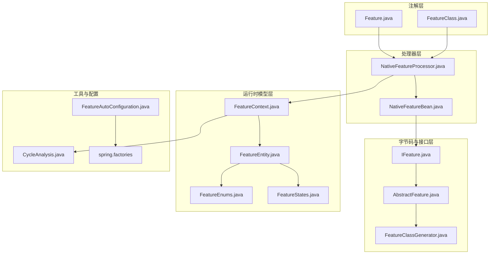
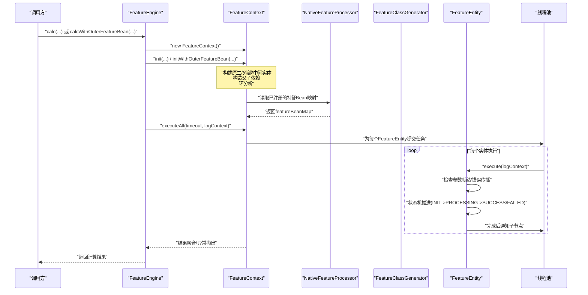
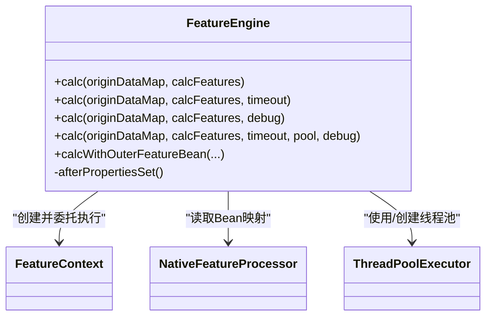
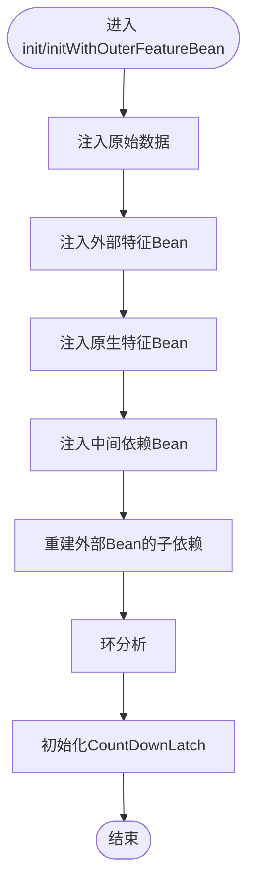
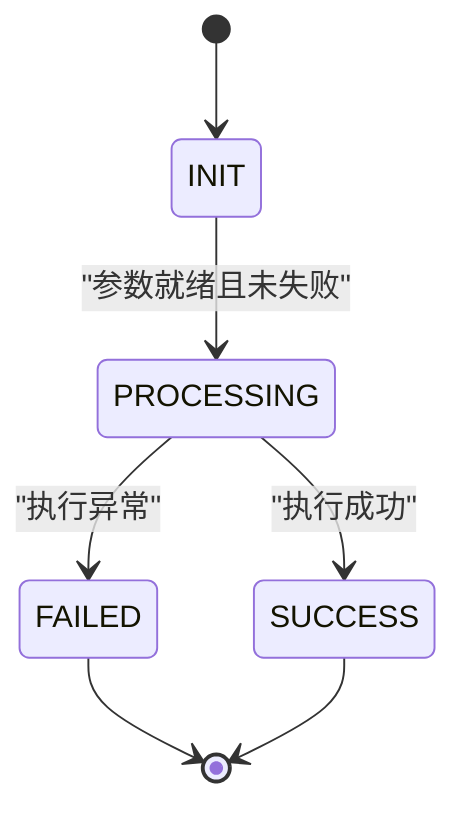
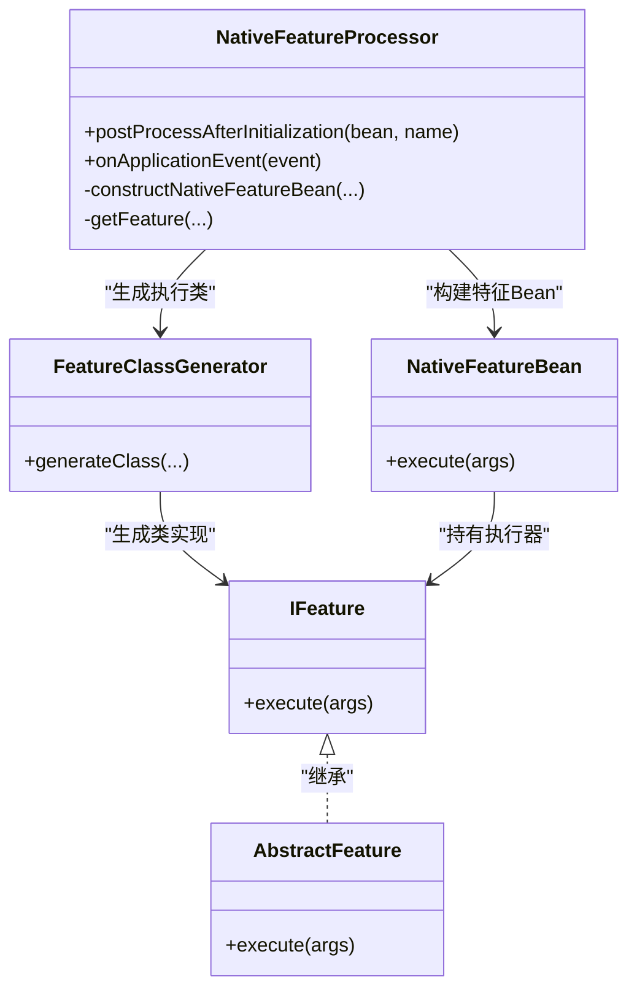
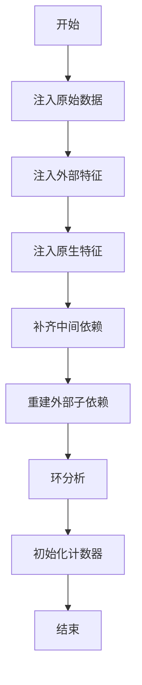
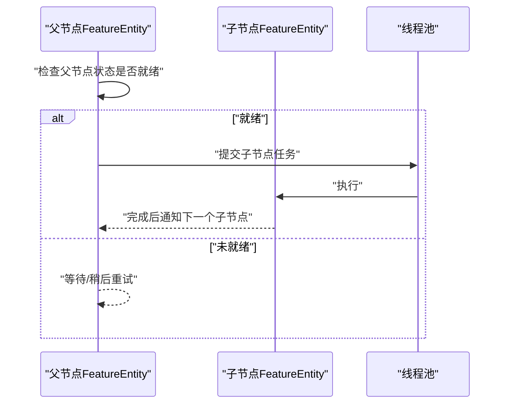
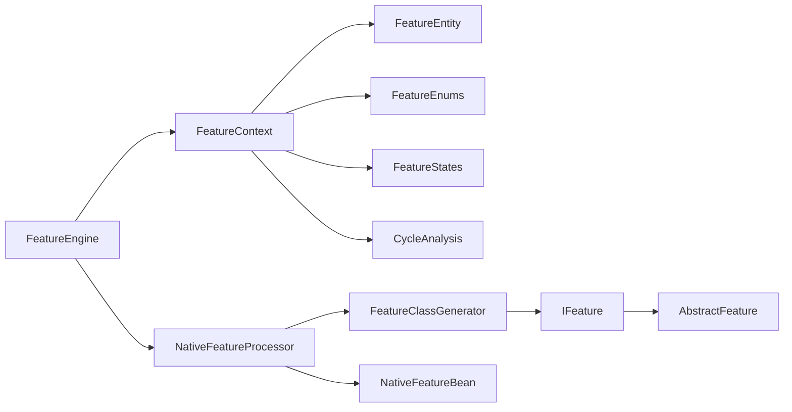

# 核心架构

<cite>
**本文引用的文件**
- [FeatureEngine.java](file://src/main/java/com/github/zh/engine/FeatureEngine.java)
- [FeatureContext.java](file://src/main/java/com/github/zh/engine/co/FeatureContext.java)
- [FeatureEntity.java](file://src/main/java/com/github/zh/engine/co/FeatureEntity.java)
- [NativeFeatureProcessor.java](file://src/main/java/com/github/zh/engine/processor/NativeFeatureProcessor.java)
- [FeatureClassGenerator.java](file://src/main/java/com/github/zh/engine/clz/FeatureClassGenerator.java)
- [IFeature.java](file://src/main/java/com/github/zh/engine/clz/IFeature.java)
- [AbstractFeature.java](file://src/main/java/com/github/zh/engine/clz/AbstractFeature.java)
- [FeatureEnums.java](file://src/main/java/com/github/zh/engine/enums/FeatureEnums.java)
- [FeatureStates.java](file://src/main/java/com/github/zh/engine/enums/FeatureStates.java)
- [CycleAnalysis.java](file://src/main/java/com/github/zh/engine/tools/CycleAnalysis.java)
- [Feature.java](file://src/main/java/com/github/zh/engine/annotation/Feature.java)
- [FeatureClass.java](file://src/main/java/com/github/zh/engine/annotation/FeatureClass.java)
- [NativeFeatureBean.java](file://src/main/java/com/github/zh/engine/co/bean/NativeFeatureBean.java)
- [FeatureAutoConfiguration.java](file://src/main/java/com/github/zh/engine/config/FeatureAutoConfiguration.java)
- [spring.factories](file://src/main/resources/META-INF/spring.factories)
</cite>

## 目录
1. [引言](#引言)
2. [项目结构](#项目结构)
3. [核心组件](#核心组件)
4. [架构总览](#架构总览)
5. [详细组件分析](#详细组件分析)
6. [依赖分析](#依赖分析)
7. [性能考虑](#性能考虑)
8. [故障排查指南](#故障排查指南)
9. [结论](#结论)
10. [附录](#附录)

## 引言
本文件面向特征计算引擎的整体架构与实现细节，重点阐述以下主题：
- FeatureEngine 作为核心引擎的职责与调用入口
- FeatureContext 作为计算上下文的生命周期、并发控制与结果聚合
- FeatureEntity 作为特征实体的执行模型与拓扑传播机制
- NativeFeatureProcessor 的注解扫描、动态字节码生成与 Bean 创建流程
- DAG 图构建与依赖解析、拓扑顺序保障与环检测
- 并行计算实现的技术选型与设计权衡（以 CompletableFuture 为核心）

## 项目结构
该工程采用按功能域分层的组织方式，核心模块包括：
- annotation：注解定义（用于声明特征方法与分类）
- clz：特征执行接口与动态字节码生成器
- co：核心运行时模型（上下文、实体、Bean 抽象）
- processor：特征处理器（扫描注解、生成执行 Bean）
- enums：枚举类型（特征类型、状态）
- tools：工具类（环检测）
- config：自动装配配置
- resources/META-INF：Spring Boot 自动装配引导

**图表来源**
- [Feature.java:1-28](file://src/main/java/com/github/zh/engine/annotation/Feature.java#L1-L28)
- [FeatureClass.java:1-17](file://src/main/java/com/github/zh/engine/annotation/FeatureClass.java#L1-L17)
- [IFeature.java:1-17](file://src/main/java/com/github/zh/engine/clz/IFeature.java#L1-L17)
- [AbstractFeature.java:1-15](file://src/main/java/com/github/zh/engine/clz/AbstractFeature.java#L1-L15)
- [FeatureClassGenerator.java:1-82](file://src/main/java/com/github/zh/engine/clz/FeatureClassGenerator.java#L1-L82)
- [FeatureContext.java:1-298](file://src/main/java/com/github/zh/engine/co/FeatureContext.java#L1-L298)
- [FeatureEntity.java:1-155](file://src/main/java/com/github/zh/engine/co/FeatureEntity.java#L1-L155)
- [FeatureEnums.java:1-26](file://src/main/java/com/github/zh/engine/enums/FeatureEnums.java#L1-L26)
- [FeatureStates.java:1-33](file://src/main/java/com/github/zh/engine/enums/FeatureStates.java#L1-L33)
- [NativeFeatureProcessor.java:1-131](file://src/main/java/com/github/zh/engine/processor/NativeFeatureProcessor.java#L1-L131)
- [NativeFeatureBean.java:1-53](file://src/main/java/com/github/zh/engine/co/bean/NativeFeatureBean.java#L1-L53)
- [CycleAnalysis.java:1-72](file://src/main/java/com/github/zh/engine/tools/CycleAnalysis.java#L1-L72)
- [FeatureAutoConfiguration.java:1-37](file://src/main/java/com/github/zh/engine/config/FeatureAutoConfiguration.java#L1-L37)
- [spring.factories:1-2](file://src/main/resources/META-INF/spring.factories#L1-L2)

**章节来源**
- [FeatureEngine.java:1-172](file://src/main/java/com/github/zh/engine/FeatureEngine.java#L1-L172)
- [FeatureContext.java:1-298](file://src/main/java/com/github/zh/engine/co/FeatureContext.java#L1-L298)
- [FeatureEntity.java:1-155](file://src/main/java/com/github/zh/engine/co/FeatureEntity.java#L1-L155)
- [NativeFeatureProcessor.java:1-131](file://src/main/java/com/github/zh/engine/processor/NativeFeatureProcessor.java#L1-L131)
- [FeatureClassGenerator.java:1-82](file://src/main/java/com/github/zh/engine/clz/FeatureClassGenerator.java#L1-L82)
- [IFeature.java:1-17](file://src/main/java/com/github/zh/engine/clz/IFeature.java#L1-L17)
- [AbstractFeature.java:1-15](file://src/main/java/com/github/zh/engine/clz/AbstractFeature.java#L1-L15)
- [FeatureEnums.java:1-26](file://src/main/java/com/github/zh/engine/enums/FeatureEnums.java#L1-L26)
- [FeatureStates.java:1-33](file://src/main/java/com/github/zh/engine/enums/FeatureStates.java#L1-L33)
- [CycleAnalysis.java:1-72](file://src/main/java/com/github/zh/engine/tools/CycleAnalysis.java#L1-L72)
- [Feature.java:1-28](file://src/main/java/com/github/zh/engine/annotation/Feature.java#L1-L28)
- [FeatureClass.java:1-17](file://src/main/java/com/github/zh/engine/annotation/FeatureClass.java#L1-L17)
- [NativeFeatureBean.java:1-53](file://src/main/java/com/github/zh/engine/co/bean/NativeFeatureBean.java#L1-L53)
- [FeatureAutoConfiguration.java:1-37](file://src/main/java/com/github/zh/engine/config/FeatureAutoConfiguration.java#L1-L37)
- [spring.factories:1-2](file://src/main/resources/META-INF/spring.factories#L1-L2)

## 核心组件
- FeatureEngine：引擎入口，负责初始化线程池、接收计算请求、协调上下文执行与结果返回。
- FeatureContext：单次计算的上下文容器，负责构建 DAG、并发调度、超时控制、结果聚合与错误传播。
- FeatureEntity：特征实体的执行单元，封装状态机、父子依赖、日志上下文传递与子节点通知。
- NativeFeatureProcessor：注解扫描与 Bean 构建器，基于反射与字节码生成，将标注方法包装为可执行的特征 Bean。
- FeatureClassGenerator：动态字节码生成器，将目标方法包装为 IFeature 实现类，实现“方法到对象”的桥接。
- IFeature/AbstractFeature：统一的执行接口与抽象基类，承载动态生成类的实例化与调用。
- FeatureEnums/FeatureStates：特征类型与状态枚举，支撑上下文与实体的状态流转与过滤逻辑。
- CycleAnalysis：拓扑环检测工具，辅助在构建依赖图时进行环路校验。

**章节来源**
- [FeatureEngine.java:29-172](file://src/main/java/com/github/zh/engine/FeatureEngine.java#L29-L172)
- [FeatureContext.java:23-298](file://src/main/java/com/github/zh/engine/co/FeatureContext.java#L23-L298)
- [FeatureEntity.java:27-155](file://src/main/java/com/github/zh/engine/co/FeatureEntity.java#L27-L155)
- [NativeFeatureProcessor.java:28-131](file://src/main/java/com/github/zh/engine/processor/NativeFeatureProcessor.java#L28-L131)
- [FeatureClassGenerator.java:11-82](file://src/main/java/com/github/zh/engine/clz/FeatureClassGenerator.java#L11-L82)
- [IFeature.java:7-17](file://src/main/java/com/github/zh/engine/clz/IFeature.java#L7-L17)
- [AbstractFeature.java:7-15](file://src/main/java/com/github/zh/engine/clz/AbstractFeature.java#L7-L15)
- [FeatureEnums.java:9-26](file://src/main/java/com/github/zh/engine/enums/FeatureEnums.java#L9-L26)
- [FeatureStates.java:9-33](file://src/main/java/com/github/zh/engine/enums/FeatureStates.java#L9-L33)
- [CycleAnalysis.java:18-72](file://src/main/java/com/github/zh/engine/tools/CycleAnalysis.java#L18-L72)

## 架构总览
下图展示了从注解扫描到并行计算执行的完整流程，以及各核心组件之间的交互关系。

**图表来源**
- [FeatureEngine.java:49-161](file://src/main/java/com/github/zh/engine/FeatureEngine.java#L49-L161)
- [FeatureContext.java:49-90](file://src/main/java/com/github/zh/engine/co/FeatureContext.java#L49-L90)
- [FeatureContext.java:100-128](file://src/main/java/com/github/zh/engine/co/FeatureContext.java#L100-L128)
- [FeatureContext.java:133-151](file://src/main/java/com/github/zh/engine/co/FeatureContext.java#L133-L151)
- [FeatureEntity.java:48-134](file://src/main/java/com/github/zh/engine/co/FeatureEntity.java#L48-L134)
- [NativeFeatureProcessor.java:33-66](file://src/main/java/com/github/zh/engine/processor/NativeFeatureProcessor.java#L33-L66)
- [FeatureClassGenerator.java:28-45](file://src/main/java/com/github/zh/engine/clz/FeatureClassGenerator.java#L28-L45)

## 详细组件分析

### FeatureEngine：核心引擎
- 职责
  - 提供统一的计算入口，支持本地特征与外部特征 Bean 的混合计算
  - 维护默认线程池，或接受外部传入的线程池
  - 协调上下文初始化、执行与结果返回
- 关键点
  - 通过 FeatureContext.executeAll 控制并发与超时
  - 支持多种重载以适配不同场景（超时、调试模式、外部 Bean）
  - 默认线程池在首次使用时按配置创建

**图表来源**
- [FeatureEngine.java:29-172](file://src/main/java/com/github/zh/engine/FeatureEngine.java#L29-L172)

**章节来源**
- [FeatureEngine.java:29-172](file://src/main/java/com/github/zh/engine/FeatureEngine.java#L29-L172)

### FeatureContext：计算上下文
- 职责
  - 构建一次请求的完整 DAG：原生特征、外部特征、中间依赖
  - 初始化线程池、计数器与日志上下文
  - 并发执行所有实体，等待完成或超时
  - 结果聚合与错误根因定位
- 关键流程
  - init/initWithOuterFeatureBean：注入原始数据、外部 Bean、原生 Bean、中间依赖；重建外部 Bean 的子依赖；环分析；初始化计数器
  - executeAll：为每个实体提交异步任务；等待 CountDownLatch 或超时
  - getCalcResult：根据输出标记与调试模式返回结果

**图表来源**
- [FeatureContext.java:71-128](file://src/main/java/com/github/zh/engine/co/FeatureContext.java#L71-L128)
- [FeatureContext.java:133-151](file://src/main/java/com/github/zh/engine/co/FeatureContext.java#L133-L151)

**章节来源**
- [FeatureContext.java:23-298](file://src/main/java/com/github/zh/engine/co/FeatureContext.java#L23-L298)
- [CycleAnalysis.java:25-59](file://src/main/java/com/github/zh/engine/tools/CycleAnalysis.java#L25-L59)

### FeatureEntity：特征实体执行模型
- 职责
  - 封装单个特征的执行逻辑与状态
  - 检查父节点就绪与错误传播
  - 执行特征 Bean 并通知子节点
- 关键机制
  - 状态机：INIT → PROCESSING → SUCCESS/FAILED
  - 错误传播：一旦父节点失败，当前节点标记失败并向上追溯根因
  - 子节点通知：使用线程池异步触发子节点继续执行
  - 日志上下文：MDC 透传，便于链路追踪

**图表来源**
- [FeatureStates.java:9-33](file://src/main/java/com/github/zh/engine/enums/FeatureStates.java#L9-L33)
- [FeatureEntity.java:48-134](file://src/main/java/com/github/zh/engine/co/FeatureEntity.java#L48-L134)

**章节来源**
- [FeatureEntity.java:27-155](file://src/main/java/com/github/zh/engine/co/FeatureEntity.java#L27-L155)
- [FeatureStates.java:9-33](file://src/main/java/com/github/zh/engine/enums/FeatureStates.java#L9-L33)

### NativeFeatureProcessor：注解处理与 Bean 创建
- 职责
  - 扫描带有 FeatureClass 的 Bean，提取标注了 Feature 的方法
  - 为每个方法生成 IFeature 实例（动态字节码）
  - 构造 NativeFeatureBean（含名称、输出标记、父/子依赖、元数据、返回类型、属性）
  - 触发后置处理器扩展点
  - 在应用上下文刷新时填充子依赖
- 动态字节码生成
  - 使用 FeatureClassGenerator 生成类，构造函数与模板方法桥接目标方法
  - 通过反射实例化生成类，作为 IFeature 的具体实现

**图表来源**
- [NativeFeatureProcessor.java:28-131](file://src/main/java/com/github/zh/engine/processor/NativeFeatureProcessor.java#L28-L131)
- [FeatureClassGenerator.java:11-82](file://src/main/java/com/github/zh/engine/clz/FeatureClassGenerator.java#L11-L82)
- [IFeature.java:7-17](file://src/main/java/com/github/zh/engine/clz/IFeature.java#L7-L17)
- [AbstractFeature.java:7-15](file://src/main/java/com/github/zh/engine/clz/AbstractFeature.java#L7-L15)
- [NativeFeatureBean.java:24-53](file://src/main/java/com/github/zh/engine/co/bean/NativeFeatureBean.java#L24-L53)

**章节来源**
- [NativeFeatureProcessor.java:28-131](file://src/main/java/com/github/zh/engine/processor/NativeFeatureProcessor.java#L28-L131)
- [FeatureClassGenerator.java:11-82](file://src/main/java/com/github/zh/engine/clz/FeatureClassGenerator.java#L11-L82)
- [IFeature.java:7-17](file://src/main/java/com/github/zh/engine/clz/IFeature.java#L7-L17)
- [AbstractFeature.java:7-15](file://src/main/java/com/github/zh/engine/clz/AbstractFeature.java#L7-L15)
- [NativeFeatureBean.java:24-53](file://src/main/java/com/github/zh/engine/co/bean/NativeFeatureBean.java#L24-L53)

### DAG 构建与依赖解析
- 构建步骤
  - 原始数据：直接注入 ORIGIN_DATA 类型实体
  - 外部特征：根据传入的外部 Bean 映射构建实体并注入
  - 原生特征：根据用户请求的目标集合与已注册 Bean 构建实体
  - 中间依赖：从待计算集合出发，广度优先补齐缺失但被引用的中间节点
  - 子依赖重建：对外部 Bean 再做一次父子关系补全
- 依赖关系
  - 父子列表来源于方法参数名（形参与实参绑定）与显式声明
  - 子依赖通过遍历父节点并确保子节点的 children 列表包含当前实体
- 环检测
  - 提供环检测工具，基于三色着色法识别环
  - 当前上下文中保留了环检测调用位置，便于启用

**图表来源**
- [FeatureContext.java:162-264](file://src/main/java/com/github/zh/engine/co/FeatureContext.java#L162-L264)
- [FeatureContext.java:141-151](file://src/main/java/com/github/zh/engine/co/FeatureContext.java#L141-L151)
- [CycleAnalysis.java:25-59](file://src/main/java/com/github/zh/engine/tools/CycleAnalysis.java#L25-L59)

**章节来源**
- [FeatureContext.java:71-128](file://src/main/java/com/github/zh/engine/co/FeatureContext.java#L71-L128)
- [FeatureContext.java:133-151](file://src/main/java/com/github/zh/engine/co/FeatureContext.java#L133-L151)
- [CycleAnalysis.java:18-72](file://src/main/java/com/github/zh/engine/tools/CycleAnalysis.java#L18-L72)

### 并行计算与拓扑顺序保障
- 并行策略
  - 使用线程池与 CompletableFuture.runAsync 对每个 FeatureEntity 提交独立任务
  - 通过 CountDownLatch 控制整体完成与超时
- 拓扑顺序
  - 通过状态机与父节点就绪检查保证“先父后子”
  - 子节点在父节点完成后由父节点主动通知执行
- 快速失败
  - 任一节点失败会设置上下文快失败标志，阻止后续节点继续执行
  - 根因定位：沿 errorParent 回溯至根节点，记录并抛出

**图表来源**
- [FeatureEntity.java:125-134](file://src/main/java/com/github/zh/engine/co/FeatureEntity.java#L125-L134)
- [FeatureEntity.java:74-77](file://src/main/java/com/github/zh/engine/co/FeatureEntity.java#L74-L77)
- [FeatureContext.java:49-61](file://src/main/java/com/github/zh/engine/co/FeatureContext.java#L49-L61)

**章节来源**
- [FeatureEntity.java:48-134](file://src/main/java/com/github/zh/engine/co/FeatureEntity.java#L48-L134)
- [FeatureContext.java:49-61](file://src/main/java/com/github/zh/engine/co/FeatureContext.java#L49-L61)

## 依赖分析
- 组件耦合
  - FeatureEngine 依赖 FeatureContext、NativeFeatureProcessor 与线程池
  - FeatureContext 依赖 FeatureEntity、FeatureEnums、FeatureStates、CycleAnalysis
  - FeatureEntity 依赖 FeatureContext 与线程池
  - NativeFeatureProcessor 依赖 FeatureClassGenerator、IFeature、NativeFeatureBean
  - FeatureClassGenerator 依赖 AbstractFeature 与 IFeature
- 外部依赖
  - Spring Bean 生命周期回调（BeanPostProcessor、ApplicationListener）
  - Javassist 字节码生成
  - SLF4J 日志与 MDC

**图表来源**
- [FeatureEngine.java:29-40](file://src/main/java/com/github/zh/engine/FeatureEngine.java#L29-L40)
- [FeatureContext.java:23-41](file://src/main/java/com/github/zh/engine/co/FeatureContext.java#L23-L41)
- [FeatureEntity.java:27-46](file://src/main/java/com/github/zh/engine/co/FeatureEntity.java#L27-L46)
- [NativeFeatureProcessor.java:28-30](file://src/main/java/com/github/zh/engine/processor/NativeFeatureProcessor.java#L28-L30)
- [FeatureClassGenerator.java:11-45](file://src/main/java/com/github/zh/engine/clz/FeatureClassGenerator.java#L11-L45)
- [IFeature.java:7-17](file://src/main/java/com/github/zh/engine/clz/IFeature.java#L7-L17)
- [AbstractFeature.java:7-15](file://src/main/java/com/github/zh/engine/clz/AbstractFeature.java#L7-L15)
- [NativeFeatureBean.java:24-53](file://src/main/java/com/github/zh/engine/co/bean/NativeFeatureBean.java#L24-L53)
- [FeatureEnums.java:9-26](file://src/main/java/com/github/zh/engine/enums/FeatureEnums.java#L9-L26)
- [FeatureStates.java:9-33](file://src/main/java/com/github/zh/engine/enums/FeatureStates.java#L9-L33)
- [CycleAnalysis.java:18-72](file://src/main/java/com/github/zh/engine/tools/CycleAnalysis.java#L18-L72)

**章节来源**
- [FeatureEngine.java:29-40](file://src/main/java/com/github/zh/engine/FeatureEngine.java#L29-L40)
- [FeatureContext.java:23-41](file://src/main/java/com/github/zh/engine/co/FeatureContext.java#L23-L41)
- [FeatureEntity.java:27-46](file://src/main/java/com/github/zh/engine/co/FeatureEntity.java#L27-L46)
- [NativeFeatureProcessor.java:28-30](file://src/main/java/com/github/zh/engine/processor/NativeFeatureProcessor.java#L28-L30)
- [FeatureClassGenerator.java:11-45](file://src/main/java/com/github/zh/engine/clz/FeatureClassGenerator.java#L11-L45)
- [IFeature.java:7-17](file://src/main/java/com/github/zh/engine/clz/IFeature.java#L7-L17)
- [AbstractFeature.java:7-15](file://src/main/java/com/github/zh/engine/clz/AbstractFeature.java#L7-L15)
- [NativeFeatureBean.java:24-53](file://src/main/java/com/github/zh/engine/co/bean/NativeFeatureBean.java#L24-L53)
- [FeatureEnums.java:9-26](file://src/main/java/com/github/zh/engine/enums/FeatureEnums.java#L9-L26)
- [FeatureStates.java:9-33](file://src/main/java/com/github/zh/engine/enums/FeatureStates.java#L9-L33)
- [CycleAnalysis.java:18-72](file://src/main/java/com/github/zh/engine/tools/CycleAnalysis.java#L18-L72)

## 性能考虑
- 并行度与吞吐
  - 线程池大小与队列容量直接影响并发与背压能力
  - 建议根据 CPU 核数与 IO 密集程度调整核心线程与最大线程数
- 调度开销
  - CompletableFuture.runAsync 与线程池配合，避免阻塞主线程
  - 子节点通知采用异步提交，减少同步等待
- 资源控制
  - CountDownLatch 与超时控制防止长时间阻塞
  - 快速失败机制避免无效计算
- 字节码生成成本
  - 动态生成类仅在初始化阶段发生，运行期无额外开销

## 故障排查指南
- 常见异常
  - 计算超时：检查线程池配置与任务耗时，适当增大超时或并行度
  - 缺少依赖：确认父节点名称与参数名一致，或检查中间依赖是否正确补齐
  - 环依赖：启用环分析并修正依赖关系
  - 快速失败：查看根因节点与错误信息，定位上游失败原因
- 排查步骤
  - 开启调试模式获取全部结果，定位失败节点
  - 检查日志上下文是否正确传递（MDC）
  - 核对 Feature 输出标记，确保只收集期望字段

**章节来源**
- [FeatureContext.java:49-61](file://src/main/java/com/github/zh/engine/co/FeatureContext.java#L49-L61)
- [FeatureContext.java:266-288](file://src/main/java/com/github/zh/engine/co/FeatureContext.java#L266-L288)
- [FeatureEntity.java:82-116](file://src/main/java/com/github/zh/engine/co/FeatureEntity.java#L82-L116)
- [CycleAnalysis.java:25-59](file://src/main/java/com/github/zh/engine/tools/CycleAnalysis.java#L25-L59)

## 结论
该特征计算引擎以“注解驱动 + 动态字节码 + DAG 并行”为核心设计，通过 FeatureEngine 统一编排、FeatureContext 精准控制并发与拓扑、FeatureEntity 状态机保障一致性，实现了高可扩展、强容错的特征计算平台。NativeFeatureProcessor 将业务方法无缝转化为可执行的特征 Bean，结合 FeatureClassGenerator 的轻量字节码生成，兼顾易用性与性能。

## 附录
- 自动装配
  - 通过 FeatureAutoConfiguration 与 spring.factories 实现条件装配，简化接入
- 注解与元数据
  - Feature 与 FeatureClass 提供特征命名、输出标记与分类描述

**章节来源**
- [FeatureAutoConfiguration.java:19-37](file://src/main/java/com/github/zh/engine/config/FeatureAutoConfiguration.java#L19-L37)
- [spring.factories:1-2](file://src/main/resources/META-INF/spring.factories#L1-L2)
- [Feature.java:13-27](file://src/main/java/com/github/zh/engine/annotation/Feature.java#L13-L27)
- [FeatureClass.java:9-16](file://src/main/java/com/github/zh/engine/annotation/FeatureClass.java#L9-L16)