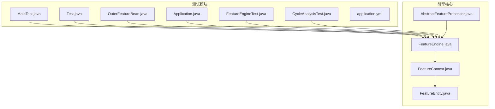
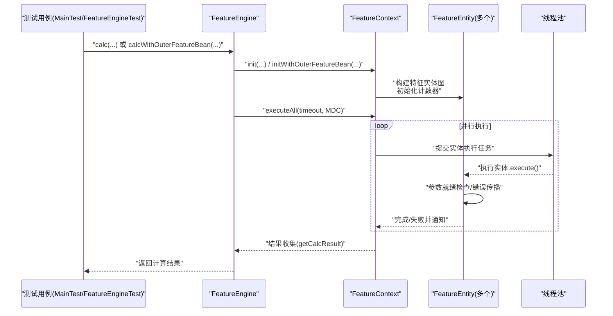
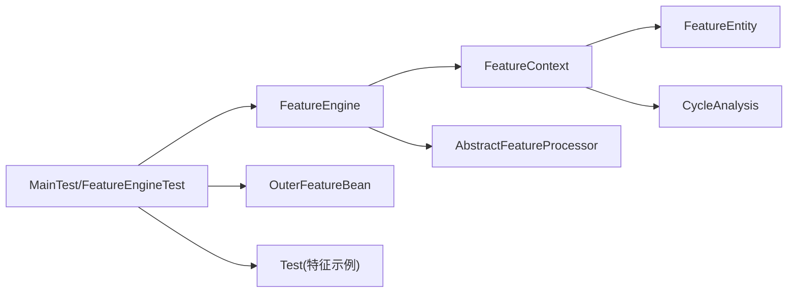

# 测试与调试

<cite>
**本文引用的文件**
- [FeatureEngine.java](file://src/main/java/com/github/zh/engine/FeatureEngine.java)
- [FeatureContext.java](file://src/main/java/com/github/zh/engine/co/FeatureContext.java)
- [FeatureEntity.java](file://src/main/java/com/github/zh/engine/co/FeatureEntity.java)
- [AbstractFeatureProcessor.java](file://src/main/java/com/github/zh/engine/processor/AbstractFeatureProcessor.java)
- [CycleAnalysis.java](file://src/main/java/com/github/zh/engine/tools/CycleAnalysis.java)
- [CalculateException.java](file://src/main/java/com/github/zh/engine/exception/CalculateException.java)
- [FeatureProperties.java](file://src/main/java/com/github/zh/engine/properties/FeatureProperties.java)
- [MainTest.java](file://src/test/java/com/github/zh/MainTest.java)
- [Application.java](file://src/test/java/com/github/zh/Application.java)
- [Test.java](file://src/test/java/com/github/zh/feature/Test.java)
- [OuterFeatureBean.java](file://src/test/java/com/github/zh/bean/OuterFeatureBean.java)
- [FeatureEngineTest.java](file://src/test/java/com/github/zh/FeatureEngineTest.java)
- [CycleAnalysisTest.java](file://src/test/java/com/github/zh/CycleAnalysisTest.java)
- [application.yml](file://src/test/resources/application.yml)
- [pom.xml](file://pom.xml)
- [README.md](file://README.md)
</cite>

## 目录
1. [简介](#简介)
2. [项目结构](#项目结构)
3. [核心组件](#核心组件)
4. [架构总览](#架构总览)
5. [详细组件分析](#详细组件分析)
6. [依赖分析](#依赖分析)
7. [性能考量](#性能考量)
8. [故障排查指南](#故障排查指南)
9. [结论](#结论)
10. [附录](#附录)

## 简介
本指南聚焦于该特征引擎项目的"测试与调试"主题，覆盖以下方面：
- 单元测试最佳实践：如何测试特征函数的依赖关系、并行计算的正确性
- 集成测试实现：完整特征计算流程的端到端验证
- 调试技巧与工具：查看特征依赖图、监控计算进度、定位性能瓶颈
- 常见问题诊断：计算错误、性能问题、配置问题
- 测试数据准备与外部依赖模拟
- 性能测试与压力测试实施建议

**更新** 新增FeatureEngineTest和CycleAnalysisTest测试类，提供全面的单元测试覆盖，包括单特征计算、依赖特征链、原数据注入、多特征并行执行、调试模式操作和超时处理

## 项目结构
该项目采用 Spring Boot 自动装配风格，核心计算逻辑集中在引擎与上下文类中，测试用例位于独立的测试模块，便于隔离运行。

**图表来源**
- [FeatureEngine.java:1-324](file://src/main/java/com/github/zh/engine/FeatureEngine.java#L1-L324)
- [FeatureContext.java:1-298](file://src/main/java/com/github/zh/engine/co/FeatureContext.java#L1-L298)
- [FeatureEntity.java:1-200](file://src/main/java/com/github/zh/engine/co/FeatureEntity.java#L1-L200)
- [AbstractFeatureProcessor.java:1-53](file://src/main/java/com/github/zh/engine/processor/AbstractFeatureProcessor.java#L1-L53)
- [MainTest.java:1-99](file://src/test/java/com/github/zh/MainTest.java#L1-L99)
- [Test.java:1-85](file://src/test/java/com/github/zh/feature/Test.java#L1-L85)
- [OuterFeatureBean.java:1-33](file://src/test/java/com/github/zh/bean/OuterFeatureBean.java#L1-L33)
- [Application.java:1-35](file://src/test/java/com/github/zh/Application.java#L1-L35)
- [FeatureEngineTest.java:1-207](file://src/test/java/com/github/zh/FeatureEngineTest.java#L1-L207)
- [CycleAnalysisTest.java:1-200](file://src/test/java/com/github/zh/CycleAnalysisTest.java#L1-L200)
- [application.yml:1-9](file://src/test/resources/application.yml#L1-L9)

**章节来源**
- [FeatureEngine.java:1-324](file://src/main/java/com/github/zh/engine/FeatureEngine.java#L1-L324)
- [FeatureContext.java:1-298](file://src/main/java/com/github/zh/engine/co/FeatureContext.java#L1-L298)
- [MainTest.java:1-99](file://src/test/java/com/github/zh/MainTest.java#L1-L99)
- [application.yml:1-9](file://src/test/resources/application.yml#L1-L9)

## 核心组件
- 特征引擎入口：负责接收输入、选择执行路径（本地或外部 Bean）、调度线程池并返回结果
- 计算上下文：构建特征实体图、初始化依赖关系、并发执行、超时控制、结果收集
- 特征实体：单个特征的执行单元，负责参数就绪检查、错误传播、子节点通知
- 处理器基类：统一管理特征 Bean 的注册、父子关系回填、后置处理器扩展点
- 环检测工具：辅助分析特征依赖是否存在环路
- 异常体系：统一的计算异常类型，便于测试断言与日志定位

**章节来源**
- [FeatureEngine.java:85-324](file://src/main/java/com/github/zh/engine/FeatureEngine.java#L85-L324)
- [FeatureContext.java:49-297](file://src/main/java/com/github/zh/engine/co/FeatureContext.java#L49-L297)
- [FeatureEntity.java:54-154](file://src/main/java/com/github/zh/engine/co/FeatureEntity.java#L54-L154)
- [AbstractFeatureProcessor.java:17-52](file://src/main/java/com/github/zh/engine/processor/AbstractFeatureProcessor.java#L17-L52)
- [CycleAnalysis.java:51-129](file://src/main/java/com/github/zh/engine/tools/CycleAnalysis.java#L51-L129)
- [CalculateException.java:9-19](file://src/main/java/com/github/zh/engine/exception/CalculateException.java#L9-L19)

## 架构总览
下图展示了从测试调用到最终结果返回的关键交互路径，以及并行执行与依赖关系传播机制。

**图表来源**
- [FeatureEngine.java:102-281](file://src/main/java/com/github/zh/engine/FeatureEngine.java#L102-L281)
- [FeatureContext.java:49-90](file://src/main/java/com/github/zh/engine/co/FeatureContext.java#L49-L90)
- [FeatureEntity.java:54-154](file://src/main/java/com/github/zh/engine/co/FeatureEntity.java#L54-L154)

## 详细组件分析

### 组件一：FeatureEngine（引擎入口）
- 职责
  - 提供多种重载的计算入口，支持本地特征、外部特征、超时控制、调试开关
  - 在首次使用时按配置创建默认线程池
- 关键点
  - 通过上下文初始化并执行，最终返回结果
  - 支持传入自定义线程池以满足不同并发需求
- 测试关注点
  - 不同重载方法的行为一致性
  - 超时与异常路径
  - 外部 Bean 注入后的依赖传播

**章节来源**
- [FeatureEngine.java:85-324](file://src/main/java/com/github/zh/engine/FeatureEngine.java#L85-L324)

### 组件二：FeatureContext（计算上下文）
- 职责
  - 构建特征实体池，注入原始数据、本地/外部特征实体
  - 进行环分析（当前为占位，可启用）、初始化计数器、并发执行
  - 结果收集：根据输出标记过滤或全量返回
- 关键点
  - 并发执行基于 CountDownLatch 控制整体完成
  - 超时抛出统一异常
  - 快速失败策略：任一实体失败即触发全局失败
- 测试关注点
  - 初始化阶段的实体构建顺序与完整性
  - 外部 Bean 合并后依赖关系重建
  - 调试模式下的全量结果收集

**章节来源**
- [FeatureContext.java:49-297](file://src/main/java/com/github/zh/engine/co/FeatureContext.java#L49-L297)

### 组件三：FeatureEntity（特征实体）
- 职责
  - 单个特征的执行单元，负责参数就绪检查、错误传播、子节点通知
  - 使用 CAS 更新状态，避免竞态
- 关键点
  - 子节点通过异步任务逐个唤醒
  - 错误父节点记录，便于根因定位
- 测试关注点
  - 参数依赖满足与不满足时的行为
  - 失败传播与快速失败联动
  - 并发场景下的状态一致性

**章节来源**
- [FeatureEntity.java:54-154](file://src/main/java/com/github/zh/engine/co/FeatureEntity.java#L54-L154)

### 组件四：AbstractFeatureProcessor（处理器基类）
- 职责
  - 统一注册特征 Bean，回填父子关系
  - 提供后置处理器扩展点，便于在装配后进一步加工
- 关键点
  - 并发安全的 Bean 映射
  - 可选的后置处理器链式处理
- 测试关注点
  - Bean 注册与父子关系正确性
  - 后置处理器生效顺序与条件匹配

**章节来源**
- [AbstractFeatureProcessor.java:17-52](file://src/main/java/com/github/zh/engine/processor/AbstractFeatureProcessor.java#L17-L52)

### 组件五：CycleAnalysis（环分析）
- 职责
  - 基于着色法检测依赖图是否存在环
- 关键点
  - 当前上下文中为占位实现，可直接启用
- 测试关注点
  - 有环与无环场景的判定
  - 与上下文初始化流程的集成

**章节来源**
- [CycleAnalysis.java:51-129](file://src/main/java/com/github/zh/engine/tools/CycleAnalysis.java#L51-L129)

### 组件六：异常体系（CalculateException）
- 职责
  - 统一的计算异常类型，便于测试断言与日志定位
- 测试关注点
  - 超时、无变量需计算、缺失依赖等场景的异常抛出与消息

**章节来源**
- [CalculateException.java:9-19](file://src/main/java/com/github/zh/engine/exception/CalculateException.java#L9-L19)

## 依赖分析
- 模块内依赖
  - FeatureEngine 依赖 FeatureContext 与处理器
  - FeatureContext 依赖 FeatureEntity 与环分析工具
  - FeatureEntity 依赖上下文与线程池
- 测试依赖
  - 测试模块通过 Spring Boot 测试启动应用上下文，注入引擎进行验证
  - 外部 Bean 通过简单实现进行依赖注入与合并

**图表来源**
- [FeatureEngine.java:1-324](file://src/main/java/com/github/zh/engine/FeatureEngine.java#L1-L324)
- [FeatureContext.java:1-298](file://src/main/java/com/github/zh/engine/co/FeatureContext.java#L1-L298)
- [FeatureEntity.java:1-200](file://src/main/java/com/github/zh/engine/co/FeatureEntity.java#L1-L200)
- [AbstractFeatureProcessor.java:1-53](file://src/main/java/com/github/zh/engine/processor/AbstractFeatureProcessor.java#L1-L53)
- [CycleAnalysis.java:1-129](file://src/main/java/com/github/zh/engine/tools/CycleAnalysis.java#L1-L129)
- [MainTest.java:1-99](file://src/test/java/com/github/zh/MainTest.java#L1-L99)
- [OuterFeatureBean.java:1-33](file://src/test/java/com/github/zh/bean/OuterFeatureBean.java#L1-L33)
- [Test.java:1-85](file://src/test/java/com/github/zh/feature/Test.java#L1-L85)

## 性能考量
- 线程池配置
  - 通过配置项设置核心/最大线程数，影响并发度与资源占用
  - 建议在测试环境中逐步提高并发度，观察吞吐与延迟变化
- 并发模型
  - 基于 CompletableFuture 的异步执行，注意任务粒度与抖动
  - 合理设置超时时间，避免长时间阻塞
- 监控与观测
  - 利用日志级别与 MDC 上下文，追踪单次计算的执行轨迹
  - 在调试模式下收集全量中间结果，辅助定位瓶颈
- 压力测试建议
  - 构造大规模特征依赖图，逐步增加并发与数据规模
  - 关注 CountDownLatch 等同步点的等待时间分布
  - 对比启用/禁用快速失败策略对整体耗时的影响

**章节来源**
- [application.yml:1-9](file://src/test/resources/application.yml#L1-L9)
- [FeatureEngine.java:293-324](file://src/main/java/com/github/zh/engine/FeatureEngine.java#L293-L324)
- [FeatureContext.java:49-90](file://src/main/java/com/github/zh/engine/co/FeatureContext.java#L49-L90)

## 故障排查指南

### 如何查看特征依赖图
- 方法一：利用调试模式
  - 在返回结果时开启调试开关，收集所有特征实体的结果，从而还原依赖关系
- 方法二：日志与上下文
  - 通过日志上下文与实体状态，结合实体间的父子关系字段，绘制依赖图
- 方法三：环分析工具
  - 启用环分析，快速判断是否存在循环依赖

**章节来源**
- [FeatureContext.java:277-297](file://src/main/java/com/github/zh/engine/co/FeatureContext.java#L277-L297)
- [CycleAnalysis.java:65-99](file://src/main/java/com/github/zh/engine/tools/CycleAnalysis.java#L65-L99)

### 如何监控计算进度
- 关键指标
  - 剩余待计算特征数量（由计数器推导）
  - 实体状态流转（INIT → RUNNING → SUCCESS/FAILED）
- 观测手段
  - 在实体执行前后打印状态与日志
  - 使用调试模式收集中间结果，评估各阶段耗时

**章节来源**
- [FeatureEntity.java:54-154](file://src/main/java/com/github/zh/engine/co/FeatureEntity.java#L54-L154)
- [FeatureContext.java:49-90](file://src/main/java/com/github/zh/engine/co/FeatureContext.java#L49-L90)

### 如何分析性能瓶颈
- CPU 密集型 vs IO 密集型
  - 若特征计算本身轻量，瓶颈可能在上下文初始化或依赖解析
  - 若存在大量外部调用，瓶颈可能在 IO 与网络
- 并发度与队列
  - 线程池饱和、队列堆积会导致延迟上升
- 建议手段
  - 分层压测：先单实体，再逐步引入依赖
  - 对比不同线程池大小与超时配置的效果
  - 使用调试模式输出中间结果，定位慢点

**章节来源**
- [FeatureEngine.java:293-324](file://src/main/java/com/github/zh/engine/FeatureEngine.java#L293-L324)
- [FeatureContext.java:49-90](file://src/main/java/com/github/zh/engine/co/FeatureContext.java#L49-L90)

### 常见问题与解决方案

#### 编译参数配置问题
- 症状：运行时抛出异常，提示找不到 `arg0`、`arg1` 等参数名
- 原因：Java 编译器默认不保留方法参数名，需要显式启用 `-parameters` 参数
- 解决方案：在 `pom.xml` 中添加编译配置，同时在 IDE 中配置相应参数

**章节来源**
- [README.md:336-359](file://README.md#L336-L359)

#### 循环依赖问题
- 症状：启动时抛出循环依赖检测异常，或计算时出现死循环/栈溢出
- 原因：Feature 之间存在循环依赖关系（A → B → C → A）
- 解决方案：
  - 检查 Feature 方法的参数依赖关系，确保不形成环
  - 使用 DAG 可视化工具分析依赖图
  - 在环中的某个节点通过 `originDataMap` 提供原始数据，打破循环

**章节来源**
- [README.md:361-371](file://README.md#L361-L371)

#### 线程池配置问题
- 症状：计算任务执行缓慢或出现超时
- 建议配置：
  - CPU 密集型：核心线程数 = CPU 核心数，最大线程数 = CPU 核心数
  - IO 密集型：核心线程数 = CPU 核心数 × 2，最大线程数 = CPU 核心数 × 4
  - 混合型：核心线程数 = CPU 核心数，最大线程数 = CPU 核心数 × 2
- 超时配置建议：根据实际业务响应时间要求设置 `calcTimeout`

**章节来源**
- [README.md:372-400](file://README.md#L372-L400)
- [FeatureProperties.java:18-51](file://src/main/java/com/github/zh/engine/properties/FeatureProperties.java#L18-L51)

#### 计算超时
- 现象：抛出统一异常
- 排查：检查依赖深度、线程池大小、外部依赖耗时
- 解决：增大超时、优化依赖、提升并发

#### 无变量需计算
- 现象：抛出统一异常
- 排查：确认待计算集合是否为空或名称拼写错误

#### 缺失依赖或输入参数
- 现象：初始化阶段抛出统一异常
- 排查：核对依赖列表与输入数据

#### 外部 Bean 合并不生效
- 现象：外部特征未参与计算
- 排查：确认 Bean 名称与 parents/children 字段

**章节来源**
- [CalculateException.java:9-19](file://src/main/java/com/github/zh/engine/exception/CalculateException.java#L9-L19)
- [FeatureContext.java:231-252](file://src/main/java/com/github/zh/engine/co/FeatureContext.java#L231-L252)
- [CycleAnalysis.java:65-99](file://src/main/java/com/github/zh/engine/tools/CycleAnalysis.java#L65-L99)

## 单元测试最佳实践

### 测试特征函数的依赖关系
- 目标：验证参数传递、依赖满足与失败传播
- 方法
  - 构造多个相互依赖的特征，确保父节点先于子节点完成
  - 断言子节点在父节点失败时能快速失败并向上报告根因
- 关键断言
  - 子节点状态为失败且错误信息可追溯到根因
  - 调试模式下能拿到全量中间结果

**章节来源**
- [FeatureEntity.java:54-154](file://src/main/java/com/github/zh/engine/co/FeatureEntity.java#L54-L154)
- [FeatureContext.java:266-297](file://src/main/java/com/github/zh/engine/co/FeatureContext.java#L266-L297)

### 测试并行计算的正确性
- 目标：验证多特征并发执行的一致性与正确性
- 方法
  - 设定不同线程池大小，重复执行同一组特征
  - 比较输出结果与预期值
- 关键断言
  - 输出结果稳定一致
  - 调试模式下中间结果符合预期

**章节来源**
- [FeatureEngine.java:102-159](file://src/main/java/com/github/zh/engine/FeatureEngine.java#L102-L159)
- [FeatureContext.java:49-90](file://src/main/java/com/github/zh/engine/co/FeatureContext.java#L49-L90)

### 测试外部 Bean 的依赖合并
- 目标：验证外部 Bean 与本地 Bean 的依赖合并与执行
- 方法
  - 准备外部 Bean，设置 parents/children 与输出标记
  - 调用带外部 Bean 的计算接口
- 关键断言
  - 外部 Bean 成功参与计算
  - 依赖关系正确重建，无遗漏

**章节来源**
- [FeatureEngine.java:176-239](file://src/main/java/com/github/zh/engine/FeatureEngine.java#L176-L239)
- [FeatureContext.java:100-128](file://src/main/java/com/github/zh/engine/co/FeatureContext.java#L100-L128)
- [OuterFeatureBean.java:27-33](file://src/test/java/com/github/zh/bean/OuterFeatureBean.java#L27-L33)

### 测试超时与异常路径
- 目标：验证超时与异常场景的健壮性
- 方法
  - 设置极短超时，触发超时异常
  - 构造无变量需计算或缺失依赖场景
- 关键断言
  - 抛出统一异常且消息明确
  - 调用栈可定位到具体环节

**章节来源**
- [FeatureContext.java:49-61](file://src/main/java/com/github/zh/engine/co/FeatureContext.java#L49-L61)
- [CalculateException.java:9-19](file://src/main/java/com/github/zh/engine/exception/CalculateException.java#L9-L19)

### 新增：FeatureEngineTest 全面测试覆盖

**更新** 基于新增的FeatureEngineTest类，提供以下测试覆盖：

#### 基本计算流程测试
- 单特征计算：验证基本特征计算的正确性
- 依赖特征链：测试多级依赖关系的正确执行顺序
- 参数校验：验证空参数和无效参数的处理

#### 原数据注入测试
- 完整原数据：提供完整特征值作为输入
- 部分原数据：提供中间特征值作为输入，验证自动补算

#### 多特征并行计算测试
- 多特征组合：验证多个特征的并行计算
- 输出标记测试：验证 output=true/false 的结果过滤

#### 调试模式测试
- 全量结果收集：验证调试模式下返回所有中间结果
- 中间值验证：断言各中间步骤的正确性

#### 超时处理测试
- 自定义超时：验证自定义超时时间的正确应用
- 边界情况：测试不存在的特征名处理

**章节来源**
- [FeatureEngineTest.java:42-206](file://src/test/java/com/github/zh/FeatureEngineTest.java#L42-L206)

### 新增：CycleAnalysisTest 环分析测试

**更新** 基于新增的CycleAnalysisTest类，提供以下环分析测试覆盖：

#### 无环图测试
- 简单 DAG：验证 A → B → C 的无环图检测
- 复杂 DAG：验证复杂依赖结构的正确性
- 多根节点：验证多个起始节点的图结构

#### 有环图测试
- 简单循环：验证 A → B → A 的循环检测
- 自循环：验证 A → A 的自循环检测
- 大图循环：验证复杂图中的循环检测

#### 边界情况测试
- 空图：验证空依赖图的正确处理
- 单节点：验证单节点图的处理

**章节来源**
- [CycleAnalysisTest.java:40-143](file://src/test/java/com/github/zh/CycleAnalysisTest.java#L40-L143)

## 集成测试实现

### 完整特征计算流程测试
- 步骤
  - 启动测试应用上下文
  - 注入特征示例与外部 Bean
  - 调用引擎计算，断言输出结果
- 关键点
  - 使用调试模式收集全量结果，便于回归
  - 验证输出标记为 true 的特征被纳入最终结果

**章节来源**
- [MainTest.java:49-98](file://src/test/java/com/github/zh/MainTest.java#L49-L98)
- [Test.java:45-85](file://src/test/java/com/github/zh/feature/Test.java#L45-L85)
- [Application.java:29-35](file://src/test/java/com/github/zh/Application.java#L29-L35)

## 调试技巧与工具

### 查看特征依赖图
- 利用调试模式收集全量中间结果，结合实体的 parents/children 字段绘制依赖图
- 使用环分析工具快速判断是否存在环

**章节来源**
- [FeatureContext.java:277-297](file://src/main/java/com/github/zh/engine/co/FeatureContext.java#L277-L297)
- [CycleAnalysis.java:65-99](file://src/main/java/com/github/zh/engine/tools/CycleAnalysis.java#L65-L99)

### 监控计算进度
- 通过实体状态与日志上下文，跟踪每个特征的执行阶段
- 使用 CountDownLatch 推断剩余任务数

**章节来源**
- [FeatureEntity.java:54-154](file://src/main/java/com/github/zh/engine/co/FeatureEntity.java#L54-L154)
- [FeatureContext.java:49-90](file://src/main/java/com/github/zh/engine/co/FeatureContext.java#L49-L90)

### 分析性能瓶颈
- 分层压测：单实体 → 多实体 → 大规模依赖图
- 对比不同线程池大小与超时配置
- 使用调试模式输出中间结果，定位慢点

**章节来源**
- [FeatureEngine.java:293-324](file://src/main/java/com/github/zh/engine/FeatureEngine.java#L293-L324)
- [FeatureContext.java:49-90](file://src/main/java/com/github/zh/engine/co/FeatureContext.java#L49-L90)

## 结论
本指南围绕该特征引擎的测试与调试提供了系统化方法，涵盖单元测试、集成测试、调试技巧与性能分析。通过合理使用调试模式、日志与上下文，结合统一异常体系与环分析工具，能够高效定位问题并持续优化性能。

**更新** 新增的FeatureEngineTest和CycleAnalysisTest测试类提供了全面的单元测试覆盖，包括单特征计算、依赖特征链、原数据注入、多特征并行执行、调试模式操作和超时处理，为特征引擎的稳定性和可靠性提供了坚实保障。

## 附录

### 测试数据准备与模拟外部依赖
- 外部 Bean 示例
  - 实现抽象 Bean，设置名称、parents/children、输出标记
  - 在测试中构造映射并传入引擎
- 特征示例
  - 使用注解声明特征与属性，确保依赖关系清晰

**章节来源**
- [OuterFeatureBean.java:27-33](file://src/test/java/com/github/zh/bean/OuterFeatureBean.java#L27-L33)
- [Test.java:45-85](file://src/test/java/com/github/zh/feature/Test.java#L45-L85)

### 性能测试与压力测试实施指南
- 环境准备
  - 读取配置中的线程池参数，按需调整
- 场景设计
  - 单实体基准测试
  - 逐步增加特征数量与依赖深度
  - 引入外部依赖与 IO 场景
- 指标采集
  - 延迟分布、吞吐、线程池饱和度、队列长度
- 工具建议
  - JMH（微基准）或自定义压测脚本
  - JVM 采样与 GC 日志分析

**章节来源**
- [application.yml:1-9](file://src/test/resources/application.yml#L1-L9)
- [FeatureEngine.java:293-324](file://src/main/java/com/github/zh/engine/FeatureEngine.java#L293-L324)
- [pom.xml:52-100](file://pom.xml#L52-L100)

### 编译参数配置指南
- 问题背景：Java 编译器默认不保留方法参数名
- 解决方案：在 Maven 编译插件中添加 `-parameters` 参数
- IDE 配置：IntelliJ IDEA 中也需要添加相应编译参数

**章节来源**
- [README.md:72-91](file://README.md#L72-L91)
- [README.md:359](file://README.md#L359)

### 线程池调优指南
- 配置参数：`featureThreadPoolSize`、`featureThreadPoolMaxSize`、`calcTimeout`
- 调优策略：
  - CPU 密集型：核心线程数 = CPU 核心数，最大线程数 = CPU 核心数
  - IO 密集型：核心线程数 = CPU 核心数 × 2，最大线程数 = CPU 核心数 × 4
  - 混合型：核心线程数 = CPU 核心数，最大线程数 = CPU 核心数 × 2
- 监控建议：定期监控线程池饱和度与队列长度

**章节来源**
- [README.md:205-223](file://README.md#L205-L223)
- [README.md:372-400](file://README.md#L372-L400)
- [FeatureProperties.java:18-51](file://src/main/java/com/github/zh/engine/properties/FeatureProperties.java#L18-L51)

### 新增：测试类详细说明

**更新** 基于新增的测试类，提供详细的测试覆盖说明：

#### FeatureEngineTest 测试类
- 基本功能测试：单特征计算、依赖链计算、参数校验
- 数据注入测试：原数据完整注入、部分数据注入
- 并行计算测试：多特征并行、输出标记过滤
- 调试模式测试：全量结果收集、中间值验证
- 超时处理测试：自定义超时、边界情况处理

#### CycleAnalysisTest 测试类
- 无环图测试：简单 DAG、复杂 DAG、多根节点
- 有环图测试：简单循环、自循环、大图循环
- 边界情况测试：空图、单节点图

**章节来源**
- [FeatureEngineTest.java:35-206](file://src/test/java/com/github/zh/FeatureEngineTest.java#L35-L206)
- [CycleAnalysisTest.java:36-199](file://src/test/java/com/github/zh/CycleAnalysisTest.java#L36-L199)