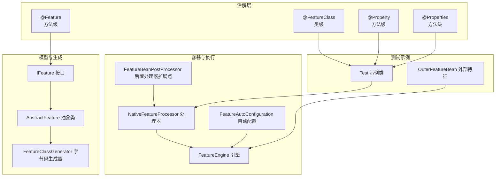
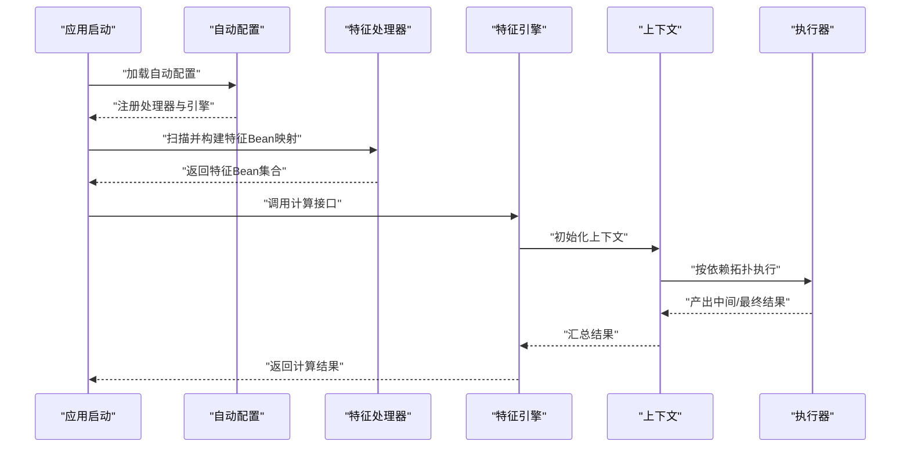
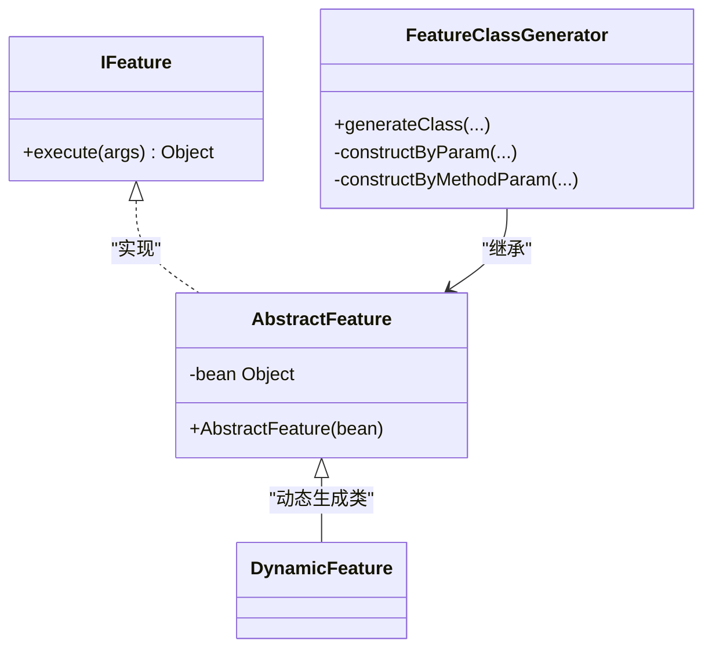
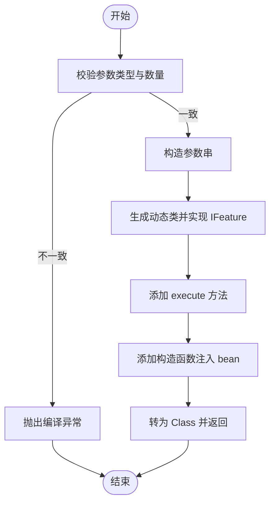
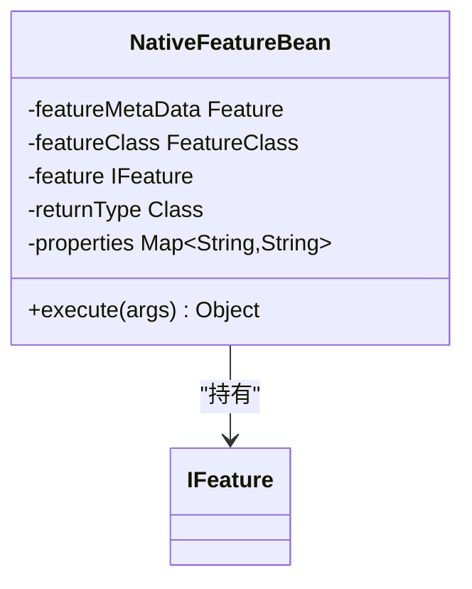
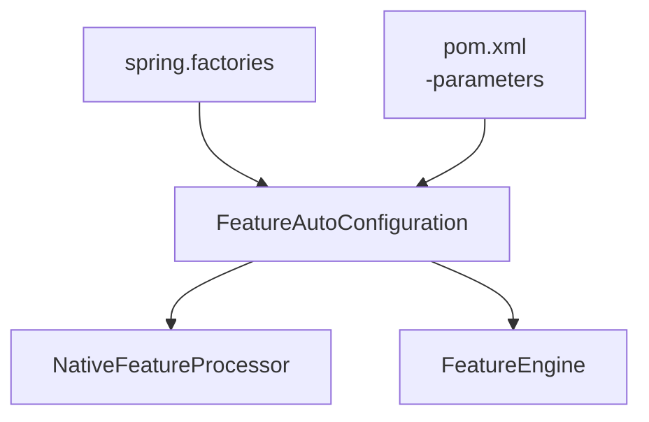
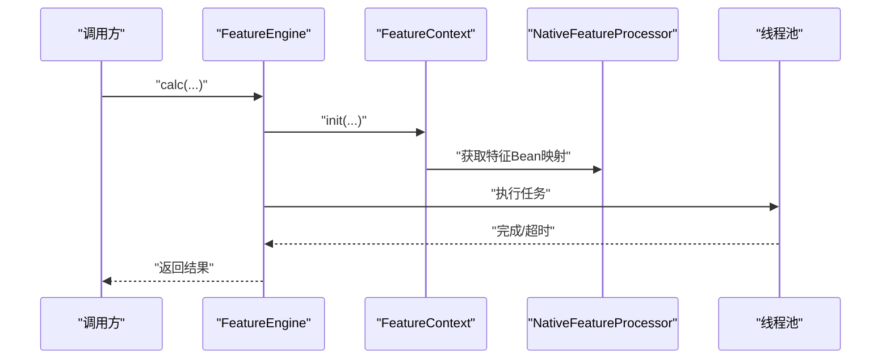
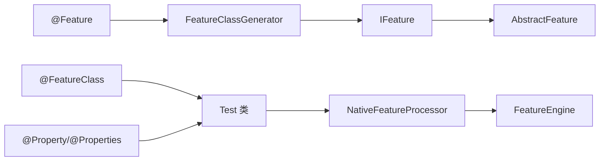

# 注解使用指南

<cite>
**本文引用的文件**
- [Feature.java](file://src/main/java/com/github/zh/engine/annotation/Feature.java)
- [FeatureClass.java](file://src/main/java/com/github/zh/engine/annotation/FeatureClass.java)
- [Properties.java](file://src/main/java/com/github/zh/engine/annotation/properties/Properties.java)
- [Property.java](file://src/main/java/com/github/zh/engine/annotation/properties/Property.java)
- [IFeature.java](file://src/main/java/com/github/zh/engine/clz/IFeature.java)
- [AbstractFeature.java](file://src/main/java/com/github/zh/engine/clz/AbstractFeature.java)
- [FeatureClassGenerator.java](file://src/main/java/com/github/zh/engine/clz/FeatureClassGenerator.java)
- [NativeFeatureBean.java](file://src/main/java/com/github/zh/engine/co/bean/NativeFeatureBean.java)
- [FeatureAutoConfiguration.java](file://src/main/java/com/github/zh/engine/config/FeatureAutoConfiguration.java)
- [FeatureEngine.java](file://src/main/java/com/github/zh/engine/FeatureEngine.java)
- [FeatureBeanPostProcessor.java](file://src/main/java/com/github/zh/engine/interfaces/FeatureBeanPostProcessor.java)
- [Test.java](file://src/test/java/com/github/zh/feature/Test.java)
- [OuterFeatureBean.java](file://src/test/java/com/github/zh/bean/OuterFeatureBean.java)
- [Application.java](file://src/test/java/com/github/zh/Application.java)
- [spring.factories](file://src/main/resources/META-INF/spring.factories)
- [pom.xml](file://pom.xml)
</cite>

## 目录
1. [简介](#简介)
2. [项目结构](#项目结构)
3. [核心注解](#核心注解)
4. [架构总览](#架构总览)
5. [详细组件解析](#详细组件解析)
6. [依赖关系分析](#依赖关系分析)
7. [性能考量](#性能考量)
8. [故障排查指南](#故障排查指南)
9. [结论](#结论)
10. [附录：完整使用示例与最佳实践](#附录完整使用示例与最佳实践)

## 简介
本指南面向希望在 Spring Boot 应用中通过注解声明“特征”（Feature）并进行自动装配与执行的开发者。内容覆盖以下注解的使用方法与集成机制：
- 方法级注解：@Feature、@Property、@Properties
- 类级注解：@FeatureClass
- 注解与 Spring 容器的自动扫描与装配流程
- 参数传递、返回值处理、生命周期管理与依赖关系建模
- 实战示例与最佳实践

## 项目结构
该工程采用按功能域分层的组织方式：
- annotation：注解定义（方法级与类级）
- annotation/properties：属性注解（单个与组合）
- clz：运行时特征模型与字节码生成
- co：特征 Bean 的元数据与封装
- config：自动配置与条件装配
- interfaces：扩展点接口（如后置处理器）
- processor：特征执行器（当前为原生实现）
- properties：配置项
- tools：工具类（如循环依赖分析）
- FeatureEngine：特征引擎入口，负责调度与并发执行
- 测试模块包含示例与演示

**图表来源**
- [Feature.java:13-27](file://src/main/java/com/github/zh/engine/annotation/Feature.java#L13-L27)
- [FeatureClass.java:13-16](file://src/main/java/com/github/zh/engine/annotation/FeatureClass.java#L13-L16)
- [Property.java:15-19](file://src/main/java/com/github/zh/engine/annotation/properties/Property.java#L15-L19)
- [Properties.java:14-17](file://src/main/java/com/github/zh/engine/annotation/properties/Properties.java#L14-L17)
- [IFeature.java:7-16](file://src/main/java/com/github/zh/engine/clz/IFeature.java#L7-L16)
- [AbstractFeature.java:7-14](file://src/main/java/com/github/zh/engine/clz/AbstractFeature.java#L7-L14)
- [FeatureClassGenerator.java:11-45](file://src/main/java/com/github/zh/engine/clz/FeatureClassGenerator.java#L11-L45)
- [FeatureEngine.java:27-171](file://src/main/java/com/github/zh/engine/FeatureEngine.java#L27-L171)
- [FeatureAutoConfiguration.java:19-36](file://src/main/java/com/github/zh/engine/config/FeatureAutoConfiguration.java#L19-L36)
- [FeatureBeanPostProcessor.java:12-20](file://src/main/java/com/github/zh/engine/interfaces/FeatureBeanPostProcessor.java#L12-L20)
- [Test.java:20-70](file://src/test/java/com/github/zh/feature/Test.java#L20-L70)
- [OuterFeatureBean.java:10-15](file://src/test/java/com/github/zh/bean/OuterFeatureBean.java#L10-L15)

**章节来源**
- [Feature.java:1-28](file://src/main/java/com/github/zh/engine/annotation/Feature.java#L1-L28)
- [FeatureClass.java:1-17](file://src/main/java/com/github/zh/engine/annotation/FeatureClass.java#L1-L17)
- [Property.java:1-20](file://src/main/java/com/github/zh/engine/annotation/properties/Property.java#L1-L20)
- [Properties.java:1-18](file://src/main/java/com/github/zh/engine/annotation/properties/Properties.java#L1-L18)
- [IFeature.java:1-17](file://src/main/java/com/github/zh/engine/clz/IFeature.java#L1-L17)
- [AbstractFeature.java:1-15](file://src/main/java/com/github/zh/engine/clz/AbstractFeature.java#L1-L15)
- [FeatureClassGenerator.java:1-82](file://src/main/java/com/github/zh/engine/clz/FeatureClassGenerator.java#L1-L82)
- [FeatureEngine.java:1-172](file://src/main/java/com/github/zh/engine/FeatureEngine.java#L1-L172)
- [FeatureAutoConfiguration.java:1-37](file://src/main/java/com/github/zh/engine/config/FeatureAutoConfiguration.java#L1-L37)
- [FeatureBeanPostProcessor.java:1-21](file://src/main/java/com/github/zh/engine/interfaces/FeatureBeanPostProcessor.java#L1-L21)
- [Test.java:1-71](file://src/test/java/com/github/zh/feature/Test.java#L1-L71)
- [OuterFeatureBean.java:1-16](file://src/test/java/com/github/zh/bean/OuterFeatureBean.java#L1-L16)
- [Application.java:1-18](file://src/test/java/com/github/zh/Application.java#L1-L18)
- [spring.factories:1-2](file://src/main/resources/META-INF/spring.factories#L1-L2)
- [pom.xml:1-100](file://pom.xml#L1-L100)

## 核心注解
- @Feature（方法级）
  - 作用：标记一个可被特征引擎识别的计算方法；支持命名与输出开关
  - 关键属性
    - name：特征名称，默认空字符串，留空则通常以方法名为基准
    - output：是否作为最终输出结果参与计算，默认 true
  - 方法签名要求
    - 返回类型任意，建议与下游依赖一致或可安全转换
    - 形参列表中的每个参数类型需与上游特征返回类型匹配
    - 建议保持纯函数式风格，避免副作用
  - 参数传递机制
    - 引擎根据依赖图自动注入上游特征的返回值
    - 支持多参数，参数顺序由依赖关系决定
  - 返回值处理
    - 若 output=true，则该特征的返回值会被收集为最终结果集
    - 若 output=false，则仅作为中间步骤参与计算，不直接出现在结果集中
  - 生命周期管理
    - 由 Spring 容器管理实例生命周期
    - 特征方法本身不涉及显式销毁回调，但可通过 Spring 的 Bean 生命周期钩子扩展

- @FeatureClass（类级）
  - 作用：声明该类包含一组特征方法，并可附加描述信息
  - 关键属性
    - description：类级描述，默认空字符串
  - 使用场景
    - 将多个相关特征方法归档到同一类，便于维护与扫描
    - 与 @Component 等容器注解配合，启用自动扫描

- @Property 与 @Properties（方法级）
  - 作用：为特征方法配置键值对属性，支持重复声明
  - @Property
    - key：属性键
    - value：属性值
  - @Properties
    - value：@Property 数组，用于批量声明
  - 使用位置
    - 可直接标注在 @Feature 方法上，或通过 @Properties 包裹多个 @Property
  - 用途
    - 为特征提供运行期配置（例如策略、阈值、开关等），供执行器读取

**章节来源**
- [Feature.java:13-27](file://src/main/java/com/github/zh/engine/annotation/Feature.java#L13-L27)
- [FeatureClass.java:13-16](file://src/main/java/com/github/zh/engine/annotation/FeatureClass.java#L13-L16)
- [Property.java:15-19](file://src/main/java/com/github/zh/engine/annotation/properties/Property.java#L15-L19)
- [Properties.java:14-17](file://src/main/java/com/github/zh/engine/annotation/properties/Properties.java#L14-L17)

## 架构总览
下图展示从 Spring 容器启动到特征执行的关键流程：

**图表来源**
- [FeatureAutoConfiguration.java:19-36](file://src/main/java/com/github/zh/engine/config/FeatureAutoConfiguration.java#L19-L36)
- [FeatureEngine.java:49-96](file://src/main/java/com/github/zh/engine/FeatureEngine.java#L49-L96)
- [Test.java:20-70](file://src/test/java/com/github/zh/feature/Test.java#L20-L70)
- [OuterFeatureBean.java:10-15](file://src/test/java/com/github/zh/bean/OuterFeatureBean.java#L10-L15)

## 详细组件解析

### 组件一：特征接口与抽象基类
- IFeature
  - 定义统一的执行入口：execute(Object[] args)
  - 作为动态生成类的实现目标
- AbstractFeature
  - 持有业务 Bean 实例引用
  - 为动态生成类提供父类支撑

**图表来源**
- [IFeature.java:7-16](file://src/main/java/com/github/zh/engine/clz/IFeature.java#L7-L16)
- [AbstractFeature.java:7-14](file://src/main/java/com/github/zh/engine/clz/AbstractFeature.java#L7-L14)
- [FeatureClassGenerator.java:11-45](file://src/main/java/com/github/zh/engine/clz/FeatureClassGenerator.java#L11-L45)

**章节来源**
- [IFeature.java:1-17](file://src/main/java/com/github/zh/engine/clz/IFeature.java#L1-L17)
- [AbstractFeature.java:1-15](file://src/main/java/com/github/zh/engine/clz/AbstractFeature.java#L1-L15)
- [FeatureClassGenerator.java:1-82](file://src/main/java/com/github/zh/engine/clz/FeatureClassGenerator.java#L1-L82)

### 组件二：特征类生成器
- 功能
  - 基于 Javassist 在运行时生成实现 IFeature 的具体类
  - 将业务 Bean 的真实方法包装为 execute(Object[] args)
  - 通过构造函数注入业务 Bean 实例
- 关键点
  - 参数绑定：根据方法参数类型与名称，从 args 中取出对应值并传入真实方法
  - 类名：以特征名为类名，确保唯一性
  - 异常：当参数类型数量与实际参数数量不一致时抛出编译异常

**图表来源**
- [FeatureClassGenerator.java:28-45](file://src/main/java/com/github/zh/engine/clz/FeatureClassGenerator.java#L28-L45)
- [FeatureClassGenerator.java:47-62](file://src/main/java/com/github/zh/engine/clz/FeatureClassGenerator.java#L47-L62)
- [FeatureClassGenerator.java:64-80](file://src/main/java/com/github/zh/engine/clz/FeatureClassGenerator.java#L64-L80)

**章节来源**
- [FeatureClassGenerator.java:1-82](file://src/main/java/com/github/zh/engine/clz/FeatureClassGenerator.java#L1-L82)

### 组件三：特征 Bean 元数据与封装
- NativeFeatureBean
  - 保存 @Feature 与 @FeatureClass 元数据
  - 保存返回类型、属性 Map、以及 IFeature 实例
  - 提供 execute(Object[] args) 代理调用底层 IFeature

**图表来源**
- [NativeFeatureBean.java:24-52](file://src/main/java/com/github/zh/engine/co/bean/NativeFeatureBean.java#L24-L52)

**章节来源**
- [NativeFeatureBean.java:1-53](file://src/main/java/com/github/zh/engine/co/bean/NativeFeatureBean.java#L1-L53)

### 组件四：自动配置与 Spring 集成
- FeatureAutoConfiguration
  - 条件装配：当存在 FeatureEngine 与 NativeFeatureProcessor 且配置项 enabled.featureEngine 为真时生效
  - 注册默认处理器与引擎 Bean
- spring.factories
  - 通过 SPI 自动注册 EnableAutoConfiguration 实现，使自动配置生效
- pom.xml
  - 编译插件开启 -parameters，保证方法参数名可用，这对参数绑定至关重要

**图表来源**
- [FeatureAutoConfiguration.java:19-36](file://src/main/java/com/github/zh/engine/config/FeatureAutoConfiguration.java#L19-L36)
- [spring.factories:1-2](file://src/main/resources/META-INF/spring.factories#L1-L2)
- [pom.xml:10-25](file://pom.xml#L10-L25)

**章节来源**
- [FeatureAutoConfiguration.java:1-37](file://src/main/java/com/github/zh/engine/config/FeatureAutoConfiguration.java#L1-L37)
- [spring.factories:1-2](file://src/main/resources/META-INF/spring.factories#L1-L2)
- [pom.xml:1-100](file://pom.xml#L1-L100)

### 组件五：特征引擎与执行流程
- FeatureEngine
  - 对外提供多种 calc(...) 重载，支持超时、调试模式、线程池自定义
  - 初始化内部线程池（若未注入）
  - 通过 FeatureContext 驱动执行，支持本地与外部特征 Bean 的混合计算
- 执行要点
  - 依赖拓扑排序执行
  - 支持超时中断
  - 可选调试模式输出中间结果

**图表来源**
- [FeatureEngine.java:49-96](file://src/main/java/com/github/zh/engine/FeatureEngine.java#L49-L96)
- [FeatureEngine.java:106-161](file://src/main/java/com/github/zh/engine/FeatureEngine.java#L106-L161)
- [FeatureEngine.java:163-171](file://src/main/java/com/github/zh/engine/FeatureEngine.java#L163-L171)

**章节来源**
- [FeatureEngine.java:1-172](file://src/main/java/com/github/zh/engine/FeatureEngine.java#L1-L172)

### 组件六：扩展点与后置处理
- FeatureBeanPostProcessor
  - 提供 postProcessAfterInitializationFeature(...) 钩子
  - 可对特定类型的特征 Bean 进行后置增强
  - 返回类型限定接口返回类

**章节来源**
- [FeatureBeanPostProcessor.java:1-21](file://src/main/java/com/github/zh/engine/interfaces/FeatureBeanPostProcessor.java#L1-L21)

## 依赖关系分析
- 注解与模型
  - @Feature 与 @FeatureClass 标注在类与方法上，驱动特征元数据采集
  - @Property/@Properties 为特征方法附加属性
- 运行时生成
  - FeatureClassGenerator 将业务方法包装为 IFeature 实现类
- 容器与执行
  - FeatureAutoConfiguration 注册处理器与引擎
  - FeatureEngine 负责调度与并发执行
- 测试示例
  - Test 展示了多特征、多依赖与属性配置的组合使用
  - OuterFeatureBean 展示了外部特征 Bean 的接入

**图表来源**
- [Feature.java:13-27](file://src/main/java/com/github/zh/engine/annotation/Feature.java#L13-L27)
- [FeatureClass.java:13-16](file://src/main/java/com/github/zh/engine/annotation/FeatureClass.java#L13-L16)
- [Property.java:15-19](file://src/main/java/com/github/zh/engine/annotation/properties/Property.java#L15-L19)
- [Properties.java:14-17](file://src/main/java/com/github/zh/engine/annotation/properties/Properties.java#L14-L17)
- [FeatureClassGenerator.java:11-45](file://src/main/java/com/github/zh/engine/clz/FeatureClassGenerator.java#L11-L45)
- [IFeature.java:7-16](file://src/main/java/com/github/zh/engine/clz/IFeature.java#L7-L16)
- [AbstractFeature.java:7-14](file://src/main/java/com/github/zh/engine/clz/AbstractFeature.java#L7-L14)
- [Test.java:20-70](file://src/test/java/com/github/zh/feature/Test.java#L20-L70)
- [FeatureEngine.java:27-171](file://src/main/java/com/github/zh/engine/FeatureEngine.java#L27-L171)

**章节来源**
- [Test.java:1-71](file://src/test/java/com/github/zh/feature/Test.java#L1-L71)
- [OuterFeatureBean.java:1-16](file://src/test/java/com/github/zh/bean/OuterFeatureBean.java#L1-L16)

## 性能考量
- 线程池配置
  - FeatureEngine 默认在 afterPropertiesSet 中创建线程池，大小由配置项控制
  - 可通过注入自定义 ThreadPoolExecutor 替换默认实现
- 超时与中断
  - calc(...) 支持超时参数，超时会触发中断，避免长时间阻塞
- 参数名与字节码生成
  - pom 中启用 -parameters，确保方法参数名可用，提升参数绑定准确性与可维护性

**章节来源**
- [FeatureEngine.java:163-171](file://src/main/java/com/github/zh/engine/FeatureEngine.java#L163-L171)
- [pom.xml:10-25](file://pom.xml#L10-L25)

## 故障排查指南
- 参数类型不匹配
  - 现象：生成动态类时报参数类型个数不匹配
  - 原因：方法形参类型与上游特征返回类型不一致
  - 处理：统一类型或在方法签名处进行显式转换
  - 参考路径：[FeatureClassGenerator.java:47-52](file://src/main/java/com/github/zh/engine/clz/FeatureClassGenerator.java#L47-L52)
- 未启用自动配置
  - 现象：处理器与引擎未注册
  - 原因：未引入自动配置或条件不满足
  - 处理：确认 spring.factories 已存在，且类路径包含自动配置类
  - 参考路径：[spring.factories:1-2](file://src/main/resources/META-INF/spring.factories#L1-L2)
- 未开启参数名编译选项
  - 现象：参数绑定失败或无法正确识别参数名
  - 处理：确保编译插件包含 -parameters
  - 参考路径：[pom.xml:10-25](file://pom.xml#L10-L25)
- 依赖循环
  - 现象：执行阶段出现死锁或异常
  - 处理：检查特征之间的依赖关系，避免环路
  - 参考路径：[FeatureEngine.java:86-96](file://src/main/java/com/github/zh/engine/FeatureEngine.java#L86-L96)

**章节来源**
- [FeatureClassGenerator.java:47-52](file://src/main/java/com/github/zh/engine/clz/FeatureClassGenerator.java#L47-L52)
- [spring.factories:1-2](file://src/main/resources/META-INF/spring.factories#L1-L2)
- [pom.xml:10-25](file://pom.xml#L10-L25)
- [FeatureEngine.java:86-96](file://src/main/java/com/github/zh/engine/FeatureEngine.java#L86-L96)

## 结论
通过注解驱动的方式，本框架实现了对“特征”的声明式建模与自动执行。@Feature、@FeatureClass、@Property/@Properties 提供了清晰的语义边界；结合 FeatureEngine 与自动配置，能够在 Spring 容器中无缝集成并高效执行复杂的特征依赖图。遵循本文的签名约定、参数传递机制与最佳实践，可显著降低耦合度并提升可维护性。

## 附录：完整使用示例与最佳实践

### 示例一：简单特征定义
- 步骤
  - 使用 @FeatureClass 标注类，@Component 使其被容器发现
  - 在方法上使用 @Feature 标注，返回值即为该特征的输出
- 参考路径
  - [Test.java:20-34](file://src/test/java/com/github/zh/feature/Test.java#L20-L34)

**章节来源**
- [Test.java:20-34](file://src/test/java/com/github/zh/feature/Test.java#L20-L34)

### 示例二：复杂依赖关系处理
- 步骤
  - 通过方法参数声明上游特征依赖
  - 引擎自动解析依赖拓扑并按序执行
- 参考路径
  - [Test.java:36-56](file://src/test/java/com/github/zh/feature/Test.java#L36-L56)

**章节来源**
- [Test.java:36-56](file://src/test/java/com/github/zh/feature/Test.java#L36-L56)

### 示例三：属性配置与批量声明
- 步骤
  - 使用 @Property 单独声明键值对
  - 或使用 @Properties 包裹多个 @Property 进行批量声明
- 参考路径
  - [Test.java:36-43](file://src/test/java/com/github/zh/feature/Test.java#L36-L43)

**章节来源**
- [Test.java:36-43](file://src/test/java/com/github/zh/feature/Test.java#L36-L43)

### 示例四：外部特征 Bean 接入
- 步骤
  - 自定义继承 AbstractFeatureBean 的类，实现 execute(Object[] args)
  - 通过 calcWithOuterFeatureBean(...) 将其纳入计算图
- 参考路径
  - [OuterFeatureBean.java:10-15](file://src/test/java/com/github/zh/bean/OuterFeatureBean.java#L10-L15)
  - [FeatureEngine.java:106-137](file://src/main/java/com/github/zh/engine/FeatureEngine.java#L106-L137)

**章节来源**
- [OuterFeatureBean.java:1-16](file://src/test/java/com/github/zh/bean/OuterFeatureBean.java#L1-L16)
- [FeatureEngine.java:106-137](file://src/main/java/com/github/zh/engine/FeatureEngine.java#L106-L137)

### 最佳实践
- 方法签名
  - 明确返回类型，与下游依赖保持一致
  - 参数类型与上游特征返回类型严格匹配
- 输出控制
  - 仅对需要的结果设置 output=true
  - 中间计算步骤设为 false，减少结果集冗余
- 属性管理
  - 使用 @Properties 批量声明，提高可读性
  - 键名语义化，避免歧义
- 生命周期
  - 将特征方法设计为无副作用的纯函数
  - 如需资源释放，通过 Spring Bean 生命周期钩子处理
- 性能
  - 合理设置线程池大小与超时时间
  - 避免深度链式依赖导致的长尾延迟