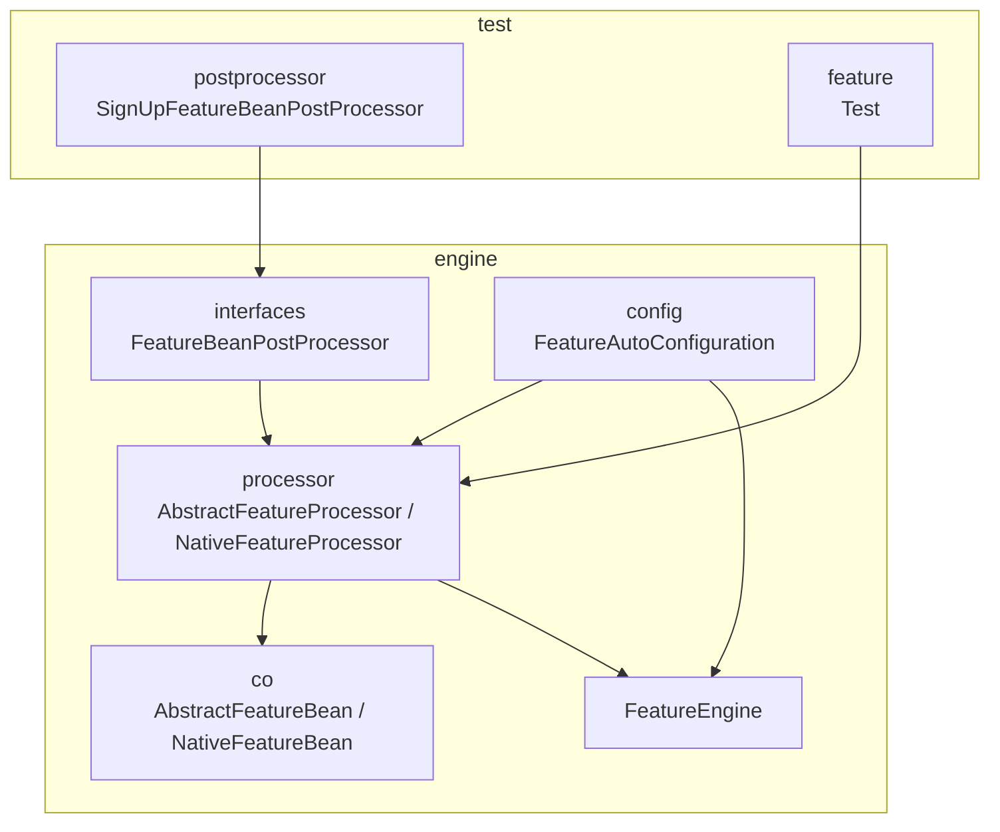
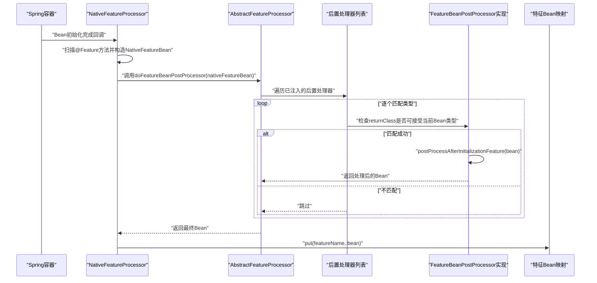
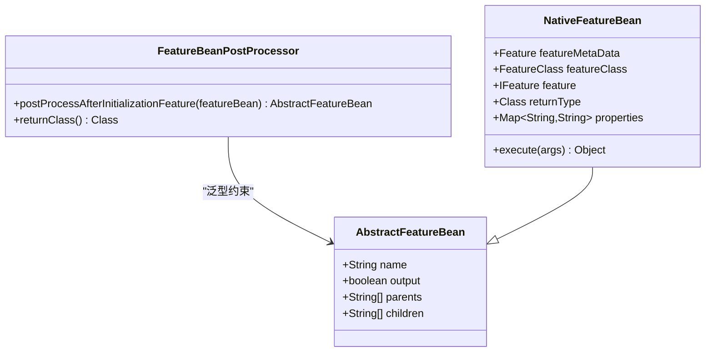
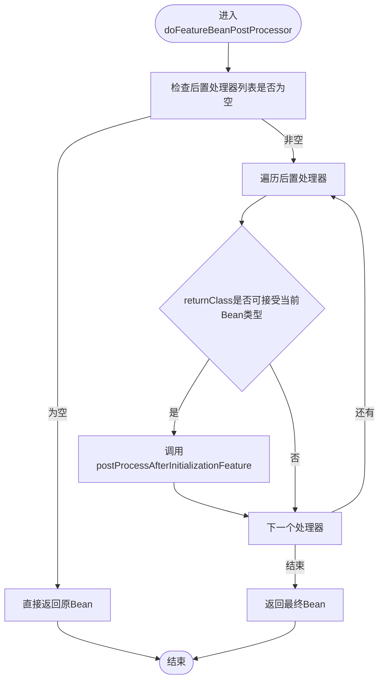
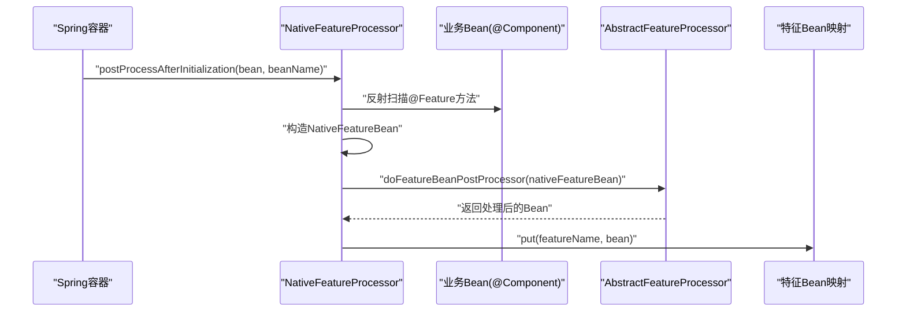
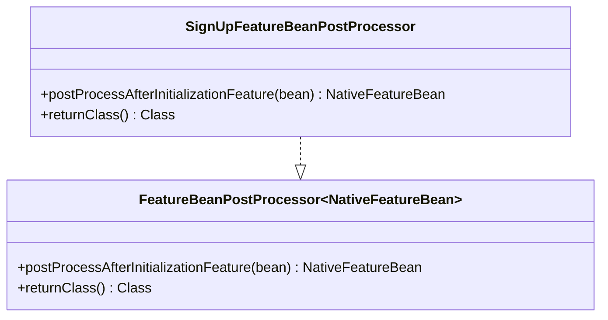
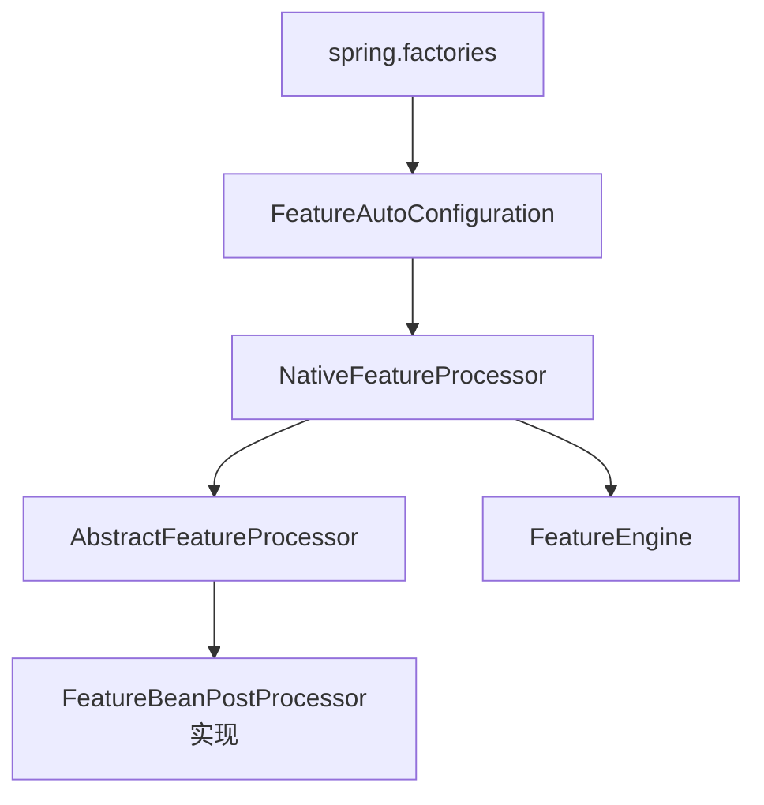

# 特征Bean后置处理器

<cite>
**本文档引用的文件**
- [FeatureBeanPostProcessor.java](file://src/main/java/com/github/zh/engine/interfaces/FeatureBeanPostProcessor.java)
- [SignUpFeatureBeanPostProcessor.java](file://src/test/java/com/github/zh/postprocessor/SignUpFeatureBeanPostProcessor.java)
- [AbstractFeatureProcessor.java](file://src/main/java/com/github/zh/engine/processor/AbstractFeatureProcessor.java)
- [NativeFeatureProcessor.java](file://src/main/java/com/github/zh/engine/processor/NativeFeatureProcessor.java)
- [FeatureAutoConfiguration.java](file://src/main/java/com/github/zh/engine/config/FeatureAutoConfiguration.java)
- [spring.factories](file://src/main/resources/META-INF/spring.factories)
- [AbstractFeatureBean.java](file://src/main/java/com/github/zh/engine/co/AbstractFeatureBean.java)
- [NativeFeatureBean.java](file://src/main/java/com/github/zh/engine/co/bean/NativeFeatureBean.java)
- [FeatureEngine.java](file://src/main/java/com/github/zh/engine/FeatureEngine.java)
- [README.md](file://README.md)
- [pom.xml](file://pom.xml)
- [Test.java](file://src/test/java/com/github/zh/feature/Test.java)
</cite>

## 目录
1. [简介](#简介)
2. [项目结构](#项目结构)
3. [核心组件](#核心组件)
4. [架构概览](#架构概览)
5. [详细组件分析](#详细组件分析)
6. [依赖分析](#依赖分析)
7. [性能考虑](#性能考虑)
8. [故障排除指南](#故障排除指南)
9. [结论](#结论)
10. [附录](#附录)

## 简介
本指南面向开发者，系统性讲解特征Bean后置处理器的设计与实现，重点覆盖以下内容：
- FeatureBeanPostProcessor接口的职责与应用场景
- Bean实例化后的处理时机与处理逻辑
- 以SignUpFeatureBeanPostProcessor为例的完整实现流程
- 后置处理器在特征Bean生命周期中的作用（验证、属性设置、依赖注入后处理）
- 开发最佳实践（异常处理、性能优化、调试方法）
- 与Spring容器的集成机制与执行顺序

## 项目结构
该项目采用分层+按功能域组织的结构：
- engine/interfaces：对外暴露的扩展接口（如FeatureBeanPostProcessor）
- engine/processor：特征Bean的扫描、装配与后置处理逻辑
- engine/co：特征Bean的数据模型（抽象与具体实现）
- engine/config：自动配置与条件装配
- test：示例与测试用例（含后置处理器实现示例）

**图表来源**
- [FeatureBeanPostProcessor.java:1-21](file://src/main/java/com/github/zh/engine/interfaces/FeatureBeanPostProcessor.java#L1-L21)
- [AbstractFeatureProcessor.java:1-53](file://src/main/java/com/github/zh/engine/processor/AbstractFeatureProcessor.java#L1-L53)
- [NativeFeatureProcessor.java:1-131](file://src/main/java/com/github/zh/engine/processor/NativeFeatureProcessor.java#L1-L131)
- [AbstractFeatureBean.java:1-28](file://src/main/java/com/github/zh/engine/co/AbstractFeatureBean.java#L1-L28)
- [NativeFeatureBean.java:1-53](file://src/main/java/com/github/zh/engine/co/bean/NativeFeatureBean.java#L1-L53)
- [FeatureAutoConfiguration.java:1-37](file://src/main/java/com/github/zh/engine/config/FeatureAutoConfiguration.java#L1-L37)
- [FeatureEngine.java:1-172](file://src/main/java/com/github/zh/engine/FeatureEngine.java#L1-L172)
- [SignUpFeatureBeanPostProcessor.java:1-28](file://src/test/java/com/github/zh/postprocessor/SignUpFeatureBeanPostProcessor.java#L1-L28)
- [Test.java:1-70](file://src/test/java/com/github/zh/feature/Test.java#L1-L70)

**章节来源**
- [FeatureAutoConfiguration.java:1-37](file://src/main/java/com/github/zh/engine/config/FeatureAutoConfiguration.java#L1-L37)
- [spring.factories:1-2](file://src/main/resources/META-INF/spring.factories#L1-L2)

## 核心组件
- FeatureBeanPostProcessor接口：定义特征Bean的后置处理扩展点，默认空实现，返回Class用于类型匹配
- AbstractFeatureProcessor：统一管理后置处理器列表，提供doFeatureBeanPostProcessor执行逻辑
- NativeFeatureProcessor：实现BeanPostProcessor，在Bean初始化完成后扫描@Feature方法，构造NativeFeatureBean并应用后置处理器
- FeatureEngine：计算引擎入口，负责调度与执行
- 数据模型：AbstractFeatureBean/NativeFeatureBean承载特征元数据、依赖关系、属性等

**章节来源**
- [FeatureBeanPostProcessor.java:12-20](file://src/main/java/com/github/zh/engine/interfaces/FeatureBeanPostProcessor.java#L12-L20)
- [AbstractFeatureProcessor.java:17-52](file://src/main/java/com/github/zh/engine/processor/AbstractFeatureProcessor.java#L17-L52)
- [NativeFeatureProcessor.java:28-66](file://src/main/java/com/github/zh/engine/processor/NativeFeatureProcessor.java#L28-L66)
- [AbstractFeatureBean.java:18-27](file://src/main/java/com/github/zh/engine/co/AbstractFeatureBean.java#L18-L27)
- [NativeFeatureBean.java:24-52](file://src/main/java/com/github/zh/engine/co/bean/NativeFeatureBean.java#L24-L52)

## 架构概览
特征Bean后置处理器的执行链路如下：
- Spring容器启动时加载自动配置，注册NativeFeatureProcessor
- NativeFeatureProcessor实现BeanPostProcessor，在每个Bean初始化后扫描@Feature方法
- 构造NativeFeatureBean后，调用AbstractFeatureProcessor的doFeatureBeanPostProcessor
- 依据返回类型匹配，依次调用所有实现类的postProcessAfterInitializationFeature方法
- 完成后将特征Bean放入映射表，供FeatureEngine后续使用

**图表来源**
- [NativeFeatureProcessor.java:33-66](file://src/main/java/com/github/zh/engine/processor/NativeFeatureProcessor.java#L33-L66)
- [AbstractFeatureProcessor.java:41-50](file://src/main/java/com/github/zh/engine/processor/AbstractFeatureProcessor.java#L41-L50)

## 详细组件分析

### FeatureBeanPostProcessor接口
- 设计目的：为特征Bean提供“初始化后”的扩展点，允许对Bean进行二次加工（如属性增强、校验、日志记录等）
- 关键方法：
  - postProcessAfterInitializationFeature：默认空实现，返回原Bean
  - returnClass：声明该实现支持的Bean类型，用于精确匹配
- 适用场景：对特定类型的特征Bean进行统一处理（如NativeFeatureBean）

**图表来源**
- [FeatureBeanPostProcessor.java:12-20](file://src/main/java/com/github/zh/engine/interfaces/FeatureBeanPostProcessor.java#L12-L20)
- [AbstractFeatureBean.java:18-27](file://src/main/java/com/github/zh/engine/co/AbstractFeatureBean.java#L18-L27)
- [NativeFeatureBean.java:24-52](file://src/main/java/com/github/zh/engine/co/bean/NativeFeatureBean.java#L24-L52)

**章节来源**
- [FeatureBeanPostProcessor.java:12-20](file://src/main/java/com/github/zh/engine/interfaces/FeatureBeanPostProcessor.java#L12-L20)

### AbstractFeatureProcessor：后置处理器调度器
- 维护一个可选的FeatureBeanPostProcessor列表
- 提供doFeatureBeanPostProcessor方法，按类型匹配逐一调用
- 支持并发安全的特征Bean映射存储

**图表来源**
- [AbstractFeatureProcessor.java:41-50](file://src/main/java/com/github/zh/engine/processor/AbstractFeatureProcessor.java#L41-L50)

**章节来源**
- [AbstractFeatureProcessor.java:17-52](file://src/main/java/com/github/zh/engine/processor/AbstractFeatureProcessor.java#L17-L52)

### NativeFeatureProcessor：特征Bean扫描与装配
- 实现BeanPostProcessor，在Bean初始化完成后扫描@Feature方法
- 构造NativeFeatureBean（包含元数据、依赖、属性等）
- 调用AbstractFeatureProcessor的doFeatureBeanPostProcessor
- 将Bean放入映射表，供上下文执行阶段使用

**图表来源**
- [NativeFeatureProcessor.java:33-66](file://src/main/java/com/github/zh/engine/processor/NativeFeatureProcessor.java#L33-L66)
- [AbstractFeatureProcessor.java:41-50](file://src/main/java/com/github/zh/engine/processor/AbstractFeatureProcessor.java#L41-L50)

**章节来源**
- [NativeFeatureProcessor.java:28-131](file://src/main/java/com/github/zh/engine/processor/NativeFeatureProcessor.java#L28-L131)

### SignUpFeatureBeanPostProcessor：完整实现示例
- 实现FeatureBeanPostProcessor<NativeFeatureBean>
- 在postProcessAfterInitializationFeature中打印Bean名称与属性，返回原Bean
- returnClass返回NativeFeatureBean.class，确保类型匹配

**图表来源**
- [SignUpFeatureBeanPostProcessor.java:14-27](file://src/test/java/com/github/zh/postprocessor/SignUpFeatureBeanPostProcessor.java#L14-L27)
- [FeatureBeanPostProcessor.java:12-20](file://src/main/java/com/github/zh/engine/interfaces/FeatureBeanPostProcessor.java#L12-L20)

**章节来源**
- [SignUpFeatureBeanPostProcessor.java:1-28](file://src/test/java/com/github/zh/postprocessor/SignUpFeatureBeanPostProcessor.java#L1-L28)

### FeatureEngine：生命周期中的作用
- 在计算前由NativeFeatureProcessor完成特征Bean的装配与后置处理
- 计算阶段通过FeatureContext从映射表获取特征Bean并执行
- 后置处理器不参与计算阶段，仅影响Bean装配阶段的最终形态

**章节来源**
- [FeatureEngine.java:49-172](file://src/main/java/com/github/zh/engine/FeatureEngine.java#L49-L172)

## 依赖分析
- 自动配置与条件装配
  - FeatureAutoConfiguration基于@EnableConfigurationProperties启用FeatureProperties
  - ConditionalOnClass保证在存在NativeFeatureProcessor时才注册
  - spring.factories声明自动配置类，便于Spring Boot自动发现
- 组件耦合
  - NativeFeatureProcessor依赖AbstractFeatureProcessor的后置处理能力
  - AbstractFeatureProcessor通过@Autowired注入FeatureBeanPostProcessor列表
  - FeatureEngine依赖NativeFeatureProcessor提供的特征Bean映射

**图表来源**
- [spring.factories:1-2](file://src/main/resources/META-INF/spring.factories#L1-L2)
- [FeatureAutoConfiguration.java:19-36](file://src/main/java/com/github/zh/engine/config/FeatureAutoConfiguration.java#L19-L36)
- [NativeFeatureProcessor.java:28-66](file://src/main/java/com/github/zh/engine/processor/NativeFeatureProcessor.java#L28-L66)
- [AbstractFeatureProcessor.java:22-23](file://src/main/java/com/github/zh/engine/processor/AbstractFeatureProcessor.java#L22-L23)

**章节来源**
- [spring.factories:1-2](file://src/main/resources/META-INF/spring.factories#L1-L2)
- [FeatureAutoConfiguration.java:19-36](file://src/main/java/com/github/zh/engine/config/FeatureAutoConfiguration.java#L19-L36)

## 性能考虑
- 后置处理器执行成本
  - doFeatureBeanPostProcessor为O(k)遍历，k为已注册的后置处理器数量
  - 类型匹配使用isAssignableFrom，开销极低
- 并发与线程安全
  - 特征Bean映射使用ConcurrentHashMap，适合多线程访问
- 执行时机
  - 仅在Bean初始化完成后执行一次，避免重复处理
- 建议
  - 控制后置处理器数量，避免链路过长
  - 在后置处理器中避免重IO操作，必要时异步化

[本节为通用性能建议，无需特定文件引用]

## 故障排除指南
- 后置处理器未生效
  - 确认实现类被Spring管理（如@Component），且位于可扫描包内
  - 确认returnClass返回的类型与目标Bean类型一致或为其子类
- Bean构造失败
  - NativeFeatureProcessor在构造过程中捕获异常并抛出FeatureCreationException
  - 检查@Feature方法签名、参数命名与依赖关系
- 日志定位
  - NativeFeatureProcessor在成功构造后会记录日志，便于确认处理链是否到达
- 调试技巧
  - 在后置处理器中打印关键字段（如name、properties），快速核对装配结果
  - 使用单元测试触发FeatureEngine.calc，观察最终计算结果

**章节来源**
- [NativeFeatureProcessor.java:59-62](file://src/main/java/com/github/zh/engine/processor/NativeFeatureProcessor.java#L59-L62)
- [SignUpFeatureBeanPostProcessor.java:17-21](file://src/test/java/com/github/zh/postprocessor/SignUpFeatureBeanPostProcessor.java#L17-L21)

## 结论
特征Bean后置处理器通过统一的接口与调度机制，为特征Bean提供了强大的扩展能力。它在Bean初始化完成后介入，不影响计算阶段的执行路径，但可以显著增强Bean的可用性与可观测性。遵循本文的最佳实践，可确保后置处理器在复杂场景中稳定、高效地运行。

[本节为总结性内容，无需特定文件引用]

## 附录

### 开发最佳实践清单
- 异常处理
  - 在后置处理器中捕获并记录异常，避免中断Bean装配
  - 对关键字段进行校验（如name、properties），不符合预期时抛出明确异常
- 性能优化
  - 避免在后置处理器中执行阻塞操作；如需IO，考虑异步化
  - 控制后置处理器数量，保持处理链简洁
- 调试方法
  - 在postProcessAfterInitializationFeature中打印关键信息（如name、properties、parents）
  - 使用单元测试触发FeatureEngine.calc，验证处理结果
- 类型匹配
  - returnClass应返回最具体的类型，避免过度宽泛导致不必要的调用

**章节来源**
- [FeatureBeanPostProcessor.java:12-20](file://src/main/java/com/github/zh/engine/interfaces/FeatureBeanPostProcessor.java#L12-L20)
- [AbstractFeatureProcessor.java:41-50](file://src/main/java/com/github/zh/engine/processor/AbstractFeatureProcessor.java#L41-L50)
- [SignUpFeatureBeanPostProcessor.java:17-21](file://src/test/java/com/github/zh/postprocessor/SignUpFeatureBeanPostProcessor.java#L17-L21)

### 与Spring容器的集成机制
- 自动配置
  - spring.factories声明自动配置类，FeatureAutoConfiguration在满足条件时注册NativeFeatureProcessor与FeatureEngine
- Bean生命周期
  - NativeFeatureProcessor实现BeanPostProcessor，在Bean初始化完成后扫描@Feature方法并应用后置处理器
- 执行顺序
  - 多个FeatureBeanPostProcessor按Spring容器注入顺序依次执行
  - 类型匹配优先于顺序，仅当returnClass可接受当前Bean类型时才会调用

**章节来源**
- [spring.factories:1-2](file://src/main/resources/META-INF/spring.factories#L1-L2)
- [FeatureAutoConfiguration.java:19-36](file://src/main/java/com/github/zh/engine/config/FeatureAutoConfiguration.java#L19-L36)
- [NativeFeatureProcessor.java:33-66](file://src/main/java/com/github/zh/engine/processor/NativeFeatureProcessor.java#L33-L66)
- [AbstractFeatureProcessor.java:41-50](file://src/main/java/com/github/zh/engine/processor/AbstractFeatureProcessor.java#L41-L50)

### 使用示例参考
- 示例Bean Test：演示@Feature、@Property、@FeatureClass的组合使用
- 示例后置处理器：SignUpFeatureBeanPostProcessor展示如何打印并返回Bean

**章节来源**
- [Test.java:20-70](file://src/test/java/com/github/zh/feature/Test.java#L20-L70)
- [SignUpFeatureBeanPostProcessor.java:14-27](file://src/test/java/com/github/zh/postprocessor/SignUpFeatureBeanPostProcessor.java#L14-L27)