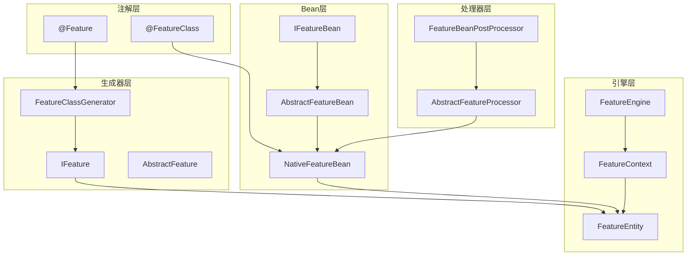
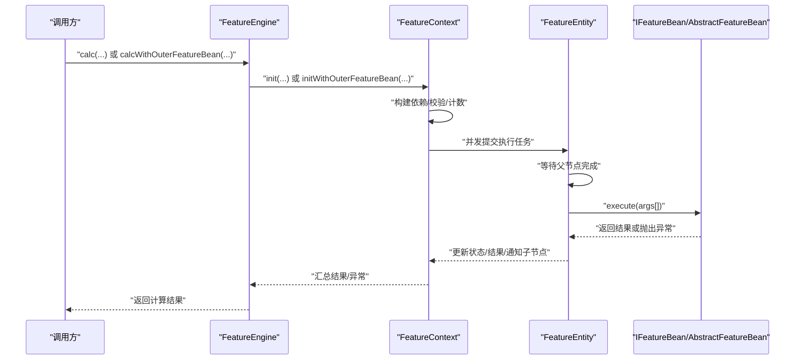
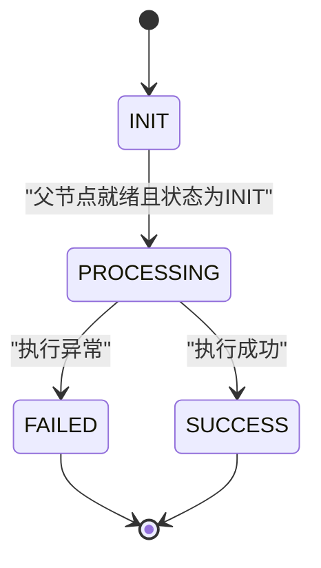
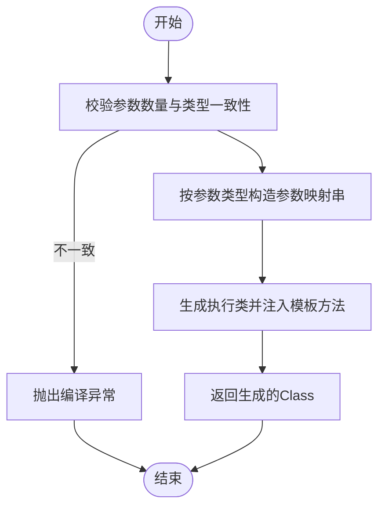
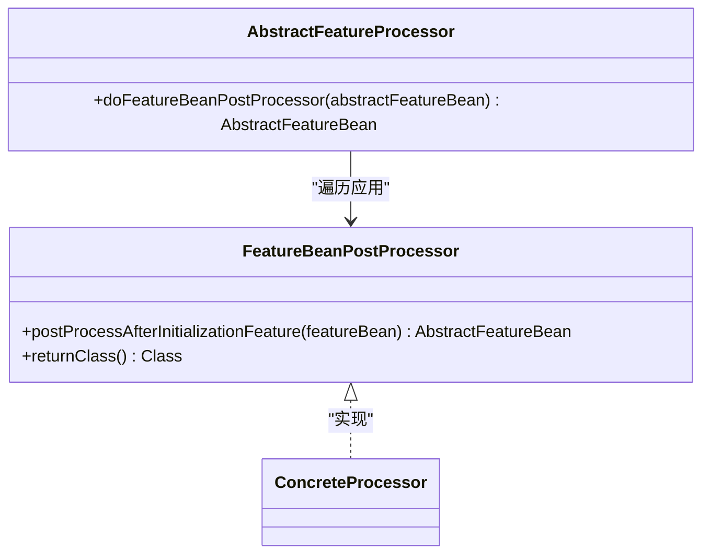
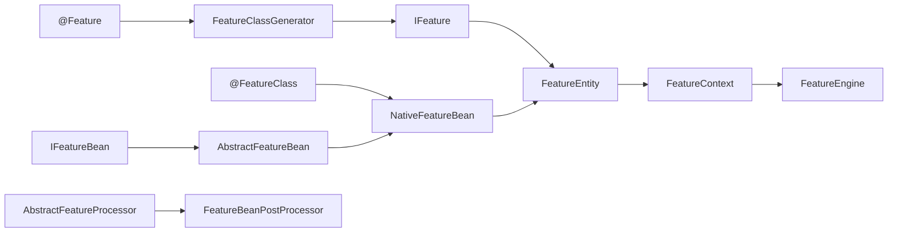

# 特征开发

<cite>
**本文引用的文件**
- [Feature.java](file://src/main/java/com/github/zh/engine/annotation/Feature.java)
- [FeatureClass.java](file://src/main/java/com/github/zh/engine/annotation/FeatureClass.java)
- [AbstractFeatureBean.java](file://src/main/java/com/github/zh/engine/co/AbstractFeatureBean.java)
- [IFeatureBean.java](file://src/main/java/com/github/zh/engine/co/IFeatureBean.java)
- [NativeFeatureBean.java](file://src/main/java/com/github/zh/engine/co/bean/NativeFeatureBean.java)
- [FeatureEngine.java](file://src/main/java/com/github/zh/engine/FeatureEngine.java)
- [FeatureContext.java](file://src/main/java/com/github/zh/engine/co/FeatureContext.java)
- [FeatureEntity.java](file://src/main/java/com/github/zh/engine/co/FeatureEntity.java)
- [AbstractFeatureProcessor.java](file://src/main/java/com/github/zh/engine/processor/AbstractFeatureProcessor.java)
- [FeatureBeanPostProcessor.java](file://src/main/java/com/github/zh/engine/interfaces/FeatureBeanPostProcessor.java)
- [FeatureClassGenerator.java](file://src/main/java/com/github/zh/engine/clz/FeatureClassGenerator.java)
- [AbstractFeature.java](file://src/main/java/com/github/zh/engine/clz/AbstractFeature.java)
- [IFeature.java](file://src/main/java/com/github/zh/engine/clz/IFeature.java)
- [OuterFeatureBean.java](file://src/test/java/com/github/zh/bean/OuterFeatureBean.java)
- [SignUpFeatureBeanPostProcessor.java](file://src/test/java/com/github/zh/postprocessor/SignUpFeatureBeanPostProcessor.java)
- [spring.factories](file://src/main/resources/META-INF/spring.factories)
- [README.md](file://README.md)
</cite>

## 目录
1. [简介](#简介)
2. [项目结构](#项目结构)
3. [核心组件](#核心组件)
4. [架构总览](#架构总览)
5. [详细组件分析](#详细组件分析)
6. [依赖分析](#依赖分析)
7. [性能考虑](#性能考虑)
8. [故障排查指南](#故障排查指南)
9. [结论](#结论)
10. [附录](#附录)

## 简介
本指南面向特征开发工程师，系统讲解如何基于注解与Bean体系构建“无副作用”的函数式计算引擎。内容涵盖：
- 使用@Feature与@FeatureClass注解定义特征函数的方法签名、参数传递与返回值处理
- 自定义特征Bean的开发流程：继承AbstractFeatureBean或实现IFeatureBean
- 通过外部特征Bean扩展计算能力（如OuterFeatureBean）
- 特征Bean后置处理器的实现与应用
- 完整开发示例与最佳实践（命名规范、依赖设计原则）

## 项目结构
该工程采用按功能域分层的组织方式，核心模块如下：
- 注解层：定义@Feature与@FeatureClass，用于标注特征函数与特征类
- Bean层：抽象与具体特征Bean（NativeFeatureBean、AbstractFeatureBean、IFeatureBean）
- 引擎层：FeatureEngine负责调度与并发执行；FeatureContext管理上下文与生命周期；FeatureEntity表示单个特征实例
- 处理器层：AbstractFeatureProcessor负责收集与后置处理特征Bean；FeatureBeanPostProcessor为后置处理器接口
- 生成器层：FeatureClassGenerator动态生成适配目标方法的执行类
- 自动装配：spring.factories声明自动配置入口

图表来源
- [Feature.java:1-28](file://src/main/java/com/github/zh/engine/annotation/Feature.java#L1-L28)
- [FeatureClass.java:1-17](file://src/main/java/com/github/zh/engine/annotation/FeatureClass.java#L1-L17)
- [IFeatureBean.java:1-20](file://src/main/java/com/github/zh/engine/co/IFeatureBean.java#L1-L20)
- [AbstractFeatureBean.java:1-28](file://src/main/java/com/github/zh/engine/co/AbstractFeatureBean.java#L1-L28)
- [NativeFeatureBean.java:1-53](file://src/main/java/com/github/zh/engine/co/bean/NativeFeatureBean.java#L1-L53)
- [FeatureEngine.java:1-172](file://src/main/java/com/github/zh/engine/FeatureEngine.java#L1-L172)
- [FeatureContext.java:1-298](file://src/main/java/com/github/zh/engine/co/FeatureContext.java#L1-L298)
- [FeatureEntity.java:1-155](file://src/main/java/com/github/zh/engine/co/FeatureEntity.java#L1-L155)
- [AbstractFeatureProcessor.java:1-53](file://src/main/java/com/github/zh/engine/processor/AbstractFeatureProcessor.java#L1-L53)
- [FeatureBeanPostProcessor.java:1-21](file://src/main/java/com/github/zh/engine/interfaces/FeatureBeanPostProcessor.java#L1-L21)
- [FeatureClassGenerator.java:1-82](file://src/main/java/com/github/zh/engine/clz/FeatureClassGenerator.java#L1-L82)
- [IFeature.java:1-17](file://src/main/java/com/github/zh/engine/clz/IFeature.java#L1-L17)
- [AbstractFeature.java:1-15](file://src/main/java/com/github/zh/engine/clz/AbstractFeature.java#L1-L15)

章节来源
- [spring.factories:1-2](file://src/main/resources/META-INF/spring.factories#L1-L2)
- [README.md:1-254](file://README.md#L1-L254)

## 核心组件
- 注解@Feature与@FeatureClass：分别标注“特征函数”和“特征类”，驱动特征发现与生成
- 特征Bean接口与抽象实现：IFeatureBean定义execute(Object[])统一入口；AbstractFeatureBean提供通用字段；NativeFeatureBean承载原生特征元数据与执行器
- 引擎与上下文：FeatureEngine对外提供计算入口；FeatureContext负责上下文初始化、并发调度、结果聚合与异常处理
- 实例实体：FeatureEntity封装单个特征的依赖、状态、结果与错误传播
- 后置处理器：FeatureBeanPostProcessor提供Bean级别的后置增强；AbstractFeatureProcessor统一收集与处理
- 动态生成：FeatureClassGenerator根据方法签名生成适配的执行类，实现参数到入参数组的映射

章节来源
- [Feature.java:1-28](file://src/main/java/com/github/zh/engine/annotation/Feature.java#L1-L28)
- [FeatureClass.java:1-17](file://src/main/java/com/github/zh/engine/annotation/FeatureClass.java#L1-L17)
- [IFeatureBean.java:1-20](file://src/main/java/com/github/zh/engine/co/IFeatureBean.java#L1-L20)
- [AbstractFeatureBean.java:1-28](file://src/main/java/com/github/zh/engine/co/AbstractFeatureBean.java#L1-L28)
- [NativeFeatureBean.java:1-53](file://src/main/java/com/github/zh/engine/co/bean/NativeFeatureBean.java#L1-L53)
- [FeatureEngine.java:1-172](file://src/main/java/com/github/zh/engine/FeatureEngine.java#L1-L172)
- [FeatureContext.java:1-298](file://src/main/java/com/github/zh/engine/co/FeatureContext.java#L1-L298)
- [FeatureEntity.java:1-155](file://src/main/java/com/github/zh/engine/co/FeatureEntity.java#L1-L155)
- [AbstractFeatureProcessor.java:1-53](file://src/main/java/com/github/zh/engine/processor/AbstractFeatureProcessor.java#L1-L53)
- [FeatureBeanPostProcessor.java:1-21](file://src/main/java/com/github/zh/engine/interfaces/FeatureBeanPostProcessor.java#L1-L21)
- [FeatureClassGenerator.java:1-82](file://src/main/java/com/github/zh/engine/clz/FeatureClassGenerator.java#L1-L82)

## 架构总览
特征计算采用“DAG编排 + 并行执行”的架构。特征函数通过注解被扫描并生成执行体，引擎根据入参名称推断依赖关系，构建有向无环图，随后在可配置线程池中并发执行。

图表来源
- [FeatureEngine.java:49-161](file://src/main/java/com/github/zh/engine/FeatureEngine.java#L49-L161)
- [FeatureContext.java:49-127](file://src/main/java/com/github/zh/engine/co/FeatureContext.java#L49-L127)
- [FeatureEntity.java:48-134](file://src/main/java/com/github/zh/engine/co/FeatureEntity.java#L48-L134)
- [IFeatureBean.java:10-19](file://src/main/java/com/github/zh/engine/co/IFeatureBean.java#L10-L19)
- [AbstractFeatureBean.java:18-27](file://src/main/java/com/github/zh/engine/co/AbstractFeatureBean.java#L18-L27)

## 详细组件分析

### 注解：@Feature 与 @FeatureClass
- @Feature
  - 作用于方法，标识特征函数
  - 属性
    - name：特征名称，默认空字符串，未设置时通常使用方法名
    - output：是否作为最终输出，默认true
- @FeatureClass
  - 作用于类，标识该类包含特征函数，需配合Spring组件注解使用
  - 属性
    - description：描述信息，默认空字符串

使用要点
- 方法签名：推荐返回值为可序列化的基础类型或业务对象；参数名即为依赖特征名，引擎据此建立依赖边
- 参数传递：通过入参名称解析依赖，运行时由FeatureEntity按父节点结果组装Object[]传入execute
- 返回值处理：默认参与结果聚合；若output=false则不纳入最终输出

章节来源
- [Feature.java:13-27](file://src/main/java/com/github/zh/engine/annotation/Feature.java#L13-L27)
- [FeatureClass.java:9-16](file://src/main/java/com/github/zh/engine/annotation/FeatureClass.java#L9-L16)
- [README.md:77-110](file://README.md#L77-L110)

### 特征Bean：IFeatureBean 与 AbstractFeatureBean
- IFeatureBean
  - 统一执行入口：execute(Object[] args)
  - 语义：接收按依赖顺序拼装的实参数组，返回计算结果
- AbstractFeatureBean
  - 字段
    - name：特征名
    - output：是否输出
    - parents：父节点列表（依赖）
    - children：子节点列表（被依赖）
  - 用途：作为自定义特征Bean的基类，便于统一管理依赖关系与输出控制

章节来源
- [IFeatureBean.java:10-19](file://src/main/java/com/github/zh/engine/co/IFeatureBean.java#L10-L19)
- [AbstractFeatureBean.java:18-27](file://src/main/java/com/github/zh/engine/co/AbstractFeatureBean.java#L18-L27)

### 原生特征Bean：NativeFeatureBean
- 承载原生特征元数据与执行器
- 关键字段
  - featureMetaData：@Feature注解元数据
  - featureClass：@FeatureClass注解元数据
  - feature：IFeature执行器
  - returnType：返回类型
  - properties：属性映射
- 执行逻辑：委托给内部IFeature.execute(args)，实现与注解驱动的特征函数一致

章节来源
- [NativeFeatureBean.java:24-52](file://src/main/java/com/github/zh/engine/co/bean/NativeFeatureBean.java#L24-L52)

### 引擎与上下文：FeatureEngine、FeatureContext、FeatureEntity
- FeatureEngine
  - 提供两类计算入口
    - 仅本地特征：calc(...)
    - 混合外部特征：calcWithOuterFeatureBean(...)
  - 内部维护线程池，支持超时与调试模式
- FeatureContext
  - 初始化阶段
    - 注入原始数据（ORIGIN_DATA）
    - 注入外部特征（OUTER_FEATURE）
    - 注入本地原生特征（NATIVE_FEATURE）
    - 构建中间依赖节点队列
    - 重建父子关系（外部场景）
    - 环分析（预留）
    - 初始化计数器
  - 执行阶段
    - 为每个FeatureEntity提交异步任务
    - 等待所有任务完成或超时
    - 汇总结果（受output与debug影响）
- FeatureEntity
  - 状态机：INIT → PROCESSING → SUCCESS/FAILED
  - 依赖检查：父节点全部完成才允许执行
  - 错误传播：任一父节点失败则标记自身失败并向上游回溯
  - 子节点通知：成功后异步唤醒子节点

图表来源
- [FeatureEntity.java:39-123](file://src/main/java/com/github/zh/engine/co/FeatureEntity.java#L39-L123)

章节来源
- [FeatureEngine.java:49-161](file://src/main/java/com/github/zh/engine/FeatureEngine.java#L49-L161)
- [FeatureContext.java:71-127](file://src/main/java/com/github/zh/engine/co/FeatureContext.java#L71-L127)
- [FeatureEntity.java:48-134](file://src/main/java/com/github/zh/engine/co/FeatureEntity.java#L48-L134)

### 动态生成器：FeatureClassGenerator
- 目标：根据方法参数类型与名称，生成适配的执行类，将Object[]参数映射到真实方法签名
- 关键点
  - 模板方法：构造execute(Object[] args)代理调用真实方法
  - 参数映射：依据参数类型与索引，从args[i]强转为对应类型
  - 类加载：使用ClassPool与CtClass在运行时生成类

图表来源
- [FeatureClassGenerator.java:31-45](file://src/main/java/com/github/zh/engine/clz/FeatureClassGenerator.java#L31-L45)
- [FeatureClassGenerator.java:47-62](file://src/main/java/com/github/zh/engine/clz/FeatureClassGenerator.java#L47-L62)

章节来源
- [FeatureClassGenerator.java:11-82](file://src/main/java/com/github/zh/engine/clz/FeatureClassGenerator.java#L11-L82)

### 自定义特征Bean开发指南
- 继承AbstractFeatureBean
  - 必填：name
  - 可选：output、parents、children
  - 实现：execute(Object[] args)返回计算结果
- 实现IFeatureBean
  - 直接实现execute(Object[] args)即可，适用于简单场景
- 外部特征Bean扩展
  - 将自定义Bean放入calcWithOuterFeatureBean的map中，键为特征名，值为Bean实例
  - Bean的parents应包含其依赖的特征名，children由引擎自动填充

章节来源
- [AbstractFeatureBean.java:18-27](file://src/main/java/com/github/zh/engine/co/AbstractFeatureBean.java#L18-L27)
- [IFeatureBean.java:10-19](file://src/main/java/com/github/zh/engine/co/IFeatureBean.java#L10-L19)
- [FeatureEngine.java:106-161](file://src/main/java/com/github/zh/engine/FeatureEngine.java#L106-L161)
- [README.md:185-237](file://README.md#L185-L237)

### 特征Bean后置处理器
- 接口：FeatureBeanPostProcessor<T extends AbstractFeatureBean>
  - postProcessAfterInitializationFeature：在Bean初始化后进行后置处理
  - returnClass：限定可处理的Bean类型
- 处理器注册：通过Spring容器管理，AbstractFeatureProcessor会遍历并应用
- 应用场景：日志打印、属性注入、依赖修正、安全校验等

图表来源
- [FeatureBeanPostProcessor.java:12-20](file://src/main/java/com/github/zh/engine/interfaces/FeatureBeanPostProcessor.java#L12-L20)
- [AbstractFeatureProcessor.java:41-50](file://src/main/java/com/github/zh/engine/processor/AbstractFeatureProcessor.java#L41-L50)

章节来源
- [FeatureBeanPostProcessor.java:1-21](file://src/main/java/com/github/zh/engine/interfaces/FeatureBeanPostProcessor.java#L1-L21)
- [AbstractFeatureProcessor.java:1-53](file://src/main/java/com/github/zh/engine/processor/AbstractFeatureProcessor.java#L1-L53)
- [SignUpFeatureBeanPostProcessor.java:1-28](file://src/test/java/com/github/zh/postprocessor/SignUpFeatureBeanPostProcessor.java#L1-L28)

### 完整开发示例与最佳实践
- 特征函数定义
  - 在类上加@FeatureClass与@Component
  - 方法上加@Feature，name可与方法名不同
  - 入参名为依赖特征名，引擎自动识别依赖
- 调用引擎
  - 通过FeatureEngine.calc(...)或calcWithOuterFeatureBean(...)
- 最佳实践
  - 命名规范：特征名与方法名保持一致或语义清晰；避免与依赖名冲突
  - 依赖设计：尽量形成DAG，避免循环依赖；若无法避免，应在环中提供原始数据以打破
  - 输出控制：仅对最终结果开启output=true
  - 参数类型：确保args[i]与方法形参类型兼容，必要时在Bean内做显式转换
  - 超时与线程池：合理配置线程池大小与超时时间，避免阻塞

章节来源
- [README.md:111-182](file://README.md#L111-L182)

## 依赖分析
- 注解驱动：@FeatureClass与@Feature共同决定特征函数的发现与生成
- 生成器依赖：FeatureClassGenerator依赖Javassist在运行时生成执行类
- Bean依赖：NativeFeatureBean依赖IFeature执行器；AbstractFeatureBean为自定义Bean提供统一基类
- 上下文依赖：FeatureContext协调FeatureEngine与FeatureEntity之间的生命周期与状态流转
- 处理器依赖：AbstractFeatureProcessor依赖Spring容器中的FeatureBeanPostProcessor列表

图表来源
- [FeatureClass.java:9-16](file://src/main/java/com/github/zh/engine/annotation/FeatureClass.java#L9-L16)
- [Feature.java:9-27](file://src/main/java/com/github/zh/engine/annotation/Feature.java#L9-L27)
- [FeatureClassGenerator.java:11-45](file://src/main/java/com/github/zh/engine/clz/FeatureClassGenerator.java#L11-L45)
- [IFeature.java:7-16](file://src/main/java/com/github/zh/engine/clz/IFeature.java#L7-L16)
- [FeatureEntity.java:27-47](file://src/main/java/com/github/zh/engine/co/FeatureEntity.java#L27-L47)
- [AbstractFeatureBean.java:18-27](file://src/main/java/com/github/zh/engine/co/AbstractFeatureBean.java#L18-L27)
- [NativeFeatureBean.java:24-52](file://src/main/java/com/github/zh/engine/co/bean/NativeFeatureBean.java#L24-L52)
- [AbstractFeatureProcessor.java:17-50](file://src/main/java/com/github/zh/engine/processor/AbstractFeatureProcessor.java#L17-L50)
- [FeatureBeanPostProcessor.java:12-20](file://src/main/java/com/github/zh/engine/interfaces/FeatureBeanPostProcessor.java#L12-L20)
- [FeatureContext.java:23-90](file://src/main/java/com/github/zh/engine/co/FeatureContext.java#L23-L90)
- [FeatureEngine.java:29-96](file://src/main/java/com/github/zh/engine/FeatureEngine.java#L29-L96)

## 性能考虑
- 并发模型：FeatureContext为每个FeatureEntity提交独立任务，利用CompletableFuture实现非阻塞唤醒
- 线程池：FeatureEngine在未注入时自动创建，核心与最大线程数可配置
- 超时控制：支持全局超时，避免长时间阻塞
- 依赖合并：通过parents与children构建DAG，减少重复计算
- 建议
  - 合理设置线程池大小，避免过多上下文切换
  - 控制特征粒度，避免过深的依赖链
  - 对耗时操作进行缓存或外部服务优化

## 故障排查指南
- 常见异常
  - 计算超时：检查线程池配置与特征复杂度
  - 缺少依赖：确认依赖特征名与入参名一致，或提供原始数据
  - 循环依赖：重构为DAG，或在环中注入原始数据
- 调试技巧
  - 开启debug模式查看中间结果
  - 使用后置处理器记录特征名与属性，辅助定位问题
- 建议
  - 在FeatureEntity执行前后打印关键日志
  - 使用Fast Fail策略快速暴露根因

章节来源
- [FeatureContext.java:49-61](file://src/main/java/com/github/zh/engine/co/FeatureContext.java#L49-L61)
- [FeatureEntity.java:80-116](file://src/main/java/com/github/zh/engine/co/FeatureEntity.java#L80-L116)
- [README.md:181-182](file://README.md#L181-L182)

## 结论
本指南从注解、Bean、引擎与上下文四个维度完整阐述了特征开发的实现路径。遵循命名与依赖设计规范，结合后置处理器与外部Bean扩展能力，可在保证“无副作用”的前提下高效构建可组合、可并行的特征计算体系。

## 附录
- 外部特征Bean示例：参考测试类OuterFeatureBean
- 后置处理器示例：参考测试类SignUpFeatureBeanPostProcessor
- 自动装配入口：spring.factories中声明的自动配置类

章节来源
- [OuterFeatureBean.java:10-15](file://src/test/java/com/github/zh/bean/OuterFeatureBean.java#L10-L15)
- [SignUpFeatureBeanPostProcessor.java:14-27](file://src/test/java/com/github/zh/postprocessor/SignUpFeatureBeanPostProcessor.java#L14-L27)
- [spring.factories:1-2](file://src/main/resources/META-INF/spring.factories#L1-L2)