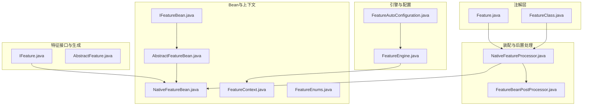
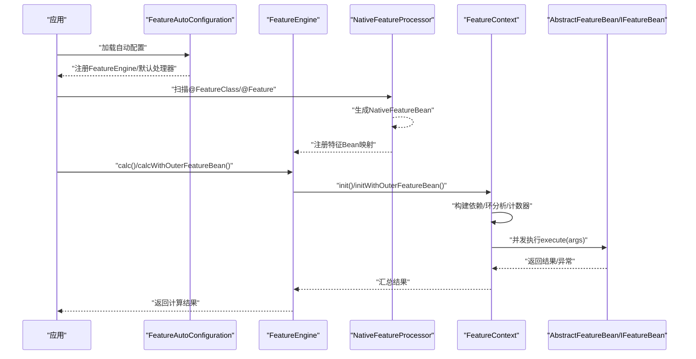
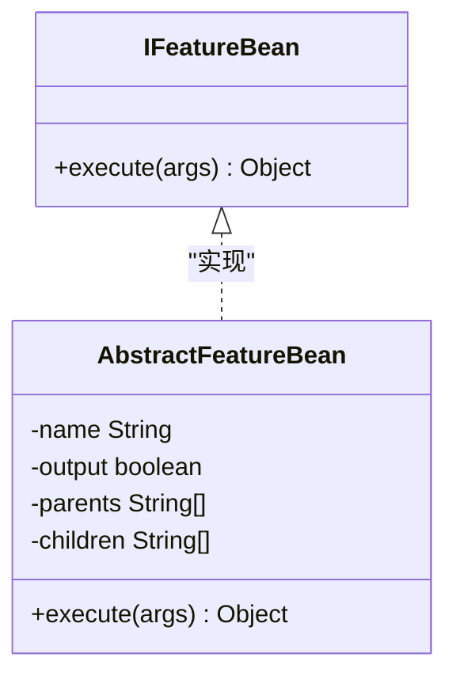
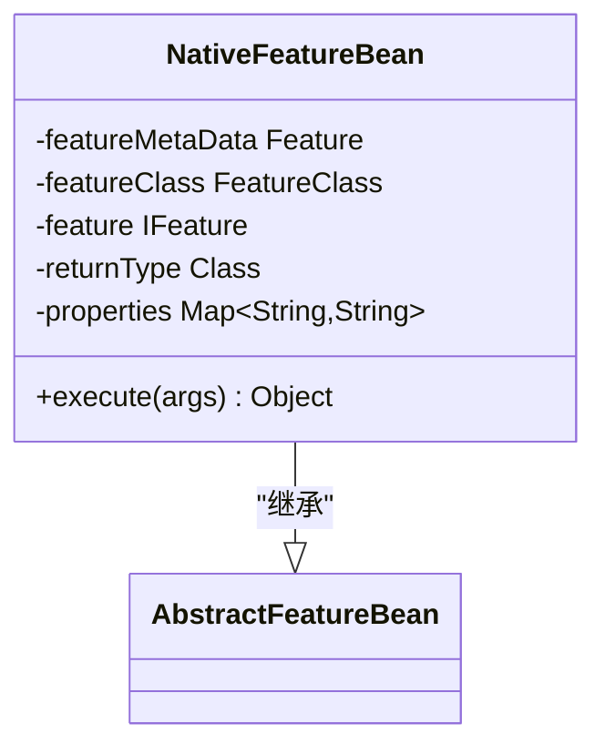
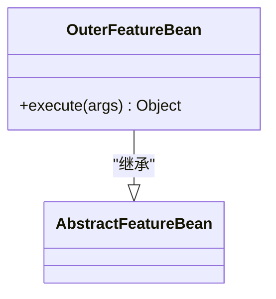
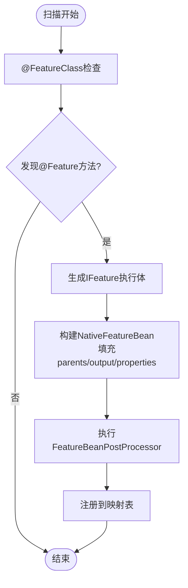
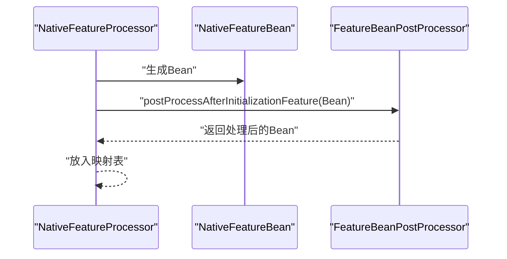
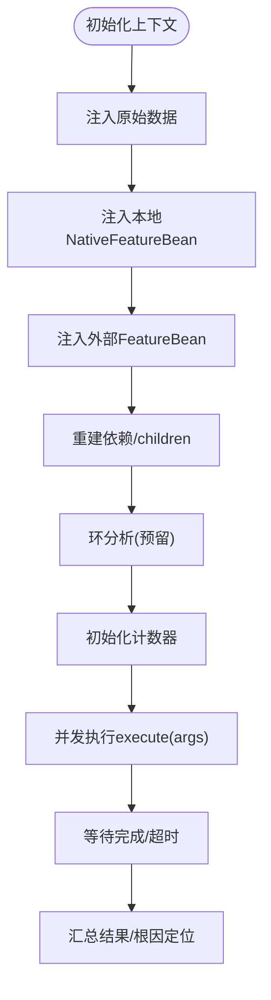
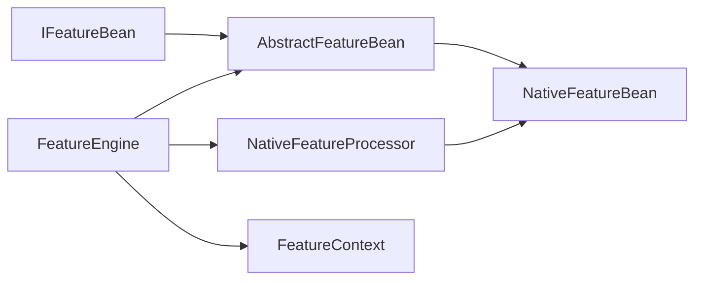

# 自定义特征Bean开发

<cite>
**本文引用的文件**
- [src/main/java/com/github/zh/engine/co/IFeatureBean.java](file://src/main/java/com/github/zh/engine/co/IFeatureBean.java)
- [src/main/java/com/github/zh/engine/co/AbstractFeatureBean.java](file://src/main/java/com/github/zh/engine/co/AbstractFeatureBean.java)
- [src/main/java/com/github/zh/engine/co/bean/NativeFeatureBean.java](file://src/main/java/com/github/zh/engine/co/bean/NativeFeatureBean.java)
- [src/test/java/com/github/zh/bean/OuterFeatureBean.java](file://src/test/java/com/github/zh/bean/OuterFeatureBean.java)
- [src/main/java/com/github/zh/engine/processor/NativeFeatureProcessor.java](file://src/main/java/com/github/zh/engine/processor/NativeFeatureProcessor.java)
- [src/main/java/com/github/zh/engine/interfaces/FeatureBeanPostProcessor.java](file://src/main/java/com/github/zh/engine/interfaces/FeatureBeanPostProcessor.java)
- [src/test/java/com/github/zh/postprocessor/SignUpFeatureBeanPostProcessor.java](file://src/test/java/com/github/zh/postprocessor/SignUpFeatureBeanPostProcessor.java)
- [src/main/java/com/github/zh/engine/config/FeatureAutoConfiguration.java](file://src/main/java/com/github/zh/engine/config/FeatureAutoConfiguration.java)
- [src/main/resources/META-INF/spring.factories](file://src/main/resources/META-INF/spring.factories)
- [README.md](file://README.md)
- [src/main/java/com/github/zh/engine/FeatureEngine.java](file://src/main/java/com/github/zh/engine/FeatureEngine.java)
- [src/main/java/com/github/zh/engine/co/FeatureContext.java](file://src/main/java/com/github/zh/engine/co/FeatureContext.java)
- [src/main/java/com/github/zh/engine/enums/FeatureEnums.java](file://src/main/java/com/github/zh/engine/enums/FeatureEnums.java)
- [src/main/java/com/github/zh/engine/clz/IFeature.java](file://src/main/java/com/github/zh/engine/clz/IFeature.java)
- [src/main/java/com/github/zh/engine/clz/AbstractFeature.java](file://src/main/java/com/github/zh/engine/clz/AbstractFeature.java)
- [src/main/java/com/github/zh/engine/annotation/Feature.java](file://src/main/java/com/github/zh/engine/annotation/Feature.java)
- [src/main/java/com/github/zh/engine/annotation/FeatureClass.java](file://src/main/java/com/github/zh/engine/annotation/FeatureClass.java)
</cite>

## 目录
1. [简介](#简介)
2. [项目结构](#项目结构)
3. [核心组件](#核心组件)
4. [架构总览](#架构总览)
5. [详细组件分析](#详细组件分析)
6. [依赖分析](#依赖分析)
7. [性能考虑](#性能考虑)
8. [故障排查指南](#故障排查指南)
9. [结论](#结论)
10. [附录](#附录)

## 简介
本指南面向希望在Spring生态中开发“自定义特征Bean”的工程师，系统讲解如何继承抽象基类、实现接口、完成生命周期管理、进行依赖注入与注册，以及在运行期与计算引擎协同工作。文档以OuterFeatureBean为例，完整演示从类设计、方法实现到Spring容器集成的全流程；同时给出命名规范、依赖关系设计原则、性能优化建议、错误处理与调试技巧。

## 项目结构
该项目采用按领域分层与按功能模块划分相结合的方式组织代码：
- annotation：注解层，用于标注特征类与特征方法
- clz：特征类生成与执行接口层
- co：上下文与Bean模型层（含IFeatureBean、AbstractFeatureBean、FeatureContext等）
- processor：特征Bean扫描与装配层（NativeFeatureProcessor等）
- config：自动装配配置层（FeatureAutoConfiguration）
- interfaces：扩展点接口（FeatureBeanPostProcessor）
- enums：枚举类型（FeatureEnums）
- tools：工具类（如环检测）
- FeatureEngine：计算引擎入口
- resources/META-INF/spring.factories：Spring自动装配声明

图表来源
- [src/main/java/com/github/zh/engine/annotation/Feature.java:1-28](file://src/main/java/com/github/zh/engine/annotation/Feature.java#L1-L28)
- [src/main/java/com/github/zh/engine/annotation/FeatureClass.java:1-17](file://src/main/java/com/github/zh/engine/annotation/FeatureClass.java#L1-L17)
- [src/main/java/com/github/zh/engine/clz/IFeature.java:1-17](file://src/main/java/com/github/zh/engine/clz/IFeature.java#L1-L17)
- [src/main/java/com/github/zh/engine/clz/AbstractFeature.java:1-15](file://src/main/java/com/github/zh/engine/clz/AbstractFeature.java#L1-L15)
- [src/main/java/com/github/zh/engine/co/IFeatureBean.java:1-20](file://src/main/java/com/github/zh/engine/co/IFeatureBean.java#L1-L20)
- [src/main/java/com/github/zh/engine/co/AbstractFeatureBean.java:1-28](file://src/main/java/com/github/zh/engine/co/AbstractFeatureBean.java#L1-L28)
- [src/main/java/com/github/zh/engine/co/bean/NativeFeatureBean.java:1-53](file://src/main/java/com/github/zh/engine/co/bean/NativeFeatureBean.java#L1-L53)
- [src/main/java/com/github/zh/engine/co/FeatureContext.java:1-298](file://src/main/java/com/github/zh/engine/co/FeatureContext.java#L1-L298)
- [src/main/java/com/github/zh/engine/enums/FeatureEnums.java:1-26](file://src/main/java/com/github/zh/engine/enums/FeatureEnums.java#L1-L26)
- [src/main/java/com/github/zh/engine/processor/NativeFeatureProcessor.java:1-131](file://src/main/java/com/github/zh/engine/processor/NativeFeatureProcessor.java#L1-L131)
- [src/main/java/com/github/zh/engine/interfaces/FeatureBeanPostProcessor.java:1-21](file://src/main/java/com/github/zh/engine/interfaces/FeatureBeanPostProcessor.java#L1-L21)
- [src/main/java/com/github/zh/engine/FeatureEngine.java:1-172](file://src/main/java/com/github/zh/engine/FeatureEngine.java#L1-L172)
- [src/main/java/com/github/zh/engine/config/FeatureAutoConfiguration.java:1-37](file://src/main/java/com/github/zh/engine/config/FeatureAutoConfiguration.java#L1-L37)

章节来源
- [README.md:1-256](file://README.md#L1-L256)

## 核心组件
- IFeatureBean：特征Bean的统一执行接口，定义execute(Object[])方法
- AbstractFeatureBean：抽象基类，封装name、output、parents、children等通用字段
- NativeFeatureBean：内置的特征Bean实现，包装IFeature并委派执行
- FeatureContext：一次计算的上下文，负责初始化、并行调度、结果收集与错误根定位
- FeatureEngine：对外暴露的计算入口，支持本地与外部特征Bean混合计算
- NativeFeatureProcessor：扫描带有@FeatureClass/@Feature的方法，生成NativeFeatureBean并注册
- FeatureBeanPostProcessor：特征Bean后置处理器扩展点
- FeatureAutoConfiguration：自动装配配置，注册引擎与默认处理器

章节来源
- [src/main/java/com/github/zh/engine/co/IFeatureBean.java:1-20](file://src/main/java/com/github/zh/engine/co/IFeatureBean.java#L1-L20)
- [src/main/java/com/github/zh/engine/co/AbstractFeatureBean.java:1-28](file://src/main/java/com/github/zh/engine/co/AbstractFeatureBean.java#L1-L28)
- [src/main/java/com/github/zh/engine/co/bean/NativeFeatureBean.java:1-53](file://src/main/java/com/github/zh/engine/co/bean/NativeFeatureBean.java#L1-L53)
- [src/main/java/com/github/zh/engine/co/FeatureContext.java:1-298](file://src/main/java/com/github/zh/engine/co/FeatureContext.java#L1-L298)
- [src/main/java/com/github/zh/engine/FeatureEngine.java:1-172](file://src/main/java/com/github/zh/engine/FeatureEngine.java#L1-L172)
- [src/main/java/com/github/zh/engine/processor/NativeFeatureProcessor.java:1-131](file://src/main/java/com/github/zh/engine/processor/NativeFeatureProcessor.java#L1-L131)
- [src/main/java/com/github/zh/engine/interfaces/FeatureBeanPostProcessor.java:1-21](file://src/main/java/com/github/zh/engine/interfaces/FeatureBeanPostProcessor.java#L1-L21)
- [src/main/java/com/github/zh/engine/config/FeatureAutoConfiguration.java:1-37](file://src/main/java/com/github/zh/engine/config/FeatureAutoConfiguration.java#L1-L37)

## 架构总览
下图展示了从Spring容器启动到特征计算执行的关键交互路径，包括注解扫描、Bean生成、上下文构建、并行执行与结果返回。

图表来源
- [src/main/java/com/github/zh/engine/config/FeatureAutoConfiguration.java:1-37](file://src/main/java/com/github/zh/engine/config/FeatureAutoConfiguration.java#L1-L37)
- [src/main/java/com/github/zh/engine/FeatureEngine.java:1-172](file://src/main/java/com/github/zh/engine/FeatureEngine.java#L1-L172)
- [src/main/java/com/github/zh/engine/processor/NativeFeatureProcessor.java:1-131](file://src/main/java/com/github/zh/engine/processor/NativeFeatureProcessor.java#L1-L131)
- [src/main/java/com/github/zh/engine/co/FeatureContext.java:1-298](file://src/main/java/com/github/zh/engine/co/FeatureContext.java#L1-L298)
- [src/main/java/com/github/zh/engine/co/AbstractFeatureBean.java:1-28](file://src/main/java/com/github/zh/engine/co/AbstractFeatureBean.java#L1-L28)
- [src/main/java/com/github/zh/engine/co/IFeatureBean.java:1-20](file://src/main/java/com/github/zh/engine/co/IFeatureBean.java#L1-L20)

## 详细组件分析

### IFeatureBean接口与AbstractFeatureBean基类
- IFeatureBean：定义单一职责的execute(Object[])方法，所有特征Bean均需实现此接口
- AbstractFeatureBean：提供name、output、parents、children四个核心字段，便于统一管理特征元信息与依赖关系

图表来源
- [src/main/java/com/github/zh/engine/co/IFeatureBean.java:1-20](file://src/main/java/com/github/zh/engine/co/IFeatureBean.java#L1-L20)
- [src/main/java/com/github/zh/engine/co/AbstractFeatureBean.java:1-28](file://src/main/java/com/github/zh/engine/co/AbstractFeatureBean.java#L1-L28)

章节来源
- [src/main/java/com/github/zh/engine/co/IFeatureBean.java:1-20](file://src/main/java/com/github/zh/engine/co/IFeatureBean.java#L1-L20)
- [src/main/java/com/github/zh/engine/co/AbstractFeatureBean.java:1-28](file://src/main/java/com/github/zh/engine/co/AbstractFeatureBean.java#L1-L28)

### NativeFeatureBean：内置特征Bean实现
- 包装IFeature并委派执行，同时持有元数据（Feature、FeatureClass）、返回类型、属性映射等
- 通过Builder构造，便于在扫描阶段快速组装

图表来源
- [src/main/java/com/github/zh/engine/co/bean/NativeFeatureBean.java:1-53](file://src/main/java/com/github/zh/engine/co/bean/NativeFeatureBean.java#L1-L53)
- [src/main/java/com/github/zh/engine/co/AbstractFeatureBean.java:1-28](file://src/main/java/com/github/zh/engine/co/AbstractFeatureBean.java#L1-L28)

章节来源
- [src/main/java/com/github/zh/engine/co/bean/NativeFeatureBean.java:1-53](file://src/main/java/com/github/zh/engine/co/bean/NativeFeatureBean.java#L1-L53)

### 外部特征Bean：以OuterFeatureBean为例
- 继承AbstractFeatureBean，重写execute(args)，直接返回第一个参数
- 适合将外部逻辑（如函数式表达式、第三方服务封装）注入为特征Bean

图表来源
- [src/test/java/com/github/zh/bean/OuterFeatureBean.java:1-16](file://src/test/java/com/github/zh/bean/OuterFeatureBean.java#L1-L16)
- [src/main/java/com/github/zh/engine/co/AbstractFeatureBean.java:1-28](file://src/main/java/com/github/zh/engine/co/AbstractFeatureBean.java#L1-L28)

章节来源
- [src/test/java/com/github/zh/bean/OuterFeatureBean.java:1-16](file://src/test/java/com/github/zh/bean/OuterFeatureBean.java#L1-L16)

### 注解驱动的特征Bean生成与装配
- @FeatureClass标注特征类，@Feature标注特征方法
- NativeFeatureProcessor扫描并生成NativeFeatureBean，填充parents（方法参数名即依赖）、output、properties等
- 在容器刷新事件时补全children依赖链

图表来源
- [src/main/java/com/github/zh/engine/processor/NativeFeatureProcessor.java:1-131](file://src/main/java/com/github/zh/engine/processor/NativeFeatureProcessor.java#L1-L131)
- [src/main/java/com/github/zh/engine/annotation/Feature.java:1-28](file://src/main/java/com/github/zh/engine/annotation/Feature.java#L1-L28)
- [src/main/java/com/github/zh/engine/annotation/FeatureClass.java:1-17](file://src/main/java/com/github/zh/engine/annotation/FeatureClass.java#L1-L17)

章节来源
- [src/main/java/com/github/zh/engine/processor/NativeFeatureProcessor.java:1-131](file://src/main/java/com/github/zh/engine/processor/NativeFeatureProcessor.java#L1-L131)
- [src/main/java/com/github/zh/engine/annotation/Feature.java:1-28](file://src/main/java/com/github/zh/engine/annotation/Feature.java#L1-L28)
- [src/main/java/com/github/zh/engine/annotation/FeatureClass.java:1-17](file://src/main/java/com/github/zh/engine/annotation/FeatureClass.java#L1-L17)

### 生命周期与后置处理
- FeatureBeanPostProcessor提供后置处理扩展点，默认空实现，可按需覆盖
- 测试示例SignUpFeatureBeanPostProcessor演示了在初始化后打印Bean元信息

图表来源
- [src/main/java/com/github/zh/engine/processor/NativeFeatureProcessor.java:1-131](file://src/main/java/com/github/zh/engine/processor/NativeFeatureProcessor.java#L1-L131)
- [src/main/java/com/github/zh/engine/interfaces/FeatureBeanPostProcessor.java:1-21](file://src/main/java/com/github/zh/engine/interfaces/FeatureBeanPostProcessor.java#L1-L21)
- [src/test/java/com/github/zh/postprocessor/SignUpFeatureBeanPostProcessor.java:1-28](file://src/test/java/com/github/zh/postprocessor/SignUpFeatureBeanPostProcessor.java#L1-L28)

章节来源
- [src/main/java/com/github/zh/engine/interfaces/FeatureBeanPostProcessor.java:1-21](file://src/main/java/com/github/zh/engine/interfaces/FeatureBeanPostProcessor.java#L1-L21)
- [src/test/java/com/github/zh/postprocessor/SignUpFeatureBeanPostProcessor.java:1-28](file://src/test/java/com/github/zh/postprocessor/SignUpFeatureBeanPostProcessor.java#L1-L28)

### 计算上下文与并行执行
- FeatureContext负责：
  - 初始化原始数据、本地与外部特征实体
  - 重建依赖关系、环分析（预留）、计数器初始化
  - 并发执行、超时控制、失败快速失败与根因定位
- FeatureEngine提供calc与calcWithOuterFeatureBean两种入口，统一调度上下文

图表来源
- [src/main/java/com/github/zh/engine/co/FeatureContext.java:1-298](file://src/main/java/com/github/zh/engine/co/FeatureContext.java#L1-L298)
- [src/main/java/com/github/zh/engine/FeatureEngine.java:1-172](file://src/main/java/com/github/zh/engine/FeatureEngine.java#L1-L172)
- [src/main/java/com/github/zh/engine/enums/FeatureEnums.java:1-26](file://src/main/java/com/github/zh/engine/enums/FeatureEnums.java#L1-L26)

章节来源
- [src/main/java/com/github/zh/engine/co/FeatureContext.java:1-298](file://src/main/java/com/github/zh/engine/co/FeatureContext.java#L1-L298)
- [src/main/java/com/github/zh/engine/FeatureEngine.java:1-172](file://src/main/java/com/github/zh/engine/FeatureEngine.java#L1-L172)
- [src/main/java/com/github/zh/engine/enums/FeatureEnums.java:1-26](file://src/main/java/com/github/zh/engine/enums/FeatureEnums.java#L1-L26)

## 依赖分析
- 组件内聚与耦合
  - IFeatureBean与AbstractFeatureBean低耦合，便于扩展
  - NativeFeatureProcessor对注解与反射强依赖，但通过生成器隔离复杂性
  - FeatureEngine仅依赖上下文与处理器接口，具备良好可替换性
- 外部依赖
  - Spring容器与自动装配机制
  - SLF4J日志门面
- 循环依赖
  - 当前实现未强制环检测，需在编码时避免；必要时可通过提供原始数据打破环

图表来源
- [src/main/java/com/github/zh/engine/co/IFeatureBean.java:1-20](file://src/main/java/com/github/zh/engine/co/IFeatureBean.java#L1-L20)
- [src/main/java/com/github/zh/engine/co/AbstractFeatureBean.java:1-28](file://src/main/java/com/github/zh/engine/co/AbstractFeatureBean.java#L1-L28)
- [src/main/java/com/github/zh/engine/co/bean/NativeFeatureBean.java:1-53](file://src/main/java/com/github/zh/engine/co/bean/NativeFeatureBean.java#L1-L53)
- [src/main/java/com/github/zh/engine/processor/NativeFeatureProcessor.java:1-131](file://src/main/java/com/github/zh/engine/processor/NativeFeatureProcessor.java#L1-L131)
- [src/main/java/com/github/zh/engine/FeatureEngine.java:1-172](file://src/main/java/com/github/zh/engine/FeatureEngine.java#L1-L172)
- [src/main/java/com/github/zh/engine/co/FeatureContext.java:1-298](file://src/main/java/com/github/zh/engine/co/FeatureContext.java#L1-L298)

章节来源
- [src/main/java/com/github/zh/engine/processor/NativeFeatureProcessor.java:1-131](file://src/main/java/com/github/zh/engine/processor/NativeFeatureProcessor.java#L1-L131)
- [src/main/java/com/github/zh/engine/FeatureEngine.java:1-172](file://src/main/java/com/github/zh/engine/FeatureEngine.java#L1-L172)

## 性能考虑
- 线程池配置
  - 通过配置项控制核心/最大线程数与超时时间，避免过载
- 并行度
  - 依据DAG拓扑并行执行，减少重复调用
- 输出控制
  - 通过output字段控制结果集大小，降低序列化成本
- 依赖最小化
  - parents尽量精确，避免不必要的中间节点

章节来源
- [README.md:146-162](file://README.md#L146-L162)
- [src/main/java/com/github/zh/engine/FeatureEngine.java:1-172](file://src/main/java/com/github/zh/engine/FeatureEngine.java#L1-L172)

## 故障排查指南
- 常见异常
  - 计算超时：检查线程池配置与任务耗时
  - 无变量需计算：确认calcFeatures集合与Bean注册情况
  - 缺少依赖：检查parents是否存在且已注册
- 错误定位
  - 开启Debug模式查看中间结果
  - 使用根因定位方法定位首个失败节点
- 调试技巧
  - 使用FeatureBeanPostProcessor在初始化后打印Bean元信息
  - 在execute中加入日志上下文（MDC）

章节来源
- [src/main/java/com/github/zh/engine/co/FeatureContext.java:1-298](file://src/main/java/com/github/zh/engine/co/FeatureContext.java#L1-L298)
- [src/test/java/com/github/zh/postprocessor/SignUpFeatureBeanPostProcessor.java:1-28](file://src/test/java/com/github/zh/postprocessor/SignUpFeatureBeanPostProcessor.java#L1-L28)
- [src/main/java/com/github/zh/engine/FeatureEngine.java:1-172](file://src/main/java/com/github/zh/engine/FeatureEngine.java#L1-L172)

## 结论
通过继承AbstractFeatureBean并实现IFeatureBean，结合注解与后置处理器，即可在Spring容器中高效地开发与管理自定义特征Bean。配合FeatureEngine与FeatureContext，可实现高并发、可观察、可扩展的特征计算体系。遵循命名规范、精简依赖与合理配置线程池，是保障性能与稳定性的关键。

## 附录

### 自定义特征Bean开发流程（以OuterFeatureBean为例）
- 步骤
  - 定义类并继承AbstractFeatureBean
  - 实现execute(args)方法，处理输入参数并返回结果
  - 如需外部依赖，可在构造函数中注入或通过后置处理器装配
  - 将Bean注册到FeatureEngine（通过calcWithOuterFeatureBean传入Map）
- 关键要点
  - name唯一且语义明确
  - parents应与实际依赖一致
  - output按需开启，避免冗余输出
  - 使用后置处理器进行统一校验与增强

章节来源
- [src/test/java/com/github/zh/bean/OuterFeatureBean.java:1-16](file://src/test/java/com/github/zh/bean/OuterFeatureBean.java#L1-L16)
- [src/main/java/com/github/zh/engine/FeatureEngine.java:1-172](file://src/main/java/com/github/zh/engine/FeatureEngine.java#L1-L172)

### 命名规范与依赖关系设计原则
- 命名规范
  - name使用小驼峰，语义清晰，避免与内置保留字冲突
  - @FeatureClass与@Feature配合，类名描述业务域，方法名描述具体特征
- 依赖关系
  - parents由方法参数名隐式推导，保持与入参一致
  - children由扫描阶段自动补全，避免手动维护
  - 避免循环依赖；必要时引入原始数据作为断点

章节来源
- [README.md:77-110](file://README.md#L77-L110)
- [src/main/java/com/github/zh/engine/processor/NativeFeatureProcessor.java:1-131](file://src/main/java/com/github/zh/engine/processor/NativeFeatureProcessor.java#L1-L131)

### Spring容器注册与管理
- 自动装配
  - 通过spring.factories声明自动配置类，启用FeatureEngine与默认处理器
- 手动注册
  - 外部Bean通过calcWithOuterFeatureBean传入Map，键为name，值为Bean实例
- 后置处理
  - 实现FeatureBeanPostProcessor接口，在Bean初始化后进行统一处理

章节来源
- [src/main/resources/META-INF/spring.factories:1-2](file://src/main/resources/META-INF/spring.factories#L1-L2)
- [src/main/java/com/github/zh/engine/config/FeatureAutoConfiguration.java:1-37](file://src/main/java/com/github/zh/engine/config/FeatureAutoConfiguration.java#L1-L37)
- [src/main/java/com/github/zh/engine/FeatureEngine.java:1-172](file://src/main/java/com/github/zh/engine/FeatureEngine.java#L1-L172)
- [src/main/java/com/github/zh/engine/interfaces/FeatureBeanPostProcessor.java:1-21](file://src/main/java/com/github/zh/engine/interfaces/FeatureBeanPostProcessor.java#L1-L21)