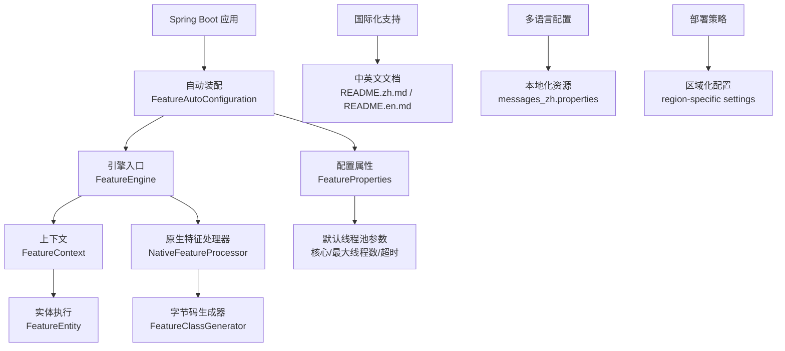
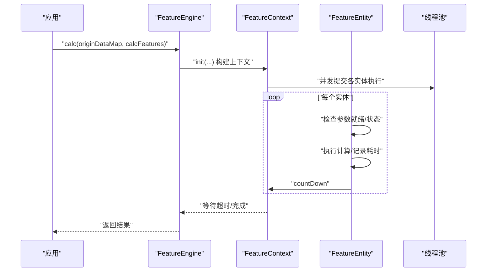
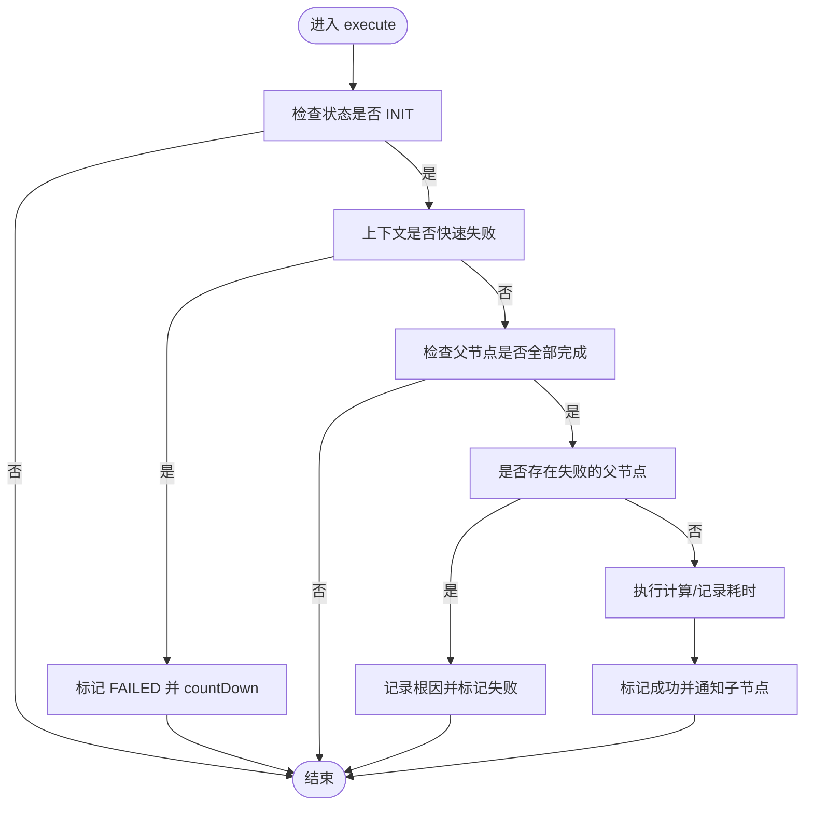
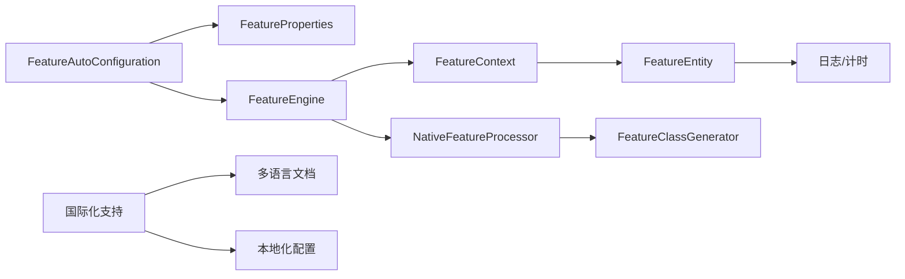

# 部署与运维

<cite>
**本文引用的文件**
- [pom.xml](file://pom.xml)
- [README.en.md](file://README.en.md)
- [README.zh.md](file://README.zh.md)
- [spring.factories](file://src/main/resources/META-INF/spring.factories)
- [FeatureAutoConfiguration.java](file://src/main/java/com/github/zh/engine/config/FeatureAutoConfiguration.java)
- [FeatureProperties.java](file://src/main/java/com/github/zh/engine/properties/FeatureProperties.java)
- [FeatureEngine.java](file://src/main/java/com/github/zh/engine/FeatureEngine.java)
- [FeatureContext.java](file://src/main/java/com/github/zh/engine/co/FeatureContext.java)
- [FeatureEntity.java](file://src/main/java/com/github/zh/engine/co/FeatureEntity.java)
- [NativeFeatureProcessor.java](file://src/main/java/com/github/zh/engine/processor/NativeFeatureProcessor.java)
- [FeatureClassGenerator.java](file://src/main/java/com/github/zh/engine/clz/FeatureClassGenerator.java)
- [FeatureEnums.java](file://src/main/java/com/github/zh/engine/enums/FeatureEnums.java)
- [CycleAnalysis.java](file://src/main/java/com/github/zh/engine/tools/CycleAnalysis.java)
- [DefaultCacheImpl.java](file://src/main/java/com/github/zh/engine/cache/DefaultCacheImpl.java)
- [CalculateException.java](file://src/main/java/com/github/zh/engine/exception/CalculateException.java)
- [application.yml](file://src/test/resources/application.yml)
- [CONTRIBUTING.md](file://CONTRIBUTING.md)
- [CODE_OF_CONDUCT.md](file://CODE_OF_CONDUCT.md)
- [CHANGELOG.md](file://CHANGELOG.md)
</cite>

## 更新摘要
**所做更改**
- 新增国际化部署考虑章节，涵盖多语言文档维护策略
- 增加多语言用户界面和文档本地化的最佳实践
- 补充国际化环境下的配置管理建议
- 添加跨文化团队协作和文档翻译流程指导

## 目录
1. [简介](#简介)
2. [项目结构](#项目结构)
3. [核心组件](#核心组件)
4. [架构总览](#架构总览)
5. [详细组件分析](#详细组件分析)
6. [依赖分析](#依赖分析)
7. [性能考虑](#性能考虑)
8. [国际化部署考虑](#国际化部署考虑)
9. [故障排查指南](#故障排查指南)
10. [结论](#结论)
11. [附录](#附录)

## 简介
本指南面向生产环境的部署与运维，围绕特征计算引擎在 Spring Boot 环境中的运行特性，给出 JVM 参数、线程池配置、内存优化、监控告警、日志管理、故障排查、版本升级与迁移、系统集成以及容量规划与性能调优等方面的实践建议。内容基于仓库中的自动装配、配置属性、线程池与上下文执行模型、异常与日志等实现细节整理而成。特别增加了国际化部署考虑和多语言文档维护策略，以支持全球化的团队协作和用户群体。

## 项目结构
该项目为 Spring Boot Starter 工程，核心模块位于 engine 包下，包含自动装配、配置属性、引擎主入口、上下文与实体、原生特征处理器、字节码生成器、枚举与工具类等。自动装配通过 META-INF/spring.factories 挂载，启用条件由配置属性控制。项目现已支持中英文双语文档，为国际化部署提供了良好的基础。

**图表来源**
- [FeatureAutoConfiguration.java:19-36](file://src/main/java/com/github/zh/engine/config/FeatureAutoConfiguration.java#L19-L36)
- [FeatureProperties.java:14-36](file://src/main/java/com/github/zh/engine/properties/FeatureProperties.java#L14-L36)
- [FeatureEngine.java:27-171](file://src/main/java/com/github/zh/engine/FeatureEngine.java#L27-L171)
- [FeatureContext.java:23-298](file://src/main/java/com/github/zh/engine/co/FeatureContext.java#L23-L298)
- [FeatureEntity.java:24-155](file://src/main/java/com/github/zh/engine/co/FeatureEntity.java#L24-L155)
- [NativeFeatureProcessor.java:26-131](file://src/main/java/com/github/zh/engine/processor/NativeFeatureProcessor.java#L26-L131)
- [FeatureClassGenerator.java:11-82](file://src/main/java/com/github/zh/engine/clz/FeatureClassGenerator.java#L11-L82)
- [README.zh.md:1-446](file://README.zh.md#L1-L446)
- [README.en.md:1-446](file://README.en.md#L1-L446)

**章节来源**
- [spring.factories:1-2](file://src/main/resources/META-INF/spring.factories#L1-L2)
- [FeatureAutoConfiguration.java:19-36](file://src/main/java/com/github/zh/engine/config/FeatureAutoConfiguration.java#L19-L36)

## 核心组件
- 自动装配与启用条件
  - 通过配置属性开关控制是否启用引擎，默认启用。
- 配置属性
  - 线程池核心/最大线程数、计算超时时间；默认值与前缀。
- 引擎主入口
  - 提供多种 calc 重载方法，支持本地与外部特征 Bean 的混合计算，内部使用线程池并发执行。
- 上下文与实体
  - FeatureContext 负责构建待计算任务、依赖关系、计数与超时等待；FeatureEntity 负责单个特征的执行、状态流转与父子通知。
- 原生特征处理器
  - 扫描标注的特征类与方法，生成执行实例并填充父子依赖关系。
- 字节码生成器
  - 基于 Javassist 动态生成执行类，将目标方法包装为统一接口。
- 枚举与工具
  - 特征类型枚举、环检测工具、默认缓存实现。
- **国际化支持**
  - 中英文双语文档支持，代码注释使用中文，为国际化部署提供基础。

**章节来源**
- [FeatureAutoConfiguration.java:19-36](file://src/main/java/com/github/zh/engine/config/FeatureAutoConfiguration.java#L19-L36)
- [FeatureProperties.java:14-36](file://src/main/java/com/github/zh/engine/properties/FeatureProperties.java#L14-L36)
- [FeatureEngine.java:49-171](file://src/main/java/com/github/zh/engine/FeatureEngine.java#L49-L171)
- [FeatureContext.java:49-298](file://src/main/java/com/github/zh/engine/co/FeatureContext.java#L49-L298)
- [FeatureEntity.java:48-155](file://src/main/java/com/github/zh/engine/co/FeatureEntity.java#L48-L155)
- [NativeFeatureProcessor.java:26-131](file://src/main/java/com/github/zh/engine/processor/NativeFeatureProcessor.java#L26-L131)
- [FeatureClassGenerator.java:11-82](file://src/main/java/com/github/zh/engine/clz/FeatureClassGenerator.java#L11-L82)
- [FeatureEnums.java:9-25](file://src/main/java/com/github/zh/engine/enums/FeatureEnums.java#L9-L25)
- [CycleAnalysis.java:18-71](file://src/main/java/com/github/zh/engine/tools/CycleAnalysis.java#L18-L71)
- [DefaultCacheImpl.java:12-31](file://src/main/java/com/github/zh/engine/cache/DefaultCacheImpl.java#L12-L31)

## 架构总览
引擎采用"注解驱动 + DAG 并行执行"的架构：扫描特征类与方法，构建依赖图，按拓扑顺序并发执行，支持外部特征 Bean 注入与超时控制。该架构天然支持国际化部署，因为核心逻辑与用户界面分离，便于在不同地区部署相同的核心功能。

**图表来源**
- [FeatureEngine.java:49-96](file://src/main/java/com/github/zh/engine/FeatureEngine.java#L49-L96)
- [FeatureContext.java:49-61](file://src/main/java/com/github/zh/engine/co/FeatureContext.java#L49-L61)
- [FeatureEntity.java:48-134](file://src/main/java/com/github/zh/engine/co/FeatureEntity.java#L48-L134)

## 详细组件分析

### 组件一：自动装配与启用条件
- 自动装配类在满足条件时注册引擎与处理器 Bean，并启用配置属性绑定。
- 启用条件可通过配置属性开关控制，默认启用。

**章节来源**
- [FeatureAutoConfiguration.java:19-36](file://src/main/java/com/github/zh/engine/config/FeatureAutoConfiguration.java#L19-L36)
- [spring.factories:1-2](file://src/main/resources/META-INF/spring.factories#L1-L2)

### 组件二：配置属性与默认行为
- 配置前缀与默认值：线程池大小、计算超时时间。
- 默认线程池大小为系统核心数×2；超时默认值为固定毫秒数。
- 生产建议：结合 CPU 核心数与业务并发度调整核心/最大线程数；根据特征复杂度与外部依赖设置合理超时。

**章节来源**
- [FeatureProperties.java:14-36](file://src/main/java/com/github/zh/engine/properties/FeatureProperties.java#L14-L36)
- [README.en.md:338-368](file://README.en.md#L338-L368)

### 组件三：引擎入口与线程池
- 引擎在首次使用时创建线程池，使用阻塞队列承载任务；支持外部注入自定义线程池。
- 提供多组 calc 方法，覆盖基础计算、带超时、带调试模式、带外部 Bean 的混合计算。

**章节来源**
- [FeatureEngine.java:31-171](file://src/main/java/com/github/zh/engine/FeatureEngine.java#L31-L171)
- [README.en.md:426-436](file://README.en.md#L426-L436)

### 组件四：上下文与实体执行
- 上下文负责：
  - 注入原始数据、本地与外部特征实体；
  - 构建中间依赖实体、统计待计算数量、初始化倒计时；
  - 并发调度执行、等待超时、聚合结果。
- 实体负责：
  - 状态机流转（INIT → PROCESSING → SUCCESS/FAILED）；
  - 参数就绪检查、错误传播、父子通知；
  - 计时与日志记录。

**图表来源**
- [FeatureEntity.java:48-134](file://src/main/java/com/github/zh/engine/co/FeatureEntity.java#L48-L134)

**章节来源**
- [FeatureContext.java:49-298](file://src/main/java/com/github/zh/engine/co/FeatureContext.java#L49-L298)
- [FeatureEntity.java:48-155](file://src/main/java/com/github/zh/engine/co/FeatureEntity.java#L48-L155)

### 组件五：原生特征处理器与字节码生成
- 处理器扫描标注的特征类与方法，提取参数名作为依赖关系，生成执行实例并注册到容器。
- 字节码生成器基于 Javassist 将目标方法包装为统一接口，便于统一调度。

**章节来源**
- [NativeFeatureProcessor.java:26-131](file://src/main/java/com/github/zh/engine/processor/NativeFeatureProcessor.java#L26-L131)
- [FeatureClassGenerator.java:11-82](file://src/main/java/com/github/zh/engine/clz/FeatureClassGenerator.java#L11-L82)

### 组件六：环检测与缓存
- 环检测工具提供环路判定能力（当前上下文中注释了抛错逻辑，保留检测能力）。
- 默认缓存实现为简单集合，可用于去重或标记。

**章节来源**
- [CycleAnalysis.java:18-71](file://src/main/java/com/github/zh/engine/tools/CycleAnalysis.java#L18-L71)
- [DefaultCacheImpl.java:12-31](file://src/main/java/com/github/zh/engine/cache/DefaultCacheImpl.java#L12-L31)

## 依赖分析
- 自动装配依赖 Spring Boot 自动配置与条件注解，启用配置属性绑定。
- 引擎依赖线程池与上下文，上下文依赖实体与状态机，实体依赖日志与计时。
- 处理器依赖反射与字节码生成，生成类依赖统一接口。

**图表来源**
- [FeatureAutoConfiguration.java:19-36](file://src/main/java/com/github/zh/engine/config/FeatureAutoConfiguration.java#L19-L36)
- [FeatureEngine.java:27-171](file://src/main/java/com/github/zh/engine/FeatureEngine.java#L27-L171)
- [FeatureContext.java:23-298](file://src/main/java/com/github/zh/engine/co/FeatureContext.java#L23-L298)
- [FeatureEntity.java:24-155](file://src/main/java/com/github/zh/engine/co/FeatureEntity.java#L24-L155)
- [NativeFeatureProcessor.java:26-131](file://src/main/java/com/github/zh/engine/processor/NativeFeatureProcessor.java#L26-L131)
- [FeatureClassGenerator.java:11-82](file://src/main/java/com/github/zh/engine/clz/FeatureClassGenerator.java#L11-L82)

**章节来源**
- [FeatureAutoConfiguration.java:19-36](file://src/main/java/com/github/zh/engine/config/FeatureAutoConfiguration.java#L19-L36)
- [FeatureEngine.java:27-171](file://src/main/java/com/github/zh/engine/FeatureEngine.java#L27-L171)

## 性能考虑
- 线程池配置
  - 默认核心/最大线程数为系统核心数×2；建议结合 CPU 核心数与特征并发度调整，避免过度上下文切换。
  - 若外部依赖（如 RPC/DB）占比高，可适当增大最大线程数并配合队列长度限制。
- 计算超时
  - 默认超时为固定毫秒数；建议根据特征复杂度与外部依赖设置合理上限，防止长时间阻塞。
- 并发策略
  - 利用 DAG 并行执行减少总耗时；避免在特征函数内进行阻塞性操作。
- 内存优化
  - 控制单次计算涉及的特征数量与中间结果规模；及时释放临时对象。
  - 合理设置 JVM 新生代/老年代比例，降低 Full GC 风险。
- JVM 参数建议
  - 堆大小：根据峰值并发与对象生命周期设定，预留安全余量。
  - GC 策略：优先选择低延迟 GC（如 G1 或 ZGC），并开启自适应停顿目标。
  - 其他：开启逃逸分析、偏向锁关闭（高并发场景）、参数化编译等。
- 监控指标
  - 关键指标：线程池活跃线程数、队列长度、拒绝次数、计算耗时 P50/P95/P99、超时次数、失败率。
  - 性能指标：特征平均耗时、吞吐量、并发度、外部依赖耗时占比。
- 日志与告警
  - 错误日志：捕获计算异常与超时异常，定位根因特征。
  - 告警阈值：超时率、失败率、线程池饱和率、队列积压、GC 停顿时长。

**章节来源**
- [FeatureProperties.java:14-36](file://src/main/java/com/github/zh/engine/properties/FeatureProperties.java#L14-L36)
- [FeatureEngine.java:164-171](file://src/main/java/com/github/zh/engine/FeatureEngine.java#L164-L171)
- [FeatureContext.java:49-61](file://src/main/java/com/github/zh/engine/co/FeatureContext.java#L49-L61)
- [FeatureEntity.java:102-116](file://src/main/java/com/github/zh/engine/co/FeatureEntity.java#L102-L116)
- [CalculateException.java:9-19](file://src/main/java/com/github/zh/engine/exception/CalculateException.java#L9-L19)

## 国际化部署考虑

### 多语言文档维护策略
- **文档同步机制**
  - 维护中英文双语文档，确保技术细节与使用说明的一致性
  - 建立文档版本对照表，跟踪不同语言版本的更新状态
  - 使用统一的文档模板，确保格式和术语的一致性

- **翻译质量保证**
  - 技术术语采用标准化翻译，避免同一概念的不同表达
  - 代码示例中的注释和文档保持一致的翻译风格
  - 建立文档审查流程，确保翻译准确性和可读性

- **文档组织结构**
  - 采用相同的章节结构和标题层次，便于跨语言导航
  - 统一的代码示例格式，确保在不同语言环境下的一致性
  - 保持链接和交叉引用的准确性

### 国际化环境配置
- **区域化部署策略**
  - 根据目标用户的地理位置部署相应的镜像站点
  - 配置适当的时区和本地化设置
  - 考虑网络延迟和带宽对用户体验的影响

- **多语言用户界面**
  - 支持用户界面的语言切换功能
  - 提供用户偏好设置的持久化存储
  - 实现动态语言包加载机制

- **本地化资源管理**
  - 统一管理消息文本、帮助文档和错误信息
  - 建立翻译记忆库，提高翻译效率和一致性
  - 定期更新和维护本地化资源

### 跨文化团队协作
- **开发流程国际化**
  - 代码注释和文档使用英文，便于国际开发者理解
  - 建立多语言的沟通渠道和协作工具
  - 制定统一的编码规范和命名约定

- **文档贡献流程**
  - 提供多语言的贡献指南和参与方式
  - 建立翻译志愿者招募和培训机制
  - 实施文档质量评估和持续改进流程

- **社区建设**
  - 鼓励不同地区的用户参与项目贡献
  - 建立多语言的用户支持和技术交流平台
  - 定期举办国际性的技术分享和培训活动

### 部署最佳实践
- **基础设施考虑**
  - 选择支持多语言的服务器和操作系统配置
  - 配置适当的字符编码和本地化支持
  - 确保数据库和存储系统支持多语言数据

- **监控和日志**
  - 收集多语言环境下的性能指标
  - 监控不同地区用户的使用模式和偏好
  - 建立跨文化的用户体验反馈机制

- **安全和合规**
  - 遵循不同地区的法律法规要求
  - 考虑数据隐私和跨境传输的合规性
  - 实施适当的内容过滤和审核机制

**章节来源**
- [README.zh.md:1-446](file://README.zh.md#L1-L446)
- [README.en.md:1-446](file://README.en.md#L1-L446)
- [CONTRIBUTING.md:1-203](file://CONTRIBUTING.md#L1-L203)
- [CODE_OF_CONDUCT.md:1-134](file://CODE_OF_CONDUCT.md#L1-L134)

## 故障排查指南
- 常见问题与定位
  - 计算超时：检查超时阈值、外部依赖耗时、线程池饱和情况。
  - 计算失败：查看实体执行日志，定位根因特征与异常堆栈。
  - 环依赖：确认特征依赖是否形成环，必要时引入原始数据打断。
- 排查步骤
  - 启用调试模式，获取完整中间结果与耗时。
  - 观察线程池队列长度与拒绝次数，评估并发度与资源配额。
  - 分析慢特征，拆分复杂逻辑或引入缓存。
- 常用命令
  - 查看进程与线程：top、ps、jstack。
  - 查看 GC 与堆：jstat、jmap、jcmd。
  - 追踪热点：perf、async-profiler。
  - 定位锁竞争：jstack 分析锁等待链路。
- 建议的日志级别
  - 生产：INFO；问题定位：DEBUG；异常：ERROR。

**章节来源**
- [FeatureContext.java:49-61](file://src/main/java/com/github/zh/engine/co/FeatureContext.java#L49-L61)
- [FeatureEntity.java:102-116](file://src/main/java/com/github/zh/engine/co/FeatureEntity.java#L102-L116)
- [CalculateException.java:9-19](file://src/main/java/com/github/zh/engine/exception/CalculateException.java#L9-L19)

## 结论
本指南基于引擎的自动装配、配置属性、线程池与上下文执行模型，给出了生产环境的部署与运维建议。通过合理的 JVM 参数、线程池与超时配置、监控与告警、日志与故障排查流程，以及容量规划与性能调优，可有效保障特征计算在高并发与复杂依赖下的稳定性与性能。新增的国际化部署考虑为全球化团队协作和多语言用户群体提供了完整的指导框架。

## 附录

### A. 生产部署要求与配置建议
- 环境要求
  - JDK 8+；Spring Boot 2.x。
- Maven 与编译参数
  - 启用参数保留编译参数以便注解解析。
- 配置项与默认值
  - 线程池核心/最大线程数、计算超时；默认值参考配置类。
- 启用条件
  - 通过配置属性开关控制是否启用引擎。

**章节来源**
- [README.en.md:83-87](file://README.en.md#L83-L87)
- [FeatureProperties.java:14-36](file://src/main/java/com/github/zh/engine/properties/FeatureProperties.java#L14-L36)
- [FeatureAutoConfiguration.java:20-22](file://src/main/java/com/github/zh/engine/config/FeatureAutoConfiguration.java#L20-L22)

### B. 监控与告警设置
- 指标采集
  - 线程池：活跃线程数、队列长度、拒绝次数。
  - 计算：耗时分布、超时次数、失败率。
  - 外部依赖：RPC/DB 调用耗时与错误率。
- 告警阈值
  - 超时率、失败率、队列积压、GC 停顿时长、线程池饱和率。
- 日志
  - 错误日志：异常堆栈与根因特征；性能日志：耗时与吞吐。

**章节来源**
- [FeatureEngine.java:164-171](file://src/main/java/com/github/zh/engine/FeatureEngine.java#L164-L171)
- [FeatureContext.java:49-61](file://src/main/java/com/github/zh/engine/co/FeatureContext.java#L49-L61)
- [FeatureEntity.java:102-116](file://src/main/java/com/github/zh/engine/co/FeatureEntity.java#L102-L116)

### C. 日志管理与分析
- 特征计算日志
  - 记录特征名称、耗时、输入参数、结果摘要。
- 性能日志
  - 统计 P50/P95/P99 耗时与并发度。
- 错误日志
  - 记录异常堆栈、根因特征、父节点失败信息。

**章节来源**
- [FeatureEntity.java:102-116](file://src/main/java/com/github/zh/engine/co/FeatureEntity.java#L102-L116)

### D. 版本升级与迁移指南
- 升级策略
  - 保持 Spring Boot 2.x 兼容；关注线程池与超时行为变化。
- 迁移要点
  - 检查配置前缀与默认值变更；验证特征函数签名与依赖关系。
- 回滚预案
  - 保留旧版配置与依赖范围；准备降级路径与限流策略。

**章节来源**
- [pom.xml:52-99](file://pom.xml#L52-L99)
- [README.en.md:338-368](file://README.en.md#L338-L368)

### E. 与其他系统集成与注意事项
- 外部特征 Bean
  - 通过扩展方法注入外部计算 Bean，注意依赖关系与输出控制。
- 外部依赖
  - 对外 RPC/DB 调用应具备熔断、重试与超时控制。
- 注意事项
  - 避免循环依赖；在环中提供原始数据打断；控制单次计算规模。

**章节来源**
- [FeatureEngine.java:106-161](file://src/main/java/com/github/zh/engine/FeatureEngine.java#L106-L161)
- [FeatureContext.java:100-127](file://src/main/java/com/github/zh/engine/co/FeatureContext.java#L100-L127)
- [README.en.md:276-312](file://README.en.md#L276-L312)

### F. 容量规划与性能调优
- 容量规划
  - 基于峰值并发与特征复杂度估算线程池大小与队列长度。
- 性能调优
  - 优化特征函数逻辑、减少外部依赖、引入缓存；调整 JVM 参数与 GC 策略。

**章节来源**
- [FeatureProperties.java:14-36](file://src/main/java/com/github/zh/engine/properties/FeatureProperties.java#L14-L36)
- [FeatureEngine.java:164-171](file://src/main/java/com/github/zh/engine/FeatureEngine.java#L164-L171)

### G. 国际化部署最佳实践
- **文档维护**
  - 建立中英文文档同步机制，确保技术内容的一致性
  - 制定翻译标准和质量检查流程
  - 定期更新文档版本，跟踪用户反馈

- **配置管理**
  - 支持多语言的配置文件管理
  - 实现动态语言切换和本地化资源加载
  - 考虑不同地区的合规要求和数据保护法规

- **团队协作**
  - 建立跨文化团队的沟通和协作机制
  - 提供多语言的技术支持和用户服务
  - 鼓励国际化贡献和社区参与

**章节来源**
- [README.zh.md:1-446](file://README.zh.md#L1-L446)
- [README.en.md:1-446](file://README.en.md#L1-L446)
- [CONTRIBUTING.md:1-203](file://CONTRIBUTING.md#L1-L203)
- [CODE_OF_CONDUCT.md:1-134](file://CODE_OF_CONDUCT.md#L1-L134)
- [CHANGELOG.md:1-42](file://CHANGELOG.md#L1-L42)