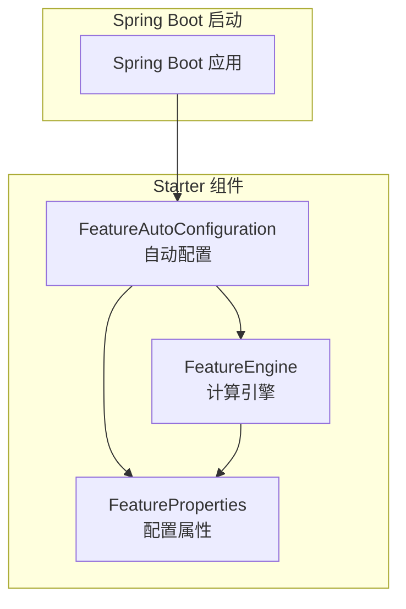
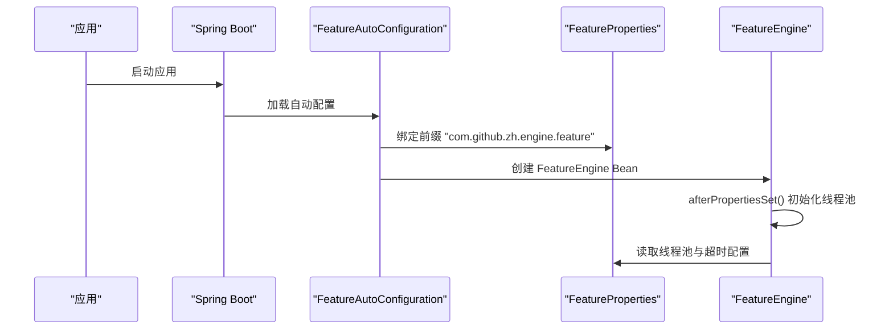
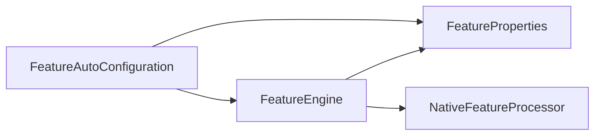

# 配置管理

<cite>
**本文引用的文件**
- [FeatureAutoConfiguration.java](file://src/main/java/com/github/zh/engine/config/FeatureAutoConfiguration.java)
- [FeatureProperties.java](file://src/main/java/com/github/zh/engine/properties/FeatureProperties.java)
- [FeatureEngine.java](file://src/main/java/com/github/zh/engine/FeatureEngine.java)
- [spring.factories](file://src/main/resources/META-INF/spring.factories)
- [pom.xml](file://pom.xml)
- [README.md](file://README.md)
- [application.yml](file://src/test/resources/application.yml)
</cite>

## 目录
1. [简介](#简介)
2. [项目结构](#项目结构)
3. [核心组件](#核心组件)
4. [架构总览](#架构总览)
5. [详细组件分析](#详细组件分析)
6. [依赖关系分析](#依赖关系分析)
7. [性能考量](#性能考量)
8. [故障排查指南](#故障排查指南)
9. [结论](#结论)
10. [附录](#附录)

## 简介
本指南围绕 Spring Boot 自动配置与 Feature 引擎的配置项展开，重点解释 FeatureProperties 中的可配置参数及其调优建议，涵盖线程池大小、超时时间、并行度设置等；提供 application.yml 配置示例与参数说明；阐述如何通过环境变量或配置文件覆盖默认设置；给出性能调优最佳实践与配置验证、故障排查方法，以及配置项之间的依赖关系与约束条件。

## 项目结构
该项目是一个 Spring Boot Starter，提供“特征/指标/变量”等无副作用计算的并行执行能力。核心配置与自动装配位于以下模块：
- 自动配置与条件装配：FeatureAutoConfiguration
- 配置属性模型：FeatureProperties
- 引擎主入口：FeatureEngine
- SPI 自动装配注册：spring.factories
- 依赖与构建：pom.xml
- 使用与配置说明：README.md
- 测试配置示例：application.yml

图表来源
- [FeatureAutoConfiguration.java:19-36](file://src/main/java/com/github/zh/engine/config/FeatureAutoConfiguration.java#L19-L36)
- [FeatureProperties.java:14-36](file://src/main/java/com/github/zh/engine/properties/FeatureProperties.java#L14-L36)
- [FeatureEngine.java:29-171](file://src/main/java/com/github/zh/engine/FeatureEngine.java#L29-L171)

章节来源
- [FeatureAutoConfiguration.java:19-36](file://src/main/java/com/github/zh/engine/config/FeatureAutoConfiguration.java#L19-L36)
- [FeatureProperties.java:14-36](file://src/main/java/com/github/zh/engine/properties/FeatureProperties.java#L14-L36)
- [FeatureEngine.java:29-171](file://src/main/java/com/github/zh/engine/FeatureEngine.java#L29-L171)
- [spring.factories:1-2](file://src/main/resources/META-INF/spring.factories#L1-L2)
- [pom.xml:52-86](file://pom.xml#L52-L86)

## 核心组件
- 自动配置类 FeatureAutoConfiguration
  - 条件启用：当存在 FeatureEngine 与 NativeFeatureProcessor 类且 enabled.featureEngine 为 true 时生效
  - 启用配置属性绑定：将 com.github.zh.engine.feature 前缀的配置映射到 FeatureProperties
  - Bean 定义：在缺失时创建 NativeFeatureProcessor 与 FeatureEngine
- 配置属性 FeatureProperties
  - 线程池核心大小：默认为 CPU 核心数 × 2
  - 线程池最大大小：默认为 CPU 核心数 × 2
  - 计算超时时间：默认 10000 毫秒
- 引擎 FeatureEngine
  - 在未注入自定义线程池时，按 FeatureProperties 初始化线程池
  - 提供多种 calc 接口，支持超时控制与调试模式
  - 通过 FeatureContext 执行 DAG 并行计算

章节来源
- [FeatureAutoConfiguration.java:19-36](file://src/main/java/com/github/zh/engine/config/FeatureAutoConfiguration.java#L19-L36)
- [FeatureProperties.java:14-36](file://src/main/java/com/github/zh/engine/properties/FeatureProperties.java#L14-L36)
- [FeatureEngine.java:164-170](file://src/main/java/com/github/zh/engine/FeatureEngine.java#L164-L170)

## 架构总览
自动配置通过 spring.factories 注册，使 Spring Boot 在启动时加载 FeatureAutoConfiguration。该类启用配置属性绑定并将 FeatureProperties 注入 FeatureEngine。FeatureEngine 在初始化阶段根据配置创建线程池，用于并行执行特征函数。

图表来源
- [spring.factories:1-2](file://src/main/resources/META-INF/spring.factories#L1-L2)
- [FeatureAutoConfiguration.java:22-35](file://src/main/java/com/github/zh/engine/config/FeatureAutoConfiguration.java#L22-L35)
- [FeatureEngine.java:164-170](file://src/main/java/com/github/zh/engine/FeatureEngine.java#L164-L170)

## 详细组件分析

### 自动配置与条件装配
- 条件注解
  - ConditionalOnProperty：开关属性 enabled.featureEngine，默认开启
  - ConditionalOnClass：要求存在 FeatureEngine 与 NativeFeatureProcessor 类
  - ConditionalOnMissingBean：在缺失对应 Bean 时才创建
- 配置属性绑定
  - EnableConfigurationProperties：启用 FeatureProperties 绑定
  - 前缀：com.github.zh.engine.feature
- Bean 定义
  - NativeFeatureProcessor：默认实现
  - FeatureEngine：默认实现

章节来源
- [FeatureAutoConfiguration.java:19-36](file://src/main/java/com/github/zh/engine/config/FeatureAutoConfiguration.java#L19-L36)
- [spring.factories:1-2](file://src/main/resources/META-INF/spring.factories#L1-L2)

### 配置属性模型 FeatureProperties
- 关键字段
  - featureThreadPoolSize：线程池核心线程数，默认 CPU 核心数 × 2
  - featureThreadPoolMaxSize：线程池最大线程数，默认 CPU 核心数 × 2
  - calcTimeout：计算超时时间（毫秒），默认 10000
- 默认值策略
  - 系统核心数：通过运行时可用核心数计算
  - 默认超时：固定 10000 毫秒
- 前缀与绑定
  - 前缀：com.github.zh.engine.feature
  - 由 EnableConfigurationProperties 与 @ConfigurationProperties 绑定

章节来源
- [FeatureProperties.java:14-36](file://src/main/java/com/github/zh/engine/properties/FeatureProperties.java#L14-L36)

### 引擎初始化与线程池
- 初始化流程
  - afterPropertiesSet：若未注入自定义线程池，则基于 FeatureProperties 创建 ThreadPoolExecutor
  - 线程池参数：核心大小、最大大小、存活时间、工作队列、线程命名
- 计算接口
  - 支持传入自定义线程池与超时时间
  - 默认使用 FeatureProperties 的超时配置
- 并行度
  - 由线程池大小决定并发执行能力
  - 与 DAG 任务数量共同影响吞吐

图表来源
- [FeatureEngine.java:164-170](file://src/main/java/com/github/zh/engine/FeatureEngine.java#L164-L170)
- [FeatureProperties.java:31-35](file://src/main/java/com/github/zh/engine/properties/FeatureProperties.java#L31-L35)

章节来源
- [FeatureEngine.java:164-170](file://src/main/java/com/github/zh/engine/FeatureEngine.java#L164-L170)
- [FeatureProperties.java:31-35](file://src/main/java/com/github/zh/engine/properties/FeatureProperties.java#L31-L35)

### 配置项与调优建议
- 线程池大小
  - featureThreadPoolSize：核心线程数，建议与 CPU 核心数成比例，I/O 密集可适当增大
  - featureThreadPoolMaxSize：最大线程数，建议与核心线程数一致或略大，避免过度上下文切换
- 超时时间
  - calcTimeout：计算超时，建议根据业务复杂度与数据规模调整，避免长时间阻塞
- 并行度设置
  - 与 DAG 任务数匹配，避免过小导致串行瓶颈，过大导致资源争用
- 内存使用优化
  - 控制线程池队列长度与任务粒度，避免大量中间对象堆积
  - 合理拆分任务，减少单次计算负载

章节来源
- [FeatureProperties.java:31-35](file://src/main/java/com/github/zh/engine/properties/FeatureProperties.java#L31-L35)
- [README.md:165-181](file://README.md#L165-L181)

### 配置覆盖方式
- application.yml
  - 前缀：com.github.zh.engine.feature
  - 示例：featureThreadPoolSize、featureThreadPoolMaxSize、calcTimeout
- 环境变量
  - Spring Boot 支持通过环境变量覆盖配置，例如通过 JVM 参数或容器环境变量设置
- 测试示例
  - 测试资源中使用 com.github.zh.engine.feature 前缀覆盖 featureThreadPoolSize

章节来源
- [application.yml:4-9](file://src/test/resources/application.yml#L4-L9)
- [README.md:173-179](file://README.md#L173-L179)

### 配置验证与故障排查
- 验证步骤
  - 启动应用后检查日志，确认 FeatureAutoConfiguration 生效
  - 通过 FeatureEngine 的调试模式查看执行详情
  - 使用单元测试验证计算结果与超时行为
- 常见问题
  - 线程池过小导致吞吐不足
  - 超时过短导致任务被中断
  - 循环依赖导致执行失败（需在编码时规避）

章节来源
- [README.md:181-181](file://README.md#L181-L181)
- [MainTest.java:28-45](file://src/test/java/com/github/zh/MainTest.java#L28-L45)

## 依赖关系分析
- 组件耦合
  - FeatureAutoConfiguration 依赖 FeatureEngine、NativeFeatureProcessor、FeatureProperties
  - FeatureEngine 依赖 FeatureProperties 与 NativeFeatureProcessor
- 外部依赖
  - Spring Boot AutoConfigure、Lombok、Javassist、SLF4J
- 自动装配注册
  - spring.factories 将 FeatureAutoConfiguration 注册为 EnableAutoConfiguration

图表来源
- [FeatureAutoConfiguration.java:22-35](file://src/main/java/com/github/zh/engine/config/FeatureAutoConfiguration.java#L22-L35)
- [FeatureEngine.java:32-40](file://src/main/java/com/github/zh/engine/FeatureEngine.java#L32-L40)

章节来源
- [pom.xml:52-86](file://pom.xml#L52-L86)
- [spring.factories:1-2](file://src/main/resources/META-INF/spring.factories#L1-L2)

## 性能考量
- 线程池参数调优
  - I/O 密集型：适当增大最大线程数，缩短等待队列
  - CPU 密集型：核心线程数接近 CPU 核心数，避免过多上下文切换
- 超时策略
  - 根据业务 SLA 设定合理超时，结合重试与降级策略
- 并发与吞吐
  - 与 DAG 任务规模匹配，避免过载或资源浪费
- 内存与 GC
  - 控制中间对象生命周期，避免长尾任务占用堆内存

## 故障排查指南
- 启动阶段
  - 确认自动配置类被加载（查看日志）
  - 检查配置前缀与键名是否正确
- 运行阶段
  - 观察线程池利用率与队列长度
  - 检查超时异常与中断日志
- 单元测试
  - 使用测试用例验证计算链路与边界条件

章节来源
- [MainTest.java:28-45](file://src/test/java/com/github/zh/MainTest.java#L28-L45)

## 结论
通过 Spring Boot 自动配置与 FeatureProperties 的绑定，项目实现了对线程池与超时时间的灵活控制。合理设置线程池大小与超时时间，结合业务特性进行调优，可显著提升计算吞吐与稳定性。同时，建议在开发阶段通过测试与日志验证配置效果，并在生产环境中持续监控与迭代。

## 附录

### 配置项清单与说明
- 前缀：com.github.zh.engine.feature
- 可配置项
  - featureThreadPoolSize：线程池核心线程数，默认 CPU 核心数 × 2
  - featureThreadPoolMaxSize：线程池最大线程数，默认 CPU 核心数 × 2
  - calcTimeout：计算超时时间（毫秒），默认 10000

章节来源
- [FeatureProperties.java:31-35](file://src/main/java/com/github/zh/engine/properties/FeatureProperties.java#L31-L35)
- [README.md:165-171](file://README.md#L165-L171)

### application.yml 配置示例
- 示例路径：[application.yml:4-9](file://src/test/resources/application.yml#L4-L9)
- 建议
  - 使用环境变量或配置文件覆盖默认值
  - 与 CI/CD 管道集成，按环境区分配置

章节来源
- [application.yml:4-9](file://src/test/resources/application.yml#L4-L9)
- [README.md:173-179](file://README.md#L173-L179)

### 依赖关系与约束
- 条件启用
  - enabled.featureEngine 为 true 时启用自动配置
  - 存在 FeatureEngine 与 NativeFeatureProcessor 类时生效
- 约束
  - featureThreadPoolMaxSize ≥ featureThreadPoolSize
  - calcTimeout 建议大于单任务平均耗时，避免频繁超时

章节来源
- [FeatureAutoConfiguration.java:20-21](file://src/main/java/com/github/zh/engine/config/FeatureAutoConfiguration.java#L20-L21)
- [FeatureProperties.java:31-35](file://src/main/java/com/github/zh/engine/properties/FeatureProperties.java#L31-L35)