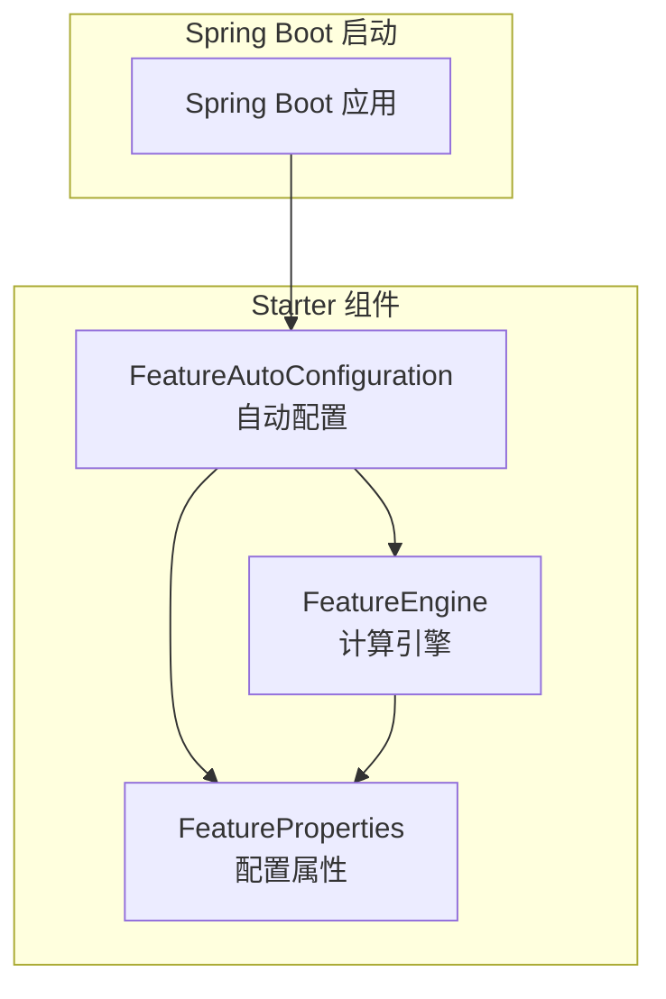
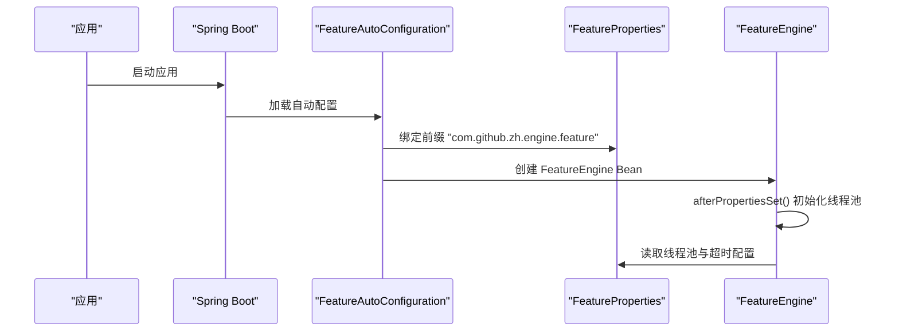
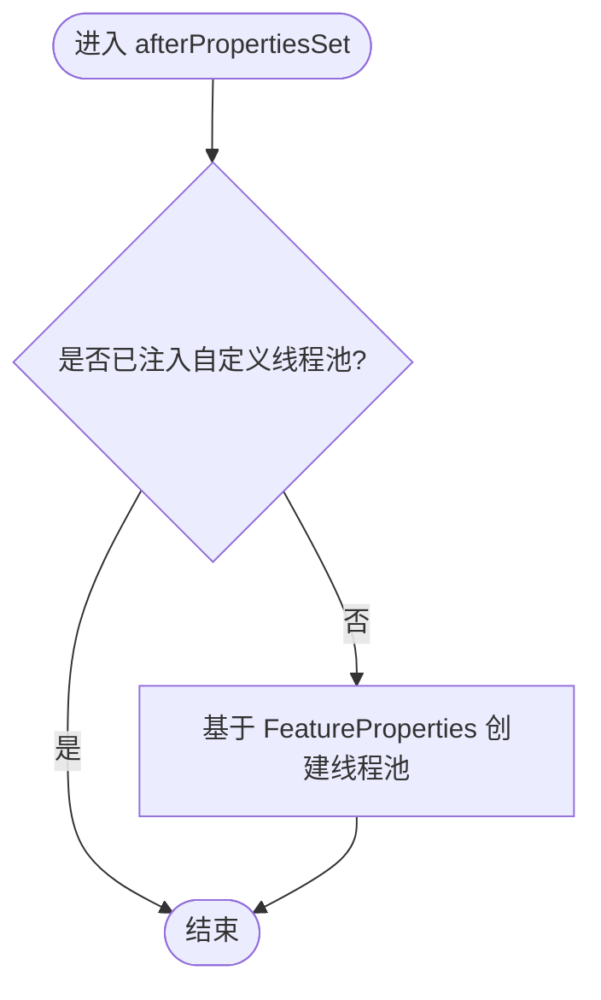
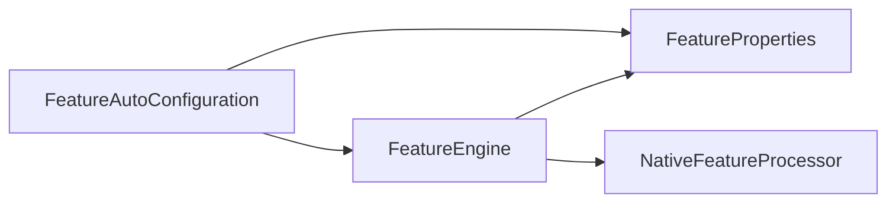

# 配置管理

<cite>
**本文引用的文件**
- [FeatureAutoConfiguration.java](file://src/main/java/com/github/zh/engine/config/FeatureAutoConfiguration.java)
- [FeatureProperties.java](file://src/main/java/com/github/zh/engine/properties/FeatureProperties.java)
- [FeatureEngine.java](file://src/main/java/com/github/zh/engine/FeatureEngine.java)
- [spring.factories](file://src/main/resources/META-INF/spring.factories)
- [pom.xml](file://pom.xml)
- [README.md](file://README.md)
- [application.yml](file://src/test/resources/application.yml)
</cite>

## 更新摘要
**变更内容**
- 新增配置参数表格，详细说明三个核心配置项的默认值和用途
- 添加完整的 application.yml 配置示例
- 补充详细的性能调优建议，包括不同场景下的线程池配置策略
- 更新超时时间默认值从10000ms调整为5000ms的说明
- 增强配置验证和故障排查指南

## 目录
1. [简介](#简介)
2. [项目结构](#项目结构)
3. [核心组件](#核心组件)
4. [架构总览](#架构总览)
5. [详细组件分析](#详细组件分析)
6. [配置参数详解](#配置参数详解)
7. [YAML配置示例](#yaml配置示例)
8. [性能调优指南](#性能调优指南)
9. [配置覆盖方式](#配置覆盖方式)
10. [配置验证与故障排查](#配置验证与故障排查)
11. [依赖关系分析](#依赖关系分析)
12. [结论](#结论)
13. [附录](#附录)

## 简介
本指南围绕 Spring Boot 自动配置与 Feature 引擎的配置项展开，重点解释 FeatureProperties 中的可配置参数及其调优建议，涵盖线程池大小、超时时间、并行度设置等；提供 application.yml 配置示例与参数说明；阐述如何通过环境变量或配置文件覆盖默认设置；给出性能调优最佳实践与配置验证、故障排查方法，以及配置项之间的依赖关系与约束条件。

## 项目结构
该项目是一个 Spring Boot Starter，提供"特征/指标/变量"等无副作用计算的并行执行能力。核心配置与自动装配位于以下模块：
- 自动配置与条件装配：FeatureAutoConfiguration
- 配置属性模型：FeatureProperties
- 引擎主入口：FeatureEngine
- SPI 自动装配注册：spring.factories
- 依赖与构建：pom.xml
- 使用与配置说明：README.md
- 测试配置示例：application.yml



**图表来源**
- [FeatureAutoConfiguration.java:19-36](file://src/main/java/com/github/zh/engine/config/FeatureAutoConfiguration.java#L19-L36)
- [FeatureProperties.java:14-36](file://src/main/java/com/github/zh/engine/properties/FeatureProperties.java#L14-L36)
- [FeatureEngine.java:29-171](file://src/main/java/com/github/zh/engine/FeatureEngine.java#L29-L171)

**章节来源**
- [FeatureAutoConfiguration.java:19-36](file://src/main/java/com/github/zh/engine/config/FeatureAutoConfiguration.java#L19-L36)
- [FeatureProperties.java:14-36](file://src/main/java/com/github/zh/engine/properties/FeatureProperties.java#L14-L36)
- [FeatureEngine.java:29-171](file://src/main/java/com/github/zh/engine/FeatureEngine.java#L29-L171)
- [spring.factories:1-2](file://src/main/resources/META-INF/spring.factories#L1-L2)
- [pom.xml:52-86](file://pom.xml#L52-L86)

## 核心组件
- 自动配置类 FeatureAutoConfiguration
  - 条件启用：当存在 FeatureEngine 与 NativeFeatureProcessor 类且 enabled.featureEngine 为 true 时生效
  - 启用配置属性绑定：将 com.github.zh.engine.feature 前缀的配置映射到 FeatureProperties
  - Bean 定义：在缺失时创建 NativeFeatureProcessor 与 FeatureEngine
- 配置属性 FeatureProperties
  - 线程池核心大小：默认为 CPU 核心数 × 2
  - 线程池最大大小：默认为 CPU 核心数 × 2
  - 计算超时时间：默认 5000 毫秒（已在最新版本调整）
- 引擎 FeatureEngine
  - 在未注入自定义线程池时，按 FeatureProperties 初始化线程池
  - 提供多种 calc 接口，支持超时控制与调试模式
  - 通过 FeatureContext 执行 DAG 并行计算

**章节来源**
- [FeatureAutoConfiguration.java:19-36](file://src/main/java/com/github/zh/engine/config/FeatureAutoConfiguration.java#L19-L36)
- [FeatureProperties.java:14-36](file://src/main/java/com/github/zh/engine/properties/FeatureProperties.java#L14-L36)
- [FeatureEngine.java:164-170](file://src/main/java/com/github/zh/engine/FeatureEngine.java#L164-L170)

## 架构总览
自动配置通过 spring.factories 注册，使 Spring Boot 在启动时加载 FeatureAutoConfiguration。该类启用配置属性绑定并将 FeatureProperties 注入 FeatureEngine。FeatureEngine 在初始化阶段根据配置创建线程池，用于并行执行特征函数。



**图表来源**
- [spring.factories:1-2](file://src/main/resources/META-INF/spring.factories#L1-L2)
- [FeatureAutoConfiguration.java:22-35](file://src/main/java/com/github/zh/engine/config/FeatureAutoConfiguration.java#L22-L35)
- [FeatureEngine.java:164-170](file://src/main/java/com/github/zh/engine/FeatureEngine.java#L164-L170)

## 详细组件分析

### 自动配置与条件装配
- 条件注解
  - ConditionalOnProperty：开关属性 enabled.featureEngine，默认开启
  - ConditionalOnClass：要求存在 FeatureEngine 与 NativeFeatureProcessor 类
  - ConditionalOnMissingBean：在缺失对应 Bean 时才创建
- 配置属性绑定
  - EnableConfigurationProperties：启用 FeatureProperties 绑定
  - 前缀：com.github.zh.engine.feature
- Bean 定义
  - NativeFeatureProcessor：默认实现
  - FeatureEngine：默认实现

**章节来源**
- [FeatureAutoConfiguration.java:19-36](file://src/main/java/com/github/zh/engine/config/FeatureAutoConfiguration.java#L19-L36)
- [spring.factories:1-2](file://src/main/resources/META-INF/spring.factories#L1-L2)

### 配置属性模型 FeatureProperties
- 关键字段
  - featureThreadPoolSize：线程池核心线程数，默认 CPU 核心数 × 2
  - featureThreadPoolMaxSize：线程池最大线程数，默认 CPU 核心数 × 2
  - calcTimeout：计算超时时间（毫秒），默认 5000（最新版本调整）
  - threadPoolNamePrefix：线程池名称前缀，默认 feature-pool-
- 默认值策略
  - 系统核心数：通过运行时可用核心数计算
  - 默认超时：固定 5000 毫秒（相比之前版本有所降低）
- 前缀与绑定
  - 前缀：com.github.zh.engine.feature
  - 由 EnableConfigurationProperties 与 @ConfigurationProperties 绑定

**章节来源**
- [FeatureProperties.java:14-36](file://src/main/java/com/github/zh/engine/properties/FeatureProperties.java#L14-L36)

### 引擎初始化与线程池
- 初始化流程
  - afterPropertiesSet：若未注入自定义线程池，则基于 FeatureProperties 创建 ThreadPoolExecutor
  - 线程池参数：核心大小、最大大小、存活时间、工作队列、线程命名
- 计算接口
  - 支持传入自定义线程池与超时时间
  - 默认使用 FeatureProperties 的超时配置
- 并行度
  - 由线程池大小决定并发执行能力
  - 与 DAG 任务数量共同影响吞吐



**图表来源**
- [FeatureEngine.java:164-170](file://src/main/java/com/github/zh/engine/FeatureEngine.java#L164-L170)
- [FeatureProperties.java:31-35](file://src/main/java/com/github/zh/engine/properties/FeatureProperties.java#L31-L35)

**章节来源**
- [FeatureEngine.java:164-170](file://src/main/java/com/github/zh/engine/FeatureEngine.java#L164-L170)
- [FeatureProperties.java:31-35](file://src/main/java/com/github/zh/engine/properties/FeatureProperties.java#L31-L35)

## 配置参数详解

### 核心配置参数表

| 配置项 | 默认值 | 说明 |
|--------|--------|------|
| `com.github.zh.engine.feature.featureThreadPoolSize` | CPU 核心数 | 线程池核心线程数 |
| `com.github.zh.engine.feature.featureThreadPoolMaxSize` | CPU 核心数 × 2 | 线程池最大线程数 |
| `com.github.zh.engine.feature.calcTimeout` | 5000 ms | 计算超时时间 |

**更新** 新增了完整的配置参数表格，明确了每个配置项的默认值和用途

### 配置项详细说明

- **featureThreadPoolSize（线程池核心大小）**
  - 默认值：CPU 核心数 × 2
  - 作用：决定线程池的核心线程数量，影响基础并发能力
  - 影响：核心线程数越大，系统越能承受高并发请求，但也会消耗更多内存

- **featureThreadPoolMaxSize（线程池最大大小）**
  - 默认值：CPU 核心数 × 2
  - 作用：决定线程池的最大线程数量，用于应对突发流量
  - 影响：最大线程数应与核心线程数保持合理比例，避免过度上下文切换

- **calcTimeout（计算超时时间）**
  - 默认值：5000 毫秒（最新版本调整）
  - 作用：控制单个计算任务的最大执行时间
  - 影响：超时时间过短可能导致正常任务被中断，过长则影响系统响应性

**章节来源**
- [README.md:207-212](file://README.md#L207-L212)
- [FeatureProperties.java:31-35](file://src/main/java/com/github/zh/engine/properties/FeatureProperties.java#L31-L35)

## YAML配置示例

### 基础配置示例

```yaml
com:
  github:
    zh:
      engine:
        feature:
          featureThreadPoolSize: 4
          featureThreadPoolMaxSize: 8
          calcTimeout: 10000
```

**更新** 新增了完整的 application.yml 配置示例，展示了如何配置三个核心参数

### 高级配置示例

```yaml
com:
  github:
    zh:
      engine:
        feature:
          featureThreadPoolSize: 16
          featureThreadPoolMaxSize: 32
          calcTimeout: 15000
          threadPoolNamePrefix: custom-feature-pool-
```

**章节来源**
- [README.md:213-223](file://README.md#L213-L223)
- [application.yml:4-9](file://src/test/resources/application.yml#L4-L9)

## 性能调优指南

### 线程池配置策略

根据不同的业务场景，推荐以下配置策略：

#### CPU 密集型场景
- 核心线程数：CPU 核心数
- 最大线程数：CPU 核心数
- 说明：避免过多线程切换，充分利用 CPU 资源

#### IO 密集型场景  
- 核心线程数：CPU 核心数 × 2
- 最大线程数：CPU 核心数 × 4
- 说明：利用 IO 等待时间，提高线程利用率

#### 混合型场景
- 核心线程数：CPU 核心数
- 最大线程数：CPU 核心数 × 2
- 说明：平衡 CPU 和 IO 资源使用

**更新** 新增了详细的性能调优建议，包括不同场景下的线程池配置策略

### 超时时间配置建议

- 根据实际业务响应时间要求设置 `calcTimeout`
- 建议设置合理的超时时间，避免请求长时间阻塞
- 监控计算耗时，及时调整配置
- 对于复杂计算任务，适当增加超时时间以避免误判

### 内存使用优化

- 控制线程池队列长度与任务粒度，避免大量中间对象堆积
- 合理拆分任务，减少单次计算负载
- 监控线程池利用率和队列长度，及时调整配置

**章节来源**
- [README.md:372-399](file://README.md#L372-L399)

## 配置覆盖方式

### application.yml 配置

- 前缀：com.github.zh.engine.feature
- 支持覆盖所有配置参数
- 示例：featureThreadPoolSize、featureThreadPoolMaxSize、calcTimeout

### 环境变量覆盖

Spring Boot 支持通过环境变量覆盖配置，例如通过 JVM 参数或容器环境变量设置：

```bash
-Dcom.github.zh.engine.feature.featureThreadPoolSize=8
```

### 测试配置示例

测试资源中使用 com.github.zh.engine.feature 前缀覆盖 featureThreadPoolSize：

```yaml
com:
  github:
    zh:
      engine:
        feature:
          featureThreadPoolSize: 2
```

**更新** 增强了配置覆盖方式的说明，补充了环境变量覆盖的具体方法

**章节来源**
- [application.yml:4-9](file://src/test/resources/application.yml#L4-L9)
- [README.md:173-179](file://README.md#L173-L179)

## 配置验证与故障排查

### 配置验证步骤

1. **启动应用后检查日志**
   - 确认 FeatureAutoConfiguration 生效
   - 查看线程池初始化日志
   - 验证配置参数是否正确加载

2. **通过 FeatureEngine 的调试模式**
   - 使用 debug 参数查看执行详情
   - 检查计算结果的完整性和准确性
   - 监控线程池使用情况

3. **使用单元测试验证**
   - 验证计算结果与超时行为
   - 测试不同配置组合的效果
   - 检查异常处理机制

### 常见问题及解决方案

- **线程池过小导致吞吐不足**
  - 症状：计算响应时间过长，线程池饱和
  - 解决：适当增大核心线程数和最大线程数

- **超时过短导致任务被中断**
  - 症状：频繁出现超时异常
  - 解决：根据实际业务需求调整 calcTimeout

- **循环依赖导致执行失败**
  - 症状：启动时抛出循环依赖异常
  - 解决：检查 Feature 方法的参数依赖关系，确保不形成环

**更新** 增强了配置验证和故障排查指南，提供了更详细的诊断步骤和解决方案

**章节来源**
- [README.md:332-399](file://README.md#L332-L399)
- [MainTest.java:28-45](file://src/test/java/com/github/zh/MainTest.java#L28-L45)

## 依赖关系分析
- 组件耦合
  - FeatureAutoConfiguration 依赖 FeatureEngine、NativeFeatureProcessor、FeatureProperties
  - FeatureEngine 依赖 FeatureProperties 与 NativeFeatureProcessor
- 外部依赖
  - Spring Boot AutoConfigure、Lombok、Javassist、SLF4J
- 自动装配注册
  - spring.factories 将 FeatureAutoConfiguration 注册为 EnableAutoConfiguration



**图表来源**
- [FeatureAutoConfiguration.java:22-35](file://src/main/java/com/github/zh/engine/config/FeatureAutoConfiguration.java#L22-L35)
- [FeatureEngine.java:32-40](file://src/main/java/com/github/zh/engine/FeatureEngine.java#L32-L40)

**章节来源**
- [pom.xml:52-86](file://pom.xml#L52-L86)
- [spring.factories:1-2](file://src/main/resources/META-INF/spring.factories#L1-L2)

## 结论
通过 Spring Boot 自动配置与 FeatureProperties 的绑定，项目实现了对线程池与超时时间的灵活控制。最新版本将超时时间默认值调整为5000ms，提高了系统的响应性。合理设置线程池大小与超时时间，结合业务特性进行调优，可显著提升计算吞吐与稳定性。同时，建议在开发阶段通过测试与日志验证配置效果，并在生产环境中持续监控与迭代。

## 附录

### 配置项清单与说明

- **前缀**：com.github.zh.engine.feature
- **可配置项**
  - featureThreadPoolSize：线程池核心线程数，默认 CPU 核心数 × 2
  - featureThreadPoolMaxSize：线程池最大线程数，默认 CPU 核心数 × 2
  - calcTimeout：计算超时时间（毫秒），默认 5000
  - threadPoolNamePrefix：线程池名称前缀，默认 feature-pool-

**更新** 补充了 threadPoolNamePrefix 配置项的说明

**章节来源**
- [FeatureProperties.java:31-35](file://src/main/java/com/github/zh/engine/properties/FeatureProperties.java#L31-L35)
- [README.md:207-212](file://README.md#L207-L212)

### application.yml 配置示例

- **示例路径**：[application.yml:4-9](file://src/test/resources/application.yml#L4-L9)
- **建议**
  - 使用环境变量或配置文件覆盖默认值
  - 与 CI/CD 管道集成，按环境区分配置
  - 根据业务场景调整线程池大小和超时时间

**更新** 增强了配置示例的说明，补充了最佳实践建议

**章节来源**
- [application.yml:4-9](file://src/test/resources/application.yml#L4-L9)
- [README.md:213-223](file://README.md#L213-L223)

### 依赖关系与约束

- **条件启用**
  - enabled.featureEngine 为 true 时启用自动配置
  - 存在 FeatureEngine 与 NativeFeatureProcessor 类时生效
- **约束**
  - featureThreadPoolMaxSize ≥ featureThreadPoolSize
  - calcTimeout 建议大于单任务平均耗时，避免频繁超时
  - 线程池大小应与业务负载相匹配

**更新** 补充了 threadPoolNamePrefix 的约束说明

**章节来源**
- [FeatureAutoConfiguration.java:20-21](file://src/main/java/com/github/zh/engine/config/FeatureAutoConfiguration.java#L20-L21)
- [FeatureProperties.java:31-35](file://src/main/java/com/github/zh/engine/properties/FeatureProperties.java#L31-L35)