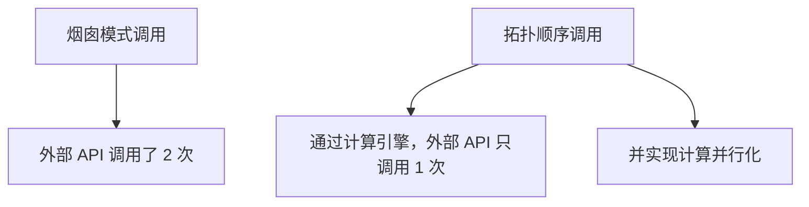
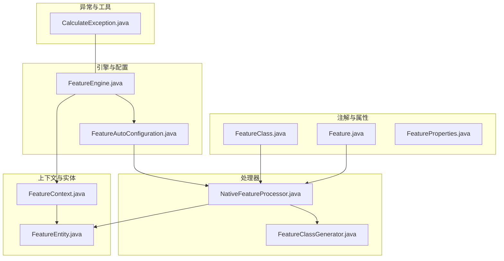
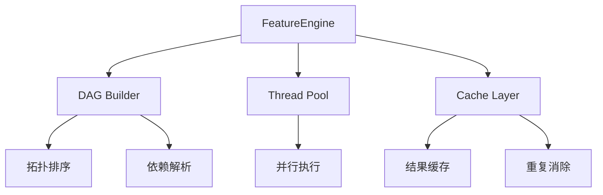
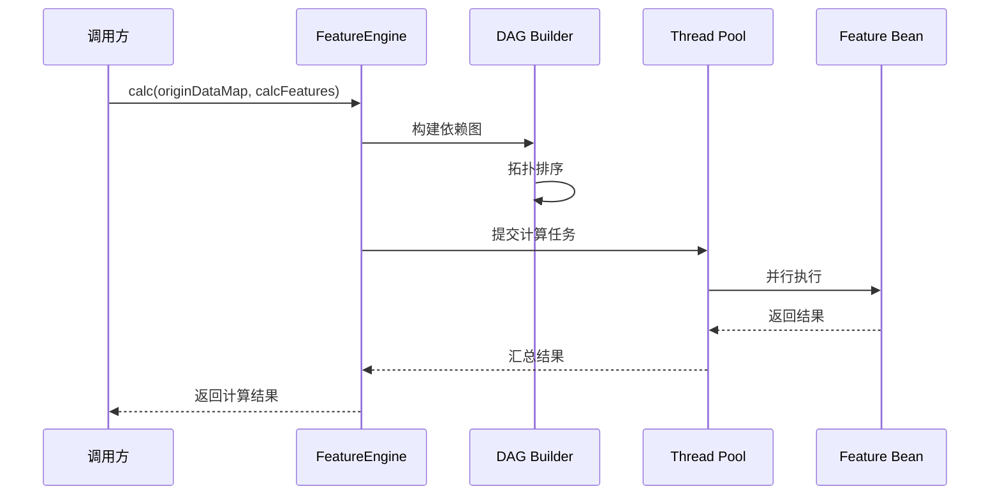
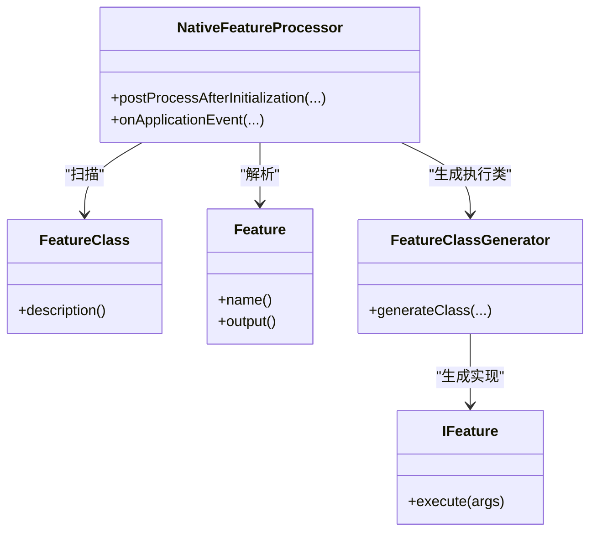
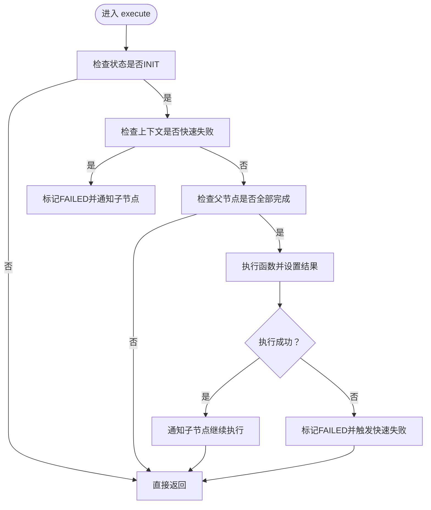
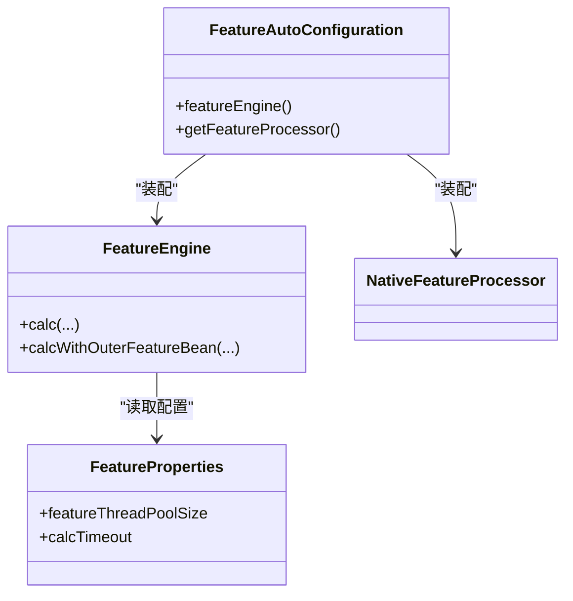
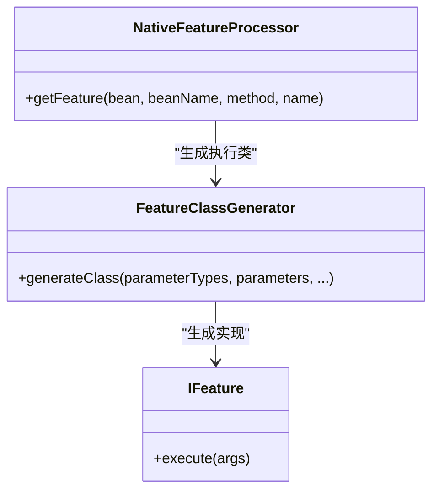
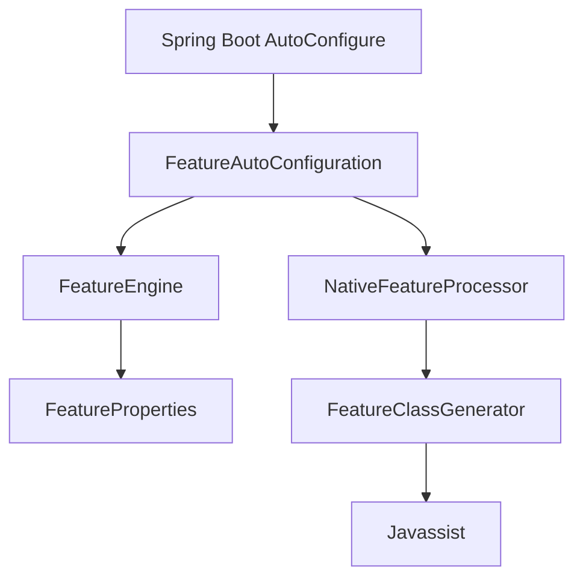

# 项目概述

<cite>
**本文引用的文件**
- [README.md](file://README.md)
- [README.zh.md](file://README.zh.md)
- [pom.xml](file://pom.xml)
- [FeatureEngine.java](file://src/main/java/com/github/zh/engine/FeatureEngine.java)
- [FeatureAutoConfiguration.java](file://src/main/java/com/github/zh/engine/config/FeatureAutoConfiguration.java)
- [Feature.java](file://src/main/java/com/github/zh/engine/annotation/Feature.java)
- [FeatureClass.java](file://src/main/java/com/github/zh/engine/annotation/FeatureClass.java)
- [FeatureContext.java](file://src/main/java/com/github/zh/engine/co/FeatureContext.java)
- [NativeFeatureProcessor.java](file://src/main/java/com/github/zh/engine/processor/NativeFeatureProcessor.java)
- [IFeature.java](file://src/main/java/com/github/zh/engine/clz/IFeature.java)
- [FeatureClassGenerator.java](file://src/main/java/com/github/zh/engine/clz/FeatureClassGenerator.java)
- [FeatureEntity.java](file://src/main/java/com/github/zh/engine/co/FeatureEntity.java)
- [FeatureProperties.java](file://src/main/java/com/github/zh/engine/properties/FeatureProperties.java)
- [CalculateException.java](file://src/main/java/com/github/zh/engine/exception/CalculateException.java)
- [spring.factories](file://src/main/resources/META-INF/spring.factories)
- [Application.java](file://src/test/java/com/github/zh/Application.java)
- [OuterFeatureBean.java](file://src/test/java/com/github/zh/bean/OuterFeatureBean.java)
- [CONTRIBUTING.md](file://CONTRIBUTING.md)
- [CODE_OF_CONDUCT.md](file://CODE_OF_CONDUCT.md)
</cite>

## 更新摘要
**变更内容**
- README.md 已从英文更新为中文，提供完整的中文使用指南
- 简化国际化支持策略，专注于中文文档的完善
- 更新项目介绍和使用说明，确保内容的一致性和准确性
- 移除对英文文档的依赖，集中资源维护中文文档质量

## 目录
1. [引言](#引言)
2. [项目结构](#项目结构)
3. [核心组件](#核心组件)
4. [架构总览](#架构总览)
5. [详细组件分析](#详细组件分析)
6. [依赖分析](#依赖分析)
7. [性能考量](#性能考量)
8. [故障排查指南](#故障排查指南)
9. [社区与贡献](#社区与贡献)
10. [结论](#结论)
11. [附录](#附录)

## 引言
本项目是一个轻量级的"函数计算引擎"，专注于元数据、指标、特征、变量等"无副作用"计算场景。其核心价值在于通过注解驱动的方式，将普通方法声明为可被编排的"函数"，并基于有向无环图（DAG）实现自动并行计算，消除重复调用与串行瓶颈，显著提升计算吞吐与性能。

### 问题背景
对于元数据、指标、特征、变量等**不会导致外部状态变更的计算**来说，本质都是一种函数：通过入参、API 调用、数据库读取，再进行一系列运算加工，生成最终结果。

在传统的"烟囱模式"下，函数集合的运算往往存在：
- 重复的接口调用
- 重复的函数执行  
- 串行执行效率低下

### 解决方案
本引擎通过**DAG（有向无环图）编排**和**并行计算**，实现：
- 消除重复调用
- 自动并行执行
- 轻量级嵌入（Spring Boot Starter）

**章节来源**
- [README.md:11-27](file://README.md#L11-L27)

## 项目结构
项目采用按职责分层的组织方式：注解层、编译期/运行时处理层、上下文与实体层、配置与自动装配层、工具与异常层。核心模块如下：
- 注解与属性：定义函数与类级别的注解，以及配置属性
- 处理器：扫描注解、生成执行体、构建依赖关系
- 上下文与实体：封装一次计算的上下文、任务实体与状态机
- 引擎：对外暴露统一的计算入口，管理线程池与超时控制
- 工具与字节码：基于 Javassist 动态生成函数执行类
- 自动装配：基于 Spring Boot 条件化装配，提供默认实现

**章节来源**
- [pom.xml:1-172](file://pom.xml#L1-L172)
- [spring.factories:1-2](file://src/main/resources/META-INF/spring.factories#L1-L2)

## 核心组件
- 注解体系
  - @Feature：将方法标记为"函数"，支持命名与输出开关
  - @FeatureClass：标记包含函数的类，通常与 Spring 组件注解组合使用
- 处理器
  - NativeFeatureProcessor：扫描带有 @FeatureClass 的类，解析 @Feature 方法，利用 Javassist 生成执行类，构造本地 FeatureBean 并建立父子依赖关系
- 上下文与实体
  - FeatureContext：一次计算的上下文，负责初始化原始数据、构建 DAG、并发调度与结果收集
  - FeatureEntity：单个函数的执行实体，维护状态、父子关系、结果与异常传播
- 引擎
  - FeatureEngine：对外计算入口，封装线程池、超时控制与调试模式，支持仅本地或混合外部 Bean 的计算
- 属性与自动装配
  - FeatureProperties：线程池大小、计算超时等配置项
  - FeatureAutoConfiguration：条件化装配引擎与处理器，默认启用
- 字节码与接口
  - IFeature：动态生成的函数执行接口
  - FeatureClassGenerator：基于 Javassist 生成执行类，桥接原方法调用

**章节来源**
- [Feature.java:1-28](file://src/main/java/com/github/zh/engine/annotation/Feature.java#L1-L28)
- [FeatureClass.java:1-17](file://src/main/java/com/github/zh/engine/annotation/FeatureClass.java#L1-L17)
- [NativeFeatureProcessor.java:1-131](file://src/main/java/com/github/zh/engine/processor/NativeFeatureProcessor.java#L1-L131)
- [FeatureClassGenerator.java:1-82](file://src/main/java/com/github/zh/engine/clz/FeatureClassGenerator.java#L1-L82)
- [IFeature.java:1-17](file://src/main/java/com/github/zh/engine/clz/IFeature.java#L1-L17)
- [FeatureContext.java:1-383](file://src/main/java/com/github/zh/engine/co/FeatureContext.java#L1-L383)
- [FeatureEntity.java:1-214](file://src/main/java/com/github/zh/engine/co/FeatureEntity.java#L1-L214)
- [FeatureEngine.java:1-325](file://src/main/java/com/github/zh/engine/FeatureEngine.java#L1-L325)
- [FeatureProperties.java:1-52](file://src/main/java/com/github/zh/engine/properties/FeatureProperties.java#L1-L52)
- [FeatureAutoConfiguration.java:1-37](file://src/main/java/com/github/zh/engine/config/FeatureAutoConfiguration.java#L1-L37)

## 架构总览
引擎的整体工作流如下：
- 应用启动时，FeatureAutoConfiguration 条件装配 FeatureEngine 与 NativeFeatureProcessor
- NativeFeatureProcessor 扫描 @FeatureClass 类，解析 @Feature 方法，生成 IFeature 实现并通过 FeatureClassGenerator 动态编译
- 用户通过 FeatureEngine.calc(...) 触发计算，FeatureContext 构建 DAG，按拓扑顺序并发执行
- FeatureEntity 负责状态机与依赖满足检测，执行成功后通知子节点继续执行
- 计算完成后，FeatureContext 收集结果并返回

**章节来源**
- [README.md:47-57](file://README.md#L47-L57)

**章节来源**
- [README.md:61-77](file://README.md#L61-L77)

## 详细组件分析

### 注解驱动的函数声明
- @FeatureClass 标记包含函数的类，常与 Spring 组件注解组合使用
- @Feature 标记函数方法，name 决定函数名，output 控制是否纳入最终结果
- 处理器解析方法签名与参数名，结合 @Property 等扩展属性，构建 FeatureBean

**章节来源**
- [FeatureClass.java:1-17](file://src/main/java/com/github/zh/engine/annotation/FeatureClass.java#L1-L17)
- [Feature.java:1-28](file://src/main/java/com/github/zh/engine/annotation/Feature.java#L1-L28)
- [NativeFeatureProcessor.java:28-131](file://src/main/java/com/github/zh/engine/processor/NativeFeatureProcessor.java#L28-L131)
- [FeatureClassGenerator.java:11-82](file://src/main/java/com/github/zh/engine/clz/FeatureClassGenerator.java#L11-L82)
- [IFeature.java:1-17](file://src/main/java/com/github/zh/engine/clz/IFeature.java#L1-L17)

### 上下文与实体：DAG 并行执行
- FeatureContext 负责：
  - 注入原始数据（ORIGIN_DATA）
  - 构建本地/外部函数实体（NATIVE_FEATURE/OUTER_FEATURE）
  - 补全中间依赖，形成 DAG
  - 使用 CountDownLatch 与线程池并发执行，支持超时与快速失败
- FeatureEntity 负责：
  - 状态机（INIT → PROCESSING → SUCCESS/FAILED）
  - 参数就绪检查与错误传播
  - 执行函数并将结果传递给子节点

**章节来源**
- [FeatureEntity.java:48-134](file://src/main/java/com/github/zh/engine/co/FeatureEntity.java#L48-L134)
- [FeatureContext.java:49-90](file://src/main/java/com/github/zh/engine/co/FeatureContext.java#L49-L90)

### 引擎与自动装配
- FeatureEngine 提供统一计算入口，支持：
  - 仅本地函数计算
  - 混合外部函数 Bean 计算
  - 超时控制、调试模式与线程池定制
- FeatureAutoConfiguration 在满足条件时自动装配 FeatureEngine 与 NativeFeatureProcessor，并启用 FeatureProperties

**章节来源**
- [FeatureEngine.java:29-172](file://src/main/java/com/github/zh/engine/FeatureEngine.java#L29-L172)
- [FeatureAutoConfiguration.java:19-36](file://src/main/java/com/github/zh/engine/config/FeatureAutoConfiguration.java#L19-L36)
- [FeatureProperties.java:13-52](file://src/main/java/com/github/zh/engine/properties/FeatureProperties.java#L13-L52)

### 字节码生成与函数执行
- IFeature 定义统一的执行接口
- FeatureClassGenerator 基于 Javassist 将原方法包装为可执行类，桥接参数数组与真实方法调用
- NativeFeatureProcessor 在运行时生成 IFeature 实例并注入 FeatureContext

**章节来源**
- [IFeature.java:1-17](file://src/main/java/com/github/zh/engine/clz/IFeature.java#L1-L17)
- [FeatureClassGenerator.java:11-82](file://src/main/java/com/github/zh/engine/clz/FeatureClassGenerator.java#L11-L82)
- [NativeFeatureProcessor.java:113-124](file://src/main/java/com/github/zh/engine/processor/NativeFeatureProcessor.java#L113-L124)

## 依赖分析
- 技术栈与版本
  - JDK 8+：保证注解参数名保留与基础并发能力
  - Spring Boot 2.x：自动装配与条件化配置
  - Javassist：运行时字节码生成，避免手写样板代码
  - SLF4J：日志门面，便于集成各类日志实现
- 外部依赖与集成点
  - Spring Boot 自动装配机制通过 spring.factories 与 @EnableConfigurationProperties 集成
  - 线程池与超时控制由 FeatureProperties 驱动，FeatureEngine 默认创建线程池并在需要时可替换

**章节来源**
- [spring.factories:1-2](file://src/main/resources/META-INF/spring.factories#L1-L2)
- [FeatureAutoConfiguration.java:19-36](file://src/main/java/com/github/zh/engine/config/FeatureAutoConfiguration.java#L19-L36)
- [FeatureEngine.java:163-170](file://src/main/java/com/github/zh/engine/FeatureEngine.java#L163-L170)
- [FeatureClassGenerator.java:3-25](file://src/main/java/com/github/zh/engine/clz/FeatureClassGenerator.java#L3-L25)

## 性能考量
- 并行化与去重
  - 通过 DAG 拓扑排序，确保仅在依赖满足时执行，避免重复计算
  - 使用线程池并发执行多个独立节点，线程数默认为核心数×2，可配置
- 超时与快速失败
  - 支持全局超时控制，任一节点失败将触发快速失败，减少无效计算
- I/O 优化
  - 通过合并外部调用与缓存中间结果，降低网络与数据库压力
- 线程模型
  - 使用 CompletableFuture 与 CountDownLatch 协调执行与收尾，避免阻塞等待

**章节来源**
- [FeatureEngine.java:163-170](file://src/main/java/com/github/zh/engine/FeatureEngine.java#L163-L170)
- [FeatureContext.java:49-61](file://src/main/java/com/github/zh/engine/co/FeatureContext.java#L49-L61)
- [FeatureEntity.java:61-122](file://src/main/java/com/github/zh/engine/co/FeatureEntity.java#L61-L122)

## 故障排查指南
- 常见异常
  - CalculateException：计算超时、无变量需计算、循环依赖（当前注释掉的环分析逻辑）等
- 排查步骤
  - 开启调试模式查看完整结果，定位 FAILED 节点
  - 检查父节点是否全部完成且状态为 SUCCESS
  - 关注快速失败路径，确认是否存在任一父节点失败导致整条链路失败
- 配置建议
  - 合理设置线程池大小与计算超时，避免过小导致阻塞或过大导致资源争用
  - 如遇参数名缺失问题，确保编译插件开启 -parameters 参数

**章节来源**
- [CalculateException.java:1-19](file://src/main/java/com/github/zh/engine/exception/CalculateException.java#L1-L19)
- [FeatureContext.java:133-139](file://src/main/java/com/github/zh/engine/co/FeatureContext.java#L133-L139)
- [FeatureEntity.java:82-116](file://src/main/java/com/github/zh/engine/co/FeatureEntity.java#L82-L116)

## 社区与贡献

### 开源协议
项目采用 AGPL-3.0 开源许可证，确保代码的自由使用和修改权利。

### 贡献指南
- **开发环境**：JDK 8、Maven 3.6+、Git
- **编译配置**：必须启用 `-parameters` 编译参数以保留方法参数名
- **代码标准**：遵循英文注释规范，使用清晰简洁的语言
- **测试要求**：所有新功能必须包含相应的单元测试

### 行为准则
项目遵循 Contributor Covenant 行为准则，致力于营造包容、多元、健康的开源社区环境。

### 社区支持
- GitHub Issues：用于报告 Bug 和功能请求
- GitHub Discussions：用于社区讨论和技术交流
- 代码贡献：欢迎通过 Pull Request 方式参与项目开发

**章节来源**
- [CONTRIBUTING.md:1-203](file://CONTRIBUTING.md#L1-L203)
- [CODE_OF_CONDUCT.md:1-134](file://CODE_OF_CONDUCT.md#L1-L134)

## 结论
本项目通过注解驱动与运行时字节码生成，将函数声明与编排自动化，结合 DAG 与并行执行，有效解决了传统烟囱式调用中的重复与串行问题。其轻量级设计与 Spring Boot Starter 形式，使得在微服务与数据平台中快速落地成为可能。

**简化的国际化支持策略**使项目更加专注和高效，通过完善的中文文档，为国内开发者提供了更好的使用体验。建议在复杂依赖场景下谨慎处理循环依赖，并通过配置与监控保障稳定性与性能。

## 附录
- 快速开始与示例
  - 依赖引入与编译参数配置
  - 使用 @FeatureClass 与 @Feature 声明函数
  - 通过 FeatureEngine.calc(...) 触发计算
- 外部 Bean 扩展
  - 通过继承 AbstractFeatureBean 自定义外部计算 Bean
  - 使用 calcWithOuterFeatureBean(...) 混合外部 Bean 计算
- 文档资源
  - 中文文档：README.md
  - 贡献指南：CONTRIBUTING.md
  - 行为准则：CODE_OF_CONDUCT.md

**章节来源**
- [README.md:81-151](file://README.md#L81-L151)
- [OuterFeatureBean.java:1-16](file://src/test/java/com/github/zh/bean/OuterFeatureBean.java#L1-L16)
- [Application.java:1-18](file://src/test/java/com/github/zh/Application.java#L1-L18)