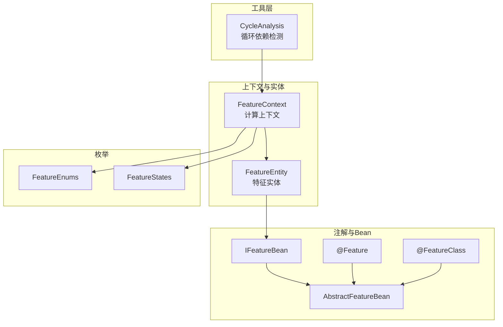
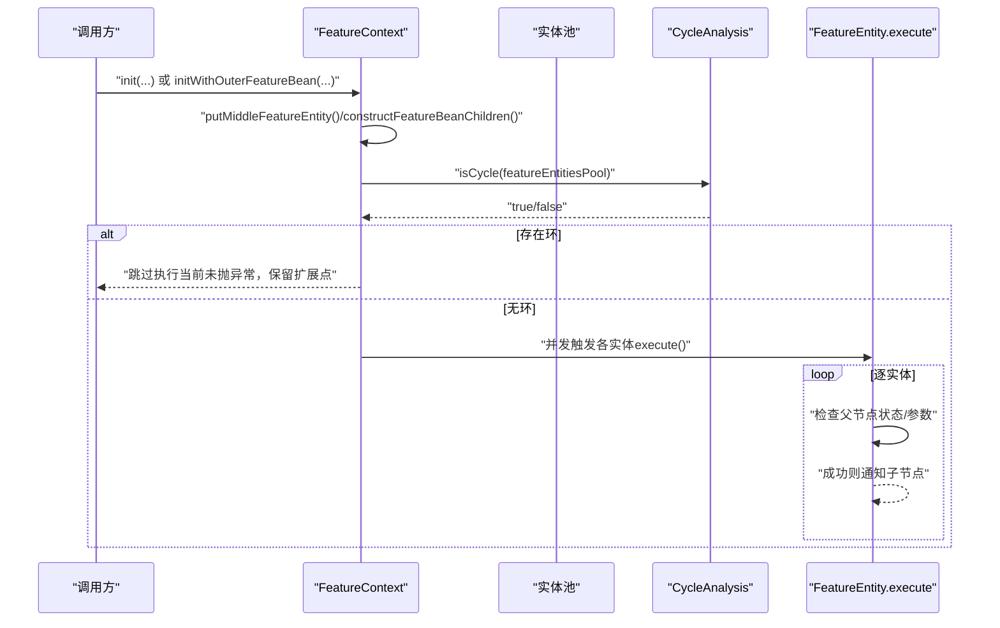
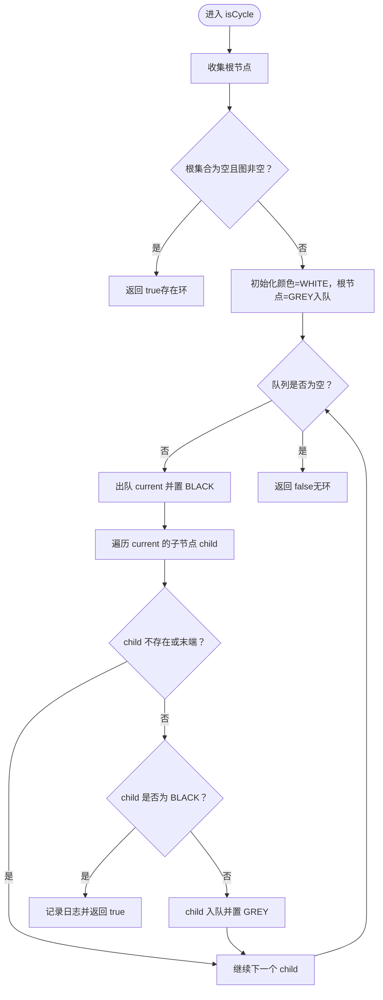
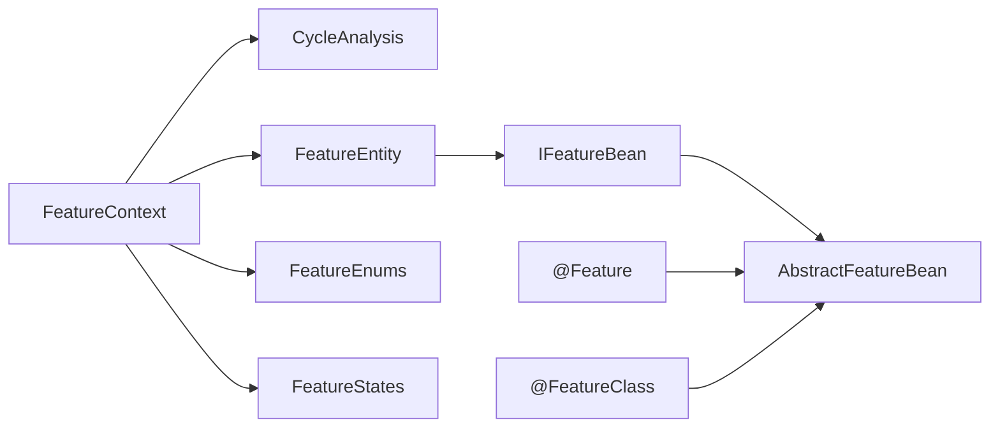

# 循环依赖处理

<cite>
**本文引用的文件**
- [CycleAnalysis.java](file://src/main/java/com/github/zh/engine/tools/CycleAnalysis.java)
- [FeatureContext.java](file://src/main/java/com/github/zh/engine/co/FeatureContext.java)
- [FeatureEntity.java](file://src/main/java/com/github/zh/engine/co/FeatureEntity.java)
- [Feature.java](file://src/main/java/com/github/zh/engine/annotation/Feature.java)
- [FeatureClass.java](file://src/main/java/com/github/zh/engine/annotation/FeatureClass.java)
- [IFeatureBean.java](file://src/main/java/com/github/zh/engine/co/IFeatureBean.java)
- [AbstractFeatureBean.java](file://src/main/java/com/github/zh/engine/co/AbstractFeatureBean.java)
- [FeatureEnums.java](file://src/main/java/com/github/zh/engine/enums/FeatureEnums.java)
- [FeatureStates.java](file://src/main/java/com/github/zh/engine/enums/FeatureStates.java)
- [README.md](file://README.md)
- [MainTest.java](file://src/test/java/com/github/zh/MainTest.java)
- [Test.java](file://src/test/java/com/github/zh/feature/Test.java)
</cite>

## 目录
1. [引言](#引言)
2. [项目结构](#项目结构)
3. [核心组件](#核心组件)
4. [架构总览](#架构总览)
5. [详细组件分析](#详细组件分析)
6. [依赖分析](#依赖分析)
7. [性能考虑](#性能考虑)
8. [故障排查指南](#故障排查指南)
9. [结论](#结论)
10. [附录](#附录)

## 引言
本文件聚焦于“循环依赖处理”，系统性阐述以下内容：
- 循环依赖检测算法的实现原理与当前版本的局限性
- DFS着色法（白/灰/黑）在代码中的具体步骤与实现细节
- CycleAnalysis工具类的使用方法：isCycle方法的参数、返回值与使用场景
- 循环依赖的常见表现与识别方式（直接与间接）
- 设计阶段规避循环依赖的最佳实践与设计原则
- 在特征设计中避免循环依赖的实际示例路径

## 项目结构
该项目是一个轻量级函数计算引擎，围绕“特征”（Feature）进行DAG编排与并行计算。循环依赖检测位于工具层，上下文层负责构建依赖图并在初始化阶段进行检测。

图表来源
- [CycleAnalysis.java:1-72](file://src/main/java/com/github/zh/engine/tools/CycleAnalysis.java#L1-L72)
- [FeatureContext.java:1-298](file://src/main/java/com/github/zh/engine/co/FeatureContext.java#L1-L298)
- [FeatureEntity.java:1-155](file://src/main/java/com/github/zh/engine/co/FeatureEntity.java#L1-L155)
- [Feature.java:1-28](file://src/main/java/com/github/zh/engine/annotation/Feature.java#L1-L28)
- [FeatureClass.java:1-17](file://src/main/java/com/github/zh/engine/annotation/FeatureClass.java#L1-L17)
- [IFeatureBean.java:1-20](file://src/main/java/com/github/zh/engine/co/IFeatureBean.java#L1-L20)
- [AbstractFeatureBean.java:1-28](file://src/main/java/com/github/zh/engine/co/AbstractFeatureBean.java#L1-L28)
- [FeatureEnums.java:1-26](file://src/main/java/com/github/zh/engine/enums/FeatureEnums.java#L1-L26)
- [FeatureStates.java:1-33](file://src/main/java/com/github/zh/engine/enums/FeatureStates.java#L1-L33)

章节来源
- [README.md:162](file://README.md#L162)

## 核心组件
- CycleAnalysis：提供isCycle方法，基于DFS着色法检测有向图是否存在环。
- FeatureContext：构建特征实体池，组装依赖关系，预留环分析入口。
- FeatureEntity：承载单个特征的执行状态、父子依赖、结果与异常传播。
- 注解与Bean：通过注解声明特征，抽象Bean模型用于封装依赖与执行逻辑。
- 枚举：FeatureEnums与FeatureStates用于区分实体类型与状态流转。

章节来源
- [CycleAnalysis.java:25-59](file://src/main/java/com/github/zh/engine/tools/CycleAnalysis.java#L25-L59)
- [FeatureContext.java:133-139](file://src/main/java/com/github/zh/engine/co/FeatureContext.java#L133-L139)
- [FeatureEntity.java:48-123](file://src/main/java/com/github/zh/engine/co/FeatureEntity.java#L48-L123)
- [Feature.java:19](file://src/main/java/com/github/zh/engine/annotation/Feature.java#L19)
- [FeatureClass.java:14](file://src/main/java/com/github/zh/engine/annotation/FeatureClass.java#L14)
- [IFeatureBean.java:18](file://src/main/java/com/github/zh/engine/co/IFeatureBean.java#L18)
- [AbstractFeatureBean.java:20-26](file://src/main/java/com/github/zh/engine/co/AbstractFeatureBean.java#L20-L26)
- [FeatureEnums.java:9-25](file://src/main/java/com/github/zh/engine/enums/FeatureEnums.java#L9-L25)
- [FeatureStates.java:9-31](file://src/main/java/com/github/zh/engine/enums/FeatureStates.java#L9-L31)

## 架构总览
引擎以FeatureContext为中心，将输入数据、本地特征与外部特征统一建模为FeatureEntity，形成有向依赖图。初始化时通过CycleAnalysis进行环检测；执行阶段按拓扑序并行推进，状态机驱动成功/失败传播。

图表来源
- [FeatureContext.java:71-127](file://src/main/java/com/github/zh/engine/co/FeatureContext.java#L71-L127)
- [FeatureContext.java:133-139](file://src/main/java/com/github/zh/engine/co/FeatureContext.java#L133-L139)
- [CycleAnalysis.java:25-59](file://src/main/java/com/github/zh/engine/tools/CycleAnalysis.java#L25-L59)
- [FeatureEntity.java:48-123](file://src/main/java/com/github/zh/engine/co/FeatureEntity.java#L48-L123)

## 详细组件分析

### CycleAnalysis：DFS着色法实现
- 数据结构
  - 顶点颜色：WHITE/GREY/BLACK三色标记
  - 节点队列：广度优先遍历（BFS）辅助
  - 根节点集合：父集为空或末端状态的节点作为起点
- 算法流程
  1) 初始化所有节点为WHITE，根节点染为GREY入队
  2) 弹出队首节点current，标记BLACK
  3) 遍历current的子节点child：
     - 若child不存在或其状态为末端，则跳过
     - 若child为BLACK，判定存在环并返回true
     - 否则child入队并标记GREY
  4) 队列空仍未发现BLACK边，则返回false
- 关键点
  - “BLACK边”即回边：从当前搜索树指向已完全处理节点的边，是环存在的充分条件
  - 根节点选择策略：父集为空或末端状态的节点作为起点，有助于覆盖孤立环
  - 当前版本未抛异常，仅返回布尔值，保留扩展点

图表来源
- [CycleAnalysis.java:25-59](file://src/main/java/com/github/zh/engine/tools/CycleAnalysis.java#L25-L59)

章节来源
- [CycleAnalysis.java:25-59](file://src/main/java/com/github/zh/engine/tools/CycleAnalysis.java#L25-L59)

### FeatureContext：依赖图构建与环分析预留
- 依赖图构建
  - 将输入数据、本地特征、外部特征统一建模为FeatureEntity并放入池
  - 对外部特征场景，会重建父子关系以保证依赖完整性
- 环分析
  - 提供cycleAnalysis()预留实现，当前版本未启用异常抛出
- 执行控制
  - 通过CountDownLatch与线程池并发执行实体
  - 支持超时与快速失败策略

章节来源
- [FeatureContext.java:71-127](file://src/main/java/com/github/zh/engine/co/FeatureContext.java#L71-L127)
- [FeatureContext.java:133-139](file://src/main/java/com/github/zh/engine/co/FeatureContext.java#L133-L139)
- [FeatureContext.java:141-151](file://src/main/java/com/github/zh/engine/co/FeatureContext.java#L141-L151)

### FeatureEntity：状态机与依赖传播
- 状态机
  - INIT → PROCESSING → SUCCESS/FAILED
  - END状态（SUCCESS/FAILED）用于剪枝与依赖满足判断
- 参数准备与错误传播
  - 仅当所有父节点均处于END状态时才进入计算
  - 任一父节点失败时，当前节点标记失败并向上游传播
- 并发执行
  - 计算完成后异步通知子节点继续执行

章节来源
- [FeatureEntity.java:48-123](file://src/main/java/com/github/zh/engine/co/FeatureEntity.java#L48-L123)
- [FeatureStates.java:28-31](file://src/main/java/com/github/zh/engine/enums/FeatureStates.java#L28-L31)

### 注解与Bean：特征声明与依赖建模
- @FeatureClass与@Feature用于声明特征函数及其名称与输出属性
- IFeatureBean/AbstractFeatureBean封装了name、parents、children等依赖信息
- 通过注解解析与Bean装配，形成特征函数的依赖关系图

章节来源
- [Feature.java:19](file://src/main/java/com/github/zh/engine/annotation/Feature.java#L19)
- [FeatureClass.java:14](file://src/main/java/com/github/zh/engine/annotation/FeatureClass.java#L14)
- [IFeatureBean.java:18](file://src/main/java/com/github/zh/engine/co/IFeatureBean.java#L18)
- [AbstractFeatureBean.java:20-26](file://src/main/java/com/github/zh/engine/co/AbstractFeatureBean.java#L20-L26)

## 依赖分析
- 组件耦合
  - FeatureContext依赖CycleAnalysis进行环检测，但当前未强制抛异常
  - FeatureEntity依赖FeatureContext与FeatureBean，形成状态与执行闭环
  - 注解与Bean层为上层提供声明式依赖建模能力
- 外部依赖
  - Spring环境下的Bean生命周期与装配（测试用例体现）

图表来源
- [FeatureContext.java:6-14](file://src/main/java/com/github/zh/engine/co/FeatureContext.java#L6-L14)
- [FeatureEntity.java:33-46](file://src/main/java/com/github/zh/engine/co/FeatureEntity.java#L33-L46)
- [Feature.java:9-12](file://src/main/java/com/github/zh/engine/annotation/Feature.java#L9-L12)
- [FeatureClass.java:9-12](file://src/main/java/com/github/zh/engine/annotation/FeatureClass.java#L9-L12)
- [FeatureEnums.java:9-25](file://src/main/java/com/github/zh/engine/enums/FeatureEnums.java#L9-L25)
- [FeatureStates.java:9-31](file://src/main/java/com/github/zh/engine/enums/FeatureStates.java#L9-L31)

章节来源
- [FeatureContext.java:6-14](file://src/main/java/com/github/zh/engine/co/FeatureContext.java#L6-L14)
- [FeatureEntity.java:33-46](file://src/main/java/com/github/zh/engine/co/FeatureEntity.java#L33-L46)
- [Feature.java:9-12](file://src/main/java/com/github/zh/engine/annotation/Feature.java#L9-L12)
- [FeatureClass.java:9-12](file://src/main/java/com/github/zh/engine/annotation/FeatureClass.java#L9-L12)
- [FeatureEnums.java:9-25](file://src/main/java/com/github/zh/engine/enums/FeatureEnums.java#L9-L25)
- [FeatureStates.java:9-31](file://src/main/java/com/github/zh/engine/enums/FeatureStates.java#L9-L31)

## 性能考虑
- 并行执行：FeatureContext通过线程池并发调度FeatureEntity，提升吞吐
- 状态机剪枝：END状态节点不再重复执行，减少无效开销
- BFS+着色：CycleAnalysis以O(V+E)复杂度检测环，适合中等规模依赖图
- 建议
  - 控制依赖深度与宽度，避免过深的链式依赖导致级联失败
  - 合理设置线程池大小与超时阈值，平衡吞吐与资源占用

## 故障排查指南
- 环检测未生效
  - 现象：存在环但未抛异常
  - 原因：FeatureContext中cycleAnalysis()为预留实现，默认不抛异常
  - 处理：启用isCycle返回值并显式抛出异常，或在业务层拦截
- 依赖缺失
  - 现象：执行时报缺少特征或输入参数
  - 原因：依赖图中存在上游节点不在池内
  - 处理：检查parents声明与Bean注册，确保依赖完整
- 快速失败
  - 现象：任一节点失败导致后续节点快速失败
  - 原因：FeatureEntity在父节点失败时标记自身失败并传播
  - 处理：定位根失败节点，修复上游逻辑

章节来源
- [FeatureContext.java:133-139](file://src/main/java/com/github/zh/engine/co/FeatureContext.java#L133-L139)
- [FeatureContext.java:234-238](file://src/main/java/com/github/zh/engine/co/FeatureContext.java#L234-L238)
- [FeatureEntity.java:80-89](file://src/main/java/com/github/zh/engine/co/FeatureEntity.java#L80-L89)
- [FeatureEntity.java:266-275](file://src/main/java/com/github/zh/engine/co/FeatureEntity.java#L266-L275)

## 结论
- 当前版本采用DFS着色法实现环检测，算法正确但未在运行期强制中断
- 循环依赖的根本原因在于有向图中存在回边，需在设计阶段通过分层与依赖规划规避
- 建议在业务层启用isCycle返回值并结合FeatureContext的预留实现，形成“可配置”的环检测策略

## 附录

### CycleAnalysis使用说明
- 方法签名与参数
  - isCycle(Map<String, FeatureEntity> featureEntityGraph)
  - 参数：特征实体映射（键为特征名，值为FeatureEntity）
- 返回值
  - true：存在环
  - false：无环
- 使用场景
  - 初始化阶段：在FeatureContext.init/initWithOuterFeatureBean之后调用
  - 外部扩展：结合业务规则决定是否中断执行或降级处理

章节来源
- [CycleAnalysis.java:25-59](file://src/main/java/com/github/zh/engine/tools/CycleAnalysis.java#L25-L59)
- [FeatureContext.java:133-139](file://src/main/java/com/github/zh/engine/co/FeatureContext.java#L133-L139)

### 循环依赖的常见表现与识别
- 直接循环依赖
  - 表现：A依赖B，B又依赖A
  - 识别：isCycle返回true；日志中出现环节点提示
- 间接循环依赖
  - 表现：A→B→C→A
  - 识别：同样isCycle返回true；可通过根节点集合为空且图非空的前置判断快速发现
- 实战建议
  - 在特征设计初期绘制依赖草图，避免形成环
  - 对复杂依赖，拆分为中间态特征或引入原始数据节点打断环

章节来源
- [CycleAnalysis.java:27-29](file://src/main/java/com/github/zh/engine/tools/CycleAnalysis.java#L27-L29)
- [README.md:162](file://README.md#L162)

### 设计阶段避免循环依赖的最佳实践
- 分层设计
  - 将特征划分为输入层、中间态层、输出层，只允许向下依赖
- 依赖规划
  - 明确parents与children，避免双向或交叉依赖
- 原始数据打断环
  - 在环中任意节点注入原始数据，使其成为根节点，破坏环结构
- 单向依赖
  - 严格遵循“自顶向下”或“自左向右”的依赖方向

章节来源
- [README.md:162](file://README.md#L162)

### 特征设计中避免循环依赖的示例路径
- 基础特征示例（展示依赖声明与输出控制）
  - 示例路径：[Test.java:36-56](file://src/test/java/com/github/zh/feature/Test.java#L36-L56)
- 外部Bean示例（展示parents/children与输出控制）
  - 示例路径：[MainTest.java:35-45](file://src/test/java/com/github/zh/MainTest.java#L35-L45)
- 注解与Bean模型
  - 示例路径：[@Feature](file://src/main/java/com/github/zh/engine/annotation/Feature.java#L19)，[@FeatureClass](file://src/main/java/com/github/zh/engine/annotation/FeatureClass.java#L14)，[IFeatureBean](file://src/main/java/com/github/zh/engine/co/IFeatureBean.java#L18)，[AbstractFeatureBean:20-26](file://src/main/java/com/github/zh/engine/co/AbstractFeatureBean.java#L20-L26)

章节来源
- [Test.java:36-56](file://src/test/java/com/github/zh/feature/Test.java#L36-L56)
- [MainTest.java:35-45](file://src/test/java/com/github/zh/MainTest.java#L35-L45)
- [Feature.java:19](file://src/main/java/com/github/zh/engine/annotation/Feature.java#L19)
- [FeatureClass.java:14](file://src/main/java/com/github/zh/engine/annotation/FeatureClass.java#L14)
- [IFeatureBean.java:18](file://src/main/java/com/github/zh/engine/co/IFeatureBean.java#L18)
- [AbstractFeatureBean.java:20-26](file://src/main/java/com/github/zh/engine/co/AbstractFeatureBean.java#L20-L26)