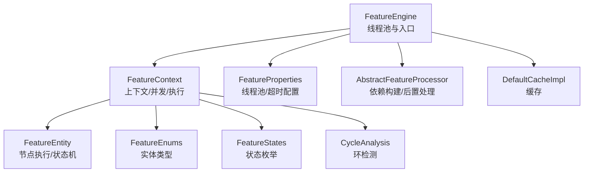
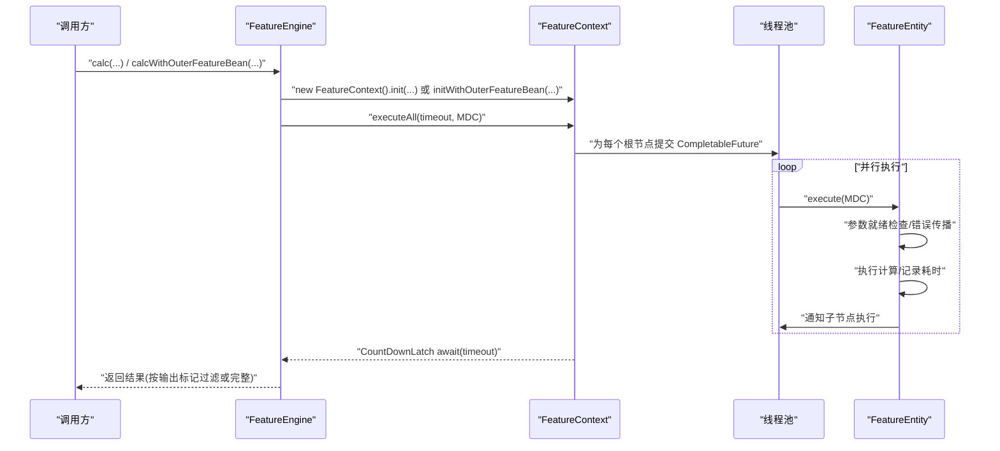
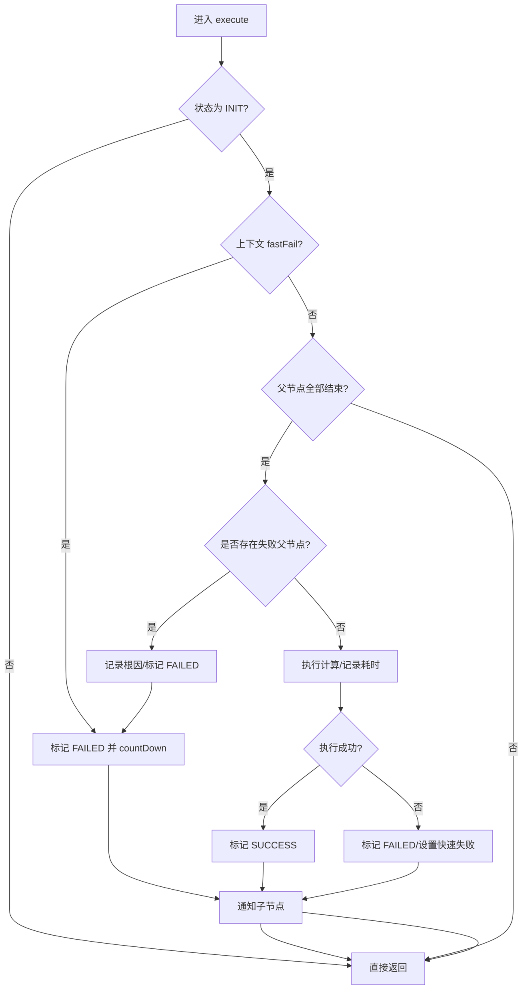
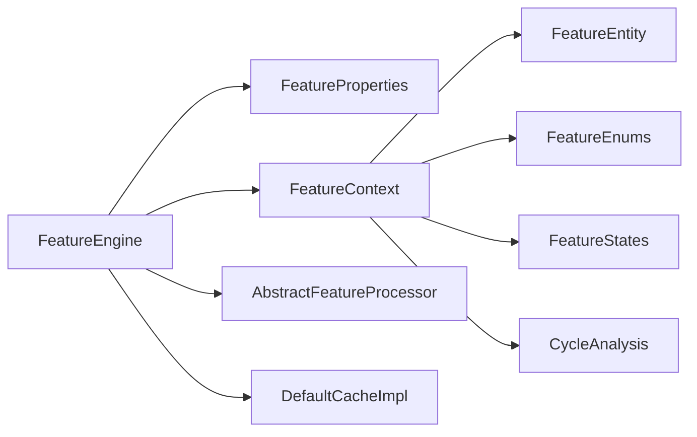

# 性能优化

<cite>
**本文引用的文件**
- [FeatureEngine.java](file://src/main/java/com/github/zh/engine/FeatureEngine.java)
- [FeatureContext.java](file://src/main/java/com/github/zh/engine/co/FeatureContext.java)
- [FeatureEntity.java](file://src/main/java/com/github/zh/engine/co/FeatureEntity.java)
- [FeatureProperties.java](file://src/main/java/com/github/zh/engine/properties/FeatureProperties.java)
- [FeatureEnums.java](file://src/main/java/com/github/zh/engine/enums/FeatureEnums.java)
- [FeatureStates.java](file://src/main/java/com/github/zh/engine/enums/FeatureStates.java)
- [AbstractFeatureProcessor.java](file://src/main/java/com/github/zh/engine/processor/AbstractFeatureProcessor.java)
- [DefaultCacheImpl.java](file://src/main/java/com/github/zh/engine/cache/DefaultCacheImpl.java)
- [CycleAnalysis.java](file://src/main/java/com/github/zh/engine/tools/CycleAnalysis.java)
- [application.yml](file://src/test/resources/application.yml)
- [pom.xml](file://pom.xml)
- [README.md](file://README.md)
</cite>

## 目录
1. [简介](#简介)
2. [项目结构](#项目结构)
3. [核心组件](#核心组件)
4. [架构总览](#架构总览)
5. [详细组件分析](#详细组件分析)
6. [依赖分析](#依赖分析)
7. [性能考量](#性能考量)
8. [故障排查指南](#故障排查指南)
9. [结论](#结论)
10. [附录](#附录)

## 简介
本指南聚焦于特征计算引擎的性能优化，围绕并行度调优、内存管理、计算效率提升展开，重点剖析 FeatureEngine 与 FeatureContext 的性能特性与优化要点，涵盖线程池配置、任务调度策略、资源回收机制；同时给出性能监控与分析方法、大规模场景下的批处理/增量/预计算策略、内存使用优化技巧以及性能测试与基准案例建议。

## 项目结构
- 引擎入口与线程池：FeatureEngine 负责对外暴露计算 API，并在未注入线程池时按配置创建默认线程池。
- 计算上下文：FeatureContext 维护一次请求的上下文、并发控制、DAG 构建与执行、结果收集与错误传播。
- 计算实体：FeatureEntity 表示单个特征节点，负责状态机、参数就绪检查、执行与子节点通知。
- 配置与枚举：FeatureProperties 提供线程池大小与超时时间等关键参数；FeatureEnums/FeatureStates 描述实体类型与状态。
- 处理器与缓存：AbstractFeatureProcessor 负责构建依赖关系与后置处理；DefaultCacheImpl 提供简单缓存能力。
- 工具：CycleAnalysis 提供环检测工具（当前默认注释掉调用）。

图表来源
- [FeatureEngine.java:29-171](file://src/main/java/com/github/zh/engine/FeatureEngine.java#L29-L171)
- [FeatureContext.java:23-297](file://src/main/java/com/github/zh/engine/co/FeatureContext.java#L23-L297)
- [FeatureEntity.java:27-154](file://src/main/java/com/github/zh/engine/co/FeatureEntity.java#L27-L154)
- [FeatureProperties.java:16-36](file://src/main/java/com/github/zh/engine/properties/FeatureProperties.java#L16-L36)
- [FeatureEnums.java:9-25](file://src/main/java/com/github/zh/engine/enums/FeatureEnums.java#L9-L25)
- [FeatureStates.java:9-32](file://src/main/java/com/github/zh/engine/enums/FeatureStates.java#L9-L32)
- [AbstractFeatureProcessor.java:17-52](file://src/main/java/com/github/zh/engine/processor/AbstractFeatureProcessor.java#L17-L52)
- [DefaultCacheImpl.java:13-31](file://src/main/java/com/github/zh/engine/cache/DefaultCacheImpl.java#L13-L31)
- [CycleAnalysis.java:18-71](file://src/main/java/com/github/zh/engine/tools/CycleAnalysis.java#L18-L71)

章节来源
- [FeatureEngine.java:29-171](file://src/main/java/com/github/zh/engine/FeatureEngine.java#L29-L171)
- [FeatureContext.java:23-297](file://src/main/java/com/github/zh/engine/co/FeatureContext.java#L23-L297)
- [FeatureEntity.java:27-154](file://src/main/java/com/github/zh/engine/co/FeatureEntity.java#L27-L154)
- [FeatureProperties.java:16-36](file://src/main/java/com/github/zh/engine/properties/FeatureProperties.java#L16-L36)
- [FeatureEnums.java:9-25](file://src/main/java/com/github/zh/engine/enums/FeatureEnums.java#L9-L25)
- [FeatureStates.java:9-32](file://src/main/java/com/github/zh/engine/enums/FeatureStates.java#L9-L32)
- [AbstractFeatureProcessor.java:17-52](file://src/main/java/com/github/zh/engine/processor/AbstractFeatureProcessor.java#L17-L52)
- [DefaultCacheImpl.java:13-31](file://src/main/java/com/github/zh/engine/cache/DefaultCacheImpl.java#L13-L31)
- [CycleAnalysis.java:18-71](file://src/main/java/com/github/zh/engine/tools/CycleAnalysis.java#L18-L71)

## 核心组件
- FeatureEngine
  - 提供多组 calc 与 calcWithOuterFeatureBean API，统一初始化 FeatureContext 并触发 executeAll。
  - 在未注入线程池时，基于 FeatureProperties 创建 ThreadPoolExecutor，默认核心/最大线程数为 CPU 核心数×2。
  - 支持超时控制与调试模式返回完整结果。
- FeatureContext
  - 维护 FeatureEntity 池、线程池、倒计时锁，负责上下文初始化、DAG 构建、执行与结果收集。
  - 通过 CompletableFuture 并行调度所有根节点，使用 CountDownLatch 等待全部完成。
  - 支持外部 Bean 注入与依赖重建，具备快速失败与错误根因定位能力。
- FeatureEntity
  - 单节点状态机：INIT → PROCESSING → SUCCESS/FAILED。
  - 参数就绪检查、错误传播、子节点异步通知、StopWatch 计时。
- FeatureProperties
  - 线程池大小、最大线程数、计算超时时间的默认值与配置项。
- FeatureEnums/FeatureStates
  - 实体类型与状态枚举，支撑 DAG 与状态流转。
- AbstractFeatureProcessor/DefaultCacheImpl
  - 依赖关系构建与后置处理；简单缓存实现，可用于去重或结果缓存。

章节来源
- [FeatureEngine.java:49-161](file://src/main/java/com/github/zh/engine/FeatureEngine.java#L49-L161)
- [FeatureEngine.java:163-171](file://src/main/java/com/github/zh/engine/FeatureEngine.java#L163-L171)
- [FeatureContext.java:49-90](file://src/main/java/com/github/zh/engine/co/FeatureContext.java#L49-L90)
- [FeatureContext.java:100-127](file://src/main/java/com/github/zh/engine/co/FeatureContext.java#L100-L127)
- [FeatureEntity.java:48-134](file://src/main/java/com/github/zh/engine/co/FeatureEntity.java#L48-L134)
- [FeatureProperties.java:16-36](file://src/main/java/com/github/zh/engine/properties/FeatureProperties.java#L16-L36)
- [FeatureEnums.java:9-25](file://src/main/java/com/github/zh/engine/enums/FeatureEnums.java#L9-L25)
- [FeatureStates.java:9-32](file://src/main/java/com/github/zh/engine/enums/FeatureStates.java#L9-L32)
- [AbstractFeatureProcessor.java:17-52](file://src/main/java/com/github/zh/engine/processor/AbstractFeatureProcessor.java#L17-L52)
- [DefaultCacheImpl.java:13-31](file://src/main/java/com/github/zh/engine/cache/DefaultCacheImpl.java#L13-L31)

## 架构总览
引擎采用“上下文驱动 + DAG 并行”的架构：FeatureEngine 作为入口，构建 FeatureContext，后者根据输入与依赖构建 FeatureEntity DAG，使用线程池与 CompletableFuture 并行执行，完成后通过 CountDownLatch 汇总结果。

图表来源
- [FeatureEngine.java:86-96](file://src/main/java/com/github/zh/engine/FeatureEngine.java#L86-L96)
- [FeatureEngine.java:149-161](file://src/main/java/com/github/zh/engine/FeatureEngine.java#L149-L161)
- [FeatureContext.java:49-61](file://src/main/java/com/github/zh/engine/co/FeatureContext.java#L49-L61)
- [FeatureEntity.java:48-134](file://src/main/java/com/github/zh/engine/co/FeatureEntity.java#L48-L134)

## 详细组件分析

### FeatureEngine 性能特性与优化要点
- 线程池配置
  - 默认线程池大小：核心/最大均为 CPU 核心数×2；可通过配置覆盖。
  - 若外部注入线程池，则优先使用注入实例，避免重复创建。
- 任务调度策略
  - executeAll 对所有根节点提交 CompletableFuture 并发执行，适合高扇出 DAG。
  - 超时控制：通过 CountDownLatch await(timeout) 限制最长等待时间。
- 资源回收机制
  - 计算完成后由调用方持有结果，上下文对象生命周期由 Spring 管理；建议在高并发场景下避免长时间复用同一上下文。
- 优化建议
  - 根据业务特征复杂度与 IO 密集程度调整 featureThreadPoolSize 与 featureThreadPoolMaxSize。
  - 对长尾任务设置合理 calcTimeout，防止阻塞线程池。
  - 将外部 Bean 的计算逻辑尽量无副作用且幂等，减少重复计算。

章节来源
- [FeatureEngine.java:31-37](file://src/main/java/com/github/zh/engine/FeatureEngine.java#L31-L37)
- [FeatureEngine.java:163-171](file://src/main/java/com/github/zh/engine/FeatureEngine.java#L163-L171)
- [FeatureEngine.java:49-96](file://src/main/java/com/github/zh/engine/FeatureEngine.java#L49-L96)
- [FeatureEngine.java:106-161](file://src/main/java/com/github/zh/engine/FeatureEngine.java#L106-L161)
- [FeatureProperties.java:31-35](file://src/main/java/com/github/zh/engine/properties/FeatureProperties.java#L31-L35)

### FeatureContext 性能特性与优化要点
- 并发控制
  - 使用 CountDownLatch 控制整体完成；每个节点执行完毕后 countDown，保证及时释放。
  - 根据 needCalcFeaturesCount 初始化倒计时，避免多余等待。
- DAG 构建与依赖
  - 支持本地与外部 Bean 的混合注入，自动补齐中间依赖节点。
  - 支持外部 Bean 依赖关系重建（constructFeatureBeanChildren），便于动态扩展。
- 错误处理与快速失败
  - fastFail 标志用于在任一节点失败时快速终止后续计算，降低资源浪费。
  - getRootErrorFeature 定位根因，便于日志与告警。
- 优化建议
  - 控制 calcFeatures 规模，避免一次性提交过多根节点导致线程池抖动。
  - 合理拆分批次，结合批量计算 API 降低上下文初始化成本。
  - 在外部 Bean 中避免阻塞操作，必要时使用独立线程池隔离。

章节来源
- [FeatureContext.java:49-61](file://src/main/java/com/github/zh/engine/co/FeatureContext.java#L49-L61)
- [FeatureContext.java:71-90](file://src/main/java/com/github/zh/engine/co/FeatureContext.java#L71-L90)
- [FeatureContext.java:100-127](file://src/main/java/com/github/zh/engine/co/FeatureContext.java#L100-L127)
- [FeatureContext.java:133-151](file://src/main/java/com/github/zh/engine/co/FeatureContext.java#L133-L151)
- [FeatureContext.java:266-296](file://src/main/java/com/github/zh/engine/co/FeatureContext.java#L266-L296)

### FeatureEntity 状态机与执行路径
- 状态机
  - INIT → PROCESSING → SUCCESS/FAILED；通过原子引用保证状态安全切换。
- 执行流程
  - 参数就绪检查：父节点均处于结束态才允许执行。
  - 错误传播：若父节点失败，记录根因并标记自身失败，触发快速失败。
  - 子节点通知：执行成功后异步通知子节点继续执行。
- 优化建议
  - 将父节点计算下沉为可复用的中间节点，减少重复计算。
  - 对热点特征进行缓存（见缓存组件），避免重复执行。

图表来源
- [FeatureEntity.java:48-134](file://src/main/java/com/github/zh/engine/co/FeatureEntity.java#L48-L134)

章节来源
- [FeatureEntity.java:48-134](file://src/main/java/com/github/zh/engine/co/FeatureEntity.java#L48-L134)
- [FeatureStates.java:28-31](file://src/main/java/com/github/zh/engine/enums/FeatureStates.java#L28-L31)

### 线程池与任务调度策略
- 线程池参数
  - 默认核心/最大线程数：CPU 核心数×2；可根据特征计算复杂度与 IO 比例调整。
  - 队列类型：LinkedBlockingQueue；建议结合业务峰值评估队列长度风险。
- 调度策略
  - 根节点并发提交；子节点在父节点完成后异步通知执行。
  - 建议避免过深的 DAG，减少线程竞争与上下文切换开销。
- 优化建议
  - 对 IO 密集型特征适当增大线程数；对 CPU 密集型特征避免过度并行。
  - 使用独立线程池承载外部 Bean 计算，避免与引擎线程池相互影响。

章节来源
- [FeatureEngine.java:163-171](file://src/main/java/com/github/zh/engine/FeatureEngine.java#L163-L171)
- [FeatureProperties.java:31-35](file://src/main/java/com/github/zh/engine/properties/FeatureProperties.java#L31-L35)
- [FeatureContext.java:53-57](file://src/main/java/com/github/zh/engine/co/FeatureContext.java#L53-L57)

### 内存管理与对象复用
- ConcurrentHashMap 池
  - FeatureContext 使用并发哈希表维护 FeatureEntity 池，支持高并发读写。
- 原子状态与局部对象
  - 状态使用原子引用；参数收集使用局部列表，减少跨线程共享。
- 缓存组件
  - DefaultCacheImpl 提供 HashSet 缓存，可用于去重或结果缓存，降低重复计算。
- 优化建议
  - 控制 FeatureEntity 数量与生命周期，避免长期持有大对象。
  - 对热点输入/中间结果建立缓存，减少重复构造与 GC 压力。
  - 注意外部 Bean 的生命周期与线程安全，避免跨线程共享可变状态。

章节来源
- [FeatureContext.java:26](file://src/main/java/com/github/zh/engine/co/FeatureContext.java#L26)
- [FeatureEntity.java:40](file://src/main/java/com/github/zh/engine/co/FeatureEntity.java#L40)
- [DefaultCacheImpl.java:15-30](file://src/main/java/com/github/zh/engine/cache/DefaultCacheImpl.java#L15-L30)

### 处理器与依赖构建
- 依赖关系构建
  - AbstractFeatureProcessor 在初始化后填充 children 列表，形成父子关系映射。
- 后置处理
  - 支持 FeatureBeanPostProcessor 接口，便于在 Bean 初始化后进行增强或校验。
- 优化建议
  - 尽量在启动阶段完成依赖构建，避免运行期动态修改。
  - 对复杂依赖关系进行静态校验，提前发现潜在环路。

章节来源
- [AbstractFeatureProcessor.java:25-35](file://src/main/java/com/github/zh/engine/processor/AbstractFeatureProcessor.java#L25-L35)
- [AbstractFeatureProcessor.java:41-50](file://src/main/java/com/github/zh/engine/processor/AbstractFeatureProcessor.java#L41-L50)

### 环检测与循环依赖规避
- 当前实现
  - CycleAnalysis 提供环检测算法；FeatureContext 中环分析默认注释掉，建议在开发/测试环境启用。
- 优化建议
  - 在编码阶段确保无循环依赖；如确需环中节点，应提供原始数据以打破环。
  - 在生产环境启用环检测并在异常时快速失败，避免死锁与资源耗尽。

章节来源
- [CycleAnalysis.java:25-59](file://src/main/java/com/github/zh/engine/tools/CycleAnalysis.java#L25-L59)
- [FeatureContext.java:133-139](file://src/main/java/com/github/zh/engine/co/FeatureContext.java#L133-L139)

## 依赖分析
- 组件耦合
  - FeatureEngine 依赖 FeatureContext、FeatureProperties、NativeFeatureProcessor；耦合集中在配置与上下文初始化。
  - FeatureContext 依赖 FeatureEntity、线程池、枚举与状态；承担主要并发与调度职责。
  - FeatureEntity 依赖 FeatureContext 与 FeatureBean，内部状态机与通知链路清晰。
- 外部依赖
  - Spring Boot 自动装配与 Lombok 注解；Javassist 用于字节码工具（在本引擎中未直接使用）。
- 优化建议
  - 明确各组件边界，避免跨层依赖；对线程池与上下文进行单元测试与集成测试。

图表来源
- [FeatureEngine.java:29-171](file://src/main/java/com/github/zh/engine/FeatureEngine.java#L29-L171)
- [FeatureContext.java:23-297](file://src/main/java/com/github/zh/engine/co/FeatureContext.java#L23-L297)
- [FeatureEntity.java:27-154](file://src/main/java/com/github/zh/engine/co/FeatureEntity.java#L27-L154)
- [FeatureProperties.java:16-36](file://src/main/java/com/github/zh/engine/properties/FeatureProperties.java#L16-L36)
- [FeatureEnums.java:9-25](file://src/main/java/com/github/zh/engine/enums/FeatureEnums.java#L9-L25)
- [FeatureStates.java:9-32](file://src/main/java/com/github/zh/engine/enums/FeatureStates.java#L9-L32)
- [AbstractFeatureProcessor.java:17-52](file://src/main/java/com/github/zh/engine/processor/AbstractFeatureProcessor.java#L17-L52)
- [DefaultCacheImpl.java:13-31](file://src/main/java/com/github/zh/engine/cache/DefaultCacheImpl.java#L13-L31)
- [CycleAnalysis.java:18-71](file://src/main/java/com/github/zh/engine/tools/CycleAnalysis.java#L18-L71)

章节来源
- [FeatureEngine.java:29-171](file://src/main/java/com/github/zh/engine/FeatureEngine.java#L29-L171)
- [FeatureContext.java:23-297](file://src/main/java/com/github/zh/engine/co/FeatureContext.java#L23-L297)
- [FeatureEntity.java:27-154](file://src/main/java/com/github/zh/engine/co/FeatureEntity.java#L27-L154)
- [FeatureProperties.java:16-36](file://src/main/java/com/github/zh/engine/properties/FeatureProperties.java#L16-L36)
- [FeatureEnums.java:9-25](file://src/main/java/com/github/zh/engine/enums/FeatureEnums.java#L9-L25)
- [FeatureStates.java:9-32](file://src/main/java/com/github/zh/engine/enums/FeatureStates.java#L9-L32)
- [AbstractFeatureProcessor.java:17-52](file://src/main/java/com/github/zh/engine/processor/AbstractFeatureProcessor.java#L17-L52)
- [DefaultCacheImpl.java:13-31](file://src/main/java/com/github/zh/engine/cache/DefaultCacheImpl.java#L13-L31)
- [CycleAnalysis.java:18-71](file://src/main/java/com/github/zh/engine/tools/CycleAnalysis.java#L18-L71)

## 性能考量

### 并行度调优
- 线程池大小
  - 默认 CPU×2；IO 密集型可适度放大，CPU 密集型避免过度并行导致上下文切换开销。
  - 可通过配置项覆盖：feature.featureThreadPoolSize 与 feature.featureThreadPoolMaxSize。
- 任务粒度
  - 控制 calcFeatures 规模，避免一次性提交过多根节点导致线程池拥塞。
  - 对高扇出 DAG，建议拆分批次或分层执行，降低峰值并发。

章节来源
- [FeatureProperties.java:31-35](file://src/main/java/com/github/zh/engine/properties/FeatureProperties.java#L31-L35)
- [application.yml:8-9](file://src/test/resources/application.yml#L8-L9)

### 内存管理与对象复用
- 对象池与缓存
  - 使用 ConcurrentHashMap 池管理 FeatureEntity；对热点输入/中间结果建立缓存。
  - DefaultCacheImpl 提供 HashSet 缓存，可用于去重或结果缓存。
- 垃圾回收优化
  - 避免在特征计算中创建大量临时对象；复用参数列表与结果容器。
  - 控制上下文生命周期，及时释放不再使用的对象。

章节来源
- [FeatureContext.java:26](file://src/main/java/com/github/zh/engine/co/FeatureContext.java#L26)
- [DefaultCacheImpl.java:15-30](file://src/main/java/com/github/zh/engine/cache/DefaultCacheImpl.java#L15-L30)

### 计算效率提升
- DAG 优化
  - 将公共子表达式下沉为中间节点，减少重复计算。
  - 避免环依赖；在确需环时提供原始数据以打破环。
- 快速失败与错误传播
  - 启用 fastFail 与根因定位，缩短失败路径，降低无效计算。
- 超时控制
  - 设置合理 calcTimeout，防止长尾任务拖垮线程池。

章节来源
- [FeatureContext.java:133-139](file://src/main/java/com/github/zh/engine/co/FeatureContext.java#L133-L139)
- [FeatureContext.java:266-296](file://src/main/java/com/github/zh/engine/co/FeatureContext.java#L266-L296)
- [FeatureProperties.java:35](file://src/main/java/com/github/zh/engine/properties/FeatureProperties.java#L35)

### 大规模场景优化策略
- 批处理优化
  - 将多个请求合并为批次，减少上下文初始化与线程池切换开销。
- 增量计算
  - 对输入变化较小的场景，仅重新计算受影响的叶子节点。
- 预计算
  - 对高频访问的中间结果进行预热与缓存，降低实时计算压力。

章节来源
- [README.md:146-162](file://README.md#L146-L162)

### 性能监控与分析
- 关键指标
  - 线程池活跃线程数、队列长度、拒绝次数；单特征耗时分布、P95/P99 耗时。
  - DAG 执行耗时、根节点并发度、失败率与根因分布。
- 监控手段
  - 使用 StopWatch 记录单节点耗时；结合日志与 MDC 上下文追踪。
  - 通过 CountDownLatch 与超时控制评估整体吞吐与稳定性。
- 分析方法
  - 对比不同线程池配置下的吞吐与延迟；定位长尾节点与热点依赖。
  - 结合缓存命中率与去重效果评估优化收益。

章节来源
- [FeatureEntity.java:102-107](file://src/main/java/com/github/zh/engine/co/FeatureEntity.java#L102-L107)
- [FeatureContext.java:49-61](file://src/main/java/com/github/zh/engine/co/FeatureContext.java#L49-L61)

### 性能测试与基准案例
- 测试方法
  - 固定输入规模与特征复杂度，对比不同线程池配置的吞吐与延迟。
  - 引入外部 Bean 与高扇出 DAG，评估快速失败与错误传播效果。
- 基准案例
  - 单节点特征：验证 StopWatch 计时与状态机正确性。
  - 多节点 DAG：评估并行度与队列长度对延迟的影响。
  - 批量请求：评估上下文复用与线程池复用的成本。
- 建议工具
  - JMH 基准测试框架；Prometheus+Grafana 监控面板；Arthas/Profiler 线上诊断。

章节来源
- [pom.xml:52-100](file://pom.xml#L52-L100)
- [README.md:246-256](file://README.md#L246-L256)

## 故障排查指南
- 常见问题
  - 计算超时：检查 calcTimeout 设置与线程池大小；定位长尾节点。
  - 快速失败：查看根因特征与错误信息，确认父节点是否失败。
  - 环依赖：启用环检测或在编码阶段规避；必要时提供原始数据打破环。
- 排查步骤
  - 开启调试模式获取完整结果；检查 FeatureContext 的 needCalcFeaturesCount 与倒计时状态。
  - 查看 FeatureEntity 的状态与错误信息；确认 children 通知链路是否正常。
- 预防措施
  - 在启动阶段校验依赖关系；对关键特征添加缓存与降级策略。

章节来源
- [FeatureContext.java:49-61](file://src/main/java/com/github/zh/engine/co/FeatureContext.java#L49-L61)
- [FeatureContext.java:266-296](file://src/main/java/com/github/zh/engine/co/FeatureContext.java#L266-L296)
- [FeatureEntity.java:80-116](file://src/main/java/com/github/zh/engine/co/FeatureEntity.java#L80-L116)
- [CycleAnalysis.java:25-59](file://src/main/java/com/github/zh/engine/tools/CycleAnalysis.java#L25-L59)

## 结论
通过合理的线程池配置、DAG 优化、快速失败与缓存策略，特征计算引擎可在高并发与复杂依赖场景下保持稳定与高效。建议在生产环境中结合监控指标持续调优，并以基准测试验证优化效果。

## 附录
- 配置参考
  - feature.featureThreadPoolSize：线程池核心线程数（默认 CPU×2）
  - feature.featureThreadPoolMaxSize：线程池最大线程数（默认 CPU×2）
  - feature.calcTimeout：计算超时时间（毫秒，默认 10000）
- 示例配置
  - 在 application.yml 中覆盖默认值，满足业务需求。

章节来源
- [FeatureProperties.java:31-35](file://src/main/java/com/github/zh/engine/properties/FeatureProperties.java#L31-L35)
- [application.yml:8-9](file://src/test/resources/application.yml#L8-L9)
- [README.md:146-162](file://README.md#L146-L162)