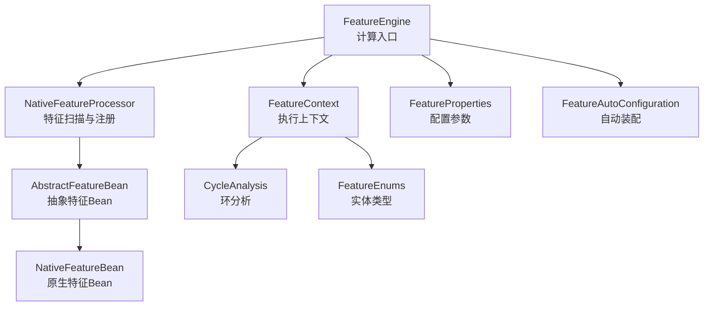
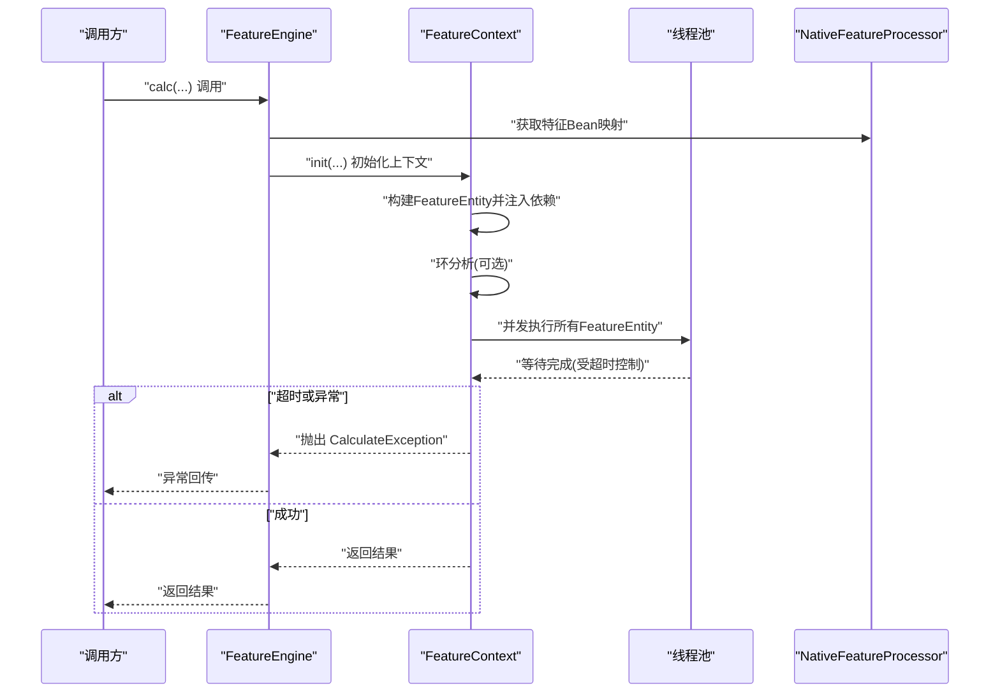
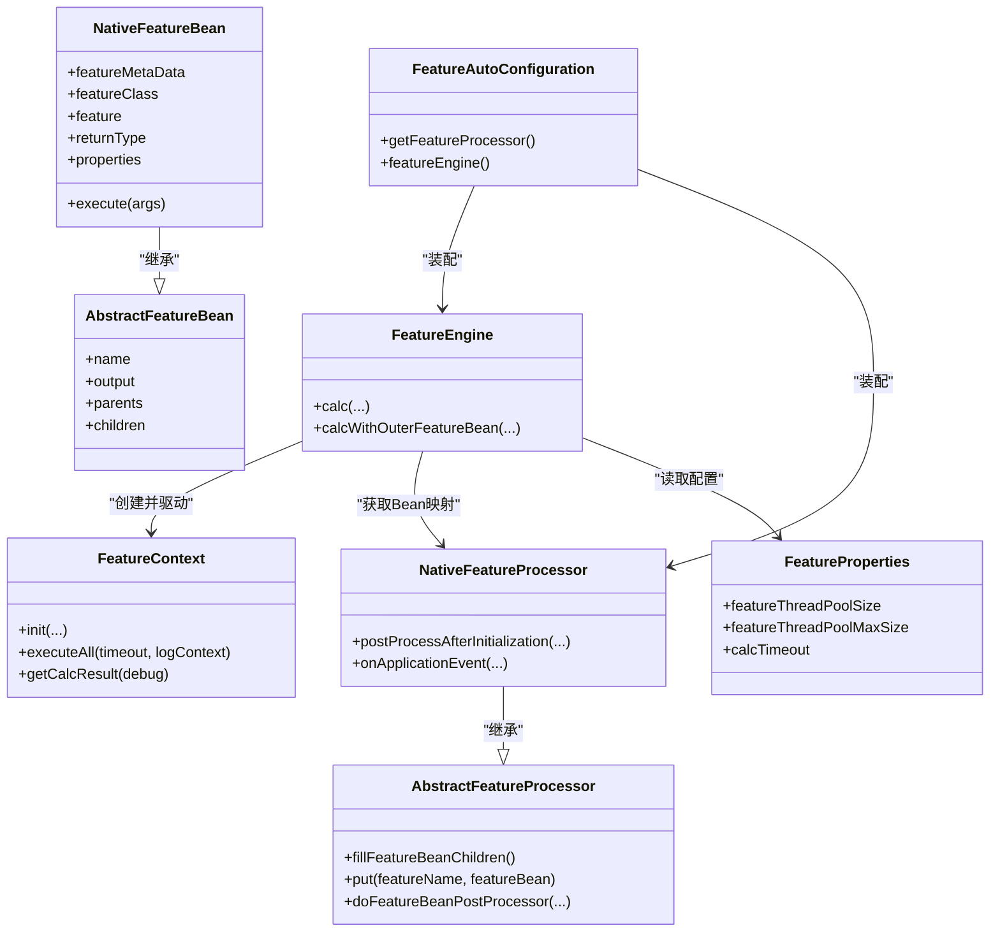
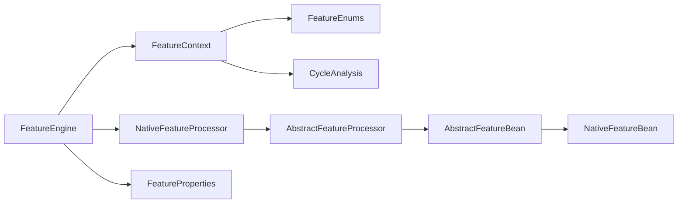
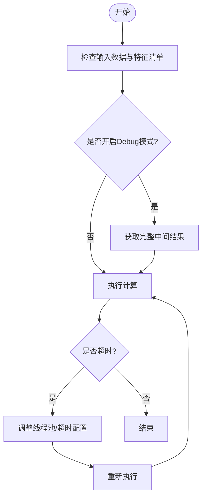

# 故障排查与调试

<cite>
**本文引用的文件**
- [CalculateException.java](file://src/main/java/com/github/zh/engine/exception/CalculateException.java)
- [FeatureCreationException.java](file://src/main/java/com/github/zh/engine/exception/FeatureCreationException.java)
- [FeatureEngine.java](file://src/main/java/com/github/zh/engine/FeatureEngine.java)
- [FeatureContext.java](file://src/main/java/com/github/zh/engine/co/FeatureContext.java)
- [NativeFeatureProcessor.java](file://src/main/java/com/github/zh/engine/processor/NativeFeatureProcessor.java)
- [AbstractFeatureProcessor.java](file://src/main/java/com/github/zh/engine/processor/AbstractFeatureProcessor.java)
- [FeatureProperties.java](file://src/main/java/com/github/zh/engine/properties/FeatureProperties.java)
- [FeatureAutoConfiguration.java](file://src/main/java/com/github/zh/engine/config/FeatureAutoConfiguration.java)
- [CycleAnalysis.java](file://src/main/java/com/github/zh/engine/tools/CycleAnalysis.java)
- [FeatureEnums.java](file://src/main/java/com/github/zh/engine/enums/FeatureEnums.java)
- [NativeFeatureBean.java](file://src/main/java/com/github/zh/engine/co/bean/NativeFeatureBean.java)
- [AbstractFeatureBean.java](file://src/main/java/com/github/zh/engine/co/AbstractFeatureBean.java)
- [Test.java](file://src/test/java/com/github/zh/feature/Test.java)
- [README.md](file://README.md)
</cite>

## 目录
1. [简介](#简介)
2. [项目结构](#项目结构)
3. [核心组件](#核心组件)
4. [架构总览](#架构总览)
5. [详细组件分析](#详细组件分析)
6. [依赖分析](#依赖分析)
7. [性能考虑](#性能考虑)
8. [故障排查指南](#故障排查指南)
9. [结论](#结论)
10. [附录](#附录)

## 简介
本指南聚焦于特征计算引擎在运行期可能出现的异常与性能问题，围绕两类关键异常展开：计算异常 CalculateException 与特征创建异常 FeatureCreationException。文档提供系统化的调试流程、日志分析技巧、错误定位策略、问题隔离方法、性能诊断手段（超时、内存、线程阻塞）、监控与观测最佳实践，以及常见问题 FAQ 与真实案例拆解，帮助开发者快速定位并解决问题。

## 项目结构
项目采用基于注解的函数式特征计算引擎，核心模块包括：
- 异常体系：计算异常与特征创建异常
- 引擎与上下文：FeatureEngine、FeatureContext
- 特征处理：NativeFeatureProcessor、AbstractFeatureProcessor
- 配置与自动装配：FeatureProperties、FeatureAutoConfiguration
- 工具与枚举：CycleAnalysis、FeatureEnums
- 数据模型：AbstractFeatureBean、NativeFeatureBean
- 测试样例：Test

图表来源
- [FeatureEngine.java:1-172](file://src/main/java/com/github/zh/engine/FeatureEngine.java#L1-L172)
- [FeatureContext.java:1-298](file://src/main/java/com/github/zh/engine/co/FeatureContext.java#L1-L298)
- [NativeFeatureProcessor.java:1-131](file://src/main/java/com/github/zh/engine/processor/NativeFeatureProcessor.java#L1-L131)
- [AbstractFeatureProcessor.java:1-53](file://src/main/java/com/github/zh/engine/processor/AbstractFeatureProcessor.java#L1-L53)
- [FeatureProperties.java:1-37](file://src/main/java/com/github/zh/engine/properties/FeatureProperties.java#L1-L37)
- [FeatureAutoConfiguration.java:1-37](file://src/main/java/com/github/zh/engine/config/FeatureAutoConfiguration.java#L1-L37)
- [CycleAnalysis.java:1-72](file://src/main/java/com/github/zh/engine/tools/CycleAnalysis.java#L1-L72)
- [FeatureEnums.java:1-26](file://src/main/java/com/github/zh/engine/enums/FeatureEnums.java#L1-L26)
- [AbstractFeatureBean.java:1-28](file://src/main/java/com/github/zh/engine/co/AbstractFeatureBean.java#L1-L28)
- [NativeFeatureBean.java:1-53](file://src/main/java/com/github/zh/engine/co/bean/NativeFeatureBean.java#L1-L53)

章节来源
- [FeatureEngine.java:1-172](file://src/main/java/com/github/zh/engine/FeatureEngine.java#L1-L172)
- [FeatureContext.java:1-298](file://src/main/java/com/github/zh/engine/co/FeatureContext.java#L1-L298)
- [NativeFeatureProcessor.java:1-131](file://src/main/java/com/github/zh/engine/processor/NativeFeatureProcessor.java#L1-L131)
- [AbstractFeatureProcessor.java:1-53](file://src/main/java/com/github/zh/engine/processor/AbstractFeatureProcessor.java#L1-L53)
- [FeatureProperties.java:1-37](file://src/main/java/com/github/zh/engine/properties/FeatureProperties.java#L1-L37)
- [FeatureAutoConfiguration.java:1-37](file://src/main/java/com/github/zh/engine/config/FeatureAutoConfiguration.java#L1-L37)
- [CycleAnalysis.java:1-72](file://src/main/java/com/github/zh/engine/tools/CycleAnalysis.java#L1-L72)
- [FeatureEnums.java:1-26](file://src/main/java/com/github/zh/engine/enums/FeatureEnums.java#L1-L26)
- [AbstractFeatureBean.java:1-28](file://src/main/java/com/github/zh/engine/co/AbstractFeatureBean.java#L1-L28)
- [NativeFeatureBean.java:1-53](file://src/main/java/com/github/zh/engine/co/bean/NativeFeatureBean.java#L1-L53)

## 核心组件
- 计算入口与线程池：FeatureEngine 提供多种 calc 重载，内部通过 FeatureContext 组织任务并使用线程池执行；默认线程池大小由 FeatureProperties 配置。
- 执行上下文：FeatureContext 负责初始化输入、构建特征实体、依赖注入、环分析、计数与超时控制，并在 debug 模式下返回完整结果。
- 特征注册：NativeFeatureProcessor 扫描带有 @FeatureClass 的类，解析 @Feature 方法，生成 NativeFeatureBean 并注册到映射表；失败时抛出 FeatureCreationException。
- 异常体系：CalculateException 用于运行期计算错误与超时；FeatureCreationException 用于特征构造阶段的 Bean 注册失败。

章节来源
- [FeatureEngine.java:1-172](file://src/main/java/com/github/zh/engine/FeatureEngine.java#L1-L172)
- [FeatureContext.java:1-298](file://src/main/java/com/github/zh/engine/co/FeatureContext.java#L1-L298)
- [NativeFeatureProcessor.java:1-131](file://src/main/java/com/github/zh/engine/processor/NativeFeatureProcessor.java#L1-L131)
- [CalculateException.java:1-19](file://src/main/java/com/github/zh/engine/exception/CalculateException.java#L1-L19)
- [FeatureCreationException.java:1-21](file://src/main/java/com/github/zh/engine/exception/FeatureCreationException.java#L1-L21)

## 架构总览
下面的序列图展示了从调用 FeatureEngine 到执行 FeatureContext 的关键步骤，以及异常如何传播。

图表来源
- [FeatureEngine.java:49-96](file://src/main/java/com/github/zh/engine/FeatureEngine.java#L49-L96)
- [FeatureContext.java:49-61](file://src/main/java/com/github/zh/engine/co/FeatureContext.java#L49-L61)
- [NativeFeatureProcessor.java:32-66](file://src/main/java/com/github/zh/engine/processor/NativeFeatureProcessor.java#L32-L66)

## 详细组件分析

### 异常类型与触发场景

- CalculateException
  - 触发原因
    - 无变量需计算：当需要计算的特征集合为空时，直接抛出。
    - 计算超时：FeatureContext 在 await(timeout) 返回 false 时抛出。
    - 缺少依赖：在构建中间实体时发现缺失上游特征或输入参数，抛出。
    - 快速失败：开启 fastFail 且检测到首个失败节点时，定位根失败特征并抛出。
  - 错误信息解读
    - “无变量需计算”：检查调用侧是否正确传入 calcFeatures。
    - “计算超时”：检查线程池大小、任务复杂度、依赖链长度与超时配置。
    - “缺少Feature或者输入参数”：检查依赖名称拼写、输入数据键名、是否遗漏注册的特征。
    - 根失败特征：结合日志上下文与根失败特征定位具体方法。
  - 解决方案
    - 调整 FeatureProperties.calcTimeout 或线程池大小。
    - 优化特征实现，避免长耗时操作；必要时拆分任务。
    - 补充缺失的输入数据或注册的特征。
    - 关闭 fastFail 或在失败时收集更详细的上下文信息。

- FeatureCreationException
  - 触发原因
    - 特征构造阶段异常：NativeFeatureProcessor 在生成 IFeature 实例或构建 NativeFeatureBean 时发生异常。
  - 错误信息解读
    - 异常消息来自底层异常的 message；通常与反射生成、参数签名不匹配、注解解析相关。
  - 解决方案
    - 检查 @Feature 方法签名与参数名称是否与注解一致。
    - 确保编译参数包含 -parameters，以便正确解析参数名。
    - 检查 @FeatureClass、@Feature、@Property 注解使用是否规范。

章节来源
- [FeatureContext.java:49-61](file://src/main/java/com/github/zh/engine/co/FeatureContext.java#L49-L61)
- [FeatureContext.java:237](file://src/main/java/com/github/zh/engine/co/FeatureContext.java#L237)
- [FeatureContext.java:266-275](file://src/main/java/com/github/zh/engine/co/FeatureContext.java#L266-L275)
- [CalculateException.java:1-19](file://src/main/java/com/github/zh/engine/exception/CalculateException.java#L1-L19)
- [FeatureCreationException.java:1-21](file://src/main/java/com/github/zh/engine/exception/FeatureCreationException.java#L1-L21)
- [NativeFeatureProcessor.java:59-62](file://src/main/java/com/github/zh/engine/processor/NativeFeatureProcessor.java#L59-L62)
- [README.md:56](file://README.md#L56)

### 类关系与职责

图表来源
- [FeatureEngine.java:1-172](file://src/main/java/com/github/zh/engine/FeatureEngine.java#L1-L172)
- [FeatureContext.java:1-298](file://src/main/java/com/github/zh/engine/co/FeatureContext.java#L1-L298)
- [NativeFeatureProcessor.java:1-131](file://src/main/java/com/github/zh/engine/processor/NativeFeatureProcessor.java#L1-L131)
- [AbstractFeatureProcessor.java:1-53](file://src/main/java/com/github/zh/engine/processor/AbstractFeatureProcessor.java#L1-L53)
- [AbstractFeatureBean.java:1-28](file://src/main/java/com/github/zh/engine/co/AbstractFeatureBean.java#L1-L28)
- [NativeFeatureBean.java:1-53](file://src/main/java/com/github/zh/engine/co/bean/NativeFeatureBean.java#L1-L53)
- [FeatureProperties.java:1-37](file://src/main/java/com/github/zh/engine/properties/FeatureProperties.java#L1-L37)
- [FeatureAutoConfiguration.java:1-37](file://src/main/java/com/github/zh/engine/config/FeatureAutoConfiguration.java#L1-L37)

## 依赖分析
- 组件耦合
  - FeatureEngine 依赖 FeatureContext、NativeFeatureProcessor、FeatureProperties。
  - FeatureContext 依赖 FeatureEnums、CycleAnalysis、线程池与 FeatureEntity。
  - NativeFeatureProcessor 依赖 FeatureClassGenerator、IFeature、NativeFeatureBean，并通过后置处理器扩展能力。
- 外部依赖
  - Spring Boot 自动装配与条件注解用于启用引擎。
  - 日志框架 SLF4J 用于记录错误与调试信息。

图表来源
- [FeatureEngine.java:1-172](file://src/main/java/com/github/zh/engine/FeatureEngine.java#L1-L172)
- [FeatureContext.java:1-298](file://src/main/java/com/github/zh/engine/co/FeatureContext.java#L1-L298)
- [NativeFeatureProcessor.java:1-131](file://src/main/java/com/github/zh/engine/processor/NativeFeatureProcessor.java#L1-L131)
- [AbstractFeatureProcessor.java:1-53](file://src/main/java/com/github/zh/engine/processor/AbstractFeatureProcessor.java#L1-L53)
- [AbstractFeatureBean.java:1-28](file://src/main/java/com/github/zh/engine/co/AbstractFeatureBean.java#L1-L28)
- [NativeFeatureBean.java:1-53](file://src/main/java/com/github/zh/engine/co/bean/NativeFeatureBean.java#L1-L53)
- [FeatureEnums.java:1-26](file://src/main/java/com/github/zh/engine/enums/FeatureEnums.java#L1-L26)
- [CycleAnalysis.java:1-72](file://src/main/java/com/github/zh/engine/tools/CycleAnalysis.java#L1-L72)

## 性能考虑
- 计算超时
  - 现象：FeatureContext.executeAll 在 await(timeout) 返回 false。
  - 诊断：检查 calcTimeout 配置、线程池大小、任务复杂度与依赖链深度。
  - 处理：增大线程池或超时时间；拆分复杂特征；减少不必要的依赖。
- 内存溢出
  - 现象：大量特征实体堆积、中间结果未及时释放。
  - 诊断：观察 FeatureContext 中 featureEntitiesPool 的规模与对象生命周期。
  - 处理：限制 calcFeatures 数量；避免在特征中持有大对象引用；及时清理临时缓存。
- 线程阻塞
  - 现象：线程池饱和、队列积压、任务长时间无法完成。
  - 诊断：查看线程池拒绝策略与队列长度；确认任务是否合理划分。
  - 处理：调整核心/最大线程数；引入限流或降级策略；异步化外部调用。

章节来源
- [FeatureContext.java:49-61](file://src/main/java/com/github/zh/engine/co/FeatureContext.java#L49-L61)
- [FeatureProperties.java:1-37](file://src/main/java/com/github/zh/engine/properties/FeatureProperties.java#L1-L37)
- [FeatureEngine.java:163-170](file://src/main/java/com/github/zh/engine/FeatureEngine.java#L163-L170)

## 故障排查指南

### 一、调试流程与方法
- 步骤一：确认输入
  - 检查 originDataMap 的键是否与特征参数名一致；确认 calcFeatures 是否包含目标特征。
- 步骤二：开启调试模式
  - 使用 debug 模式返回完整中间结果，便于定位中间值异常。
- 步骤三：日志分析
  - 关注 FeatureEngine.calc 与 NativeFeatureProcessor 的日志；留意“Generate feature error”“Feature bean construct success”等关键信息。
- 步骤四：异常定位
  - 若抛出 CalculateException，优先检查“计算超时”“缺少Feature或者输入参数”“无变量需计算”等信息。
  - 若抛出 FeatureCreationException，重点检查特征构造阶段的异常堆栈与注解使用。

图表来源
- [FeatureEngine.java:49-96](file://src/main/java/com/github/zh/engine/FeatureEngine.java#L49-L96)
- [FeatureContext.java:277-288](file://src/main/java/com/github/zh/engine/co/FeatureContext.java#L277-L288)

章节来源
- [FeatureEngine.java:49-96](file://src/main/java/com/github/zh/engine/FeatureEngine.java#L49-L96)
- [FeatureContext.java:277-288](file://src/main/java/com/github/zh/engine/co/FeatureContext.java#L277-L288)
- [NativeFeatureProcessor.java:59-62](file://src/main/java/com/github/zh/engine/processor/NativeFeatureProcessor.java#L59-L62)

### 二、错误定位策略
- 快速失败定位
  - 当 fastFail 为真时，FeatureContext 会找到首个失败节点并向上追溯根失败特征，随后抛出 CalculateException。
  - 建议：在失败时打印根失败特征名与错误信息，结合日志上下文 MDC 定位。
- 依赖缺失定位
  - 若提示“缺少Feature或者输入参数”，检查依赖名称是否与注册的特征名一致，或是否遗漏了输入数据。
- 环依赖规避
  - 环分析工具提供环检测逻辑，建议在开发期尽早发现并修复环依赖；或在环中任意节点提供原始数据以打破循环。

章节来源
- [FeatureContext.java:266-275](file://src/main/java/com/github/zh/engine/co/FeatureContext.java#L266-L275)
- [FeatureContext.java:237](file://src/main/java/com/github/zh/engine/co/FeatureContext.java#L237)
- [CycleAnalysis.java:25-59](file://src/main/java/com/github/zh/engine/tools/CycleAnalysis.java#L25-L59)
- [README.md:162](file://README.md#L162)

### 三、问题隔离方法
- 分批计算：将 calcFeatures 拆分为多个批次，逐步缩小范围。
- 外部Bean隔离：使用 calcWithOuterFeatureBean 将可疑外部实现替换为简单实现，验证是否为外部Bean导致的问题。
- 线程池隔离：为高风险特征单独分配线程池，避免影响整体吞吐。

章节来源
- [FeatureEngine.java:106-161](file://src/main/java/com/github/zh/engine/FeatureEngine.java#L106-L161)

### 四、监控与观测最佳实践
- 关键指标
  - 计算耗时分布、超时次数、失败次数、线程池活跃度、队列长度。
- 异常告警
  - 对 CalculateException 与 FeatureCreationException 设置分级告警；根失败特征名纳入告警标签。
- 性能基线
  - 基于 FeatureProperties 的默认线程池与超时时间建立基线，对比线上波动阈值。

章节来源
- [FeatureProperties.java:14-36](file://src/main/java/com/github/zh/engine/properties/FeatureProperties.java#L14-L36)
- [FeatureEngine.java:163-170](file://src/main/java/com/github/zh/engine/FeatureEngine.java#L163-L170)

### 五、常见问题 FAQ
- Q：为什么抛出“无变量需计算”？
  - A：请检查 calcFeatures 是否为空或未包含目标特征。
- Q：为什么抛出“计算超时”？
  - A：增大 calcTimeout 或提升线程池大小；优化特征实现。
- Q：为什么抛出“缺少Feature或者输入参数”？
  - A：核对依赖名称与输入键名，确保已注册或已提供。
- Q：为什么特征构造失败？
  - A：检查注解使用、编译参数是否包含 -parameters；查看 FeatureCreationException 的异常消息。
- Q：如何避免环依赖？
  - A：在开发期使用环分析工具；或在环中提供原始数据以打破循环。

章节来源
- [FeatureContext.java:51](file://src/main/java/com/github/zh/engine/co/FeatureContext.java#L51)
- [FeatureContext.java:59](file://src/main/java/com/github/zh/engine/co/FeatureContext.java#L59)
- [FeatureContext.java:237](file://src/main/java/com/github/zh/engine/co/FeatureContext.java#L237)
- [FeatureCreationException.java:1-21](file://src/main/java/com/github/zh/engine/exception/FeatureCreationException.java#L1-L21)
- [README.md:162](file://README.md#L162)

### 六、故障案例与处理过程
- 案例一：计算超时
  - 现象：FeatureContext 抛出“计算超时”。
  - 处理：增大 FeatureProperties.calcTimeout；评估线程池大小；拆分复杂特征。
- 案例二：特征构造失败
  - 现象：NativeFeatureProcessor 抛出 FeatureCreationException。
  - 处理：检查 @Feature 方法签名与注解使用；确保编译参数包含 -parameters。
- 案例三：依赖缺失
  - 现象：FeatureContext 抛出“缺少Feature或者输入参数”。
  - 处理：补齐输入数据或注册缺失的特征；核对依赖名称。

章节来源
- [FeatureContext.java:49-61](file://src/main/java/com/github/zh/engine/co/FeatureContext.java#L49-L61)
- [FeatureContext.java:237](file://src/main/java/com/github/zh/engine/co/FeatureContext.java#L237)
- [NativeFeatureProcessor.java:59-62](file://src/main/java/com/github/zh/engine/processor/NativeFeatureProcessor.java#L59-L62)
- [README.md:56](file://README.md#L56)

## 结论
通过明确异常类型、掌握调试流程、实施性能诊断与监控观测，可以高效定位并解决特征计算中的各类问题。建议在开发与运维中形成标准化的排查手册与告警策略，持续优化线程池与超时配置，确保系统稳定与可观测性。

## 附录
- 配置参考
  - feature.featureThreadPoolSize：线程池核心线程数
  - feature.featureThreadPoolMaxSize：线程池最大线程数
  - feature.calcTimeout：计算超时时间（毫秒）

章节来源
- [FeatureProperties.java:14-36](file://src/main/java/com/github/zh/engine/properties/FeatureProperties.java#L14-L36)
- [README.md:146-161](file://README.md#L146-L161)