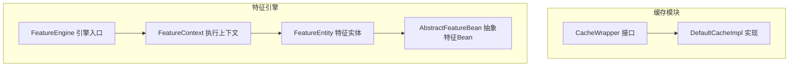
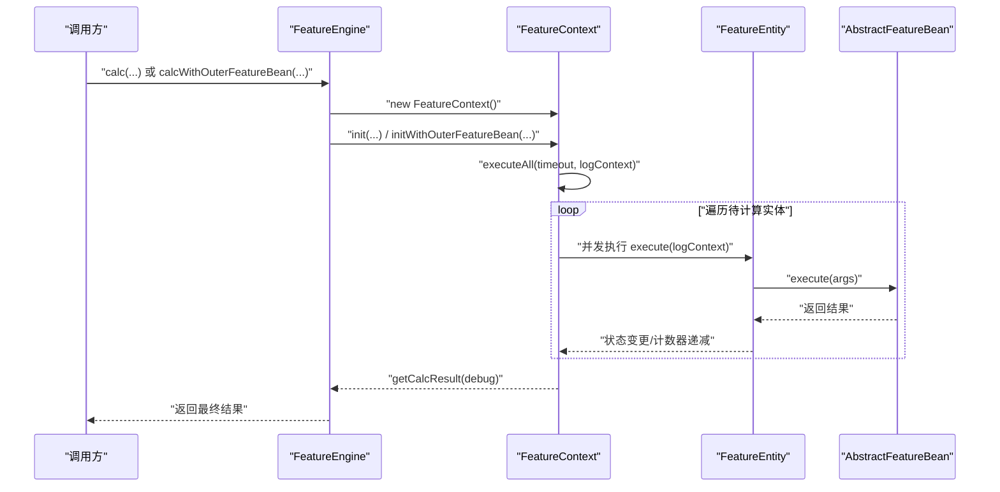
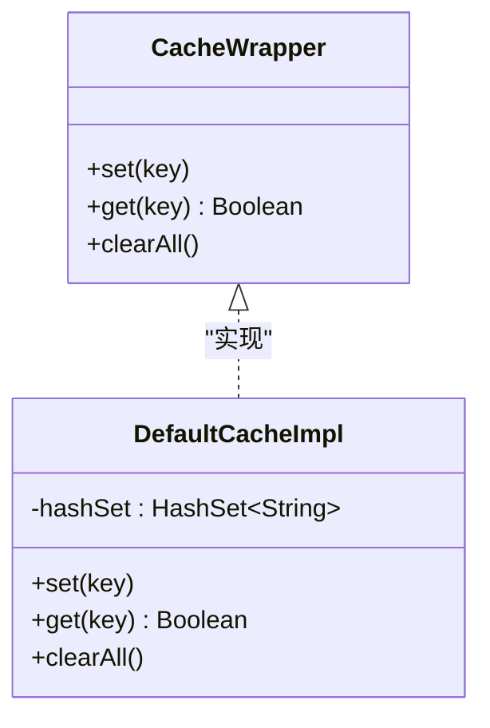
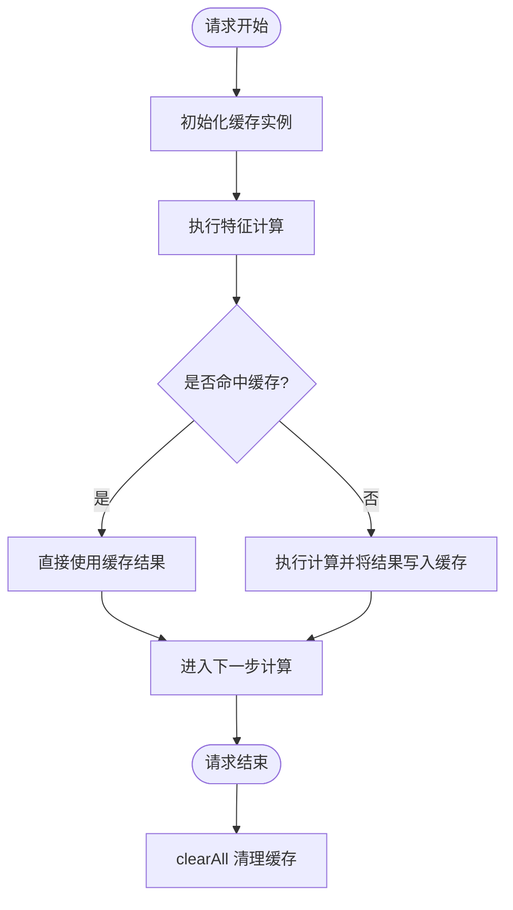
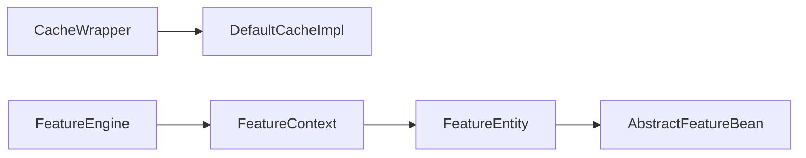

# 缓存系统

<cite>
**本文引用的文件**
- [CacheWrapper.java](file://src/main/java/com/github/zh/engine/cache/CacheWrapper.java)
- [DefaultCacheImpl.java](file://src/main/java/com/github/zh/engine/cache/DefaultCacheImpl.java)
- [FeatureEngine.java](file://src/main/java/com/github/zh/engine/FeatureEngine.java)
- [FeatureContext.java](file://src/main/java/com/github/zh/engine/co/FeatureContext.java)
- [FeatureEntity.java](file://src/main/java/com/github/zh/engine/co/FeatureEntity.java)
- [AbstractFeatureBean.java](file://src/main/java/com/github/zh/engine/co/AbstractFeatureBean.java)
- [FeatureProperties.java](file://src/main/java/com/github/zh/engine/properties/FeatureProperties.java)
- [application.yml](file://src/test/resources/application.yml)
- [Test.java](file://src/test/java/com/github/zh/feature/Test.java)
</cite>

## 目录
1. [引言](#引言)
2. [项目结构](#项目结构)
3. [核心组件](#核心组件)
4. [架构总览](#架构总览)
5. [详细组件分析](#详细组件分析)
6. [依赖分析](#依赖分析)
7. [性能考量](#性能考量)
8. [故障排查指南](#故障排查指南)
9. [结论](#结论)
10. [附录](#附录)

## 引言
本文件围绕特征计算引擎中的缓存系统进行系统化说明，重点覆盖以下内容：
- CacheWrapper 接口与 DefaultCacheImpl 默认实现的设计理念与实现原理
- 缓存在特征计算引擎中的作用与价值（性能优化、资源节约）
- 生命周期管理（创建、更新、失效）
- 配置与使用最佳实践（缓存粒度、过期策略、容量控制）
- 与特征计算的集成方式及注意事项
- 结合源码路径给出可参考的使用示例与排错建议

## 项目结构
缓存系统位于 engine/cache 包内，采用接口 + 默认实现的分层设计；同时，特征计算引擎通过 FeatureEngine、FeatureContext、FeatureEntity 等组件驱动整体执行流程。

图表来源
- [CacheWrapper.java:11-29](file://src/main/java/com/github/zh/engine/cache/CacheWrapper.java#L11-L29)
- [DefaultCacheImpl.java:13-31](file://src/main/java/com/github/zh/engine/cache/DefaultCacheImpl.java#L13-L31)
- [FeatureEngine.java:29-172](file://src/main/java/com/github/zh/engine/FeatureEngine.java#L29-L172)
- [FeatureContext.java:23-298](file://src/main/java/com/github/zh/engine/co/FeatureContext.java#L23-L298)
- [FeatureEntity.java:27-155](file://src/main/java/com/github/zh/engine/co/FeatureEntity.java#L27-L155)
- [AbstractFeatureBean.java:18-27](file://src/main/java/com/github/zh/engine/co/AbstractFeatureBean.java#L18-L27)

章节来源
- [FeatureEngine.java:29-172](file://src/main/java/com/github/zh/engine/FeatureEngine.java#L29-L172)
- [FeatureContext.java:23-298](file://src/main/java/com/github/zh/engine/co/FeatureContext.java#L23-L298)
- [FeatureEntity.java:27-155](file://src/main/java/com/github/zh/engine/co/FeatureEntity.java#L27-L155)
- [AbstractFeatureBean.java:18-27](file://src/main/java/com/github/zh/engine/co/AbstractFeatureBean.java#L18-L27)

## 核心组件
- CacheWrapper 接口：定义缓存能力的最小契约，包含“设置键”“查询键”“清空全部”三个方法，用于标记某特征或计算阶段的“已处理/已存在”状态。
- DefaultCacheImpl 实现：基于 HashSet 的轻量级内存缓存，默认实现不支持过期与容量上限，适合短生命周期的请求上下文内使用。

章节来源
- [CacheWrapper.java:11-29](file://src/main/java/com/github/zh/engine/cache/CacheWrapper.java#L11-L29)
- [DefaultCacheImpl.java:13-31](file://src/main/java/com/github/zh/engine/cache/DefaultCacheImpl.java#L13-L31)

## 架构总览
特征计算引擎以 FeatureEngine 为入口，构建 FeatureContext 并调度多个 FeatureEntity 并发执行；缓存系统可作为上下文或实体级别的辅助能力，用于避免重复计算或标记已处理项。

图表来源
- [FeatureEngine.java:86-96](file://src/main/java/com/github/zh/engine/FeatureEngine.java#L86-L96)
- [FeatureEngine.java:149-161](file://src/main/java/com/github/zh/engine/FeatureEngine.java#L149-L161)
- [FeatureContext.java:49-61](file://src/main/java/com/github/zh/engine/co/FeatureContext.java#L49-L61)
- [FeatureEntity.java:48-123](file://src/main/java/com/github/zh/engine/co/FeatureEntity.java#L48-L123)
- [AbstractFeatureBean.java:18-27](file://src/main/java/com/github/zh/engine/co/AbstractFeatureBean.java#L18-L27)

## 详细组件分析

### CacheWrapper 接口与 DefaultCacheImpl 实现
- 设计理念
  - 以“键存在性”为核心语义，适合在特征计算中标识“某输入/中间态/输出已存在”，从而避免重复计算。
  - 通过 Spring 组件注解暴露为可注入的缓存服务，便于在上下文或实体中组合使用。
- 默认实现特性
  - 使用 HashSet 存储键集合，提供 O(1) 左右的平均查找与插入复杂度。
  - 不具备过期、驱逐、容量限制等高级特性，适合短期请求上下文内的去重与幂等保护。
  - 提供 clearAll 清空能力，便于在请求结束时回收内存。

图表来源
- [CacheWrapper.java:11-29](file://src/main/java/com/github/zh/engine/cache/CacheWrapper.java#L11-L29)
- [DefaultCacheImpl.java:13-31](file://src/main/java/com/github/zh/engine/cache/DefaultCacheImpl.java#L13-L31)

章节来源
- [CacheWrapper.java:11-29](file://src/main/java/com/github/zh/engine/cache/CacheWrapper.java#L11-L29)
- [DefaultCacheImpl.java:13-31](file://src/main/java/com/github/zh/engine/cache/DefaultCacheImpl.java#L13-L31)

### 在特征计算中的角色与价值
- 性能优化
  - 通过缓存“已存在”的键，避免对相同输入的重复计算，降低 CPU 与 IO 开销。
  - 在并发场景下，结合 FeatureContext 的线程池与 CountDownLatch，减少无效任务的创建与调度。
- 资源节约
  - 减少重复的函数调用与对象构造，缩短计算链路，降低内存占用与 GC 压力。
- 幂等与一致性
  - 对于确定性计算，缓存可保证同一输入多次访问得到一致结果，提升系统稳定性。

章节来源
- [FeatureContext.java:49-61](file://src/main/java/com/github/zh/engine/co/FeatureContext.java#L49-L61)
- [FeatureEntity.java:48-123](file://src/main/java/com/github/zh/engine/co/FeatureEntity.java#L48-L123)

### 生命周期管理
- 创建
  - 在请求开始时初始化缓存实例（如 Spring 容器中的单例），并在 FeatureContext 中按需注入。
- 更新
  - 在 FeatureEntity 执行成功后，将关键输入或中间结果的“键”写入缓存，以便后续复用。
- 失效
  - 请求结束后调用 clearAll 清空缓存，释放内存；也可在异常路径上提前清理，避免脏数据影响后续请求。

图表来源
- [DefaultCacheImpl.java:18-30](file://src/main/java/com/github/zh/engine/cache/DefaultCacheImpl.java#L18-L30)
- [FeatureEntity.java:92-116](file://src/main/java/com/github/zh/engine/co/FeatureEntity.java#L92-L116)

章节来源
- [DefaultCacheImpl.java:18-30](file://src/main/java/com/github/zh/engine/cache/DefaultCacheImpl.java#L18-L30)
- [FeatureEntity.java:92-116](file://src/main/java/com/github/zh/engine/co/FeatureEntity.java#L92-L116)

### 集成方式与最佳实践
- 缓存粒度选择
  - 建议以“输入签名+上下文标识”作为键，确保不同请求或不同输入不会互相污染。
  - 对于复杂对象，优先使用稳定序列化后的字符串作为键，避免哈希冲突与误判。
- 过期时间设置
  - 默认实现不支持过期，可在业务层引入带 TTL 的包装器或替换为支持过期的缓存实现（如基于 Map 的定时清理）。
- 缓存容量控制
  - 默认实现无容量上限，建议在高并发场景下：
    - 将缓存绑定到请求级上下文，请求结束即清理；
    - 或引入 LRU/淘汰策略的缓存实现；
    - 控制键的数量与长度，避免内存膨胀。
- 与特征计算的集成
  - 在 FeatureEntity.execute 中，先检查输入键是否已在缓存中；若命中则直接使用，否则执行计算并写入缓存。
  - 对于外部特征 Bean，同样遵循相同的键规则与生命周期管理。

章节来源
- [FeatureEntity.java:92-116](file://src/main/java/com/github/zh/engine/co/FeatureEntity.java#L92-L116)
- [AbstractFeatureBean.java:18-27](file://src/main/java/com/github/zh/engine/co/AbstractFeatureBean.java#L18-L27)

### 使用示例与注意事项
- 示例路径
  - 特征类定义与依赖关系示例：[Test.java:20-71](file://src/test/java/com/github/zh/feature/Test.java#L20-L71)
  - 引擎入口与上下文初始化示例：[FeatureEngine.java:86-96](file://src/main/java/com/github/zh/engine/FeatureEngine.java#L86-L96)
  - 外部特征 Bean 集成示例：[FeatureEngine.java:149-161](file://src/main/java/com/github/zh/engine/FeatureEngine.java#L149-L161)
- 注意事项
  - 缓存键必须稳定且唯一，避免误判命中；
  - 在并发执行中注意缓存实例的线程安全（HashSet 本身非线程安全，建议在请求级隔离或加锁）；
  - 对于长生命周期缓存，务必配合过期与容量策略，防止内存泄漏。

章节来源
- [Test.java:20-71](file://src/test/java/com/github/zh/feature/Test.java#L20-L71)
- [FeatureEngine.java:86-96](file://src/main/java/com/github/zh/engine/FeatureEngine.java#L86-L96)
- [FeatureEngine.java:149-161](file://src/main/java/com/github/zh/engine/FeatureEngine.java#L149-L161)

## 依赖分析
- 缓存模块
  - CacheWrapper 与 DefaultCacheImpl 之间为接口与实现的关系，无额外外部依赖。
- 特征引擎
  - FeatureEngine 依赖 FeatureContext 与 AbstractFeatureBean，负责初始化上下文、调度执行与结果收集。
  - FeatureContext 负责并发执行、超时控制与结果汇总。
  - FeatureEntity 表达单个特征的执行状态、父子依赖与结果传播。

图表来源
- [CacheWrapper.java:11-29](file://src/main/java/com/github/zh/engine/cache/CacheWrapper.java#L11-L29)
- [DefaultCacheImpl.java:13-31](file://src/main/java/com/github/zh/engine/cache/DefaultCacheImpl.java#L13-L31)
- [FeatureEngine.java:29-172](file://src/main/java/com/github/zh/engine/FeatureEngine.java#L29-L172)
- [FeatureContext.java:23-298](file://src/main/java/com/github/zh/engine/co/FeatureContext.java#L23-L298)
- [FeatureEntity.java:27-155](file://src/main/java/com/github/zh/engine/co/FeatureEntity.java#L27-L155)
- [AbstractFeatureBean.java:18-27](file://src/main/java/com/github/zh/engine/co/AbstractFeatureBean.java#L18-L27)

章节来源
- [FeatureEngine.java:29-172](file://src/main/java/com/github/zh/engine/FeatureEngine.java#L29-L172)
- [FeatureContext.java:23-298](file://src/main/java/com/github/zh/engine/co/FeatureContext.java#L23-L298)
- [FeatureEntity.java:27-155](file://src/main/java/com/github/zh/engine/co/FeatureEntity.java#L27-L155)
- [AbstractFeatureBean.java:18-27](file://src/main/java/com/github/zh/engine/co/AbstractFeatureBean.java#L18-L27)

## 性能考量
- 时间复杂度
  - HashSet 查找与插入近似 O(1)，适合高频命中场景。
- 空间复杂度
  - 与缓存键数量线性相关，需结合容量策略控制内存占用。
- 并发与线程安全
  - HashSet 非线程安全，建议在请求级隔离或加锁；或替换为线程安全的并发容器。
- 与特征引擎的协同
  - 与 FeatureContext 的线程池、CountDownLatch 协同，避免重复任务与无效等待。

章节来源
- [DefaultCacheImpl.java:15-20](file://src/main/java/com/github/zh/engine/cache/DefaultCacheImpl.java#L15-L20)
- [FeatureContext.java:49-61](file://src/main/java/com/github/zh/engine/co/FeatureContext.java#L49-L61)

## 故障排查指南
- 常见问题
  - 缓存未生效：确认键生成规则是否稳定、是否在正确时机写入缓存。
  - 内存持续增长：检查是否在请求结束时调用 clearAll，或引入容量/过期策略。
  - 并发冲突：确认缓存实例是否按请求隔离，避免多请求共享同一实例。
- 关联定位
  - 特征执行链路与状态流转：参考 FeatureEntity 的状态机与错误传播逻辑。
  - 超时与失败：参考 FeatureContext 的超时控制与快速失败机制。

章节来源
- [FeatureEntity.java:48-123](file://src/main/java/com/github/zh/engine/co/FeatureEntity.java#L48-L123)
- [FeatureContext.java:49-61](file://src/main/java/com/github/zh/engine/co/FeatureContext.java#L49-L61)

## 结论
缓存系统以简洁的键存在性语义，为特征计算引擎提供了高效的幂等与去重能力。DefaultCacheImpl 作为默认实现，具备低开销与易用性的优势；但在生产环境中建议结合过期与容量策略，或替换为更完善的缓存实现，以满足高并发与长生命周期场景的需求。通过与 FeatureEngine、FeatureContext、FeatureEntity 的协同，缓存能够显著提升性能并降低资源消耗。

## 附录
- 配置示例
  - 线程池大小可通过配置文件设置，影响特征计算的并发度与吞吐量。
  - 参考路径：[application.yml:1-9](file://src/test/resources/application.yml#L1-L9)
  - 属性定义：[FeatureProperties.java:16-36](file://src/main/java/com/github/zh/engine/properties/FeatureProperties.java#L16-L36)

章节来源
- [application.yml:1-9](file://src/test/resources/application.yml#L1-L9)
- [FeatureProperties.java:16-36](file://src/main/java/com/github/zh/engine/properties/FeatureProperties.java#L16-L36)