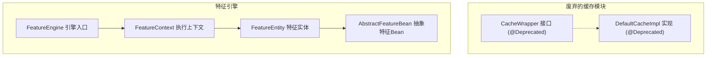
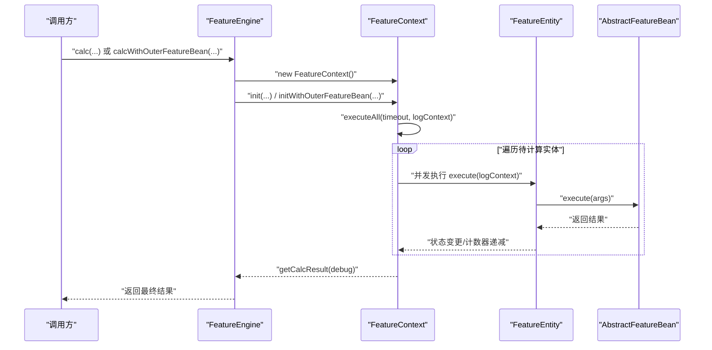
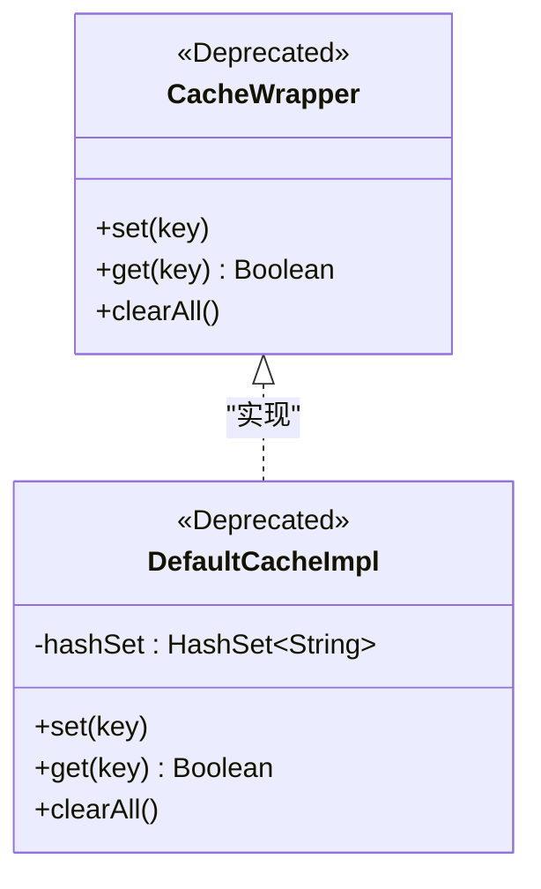
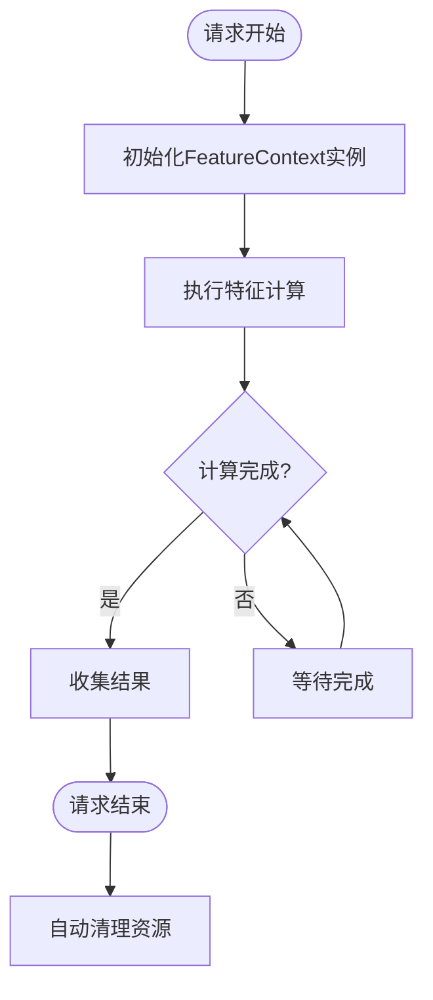
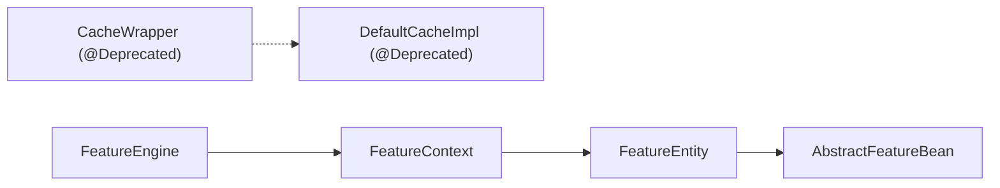

# 缓存系统

<cite>
**本文引用的文件**
- [CacheWrapper.java](file://src/main/java/com/github/zh/engine/cache/CacheWrapper.java)
- [DefaultCacheImpl.java](file://src/main/java/com/github/zh/engine/cache/DefaultCacheImpl.java)
- [FeatureEngine.java](file://src/main/java/com/github/zh/engine/FeatureEngine.java)
- [FeatureContext.java](file://src/main/java/com/github/zh/engine/co/FeatureContext.java)
- [FeatureEntity.java](file://src/main/java/com/github/zh/engine/co/FeatureEntity.java)
- [AbstractFeatureBean.java](file://src/main/java/com/github/zh/engine/co/AbstractFeatureBean.java)
- [FeatureProperties.java](file://src/main/java/com/github/zh/engine/properties/FeatureProperties.java)
- [application.yml](file://src/test/resources/application.yml)
- [Test.java](file://src/test/java/com/github/zh/feature/Test.java)
</cite>

## 更新摘要
**变更内容**
- 缓存包装器系统已被完全废弃，不再在特征计算引擎中使用
- CacheWrapper接口和DefaultCacheImpl实现均标记为@Deprecated
- 原有的缓存功能已被移除，不再提供资源清理和生命周期管理
- 文档需要反映这一重大架构变更

## 目录
1. [引言](#引言)
2. [项目结构](#项目结构)
3. [核心组件](#核心组件)
4. [架构总览](#架构总览)
5. [详细组件分析](#详细组件分析)
6. [依赖分析](#依赖分析)
7. [性能考量](#性能考量)
8. [故障排查指南](#故障排查指南)
9. [结论](#结论)
10. [附录](#附录)

## 引言
本文件围绕特征计算引擎中的缓存系统进行系统化说明。**重要更新**：经过最新分析，缓存系统（CacheWrapper和DefaultCacheImpl）已被完全废弃，不再在特征计算引擎中使用。这些组件现在标记为`@Deprecated`，明确表示保留用于未来使用，但当前并未在引擎中实际使用。

本文档将帮助开发者理解这一架构变更，并提供替代方案和最佳实践。

## 项目结构
缓存系统位于engine/cache包内，虽然仍存在于代码库中，但已被标记为废弃状态。特征计算引擎通过FeatureEngine、FeatureContext、FeatureEntity等组件驱动整体执行流程。

**图表来源**
- [CacheWrapper.java:29](file://src/main/java/com/github/zh/engine/cache/CacheWrapper.java#L29)
- [DefaultCacheImpl.java:33](file://src/main/java/com/github/zh/engine/cache/DefaultCacheImpl.java#L33)
- [FeatureEngine.java:75](file://src/main/java/com/github/zh/engine/FeatureEngine.java#L75)
- [FeatureContext.java:63](file://src/main/java/com/github/zh/engine/co/FeatureContext.java#L63)
- [FeatureEntity.java:65](file://src/main/java/com/github/zh/engine/co/FeatureEntity.java#L65)

## 核心组件
**重要更新**：以下组件现已废弃，不再在特征计算引擎中使用：

- **CacheWrapper接口**：标记为`@Deprecated`，注释说明"保留用于未来使用，但当前未在引擎中使用"。该接口定义了缓存能力的最小契约，包含"设置键""查询键""清空全部"三个方法。
- **DefaultCacheImpl实现**：标记为`@Deprecated`，基于HashSet的轻量级内存缓存实现。由于条件注解`@ConditionalOnProperty(name = "feature.cache.enabled", havingValue = "true", matchIfMissing = false)`，该实现仅在配置属性`feature.cache.enabled=true`时才会被加载。

**章节来源**
- [CacheWrapper.java:29](file://src/main/java/com/github/zh/engine/cache/CacheWrapper.java#L29)
- [DefaultCacheImpl.java:33](file://src/main/java/com/github/zh/engine/cache/DefaultCacheImpl.java#L33)

## 架构总览
特征计算引擎以FeatureEngine为入口，构建FeatureContext并调度多个FeatureEntity并发执行。**重要更新**：缓存系统已从架构中移除，不再作为上下文或实体级别的辅助能力。

**图表来源**
- [FeatureEngine.java:260-281](file://src/main/java/com/github/zh/engine/FeatureEngine.java#L260-L281)
- [FeatureContext.java:95-107](file://src/main/java/com/github/zh/engine/co/FeatureContext.java#L95-L107)
- [FeatureEntity.java:106-181](file://src/main/java/com/github/zh/engine/co/FeatureEntity.java#L106-L181)

## 详细组件分析

### 废弃的缓存系统分析
**重要更新**：CacheWrapper和DefaultCacheImpl已被完全废弃，不再提供任何功能。

- **设计理念**
  - 原设计以"键存在性"为核心语义，适合在特征计算中标识"某输入/中间态/输出已存在"
  - 通过Spring组件注解暴露为可注入的缓存服务
- **默认实现特性**
  - 使用HashSet存储键集合，提供O(1)左右的平均查找与插入复杂度
  - 不具备过期、驱逐、容量限制等高级特性
  - 提供clearAll清空能力
- **当前状态**
  - 全部标记为`@Deprecated`
  - 注释明确说明"保留用于未来使用，但当前未在引擎中使用"
  - 仅在配置`feature.cache.enabled=true`时才被加载

**图表来源**
- [CacheWrapper.java:29](file://src/main/java/com/github/zh/engine/cache/CacheWrapper.java#L29)
- [DefaultCacheImpl.java:33](file://src/main/java/com/github/zh/engine/cache/DefaultCacheImpl.java#L33)

**章节来源**
- [CacheWrapper.java:29](file://src/main/java/com/github/zh/engine/cache/CacheWrapper.java#L29)
- [DefaultCacheImpl.java:33](file://src/main/java/com/github/zh/engine/cache/DefaultCacheImpl.java#L33)

### 特征计算中的替代方案
由于缓存系统已被废弃，特征计算引擎现在完全依赖以下机制：

- **幂等性**：通过特征计算的确定性逻辑保证结果一致性
- **去重机制**：通过FeatureContext的DAG构建和依赖管理避免重复计算
- **生命周期管理**：通过FeatureContext的请求级隔离和自动清理机制管理资源

**章节来源**
- [FeatureContext.java:122-182](file://src/main/java/com/github/zh/engine/co/FeatureContext.java#L122-L182)
- [FeatureEntity.java:106-181](file://src/main/java/com/github/zh/engine/co/FeatureEntity.java#L106-L181)

### 生命周期管理现状
**重要更新**：由于缓存系统已被废弃，生命周期管理现在完全由FeatureContext负责：

- **创建**：在请求开始时初始化FeatureContext实例
- **更新**：通过FeatureEntity的状态管理和通知机制实现
- **失效**：通过请求结束时的自动清理和线程池关闭实现

**图表来源**
- [FeatureEngine.java:260-281](file://src/main/java/com/github/zh/engine/FeatureEngine.java#L260-L281)
- [FeatureContext.java:95-107](file://src/main/java/com/github/zh/engine/co/FeatureContext.java#L95-L107)

**章节来源**
- [FeatureEngine.java:260-281](file://src/main/java/com/github/zh/engine/FeatureEngine.java#L260-L281)
- [FeatureContext.java:95-107](file://src/main/java/com/github/zh/engine/co/FeatureContext.java#L95-L107)

### 集成方式与最佳实践
**重要更新**：由于缓存系统已被废弃，集成方式发生根本性变化：

- **原缓存集成**：在FeatureEntity.execute中检查输入键是否已在缓存中
- **新集成方式**：完全依赖FeatureContext的DAG依赖管理和去重机制
- **配置方式**：通过FeatureProperties配置线程池大小、超时时间等参数

**章节来源**
- [FeatureContext.java:122-182](file://src/main/java/com/github/zh/engine/co/FeatureContext.java#L122-L182)
- [FeatureProperties.java:54-105](file://src/main/java/com/github/zh/engine/properties/FeatureProperties.java#L54-L105)

### 使用示例与注意事项
**重要更新**：由于缓存系统已被废弃，相关示例不再适用：

- **示例路径**：原有的缓存使用示例（如Test.java中的缓存示例）已不存在
- **注意事项**：
  - 缓存键概念已不再适用
  - 并发执行中的线程安全问题通过FeatureContext的线程池管理解决
  - 资源清理通过FeatureEngine的DisposableBean接口实现

**章节来源**
- [FeatureEngine.java:310-323](file://src/main/java/com/github/zh/engine/FeatureEngine.java#L310-L323)
- [Test.java:40-85](file://src/test/java/com/github/zh/feature/Test.java#L40-L85)

## 依赖分析
**重要更新**：缓存模块已从依赖关系中移除。

- **缓存模块**：CacheWrapper与DefaultCacheImpl之间为接口与实现的关系，但现在均标记为废弃
- **特征引擎**：FeatureEngine、FeatureContext、FeatureEntity之间的依赖关系保持不变

**图表来源**
- [CacheWrapper.java:29](file://src/main/java/com/github/zh/engine/cache/CacheWrapper.java#L29)
- [DefaultCacheImpl.java:33](file://src/main/java/com/github/zh/engine/cache/DefaultCacheImpl.java#L33)
- [FeatureEngine.java:75](file://src/main/java/com/github/zh/engine/FeatureEngine.java#L75)
- [FeatureContext.java:63](file://src/main/java/com/github/zh/engine/co/FeatureContext.java#L63)
- [FeatureEntity.java:65](file://src/main/java/com/github/zh/engine/co/FeatureEntity.java#L65)

**章节来源**
- [FeatureEngine.java:75](file://src/main/java/com/github/zh/engine/FeatureEngine.java#L75)
- [FeatureContext.java:63](file://src/main/java/com/github/zh/engine/co/FeatureContext.java#L63)
- [FeatureEntity.java:65](file://src/main/java/com/github/zh/engine/co/FeatureEntity.java#L65)

## 性能考量
**重要更新**：性能考量已完全基于新的架构。

- **时间复杂度**
  - FeatureEntity的异步执行和DAG依赖管理提供最优的并行计算性能
  - 通过线程池大小和超时配置优化计算效率
- **空间复杂度**
  - FeatureContext使用ConcurrentHashMap管理特征实体，内存占用与特征数量线性相关
  - 请求结束后自动清理，避免内存泄漏
- **并发与线程安全**
  - 通过CompletableFuture和线程池管理确保线程安全
  - FeatureContext的volatile字段和AtomicReference保证状态一致性

**章节来源**
- [FeatureContext.java:66-76](file://src/main/java/com/github/zh/engine/co/FeatureContext.java#L66-L76)
- [FeatureEntity.java:78-84](file://src/main/java/com/github/zh/engine/co/FeatureEntity.java#L78-L84)

## 故障排查指南
**重要更新**：故障排查指南已更新以反映废弃的缓存系统。

- **常见问题**
  - 缓存未生效：由于缓存系统已被废弃，此问题不再适用
  - 内存持续增长：检查FeatureContext的自动清理机制是否正常工作
  - 并发冲突：确认FeatureContext的线程池配置是否合理
- **关联定位**
  - 特征执行链路与状态流转：参考FeatureEntity的状态机与错误传播逻辑
  - 超时与失败：参考FeatureContext的超时控制与快速失败机制
  - 资源泄漏：检查FeatureEngine的DisposableBean接口实现

**章节来源**
- [FeatureEntity.java:106-181](file://src/main/java/com/github/zh/engine/co/FeatureEntity.java#L106-L181)
- [FeatureContext.java:95-107](file://src/main/java/com/github/zh/engine/co/FeatureContext.java#L95-L107)
- [FeatureEngine.java:310-323](file://src/main/java/com/github/zh/engine/FeatureEngine.java#L310-L323)

## 结论
**重要更新**：缓存系统已被完全废弃，这是特征计算引擎的一个重大架构变更。

- **历史回顾**：CacheWrapper和DefaultCacheImpl曾提供键存在性语义和去重能力
- **当前状态**：两个组件均标记为`@Deprecated`，明确说明"保留用于未来使用，但当前未在引擎中使用"
- **替代方案**：新的架构完全依赖FeatureContext的DAG依赖管理和去重机制
- **最佳实践**：关注FeatureProperties的配置、FeatureContext的生命周期管理和FeatureEngine的资源清理机制

对于需要缓存功能的应用，建议考虑使用独立的外部缓存解决方案（如Redis、Ehcache等）来满足缓存需求。

## 附录
- **配置示例**
  - 线程池大小可通过FeatureProperties配置，影响特征计算的并发度与吞吐量
  - 参考路径：[application.yml:1-9](file://src/test/resources/application.yml#L1-L9)
  - 属性定义：[FeatureProperties.java:54-105](file://src/main/java/com/github/zh/engine/properties/FeatureProperties.java#L54-L105)

**章节来源**
- [application.yml:1-9](file://src/test/resources/application.yml#L1-L9)
- [FeatureProperties.java:54-105](file://src/main/java/com/github/zh/engine/properties/FeatureProperties.java#L54-L105)