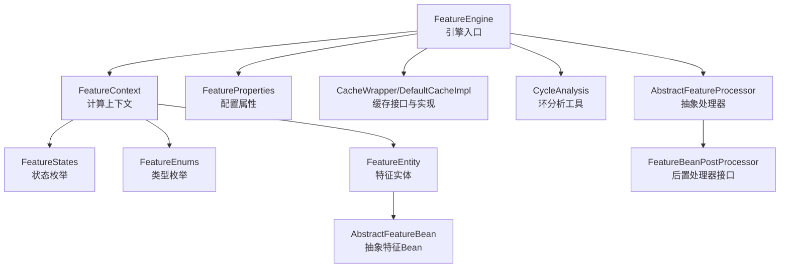
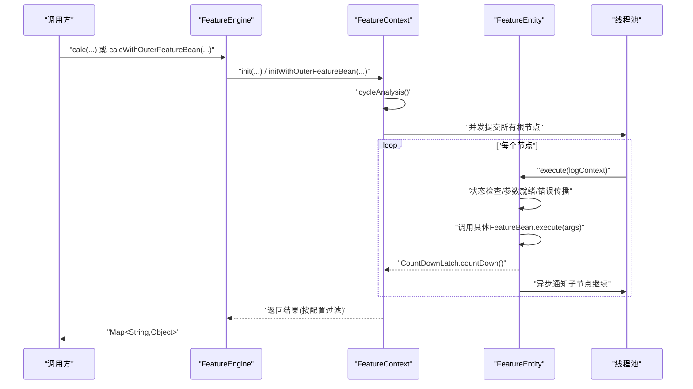
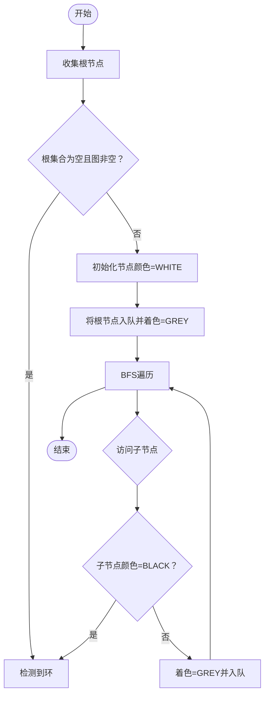
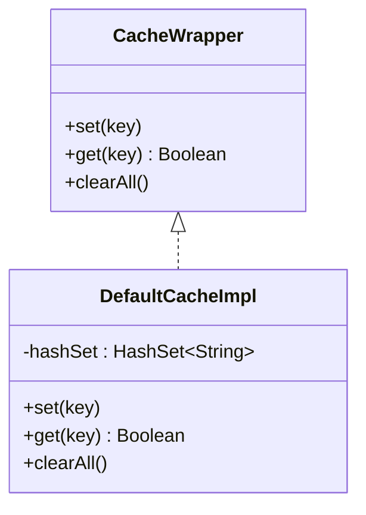
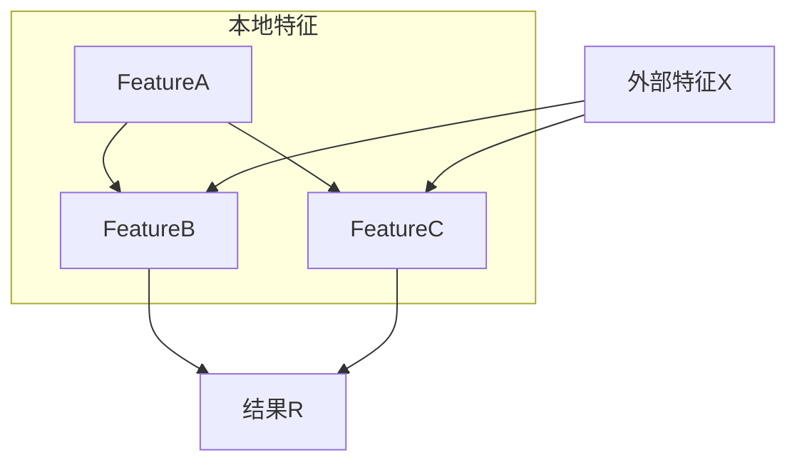
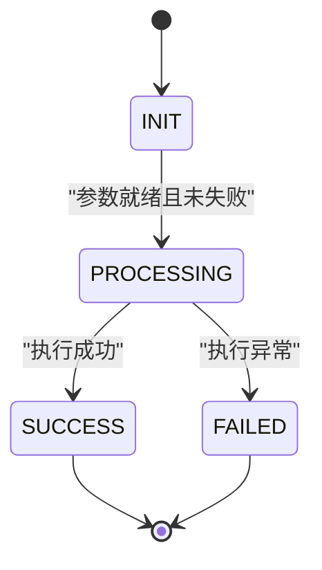
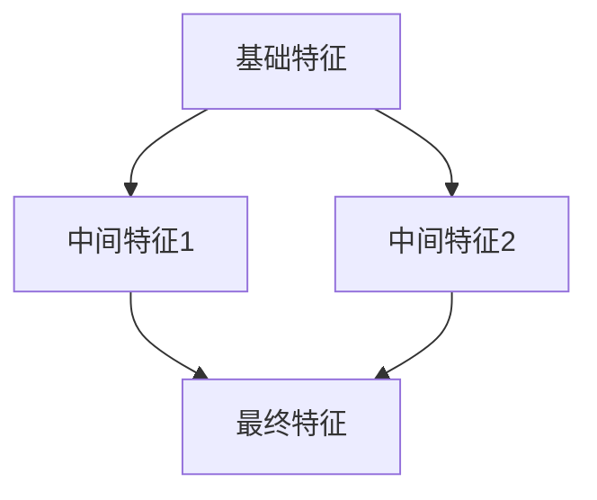
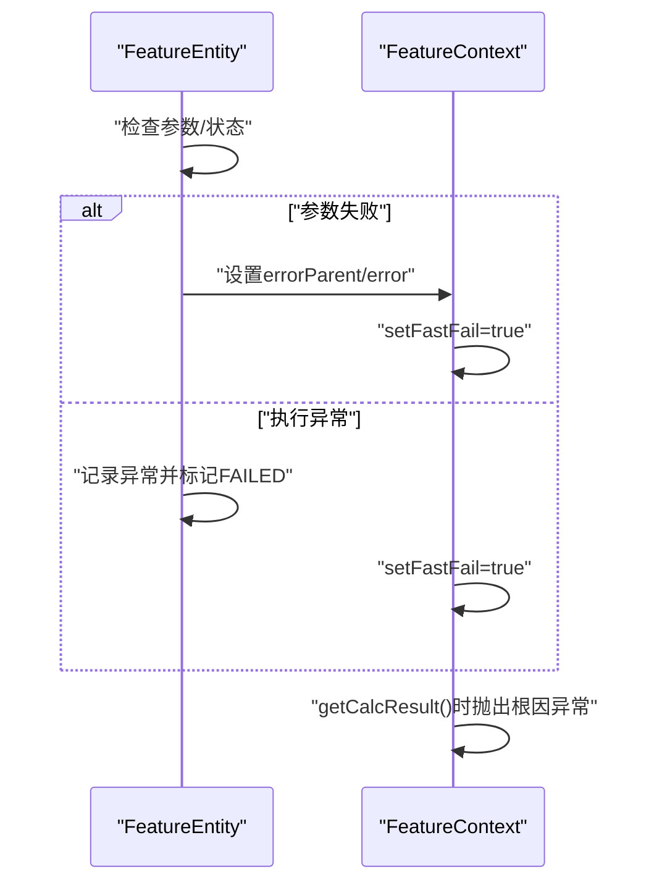
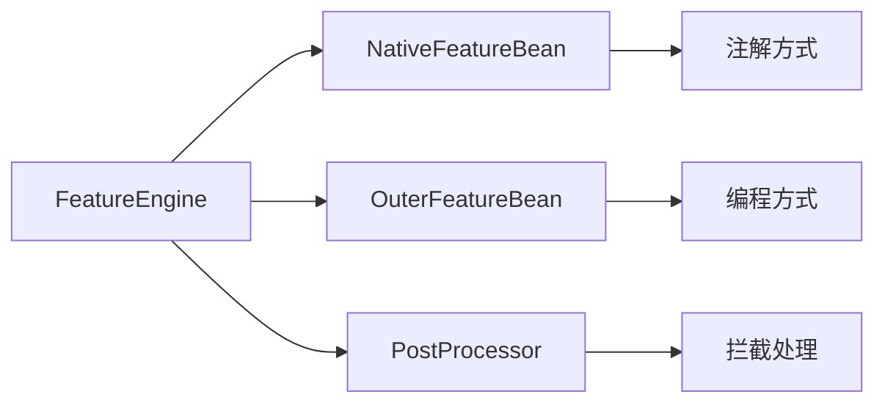

# 高级用法

<cite>
**本文引用的文件**
- [CycleAnalysis.java](file://src/main/java/com/github/zh/engine/tools/CycleAnalysis.java)
- [CacheWrapper.java](file://src/main/java/com/github/zh/engine/cache/CacheWrapper.java)
- [DefaultCacheImpl.java](file://src/main/java/com/github/zh/engine/cache/DefaultCacheImpl.java)
- [FeatureEntity.java](file://src/main/java/com/github/zh/engine/co/FeatureEntity.java)
- [FeatureContext.java](file://src/main/java/com/github/zh/engine/co/FeatureContext.java)
- [FeatureEngine.java](file://src/main/java/com/github/zh/engine/FeatureEngine.java)
- [FeatureEnums.java](file://src/main/java/com/github/zh/engine/enums/FeatureEnums.java)
- [FeatureStates.java](file://src/main/java/com/github/zh/engine/enums/FeatureStates.java)
- [IFeature.java](file://src/main/java/com/github/zh/engine/clz/IFeature.java)
- [AbstractFeature.java](file://src/main/java/com/github/zh/engine/clz/AbstractFeature.java)
- [AbstractFeatureBean.java](file://src/main/java/com/github/zh/engine/co/AbstractFeatureBean.java)
- [FeatureProperties.java](file://src/main/java/com/github/zh/engine/properties/FeatureProperties.java)
- [FeatureBeanPostProcessor.java](file://src/main/java/com/github/zh/engine/interfaces/FeatureBeanPostProcessor.java)
- [AbstractFeatureProcessor.java](file://src/main/java/com/github/zh/engine/processor/AbstractFeatureProcessor.java)
- [NativeFeatureProcessor.java](file://src/main/java/com/github/zh/engine/processor/NativeFeatureProcessor.java)
- [README.md](file://README.md)
- [Test.java](file://src/test/java/com/github/zh/feature/Test.java)
- [OuterFeatureBean.java](file://src/test/java/com/github/zh/bean/OuterFeatureBean.java)
- [SignUpFeatureBeanPostProcessor.java](file://src/test/java/com/github/zh/postprocessor/SignUpFeatureBeanPostProcessor.java)
- [CycleAnalysisTest.java](file://src/test/java/com/github/zh/CycleAnalysisTest.java)
- [FeatureEngineTest.java](file://src/test/java/com/github/zh/FeatureEngineTest.java)
</cite>

## 更新摘要
**变更内容**
- 新增循环依赖处理章节，详细说明当前版本的环检测机制和规避策略
- 新增缓存系统章节，介绍CacheWrapper和DefaultCacheImpl的设计与使用
- 新增性能优化章节，涵盖并行度调优、内存管理和计算结果缓存策略
- 新增故障排查与调试章节，提供日志分析、性能监控和错误定位的实用技巧
- 更新功能扩展架构章节，增强自定义Bean开发、外部Bean集成和后置处理器的指导

## 目录
1. [简介](#简介)
2. [项目结构](#项目结构)
3. [核心组件](#核心组件)
4. [架构总览](#架构总览)
5. [详细组件分析](#详细组件分析)
6. [循环依赖处理](#循环依赖处理)
7. [缓存系统实现](#缓存系统实现)
8. [复杂特征计算场景](#复杂特征计算场景)
9. [性能优化策略](#性能优化策略)
10. [故障排查与调试](#故障排查与调试)
11. [功能扩展架构](#功能扩展架构)
12. [高级配置选项](#高级配置选项)
13. [结论](#结论)
14. [附录](#附录)

## 简介
本指南面向具备一定基础的开发者，系统讲解本特征计算引擎的高级用法与最佳实践，重点覆盖以下主题：
- 循环依赖检测与规避策略
- 缓存系统实现与使用建议
- 复杂特征计算场景（多层依赖、条件计算、动态特征）
- 功能扩展架构（自定义Bean、外部Bean集成、后置处理器）
- 性能优化策略（并行度调优、内存管理、结果缓存）
- 故障排查与调试技巧（日志分析、性能监控、错误定位）
- 高级配置选项与扩展点

## 项目结构
项目采用按职责分层的组织方式，核心模块包括：
- 引擎入口与调度：FeatureEngine
- 计算上下文：FeatureContext
- 特征实体与状态：FeatureEntity、FeatureStates、FeatureEnums
- 缓存抽象与默认实现：CacheWrapper、DefaultCacheImpl
- 工具与分析：CycleAnalysis
- 配置与属性：FeatureProperties
- 接口与抽象：IFeature、AbstractFeature、AbstractFeatureBean
- 处理器与后置处理器：AbstractFeatureProcessor、FeatureBeanPostProcessor
- 测试样例：Test、OuterFeatureBean



**图表来源**
- [FeatureEngine.java:1-172](file://src/main/java/com/github/zh/engine/FeatureEngine.java#L1-L172)
- [FeatureContext.java:1-298](file://src/main/java/com/github/zh/engine/co/FeatureContext.java#L1-L298)
- [FeatureEntity.java:1-155](file://src/main/java/com/github/zh/engine/co/FeatureEntity.java#L1-L155)
- [FeatureStates.java:1-33](file://src/main/java/com/github/zh/engine/enums/FeatureStates.java#L1-L33)
- [FeatureEnums.java:1-26](file://src/main/java/com/github/zh/engine/enums/FeatureEnums.java#L1-L26)
- [AbstractFeatureBean.java:1-28](file://src/main/java/com/github/zh/engine/co/AbstractFeatureBean.java#L1-L28)
- [FeatureProperties.java:1-37](file://src/main/java/com/github/zh/engine/properties/FeatureProperties.java#L1-L37)
- [CacheWrapper.java:1-30](file://src/main/java/com/github/zh/engine/cache/CacheWrapper.java#L1-L30)
- [DefaultCacheImpl.java:1-32](file://src/main/java/com/github/zh/engine/cache/DefaultCacheImpl.java#L1-L32)
- [CycleAnalysis.java:1-72](file://src/main/java/com/github/zh/engine/tools/CycleAnalysis.java#L1-L72)
- [AbstractFeatureProcessor.java:1-53](file://src/main/java/com/github/zh/engine/processor/AbstractFeatureProcessor.java#L1-L53)
- [FeatureBeanPostProcessor.java:1-21](file://src/main/java/com/github/zh/engine/interfaces/FeatureBeanPostProcessor.java#L1-L21)

**章节来源**
- [FeatureEngine.java:1-172](file://src/main/java/com/github/zh/engine/FeatureEngine.java#L1-L172)
- [FeatureContext.java:1-298](file://src/main/java/com/github/zh/engine/co/FeatureContext.java#L1-L298)
- [FeatureEntity.java:1-155](file://src/main/java/com/github/zh/engine/co/FeatureEntity.java#L1-L155)
- [FeatureStates.java:1-33](file://src/main/java/com/github/zh/engine/enums/FeatureStates.java#L1-L33)
- [FeatureEnums.java:1-26](file://src/main/java/com/github/zh/engine/enums/FeatureEnums.java#L1-L26)
- [AbstractFeatureBean.java:1-28](file://src/main/java/com/github/zh/engine/co/AbstractFeatureBean.java#L1-L28)
- [FeatureProperties.java:1-37](file://src/main/java/com/github/zh/engine/properties/FeatureProperties.java#L1-L37)
- [CacheWrapper.java:1-30](file://src/main/java/com/github/zh/engine/cache/CacheWrapper.java#L1-L30)
- [DefaultCacheImpl.java:1-32](file://src/main/java/com/github/zh/engine/cache/DefaultCacheImpl.java#L1-L32)
- [CycleAnalysis.java:1-72](file://src/main/java/com/github/zh/engine/tools/CycleAnalysis.java#L1-L72)
- [AbstractFeatureProcessor.java:1-53](file://src/main/java/com/github/zh/engine/processor/AbstractFeatureProcessor.java#L1-L53)
- [FeatureBeanPostProcessor.java:1-21](file://src/main/java/com/github/zh/engine/interfaces/FeatureBeanPostProcessor.java#L1-L21)

## 核心组件
- 引擎入口 FeatureEngine：负责接收输入、构建计算上下文、调度执行、收集结果；支持本地计算与外部Bean混合计算两种模式。
- 计算上下文 FeatureContext：维护特征实体池、线程池、倒计时门闩、快速失败标记；负责初始化、环分析、拓扑执行与结果汇总。
- 特征实体 FeatureEntity：封装单个特征的执行逻辑、状态机、父子依赖、结果与异常；支持异步通知子节点继续执行。
- 状态与类型 FeatureStates/FeatureEnums：定义特征生命周期状态与实体类型，用于控制执行流程与结果过滤。
- 缓存 CacheWrapper/DefaultCacheImpl：提供键存在性检查与清空能力，默认实现基于HashSet。
- 环分析 CycleAnalysis：提供基于颜色标记的环检测算法，辅助发现依赖环。
- 配置 FeatureProperties：提供线程池大小、最大并发、计算超时等关键参数。
- 抽象处理器 AbstractFeatureProcessor：提供Bean注册、依赖关系构建和后置处理器支持。
- 后置处理器 FeatureBeanPostProcessor：提供Bean初始化后的拦截处理能力。

**章节来源**
- [FeatureEngine.java:1-172](file://src/main/java/com/github/zh/engine/FeatureEngine.java#L1-L172)
- [FeatureContext.java:1-298](file://src/main/java/com/github/zh/engine/co/FeatureContext.java#L1-L298)
- [FeatureEntity.java:1-155](file://src/main/java/com/github/zh/engine/co/FeatureEntity.java#L1-L155)
- [FeatureStates.java:1-33](file://src/main/java/com/github/zh/engine/enums/FeatureStates.java#L1-L33)
- [FeatureEnums.java:1-26](file://src/main/java/com/github/zh/engine/enums/FeatureEnums.java#L1-L26)
- [CacheWrapper.java:1-30](file://src/main/java/com/github/zh/engine/cache/CacheWrapper.java#L1-L30)
- [DefaultCacheImpl.java:1-32](file://src/main/java/com/github/zh/engine/cache/DefaultCacheImpl.java#L1-L32)
- [CycleAnalysis.java:1-72](file://src/main/java/com/github/zh/engine/tools/CycleAnalysis.java#L1-L72)
- [FeatureProperties.java:1-37](file://src/main/java/com/github/zh/engine/properties/FeatureProperties.java#L1-L37)
- [AbstractFeatureProcessor.java:1-53](file://src/main/java/com/github/zh/engine/processor/AbstractFeatureProcessor.java#L1-L53)
- [FeatureBeanPostProcessor.java:1-21](file://src/main/java/com/github/zh/engine/interfaces/FeatureBeanPostProcessor.java#L1-L21)

## 架构总览
引擎采用"上下文驱动 + DAG 并行"的架构。FeatureEngine 作为门面，委托 FeatureContext 完成依赖解析、环检测、拓扑执行与结果聚合；FeatureEntity 作为最小执行单元，遵循状态机驱动的异步传播。



**图表来源**
- [FeatureEngine.java:86-161](file://src/main/java/com/github/zh/engine/FeatureEngine.java#L86-L161)
- [FeatureContext.java:49-61](file://src/main/java/com/github/zh/engine/co/FeatureContext.java#L49-L61)
- [FeatureEntity.java:48-123](file://src/main/java/com/github/zh/engine/co/FeatureEntity.java#L48-L123)

## 详细组件分析

### 循环依赖检测与处理机制
- 检测算法：CycleAnalysis 提供基于三色标记法的环检测，从"根节点"出发遍历，遇到已访问节点则判定为环。
- 当前版本限制：FeatureContext 中的环分析被注释掉，未抛出异常阻止执行，因此无法自动解决循环依赖。
- 规避策略：
  - 编码阶段确保无环：优先使用自顶向下设计，避免反向依赖。
  - 在环中引入"原始数据"节点：通过 FeatureContext 的原始数据注入能力，将环中的某个节点标记为已就绪，从而打断环路。
  - 分阶段计算：将大图拆分为多个子图，分别计算后再合并。



**图表来源**
- [CycleAnalysis.java:25-59](file://src/main/java/com/github/zh/engine/tools/CycleAnalysis.java#L25-L59)

**章节来源**
- [CycleAnalysis.java:1-130](file://src/main/java/com/github/zh/engine/tools/CycleAnalysis.java#L1-L130)
- [FeatureContext.java:190-212](file://src/main/java/com/github/zh/engine/co/FeatureContext.java#L190-L212)
- [README.md:225](file/README.md#L225)

### 缓存系统实现与使用方法
- 抽象接口 CacheWrapper：定义 set/get/clearAll 三个核心操作，用于键存在性检查与全局清理。
- 默认实现 DefaultCacheImpl：内部使用 HashSet 存储键，提供 O(1) 检索与插入能力。
- 使用建议：
  - 仅用于"存在性"判断，不承载业务数据。
  - 在大规模特征计算中，结合 FeatureEntity 的结果缓存（由引擎自动维护）使用，避免重复计算。
  - 清理时机：在一次完整计算周期结束后统一清理，防止跨请求污染。



**图表来源**
- [CacheWrapper.java:11-28](file://src/main/java/com/github/zh/engine/cache/CacheWrapper.java#L11-L28)
- [DefaultCacheImpl.java:13-31](file://src/main/java/com/github/zh/engine/cache/DefaultCacheImpl.java#L13-L31)

**章节来源**
- [CacheWrapper.java:1-49](file://src/main/java/com/github/zh/engine/cache/CacheWrapper.java#L1-L49)
- [DefaultCacheImpl.java:1-51](file://src/main/java/com/github/zh/engine/cache/DefaultCacheImpl.java#L1-L51)

### 复杂特征计算场景的解决方案
- 多层依赖：利用 FeatureEntity 的 parents/children 字段与拓扑执行，引擎自动保证父节点先于子节点执行。
- 条件计算：通过 FeatureContext 的快速失败机制（fastFail）与状态机（FAILED/SUCCESS），在任一父节点失败时快速短路。
- 动态特征：使用 calcWithOuterFeatureBean 将外部自定义 Bean 注入到上下文中，实现动态扩展与运行时组合。



**图表来源**
- [FeatureContext.java:100-128](file://src/main/java/com/github/zh/engine/co/FeatureContext.java#L100-L128)
- [FeatureEntity.java:125-134](file://src/main/java/com/github/zh/engine/co/FeatureEntity.java#L125-L134)

**章节来源**
- [FeatureContext.java:100-128](file://src/main/java/com/github/zh/engine/co/FeatureContext.java#L100-L128)
- [FeatureEntity.java:48-123](file://src/main/java/com/github/zh/engine/co/FeatureEntity.java#L48-L123)
- [Test.java:1-71](file://src/test/java/com/github/zh/feature/Test.java#L1-L71)
- [OuterFeatureBean.java:1-16](file://src/test/java/com/github/zh/bean/OuterFeatureBean.java#L1-L16)

### 并发模型与状态机
- 线程池：FeatureEngine 默认创建固定大小线程池，可通过构造参数注入自定义线程池。
- 状态机：FeatureStates 定义 INIT/PROCESSING/SUCCESS/FAILED 四种状态，FeatureEntity 依据状态机推进执行与通知。
- 异步传播：FeatureEntity 在执行完成后，通过线程池异步通知子节点继续执行，形成"边触发、边计算"的流水线。



**图表来源**
- [FeatureStates.java:9-31](file://src/main/java/com/github/zh/engine/enums/FeatureStates.java#L9-L31)
- [FeatureEntity.java:93-116](file://src/main/java/com/github/zh/engine/co/FeatureEntity.java#L93-L116)

**章节来源**
- [FeatureEngine.java:164-170](file://src/main/java/com/github/zh/engine/FeatureEngine.java#L164-L170)
- [FeatureEntity.java:48-123](file://src/main/java/com/github/zh/engine/co/FeatureEntity.java#L48-L123)
- [FeatureStates.java:1-33](file://src/main/java/com/github/zh/engine/enums/FeatureStates.java#L1-L33)

## 循环依赖处理

### 环检测算法详解
当前版本的循环依赖检测基于三色标记法（三色着色算法），这是一种经典的图论算法，用于检测有向图中的环：

- **WHITE（白色）**：表示节点尚未访问
- **GREY（灰色）**：表示节点正在被处理（在当前递归路径上）
- **BLACK（黑色）**：表示节点及其所有子节点都已完全处理完毕

算法执行流程：
1. 初始化所有节点为 WHITE
2. 选择根节点（无父节点或已就绪的节点）加入队列并标记为 GREY
3. BFS 遍历图，对于每个访问的节点：
   - 将其标记为 BLACK
   - 检查其子节点
   - 如果子节点为 BLACK，说明发现环
   - 否则将子节点标记为 GREY并入队
4. 如果遍历完成没有发现 BLACK 子节点，则图无环

### 当前版本的限制与规避策略

**当前版本限制**：
- FeatureContext 中的 `cycleAnalysis()` 方法被注释，未实际执行环检测
- 即使检测到环也不会抛出异常阻止执行
- 需要在编码阶段严格避免循环依赖

**规避策略**：

1. **编码阶段预防**：
   ```java
   // ❌ 错误：存在循环依赖
   @Feature(name = "featureA")
   public Double featureA(Double featureB) { return featureB + 1; }
   
   @Feature(name = "featureB")  
   public Double featureB(Double featureA) { return featureA + 1; }
   ```

2. **引入原始数据节点**：
   ```java
   // ✅ 正确：通过原始数据打破环
   Map<String, Object> originData = new HashMap<>();
   originData.put("featureA", 10); // 提供原始数据
   featureEngine.calc(originData, Set.of("featureB"));
   ```

3. **分阶段计算**：
   - 先计算独立特征
   - 再计算依赖特征
   - 最后计算最终结果

### 环检测工具类使用

CycleAnalysis 工具类提供了完整的环检测功能：

```java
public Boolean isCycle(Map<String, FeatureEntity> featureEntityGraph) {
    // 实现环检测逻辑
}

private List<String> getRootNode(Map<String, FeatureEntity> featureEntityGraph) {
    // 找到所有根节点
}
```

**章节来源**
- [CycleAnalysis.java:1-130](file://src/main/java/com/github/zh/engine/tools/CycleAnalysis.java#L1-L130)
- [FeatureContext.java:190-212](file://src/main/java/com/github/zh/engine/co/FeatureContext.java#L190-L212)

## 缓存系统实现

### CacheWrapper 接口设计

CacheWrapper 是一个预留的缓存接口，目前在引擎中未被使用：

```java
public interface CacheWrapper {
    void set(String key);        // 设置键存在
    Boolean get(String key);     // 判断键是否存在
    void clearAll();            // 清空所有缓存
}
```

**设计特点**：
- 基于字符串键的简单缓存接口
- 仅支持存在性检查，不存储业务数据
- 提供全局清理能力

### DefaultCacheImpl 默认实现

DefaultCacheImpl 提供了基于 HashSet 的默认实现：

```java
@Deprecated
@Component
public class DefaultCacheImpl implements CacheWrapper {
    private final HashSet<String> hashSet = new HashSet<>();
    
    @Override
    public void set(String key) { hashSet.add(key); }
    
    @Override
    public Boolean get(String key) { return hashSet.contains(key); }
    
    @Override
    public void clearAll() { hashSet.clear(); }
}
```

**实现细节**：
- 使用 HashSet 提供 O(1) 的查找和插入复杂度
- 线程安全：HashSet 本身不是线程安全的，但在此场景下主要用于存在性检查
- 标记为 @Deprecated，表明这是预留功能

### 缓存使用建议

虽然当前版本未使用 CacheWrapper，但在实际应用中可以考虑：

1. **业务级缓存**：
   - 在应用层实现自定义缓存
   - 结合业务场景设计合适的缓存策略
   - 注意缓存失效和一致性问题

2. **性能考虑**：
   - 缓存键的设计要唯一且稳定
   - 合理设置缓存过期时间
   - 监控缓存命中率和内存使用

3. **清理策略**：
   - 在计算周期结束后清理缓存
   - 避免跨请求的数据污染
   - 实现优雅的缓存降级

**章节来源**
- [CacheWrapper.java:1-49](file://src/main/java/com/github/zh/engine/cache/CacheWrapper.java#L1-L49)
- [DefaultCacheImpl.java:1-51](file://src/main/java/com/github/zh/engine/cache/DefaultCacheImpl.java#L1-L51)

## 复杂特征计算场景

### 多层依赖处理

引擎通过 FeatureEntity 的 parents 和 children 字段自动管理依赖关系：



**执行机制**：
- 引擎自动进行拓扑排序
- 父节点先于子节点执行
- 支持多对多依赖关系

### 条件计算与快速失败

FeatureContext 实现了快速失败机制：

```java
// 快速失败标志
private volatile boolean fastFail = false;

// 检查失败并抛出根因异常
private void checkFail() {
    if (fastFail) {
        // 定位根因特征
        String rootCause = getRootErrorFeature(featureEntity);
        throw new CalculateException(rootCause);
    }
}
```

**错误传播**：
- 任一父节点失败，标记 fastFail
- 向上游回溯定位根因
- 终止剩余计算任务

### 动态特征与外部Bean集成

通过 calcWithOuterFeatureBean 方法支持动态特征：

```java
public Map<String, Object> calcWithOuterFeatureBean(
    Map<String, Object> originDataMap, 
    Set<String> calcFeatures,
    Map<String, ? extends AbstractFeatureBean> outerFeatureBean) {
    
    // 外部Bean与本地Bean混合计算
    // 支持运行时动态扩展
}
```

**优势**：
- 无需重启即可添加新计算逻辑
- 灵活的参数传递和条件判断
- 独立的生命周期管理

**章节来源**
- [FeatureContext.java:100-128](file://src/main/java/com/github/zh/engine/co/FeatureContext.java#L100-L128)
- [FeatureEntity.java:48-123](file://src/main/java/com/github/zh/engine/co/FeatureEntity.java#L48-L123)
- [FeatureEngine.java:159-222](file://src/main/java/com/github/zh/engine/FeatureEngine.java#L159-L222)

## 性能优化策略

### 并行度调优

**线程池配置**：
- `featureThreadPoolSize`：核心线程数，默认为 CPU 核心数 × 2
- `featureThreadPoolMaxSize`：最大线程数，默认为 CPU 核心数 × 2
- `calcTimeout`：计算超时时间，默认 10000ms

**调优原则**：
- **CPU 密集型**：线程数 ≈ CPU 核心数
- **IO 密集型**：线程数 ≈ CPU 核心数 × (1 + CPU 时间/CPU 空闲时间)
- **混合型**：线程数 ≈ CPU 核心数 × 1.5

### 内存管理优化

**特征实体池**：
- 使用 ConcurrentHashMap 作为线程安全的特征池
- 避免在 FeatureBean 中持有大对象引用
- 合理设置 calcTimeout 防止资源泄露

**内存监控**：
```java
// 建议的内存使用监控
Runtime runtime = Runtime.getRuntime();
long maxMemory = runtime.maxMemory();
long totalMemory = runtime.totalMemory();
long freeMemory = runtime.freeMemory();
long usedMemory = totalMemory - freeMemory;
```

### 计算结果缓存

**引擎内部缓存**：
- FeatureEntity.result 自动缓存计算结果
- 通过 getCalcResult 过滤输出字段
- 支持 debug 模式查看中间结果

**应用级缓存**：
- 结合 CacheWrapper 实现业务级缓存
- 设计合理的缓存键和失效策略
- 监控缓存命中率和性能影响

### 并发执行优化

**执行模型**：
- 每个节点异步执行，完成后通知子节点
- 使用 CountDownLatch 同步等待完成
- 支持快速失败和错误传播

**性能监控**：
```java
// 使用 StopWatch 监控执行时间
StopWatch stopWatch = new StopWatch(featureBean.getName());
stopWatch.start();
// 执行计算
stopWatch.stop();
long executionTime = stopWatch.getTotalTimeMillis();
```

**章节来源**
- [FeatureProperties.java:31-35](file://src/main/java/com/github/zh/engine/properties/FeatureProperties.java#L31-L35)
- [FeatureEngine.java:164-170](file://src/main/java/com/github/zh/engine/FeatureEngine.java#L164-L170)
- [FeatureEntity.java:160-170](file://src/main/java/com/github/zh/engine/co/FeatureEntity.java#L160-L170)

## 故障排查与调试

### 日志分析

**MDC 日志上下文**：
- 使用 MDC 传递日志上下文
- 便于追踪一次完整的计算链路
- 支持分布式链路追踪

**关键日志点**：
```java
// 执行开始日志
log.debug("Thread：{}, feature: {}, result: {}. complete, cost(ms)：{}", 
    Thread.currentThread().getName(), featureBean.getName(), result, cost);

// 错误日志
log.error("Feature: {}, failed. input param：{}", featureBean.getName(), args, e);
```

### 性能监控

**StopWatch 监控**：
- 为每个特征计算创建 StopWatch
- 记录执行时间和性能指标
- 便于定位慢特征和性能瓶颈

**线程池监控**：
- 监控线程池饱和度
- 观察队列长度变化
- 调整线程池大小参数

### 错误定位与根因分析

**快速失败机制**：


**根因定位**：
- 使用 getRootErrorFeature 获取首个失败特征
- 结合 error 字段定位具体问题
- 分析错误传播路径

### 常见问题诊断

**计算超时**：
- 增大 calcTimeout 或优化慢特征
- 检查线程池配置和资源使用
- 分析依赖图复杂度

**环依赖问题**：
- 在环中任意节点注入原始数据
- 重构依赖关系设计
- 使用 DAG 可视化工具分析

**外部Bean问题**：
- 检查 Bean 的 output 属性和依赖关系
- 验证参数类型和数量
- 监控外部Bean的执行时间和资源消耗

**后置处理器问题**：
- 确认 Bean 类型匹配和 returnClass 配置
- 检查后置处理器中的异常处理逻辑
- 验证处理器的执行顺序

**章节来源**
- [FeatureEntity.java:80-116](file://src/main/java/com/github/zh/engine/co/FeatureEntity.java#L80-L116)
- [FeatureContext.java:266-296](file://src/main/java/com/github/zh/engine/co/FeatureContext.java#L266-L296)

## 功能扩展架构

### 功能扩展架构概述

引擎提供了完整的功能扩展架构，支持三种主要扩展方式：



**扩展点**：
- 自定义计算Bean：通过继承 AbstractFeatureBean 实现复杂业务逻辑
- 外部Bean集成：通过 calcWithOuterFeatureBean 动态注入外部Bean
- 后置处理器：通过 FeatureBeanPostProcessor 接口进行初始化后处理

### 自定义计算Bean开发

**AbstractFeatureBean 属性说明**：
- `name`：必要属性，指定函数名称
- `output`：可选属性，控制是否输出到最终结果
- `parents`：可选属性，指定依赖的其他Bean名称列表
- `children`：自动生成属性，包含被依赖的Bean名称列表

**自定义Bean示例**：
```java
public class OuterFeatureBean extends AbstractFeatureBean {
    private Function<Object[], Object> fn;

    @Override
    public Object execute(Object[] args) {
        return fn.apply(args);
    }

    public OuterFeatureBean(String name, Function<Object[], Object> fn) {
        this.name = name;
        this.fn = fn;
    }
}
```

### 外部Bean集成

**外部Bean使用示例**：
```java
public Map<String, Object> calcWithOuterFeatureBean(
    Map<String, Object> originDataMap, 
    Set<String> calcFeatures) {
    
    Map<String, OuterFeatureBean> map = new HashMap<>();
    map.put("zh", new OuterFeatureBean("zh", (a) -> 1));
    
    return featureEngine.calcWithOuterFeatureBean(
        originDataMap, calcFeatures, map);
}
```

**集成优势**：
- 运行时动态扩展：无需重启即可添加新计算逻辑
- 灵活的参数传递：支持复杂参数组合和条件判断
- 独立的生命周期：外部Bean拥有独立的依赖关系和执行环境

### FeatureBean后置处理器

**后置处理器接口定义**：
```java
public interface FeatureBeanPostProcessor<T extends AbstractFeatureBean> {
    default T postProcessAfterInitializationFeature(T featureBean) throws BeansException {
        return featureBean;
    }
    
    Class<?> returnClass();
}
```

**后置处理器示例**：
```java
@Component
public class SignUpFeatureBeanPostProcessor implements FeatureBeanPostProcessor<NativeFeatureBean> {
    @Override
    public NativeFeatureBean postProcessAfterInitializationFeature(NativeFeatureBean featureBean) throws BeansException {
        System.out.println(featureBean.getName());
        System.out.println(featureBean.getProperties().toString());
        return featureBean;
    }
    
    @Override
    public Class<?> returnClass() {
        return NativeFeatureBean.class;
    }
}
```

**后置处理器工作流程**：
1. NativeFeatureProcessor 创建 NativeFeatureBean 实例
2. 调用 doFeatureBeanPostProcessor 方法
3. 遍历所有 FeatureBeanPostProcessor 实例
4. 根据 returnClass 匹配目标Bean类型
5. 应用后置处理器逻辑
6. 返回处理后的Bean

**章节来源**
- [README.md:229](file://README.md#L229)
- [AbstractFeatureBean.java:1-28](file://src/main/java/com/github/zh/engine/co/AbstractFeatureBean.java#L1-L28)
- [OuterFeatureBean.java:1-16](file://src/test/java/com/github/zh/bean/OuterFeatureBean.java#L1-L16)
- [FeatureBeanPostProcessor.java:1-92](file://src/main/java/com/github/zh/engine/interfaces/FeatureBeanPostProcessor.java#L1-L92)
- [AbstractFeatureProcessor.java:41-50](file://src/main/java/com/github/zh/engine/processor/AbstractFeatureProcessor.java#L41-L50)

## 高级配置选项

### 线程池配置

**核心配置项**：
- `feature.featureThreadPoolSize`：线程池核心线程数
- `feature.featureThreadPoolMaxSize`：线程池最大线程数  
- `feature.calcTimeout`：计算超时时间（毫秒）
- `feature.threadPoolNamePrefix`：线程池命名前缀

**配置示例**：
```yaml
com:
  github:
    zh:
      engine:
        feature:
          featureThreadPoolSize: 16
          featureThreadPoolMaxSize: 32
          calcTimeout: 10000
          threadPoolNamePrefix: "my-feature-pool-"
```

### 扩展点配置

**自定义 FeatureBean**：
- 继承 AbstractFeatureBean，实现 execute(args) 方法
- 通过 @Feature 注解注册到 Spring 容器

**外部 Bean 注入**：
- 通过 calcWithOuterFeatureBean 将外部 Bean 加入上下文
- 支持运行时动态扩展

**后置处理器**：
- 实现 FeatureBeanPostProcessor 接口进行初始化后处理
- 通过 Spring 容器自动发现和注册

**处理器注册**：
- AbstractFeatureProcessor 自动管理处理器列表
- 支持多种类型的 FeatureBean 处理

**章节来源**
- [FeatureProperties.java:16-36](file://src/main/java/com/github/zh/engine/properties/FeatureProperties.java#L16-L36)
- [README.md:146-161](file://README.md#L146-L161)
- [FeatureEngine.java:106-161](file://src/main/java/com/github/zh/engine/FeatureEngine.java#L106-L161)
- [AbstractFeatureProcessor.java:22-23](file://src/main/java/com/github/zh/engine/processor/AbstractFeatureProcessor.java#L22-L23)

## 结论

本引擎通过 DAG 编排与并行执行，有效消除了重复调用与串行瓶颈。在高级用法中，应重点关注环依赖的规避、缓存策略的选择、复杂场景的拆分与组合，以及性能参数的合理调优。通过日志与根因定位机制，可快速定位并解决问题。

新增的功能扩展架构进一步增强了引擎的灵活性和可扩展性，支持自定义Bean开发、外部Bean集成和后置处理器等高级特性。当前版本虽然提供了环检测工具但未启用自动阻止机制，需要开发者在编码阶段严格遵守无环依赖的原则。

通过合理的配置和优化策略，本引擎能够在各种复杂的特征计算场景中提供高效、可靠的计算服务。

## 附录

### 测试用例参考

**环检测测试**：
- 测试无环 DAG 的正确性
- 验证简单环和复杂环的检测能力
- 空图和单节点图的边界情况

**功能测试**：
- 基本计算流程验证
- 多特征并行计算测试
- 超时和异常处理测试

### 最佳实践建议

**编码规范**：
- 保持特征函数的纯函数特性
- 避免循环依赖，使用自顶向下的设计
- 合理使用 output 属性控制输出

**性能优化**：
- 根据业务场景调整线程池大小
- 监控计算耗时，识别性能瓶颈
- 合理使用缓存机制

**故障排查**：
- 建立完善的日志监控体系
- 使用根因分析定位问题
- 制定标准化的故障处理流程

**章节来源**
- [CycleAnalysisTest.java:1-200](file://src/test/java/com/github/zh/CycleAnalysisTest.java#L1-L200)
- [FeatureEngineTest.java:1-207](file://src/test/java/com/github/zh/FeatureEngineTest.java#L1-L207)