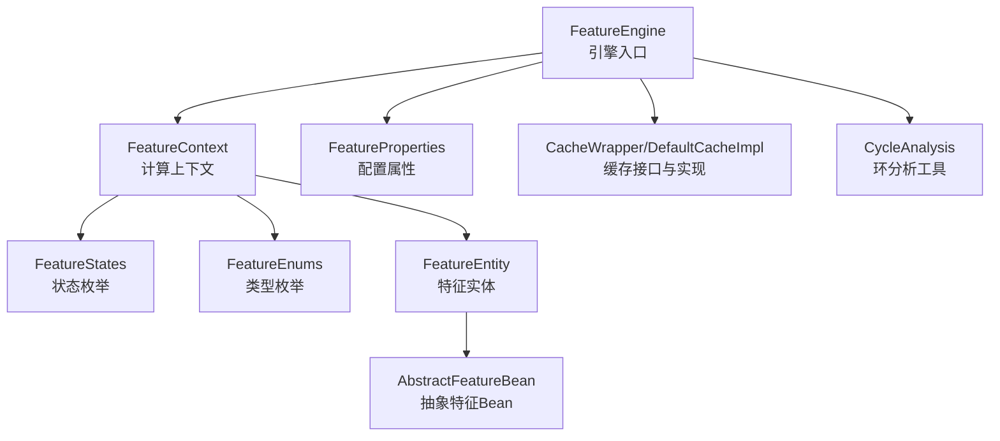
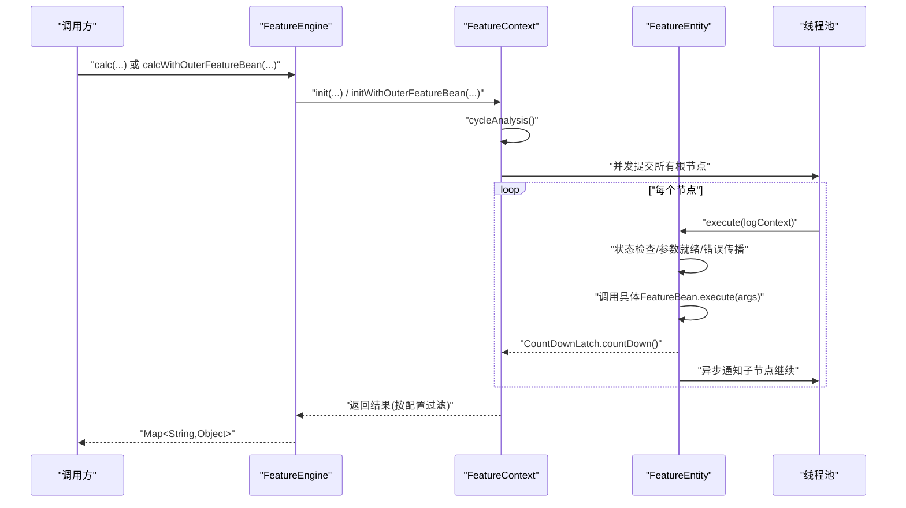
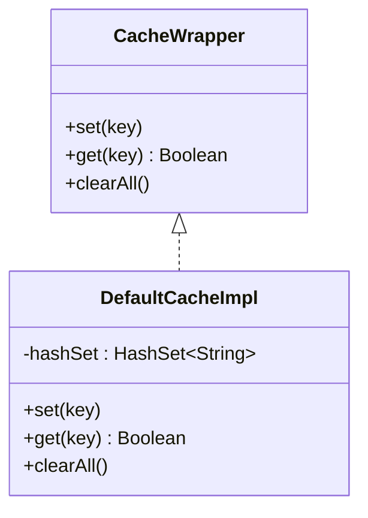
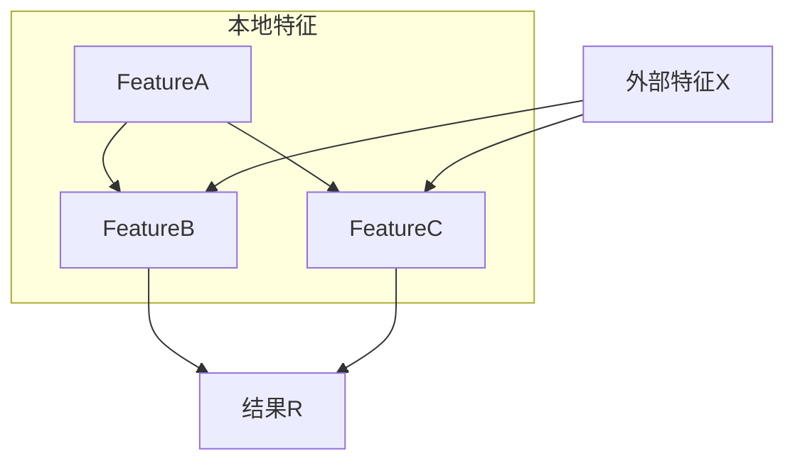
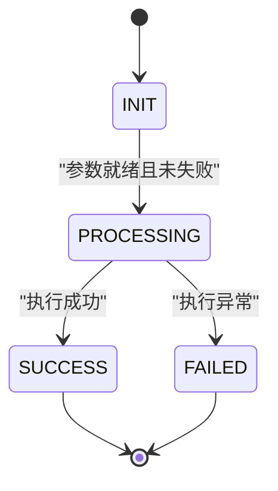
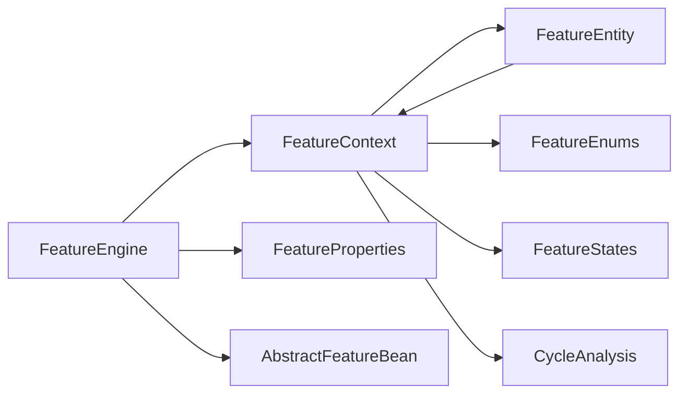
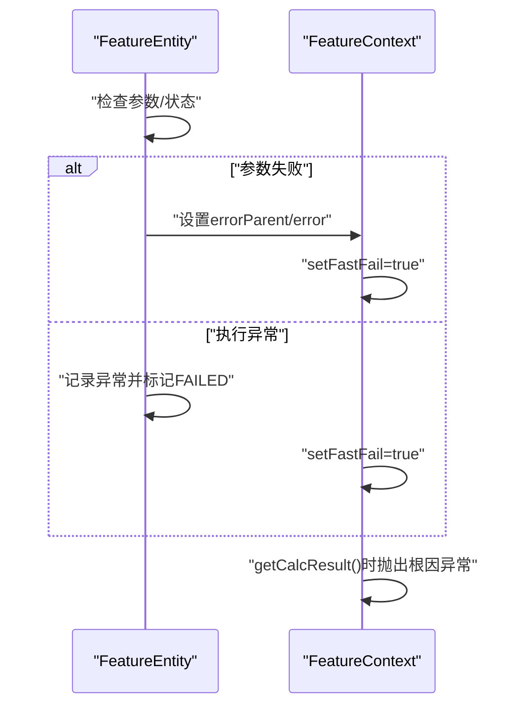

# 高级用法

<cite>
**本文引用的文件**
- [CycleAnalysis.java](file://src/main/java/com/github/zh/engine/tools/CycleAnalysis.java)
- [CacheWrapper.java](file://src/main/java/com/github/zh/engine/cache/CacheWrapper.java)
- [DefaultCacheImpl.java](file://src/main/java/com/github/zh/engine/cache/DefaultCacheImpl.java)
- [FeatureEntity.java](file://src/main/java/com/github/zh/engine/co/FeatureEntity.java)
- [FeatureContext.java](file://src/main/java/com/github/zh/engine/co/FeatureContext.java)
- [FeatureEngine.java](file://src/main/java/com/github/zh/engine/FeatureEngine.java)
- [FeatureEnums.java](file://src/main/java/com/github/zh/engine/enums/FeatureEnums.java)
- [FeatureStates.java](file://src/main/java/com/github/zh/engine/enums/FeatureStates.java)
- [IFeature.java](file://src/main/java/com/github/zh/engine/clz/IFeature.java)
- [AbstractFeature.java](file://src/main/java/com/github/zh/engine/clz/AbstractFeature.java)
- [AbstractFeatureBean.java](file://src/main/java/com/github/zh/engine/co/AbstractFeatureBean.java)
- [FeatureProperties.java](file://src/main/java/com/github/zh/engine/properties/FeatureProperties.java)
- [README.md](file://README.md)
- [Test.java](file://src/test/java/com/github/zh/feature/Test.java)
- [OuterFeatureBean.java](file://src/test/java/com/github/zh/bean/OuterFeatureBean.java)
</cite>

## 目录
1. [简介](#简介)
2. [项目结构](#项目结构)
3. [核心组件](#核心组件)
4. [架构总览](#架构总览)
5. [详细组件分析](#详细组件分析)
6. [依赖分析](#依赖分析)
7. [性能考虑](#性能考虑)
8. [故障排查指南](#故障排查指南)
9. [结论](#结论)
10. [附录](#附录)

## 简介
本指南面向具备一定基础的开发者，系统讲解本特征计算引擎的高级用法与最佳实践，重点覆盖以下主题：
- 循环依赖检测与规避策略
- 缓存系统实现与使用建议
- 复杂特征计算场景（多层依赖、条件计算、动态特征）
- 性能优化策略（并行度调优、内存管理、结果缓存）
- 故障排查与调试技巧（日志分析、性能监控、错误定位）
- 高级配置选项与扩展点

## 项目结构
项目采用按职责分层的组织方式，核心模块包括：
- 引擎入口与调度：FeatureEngine
- 计算上下文：FeatureContext
- 特征实体与状态：FeatureEntity、FeatureStates、FeatureEnums
- 缓存抽象与默认实现：CacheWrapper、DefaultCacheImpl
- 工具与分析：CycleAnalysis
- 配置与属性：FeatureProperties
- 接口与抽象：IFeature、AbstractFeature、AbstractFeatureBean
- 测试样例：Test、OuterFeatureBean

图表来源
- [FeatureEngine.java:1-172](file://src/main/java/com/github/zh/engine/FeatureEngine.java#L1-L172)
- [FeatureContext.java:1-298](file://src/main/java/com/github/zh/engine/co/FeatureContext.java#L1-L298)
- [FeatureEntity.java:1-155](file://src/main/java/com/github/zh/engine/co/FeatureEntity.java#L1-L155)
- [FeatureStates.java:1-33](file://src/main/java/com/github/zh/engine/enums/FeatureStates.java#L1-L33)
- [FeatureEnums.java:1-26](file://src/main/java/com/github/zh/engine/enums/FeatureEnums.java#L1-L26)
- [AbstractFeatureBean.java:1-28](file://src/main/java/com/github/zh/engine/co/AbstractFeatureBean.java#L1-L28)
- [FeatureProperties.java:1-37](file://src/main/java/com/github/zh/engine/properties/FeatureProperties.java#L1-L37)
- [CacheWrapper.java:1-30](file://src/main/java/com/github/zh/engine/cache/CacheWrapper.java#L1-L30)
- [DefaultCacheImpl.java:1-32](file://src/main/java/com/github/zh/engine/cache/DefaultCacheImpl.java#L1-L32)
- [CycleAnalysis.java:1-72](file://src/main/java/com/github/zh/engine/tools/CycleAnalysis.java#L1-L72)

章节来源
- [FeatureEngine.java:1-172](file://src/main/java/com/github/zh/engine/FeatureEngine.java#L1-L172)
- [FeatureContext.java:1-298](file://src/main/java/com/github/zh/engine/co/FeatureContext.java#L1-L298)
- [FeatureEntity.java:1-155](file://src/main/java/com/github/zh/engine/co/FeatureEntity.java#L1-L155)
- [FeatureStates.java:1-33](file://src/main/java/com/github/zh/engine/enums/FeatureStates.java#L1-L33)
- [FeatureEnums.java:1-26](file://src/main/java/com/github/zh/engine/enums/FeatureEnums.java#L1-L26)
- [AbstractFeatureBean.java:1-28](file://src/main/java/com/github/zh/engine/co/AbstractFeatureBean.java#L1-L28)
- [FeatureProperties.java:1-37](file://src/main/java/com/github/zh/engine/properties/FeatureProperties.java#L1-L37)
- [CacheWrapper.java:1-30](file://src/main/java/com/github/zh/engine/cache/CacheWrapper.java#L1-L30)
- [DefaultCacheImpl.java:1-32](file://src/main/java/com/github/zh/engine/cache/DefaultCacheImpl.java#L1-L32)
- [CycleAnalysis.java:1-72](file://src/main/java/com/github/zh/engine/tools/CycleAnalysis.java#L1-L72)

## 核心组件
- 引擎入口 FeatureEngine：负责接收输入、构建计算上下文、调度执行、收集结果；支持本地计算与外部Bean混合计算两种模式。
- 计算上下文 FeatureContext：维护特征实体池、线程池、倒计时门闩、快速失败标记；负责初始化、环分析、拓扑执行与结果汇总。
- 特征实体 FeatureEntity：封装单个特征的执行逻辑、状态机、父子依赖、结果与异常；支持异步通知子节点继续执行。
- 状态与类型 FeatureStates/FeatureEnums：定义特征生命周期状态与实体类型，用于控制执行流程与结果过滤。
- 缓存 CacheWrapper/DefaultCacheImpl：提供键存在性检查与清空能力，默认实现基于HashSet。
- 环分析 CycleAnalysis：提供基于颜色标记的环检测算法，辅助发现依赖环。
- 配置 FeatureProperties：提供线程池大小、最大并发、计算超时等关键参数。

章节来源
- [FeatureEngine.java:1-172](file://src/main/java/com/github/zh/engine/FeatureEngine.java#L1-L172)
- [FeatureContext.java:1-298](file://src/main/java/com/github/zh/engine/co/FeatureContext.java#L1-L298)
- [FeatureEntity.java:1-155](file://src/main/java/com/github/zh/engine/co/FeatureEntity.java#L1-L155)
- [FeatureStates.java:1-33](file://src/main/java/com/github/zh/engine/enums/FeatureStates.java#L1-L33)
- [FeatureEnums.java:1-26](file://src/main/java/com/github/zh/engine/enums/FeatureEnums.java#L1-L26)
- [CacheWrapper.java:1-30](file://src/main/java/com/github/zh/engine/cache/CacheWrapper.java#L1-L30)
- [DefaultCacheImpl.java:1-32](file://src/main/java/com/github/zh/engine/cache/DefaultCacheImpl.java#L1-L32)
- [CycleAnalysis.java:1-72](file://src/main/java/com/github/zh/engine/tools/CycleAnalysis.java#L1-L72)
- [FeatureProperties.java:1-37](file://src/main/java/com/github/zh/engine/properties/FeatureProperties.java#L1-L37)

## 架构总览
引擎采用“上下文驱动 + DAG 并行”的架构。FeatureEngine 作为门面，委托 FeatureContext 完成依赖解析、环检测、拓扑执行与结果聚合；FeatureEntity 作为最小执行单元，遵循状态机驱动的异步传播。

图表来源
- [FeatureEngine.java:86-161](file://src/main/java/com/github/zh/engine/FeatureEngine.java#L86-L161)
- [FeatureContext.java:49-61](file://src/main/java/com/github/zh/engine/co/FeatureContext.java#L49-L61)
- [FeatureEntity.java:48-123](file://src/main/java/com/github/zh/engine/co/FeatureEntity.java#L48-L123)

## 详细组件分析

### 循环依赖检测与处理机制
- 检测算法：CycleAnalysis 提供基于三色标记法的环检测，从“根节点”出发遍历，遇到已访问节点则判定为环。
- 当前版本限制：FeatureContext 中的环分析被注释掉，未抛出异常阻止执行，因此无法自动解决循环依赖。
- 规避策略：
  - 编码阶段确保无环：优先使用自顶向下设计，避免反向依赖。
  - 在环中引入“原始数据”节点：通过 FeatureContext 的原始数据注入能力，将环中的某个节点标记为已就绪，从而打断环路。
  - 分阶段计算：将大图拆分为多个子图，分别计算后再合并。

图表来源
- [CycleAnalysis.java:25-59](file://src/main/java/com/github/zh/engine/tools/CycleAnalysis.java#L25-L59)

章节来源
- [CycleAnalysis.java:1-72](file://src/main/java/com/github/zh/engine/tools/CycleAnalysis.java#L1-L72)
- [FeatureContext.java:133-139](file://src/main/java/com/github/zh/engine/co/FeatureContext.java#L133-L139)
- [README.md:162](file://README.md#L162)

### 缓存系统实现与使用方法
- 抽象接口 CacheWrapper：定义 set/get/clearAll 三个核心操作，用于键存在性检查与全局清理。
- 默认实现 DefaultCacheImpl：内部使用 HashSet 存储键，提供 O(1) 检索与插入能力。
- 使用建议：
  - 仅用于“存在性”判断，不承载业务数据。
  - 在大规模特征计算中，结合 FeatureEntity 的结果缓存（由引擎自动维护）使用，避免重复计算。
  - 清理时机：在一次完整计算周期结束后统一清理，防止跨请求污染。

图表来源
- [CacheWrapper.java:11-28](file://src/main/java/com/github/zh/engine/cache/CacheWrapper.java#L11-L28)
- [DefaultCacheImpl.java:13-31](file://src/main/java/com/github/zh/engine/cache/DefaultCacheImpl.java#L13-L31)

章节来源
- [CacheWrapper.java:1-30](file://src/main/java/com/github/zh/engine/cache/CacheWrapper.java#L1-L30)
- [DefaultCacheImpl.java:1-32](file://src/main/java/com/github/zh/engine/cache/DefaultCacheImpl.java#L1-L32)

### 复杂特征计算场景的解决方案
- 多层依赖：利用 FeatureEntity 的 parents/children 字段与拓扑执行，引擎自动保证父节点先于子节点执行。
- 条件计算：通过 FeatureContext 的快速失败机制（fastFail）与状态机（FAILED/SUCCESS），在任一父节点失败时快速短路。
- 动态特征：使用 calcWithOuterFeatureBean 将外部自定义 Bean 注入到上下文中，实现动态扩展与运行时组合。

图表来源
- [FeatureContext.java:100-128](file://src/main/java/com/github/zh/engine/co/FeatureContext.java#L100-L128)
- [FeatureEntity.java:125-134](file://src/main/java/com/github/zh/engine/co/FeatureEntity.java#L125-L134)

章节来源
- [FeatureContext.java:100-128](file://src/main/java/com/github/zh/engine/co/FeatureContext.java#L100-L128)
- [FeatureEntity.java:48-123](file://src/main/java/com/github/zh/engine/co/FeatureEntity.java#L48-L123)
- [Test.java:1-71](file://src/test/java/com/github/zh/feature/Test.java#L1-L71)
- [OuterFeatureBean.java:1-16](file://src/test/java/com/github/zh/bean/OuterFeatureBean.java#L1-L16)

### 并发模型与状态机
- 线程池：FeatureEngine 默认创建固定大小线程池，可通过构造参数注入自定义线程池。
- 状态机：FeatureStates 定义 INIT/PROCESSING/SUCCESS/FAILED 四种状态，FeatureEntity 依据状态机推进执行与通知。
- 异步传播：FeatureEntity 在执行完成后，通过线程池异步通知子节点继续执行，形成“边触发、边计算”的流水线。

图表来源
- [FeatureStates.java:9-31](file://src/main/java/com/github/zh/engine/enums/FeatureStates.java#L9-L31)
- [FeatureEntity.java:93-116](file://src/main/java/com/github/zh/engine/co/FeatureEntity.java#L93-L116)

章节来源
- [FeatureEngine.java:164-170](file://src/main/java/com/github/zh/engine/FeatureEngine.java#L164-L170)
- [FeatureEntity.java:48-123](file://src/main/java/com/github/zh/engine/co/FeatureEntity.java#L48-L123)
- [FeatureStates.java:1-33](file://src/main/java/com/github/zh/engine/enums/FeatureStates.java#L1-L33)

## 依赖分析
- 组件耦合：
  - FeatureEngine 依赖 FeatureContext、NativeFeatureProcessor（通过属性注入）、FeatureProperties。
  - FeatureContext 依赖 FeatureEntity、FeatureStates、FeatureEnums、CycleAnalysis。
  - FeatureEntity 依赖 FeatureContext、AbstractFeatureBean、线程池。
- 外部依赖：
  - Spring 相关（MDC、StopWatch、ConcurrentHashMap、CountDownLatch、ThreadPoolExecutor）。
  - Lombok（Builder/Data/Getter/Setter/Slf4j）。

图表来源
- [FeatureEngine.java:32-40](file://src/main/java/com/github/zh/engine/FeatureEngine.java#L32-L40)
- [FeatureContext.java:26-36](file://src/main/java/com/github/zh/engine/co/FeatureContext.java#L26-L36)
- [FeatureEntity.java:31-42](file://src/main/java/com/github/zh/engine/co/FeatureEntity.java#L31-L42)
- [FeatureEnums.java:9-25](file://src/main/java/com/github/zh/engine/enums/FeatureEnums.java#L9-L25)
- [FeatureStates.java:9-31](file://src/main/java/com/github/zh/engine/enums/FeatureStates.java#L9-L31)
- [CycleAnalysis.java:3](file://src/main/java/com/github/zh/engine/tools/CycleAnalysis.java#L3)

章节来源
- [FeatureEngine.java:1-172](file://src/main/java/com/github/zh/engine/FeatureEngine.java#L1-L172)
- [FeatureContext.java:1-298](file://src/main/java/com/github/zh/engine/co/FeatureContext.java#L1-L298)
- [FeatureEntity.java:1-155](file://src/main/java/com/github/zh/engine/co/FeatureEntity.java#L1-L155)
- [FeatureEnums.java:1-26](file://src/main/java/com/github/zh/engine/enums/FeatureEnums.java#L1-L26)
- [FeatureStates.java:1-33](file://src/main/java/com/github/zh/engine/enums/FeatureStates.java#L1-L33)
- [CycleAnalysis.java:1-72](file://src/main/java/com/github/zh/engine/tools/CycleAnalysis.java#L1-L72)

## 性能考虑
- 并行度调优
  - 线程池大小：feature.featureThreadPoolSize 与 feature.featureThreadPoolMaxSize 控制核心与最大线程数；默认为核心数×2。
  - 调整原则：CPU 密集型特征可适度降低；IO 密集型可适当提高。
- 内存管理
  - 使用 ConcurrentHashMap 作为特征池，减少锁竞争；避免在 FeatureBean 中持有大对象引用。
  - 合理设置 calcTimeout，防止长时间占用线程资源。
- 结果缓存
  - 引擎内部以 FeatureEntity.result 缓存计算结果；对外通过 getCalcResult 过滤输出字段。
  - 若需跨请求复用，建议在应用层结合 CacheWrapper 实现业务级缓存。

章节来源
- [FeatureProperties.java:31-35](file://src/main/java/com/github/zh/engine/properties/FeatureProperties.java#L31-L35)
- [FeatureEngine.java:164-170](file://src/main/java/com/github/zh/engine/FeatureEngine.java#L164-L170)
- [FeatureContext.java:26](file://src/main/java/com/github/zh/engine/co/FeatureContext.java#L26)
- [FeatureEntity.java:42](file://src/main/java/com/github/zh/engine/co/FeatureEntity.java#L42)
- [FeatureContext.java:277-288](file://src/main/java/com/github/zh/engine/co/FeatureContext.java#L277-L288)

## 故障排查指南
- 日志分析
  - 使用 MDC 上下文传递日志上下文，便于追踪一次计算链路。
  - 关注 FeatureEntity.execute 中的错误日志与耗时统计。
- 性能监控
  - 通过 StopWatch 记录每个特征的执行耗时，定位慢特征。
  - 结合线程池饱和与队列长度观察并发瓶颈。
- 错误定位
  - 快速失败：当任一父节点失败，引擎会标记 fastFail 并向上游回溯，最终抛出根因异常。
  - 根因定位：使用 getRootErrorFeature 获取首个失败特征，结合其 error 字段定位问题。
- 常见问题
  - 计算超时：增大 calcTimeout 或优化慢特征。
  - 环依赖：在环中任意节点注入原始数据以打破环，或重构依赖。

图表来源
- [FeatureEntity.java:80-116](file://src/main/java/com/github/zh/engine/co/FeatureEntity.java#L80-L116)
- [FeatureContext.java:266-275](file://src/main/java/com/github/zh/engine/co/FeatureContext.java#L266-L275)
- [FeatureContext.java:290-296](file://src/main/java/com/github/zh/engine/co/FeatureContext.java#L290-L296)

章节来源
- [FeatureEntity.java:48-123](file://src/main/java/com/github/zh/engine/co/FeatureEntity.java#L48-L123)
- [FeatureContext.java:266-296](file://src/main/java/com/github/zh/engine/co/FeatureContext.java#L266-L296)

## 结论
本引擎通过 DAG 编排与并行执行，有效消除了重复调用与串行瓶颈。在高级用法中，应重点关注环依赖的规避、缓存策略的选择、复杂场景的拆分与组合，以及性能参数的合理调优。通过日志与根因定位机制，可快速定位并解决问题。

## 附录
- 高级配置项
  - feature.featureThreadPoolSize：线程池核心线程数
  - feature.featureThreadPoolMaxSize：线程池最大线程数
  - feature.calcTimeout：计算超时时间（毫秒）
- 扩展点
  - 自定义 FeatureBean：继承 AbstractFeatureBean，实现 execute(args)
  - 外部 Bean 注入：通过 calcWithOuterFeatureBean 将外部 Bean 加入上下文
  - 后置处理器：实现 FeatureBeanPostProcessor 接口进行初始化后处理

章节来源
- [FeatureProperties.java:16-36](file://src/main/java/com/github/zh/engine/properties/FeatureProperties.java#L16-L36)
- [README.md:146-161](file://README.md#L146-L161)
- [README.md:164-244](file://README.md#L164-L244)
- [FeatureEngine.java:106-161](file://src/main/java/com/github/zh/engine/FeatureEngine.java#L106-L161)
- [AbstractFeatureBean.java:18-27](file://src/main/java/com/github/zh/engine/co/AbstractFeatureBean.java#L18-L27)