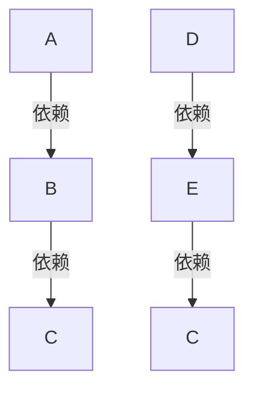
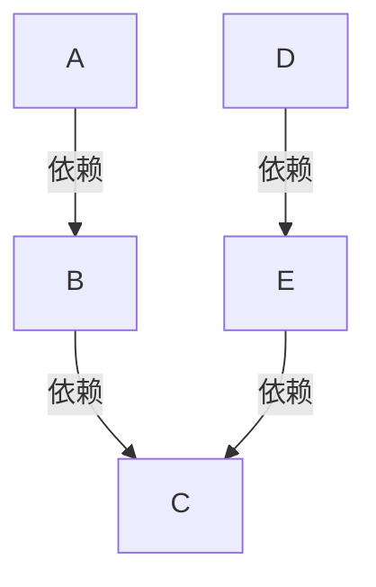

# feature
DAG图计算引擎

## 概述

对于很多元数据来说，某种数据的获取可能只需要一些入参和一些API调用，在进行一些计算，便可以将这个元数据加工出来。
那么对于一个集合的元数据运算，往往会有很多重复的调用接口或者调用调用同一个元数据的操作，这些操作往往是不必需要。
这个引擎简化了对于一个集合的元数据调用的运算次数，并且通过一个非常轻量级的方式嵌入到项目中。

### 对于旧的元数据调用方式


从上述的图可以看出，C调用了2次

### 对于新的元数据调用方式

通过这个计算引擎，C只调用了1次

## 用法

通过标注@Feature的形式，将方法转化为一个变量。

```Java
@FeatureComponent
public class Test {

    @Feature(name = "test5")
    public Double test5(Double test4){
        return test4 + 1.0;
    }
    
    @Feature(name = "test4")
    public Double test4(){
        return 1.0;
    }
}
```
> @Feature
> 标志这个方法是一个变量，name属性为最后生成该变量的名字（可与方法名不同），入参的类型和参数必须已有的变量相同，不支持同名变量。

> @FeatureComponent
> 作用在类上，标明这个类中有变量需要计算，并且集合了Spring中的@Component注解

---

通过Spring自动注入FeatureEngine，需要**originDataMap**原始数据 和**calcFeatures**需要被计算的变量名称。
返回一个计算完成的变量Map。
默认使用线程池进行并行计算（确保拓扑顺序），线程数为机器的核心数✖️2，可通过feature.featureThreadPoolSize更改。
现版本无法解决环依赖问题。

```Java
@Service
@Slf4j
public class FeatureService {

    @Autowired
    FeatureEngine featureEngine;

    public Map<String, Object> calc(Map<String, Object> originDataMap, Set<String> calcFeatures){
        return featureEngine.calc(originDataMap, calcFeatures);
    }

    public Map<String, Object> calcWithOuterFeatureBean(Map<String, Object> originDataMap, Set<String> calcFeatures){
        Map<String, OuterFeatureBean> map = new HashMap<>(1);
        map.put("zh", new OuterFeatureBean("zh", (a) -> 1));
        return featureEngine.calcWithOuterFeatureBean(originDataMap, calcFeatures, map);
    }
}
```


输入样例：
```json
{
  "features": [
    "test5"
  ],
  "initData": {
  	"zh":1
  }
}
```
输出样例：
```json
{
    "test4": 1,
    "test5": 2,
    "zh": 1
  }
```