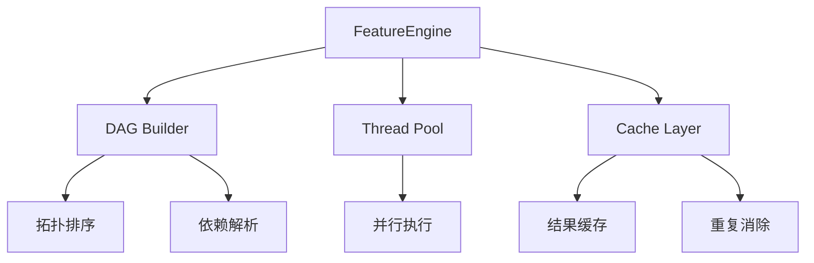
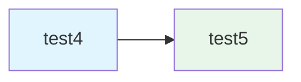
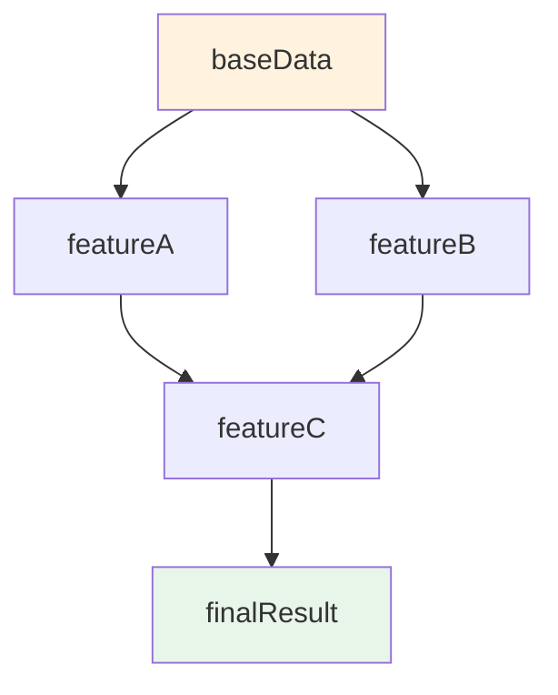
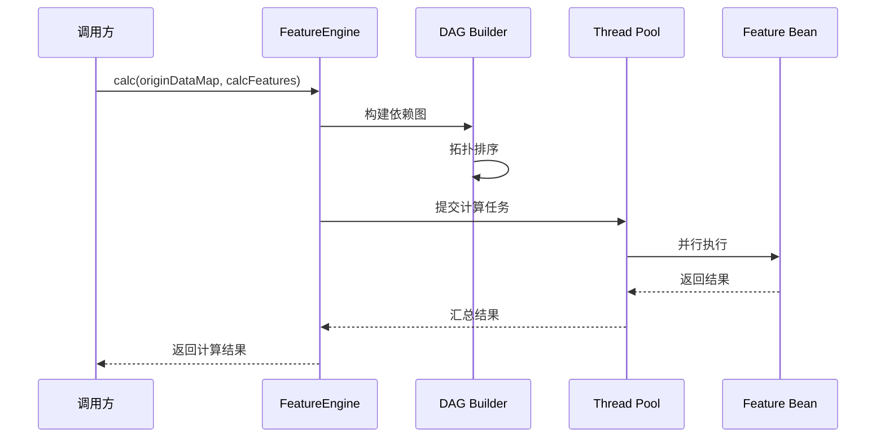
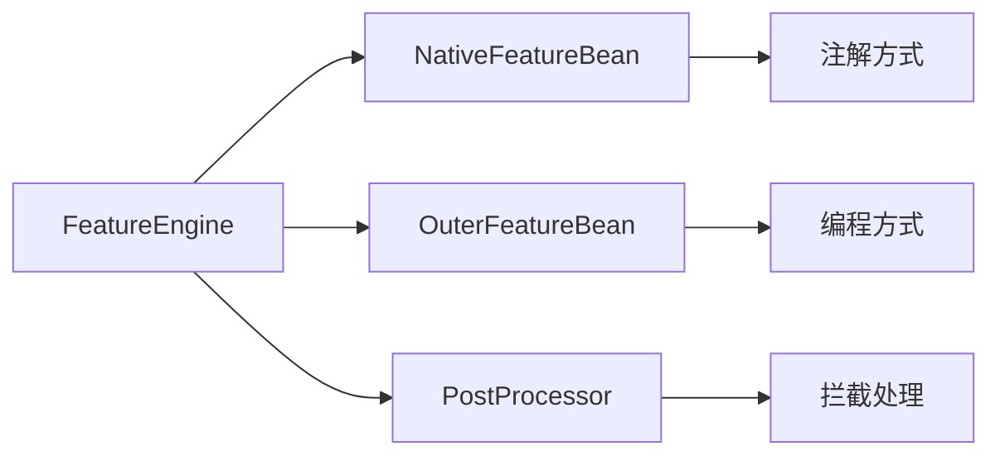

# Feature Engine

轻量级函数计算引擎，专为元数据、指标、特征、变量等**无副作用计算**场景设计。

## 概述

### 问题背景

对于元数据、指标、特征、变量等**不会导致外部状态变更的计算**来说，本质都是一种函数：通过入参、API 调用、数据库读取，再进行一系列运算加工，生成最终结果。

在传统的"烟囱模式"下，函数集合的运算往往存在：
- 重复的接口调用
- 重复的函数执行
- 串行执行效率低下

### 解决方案

本引擎通过**DAG（有向无环图）编排**和**并行计算**，实现：
- 消除重复调用
- 自动并行执行
- 轻量级嵌入（Spring Boot Starter）

### 架构图


```mermaid
graph TD
    A[FeatureEngine] --> B[DAG Builder]
    A --> C[Thread Pool]
    A --> D[Cache Layer]
    B --> E[拓扑排序]
    B --> F[依赖解析]
    C --> G[并行执行]
    D --> H[结果缓存]
    D --> I[重复消除]
```

### 对比示意

#### 烟囱模式调用


外部 API 调用了 **2 次**

#### 拓扑顺序调用


**通过计算引擎，外部 API 只调用 1 次，并实现计算并行化**

## 快速开始

### 环境要求

- JDK 8+
- Spring Boot 2.x

### Maven 依赖

```xml
<dependency>
    <groupId>com.github.zh</groupId>
    <artifactId>feature-spring-boot-starter</artifactId>
    <version>1.0.0</version>
</dependency>
```

### 编译配置

> **注意**：若出现找不到 `arg0` 变量的错误，需要在项目中增加 `-parameters` 编译参数。

```xml
<plugin>
    <groupId>org.apache.maven.plugins</groupId>
    <artifactId>maven-compiler-plugin</artifactId>
    <version>3.8.1</version>
    <configuration>
        <source>8</source>
        <target>8</target>
        <encoding>UTF-8</encoding>
        <!-- 重要：必须添加 -->
        <compilerArgs>
            <arg>-parameters</arg>
        </compilerArgs>
    </configuration>
</plugin>
```

## 核心概念

### 注解说明

| 注解 | 作用位置 | 说明 |
|------|----------|------|
| `@FeatureClass` | 类 | 标识该类包含特征函数，需配合 `@Component` 使用 |
| `@Feature` | 方法 | 标识该方法为特征函数，`name` 属性指定函数名（可与方法名不同） |

### 依赖关系

引擎根据函数入参名称自动识别依赖关系，生成 DAG 图进行拓扑排序执行。

**示例**：`test5` 依赖 `test4`


```mermaid
graph LR
    A[test4] --> B[test5]
    style A fill:#e1f5fe
    style B fill:#e8f5e9
```

**复杂依赖示例**：


```mermaid
graph TD
    A[baseData] --> B[featureA]
    A --> C[featureB]
    B --> D[featureC]
    C --> D
    D --> E[finalResult]
    
    style A fill:#fff3e0
    style E fill:#e8f5e9
```

```
@FeatureClass
@Component
public class Test {
    //   		⬇️代表函数名称
    @Feature(name = "test5")
    //				⬇️ 依赖的函数名称
    public Double test5(Double test4){
        return test4 + 1.0;
    }
    
    @Feature(name = "test4")
    public Double test4(){
        return 1.0;
    }
}
```

- 函数 `test5` 的入参名为 `test4`，引擎自动识别依赖关系
- 计算时先执行 `test4`，再将结果作为 `test5` 的入参

### 执行流程


```mermaid
sequenceDiagram
    participant Client as 调用方
    participant Engine as FeatureEngine
    participant DAG as DAG Builder
    participant Pool as Thread Pool
    participant Feature as Feature Bean

    Client->>Engine: calc(originDataMap, calcFeatures)
    Engine->>DAG: 构建依赖图
    DAG->>DAG: 拓扑排序
    Engine->>Pool: 提交计算任务
    Pool->>Feature: 并行执行
    Feature-->>Pool: 返回结果
    Pool-->>Engine: 汇总结果
    Engine-->>Client: 返回计算结果
```

## 使用示例

### 调用计算引擎

```java
@Service
public class FeatureService {

    @Autowired
    private FeatureEngine featureEngine;

    public Map<String, Object> calc(Map<String, Object> originDataMap, Set<String> calcFeatures) {
        return featureEngine.calc(originDataMap, calcFeatures);
    }
}
```

### 输入输出示例

**输入**：
```json
{
  "calcFeatures": ["test5"],
  "originDataMap": {}
}
```

**输出**：
```json
{
  "test4": 1,
  "test5": 2
}
```

## 配置参数

| 配置项 | 默认值 | 说明 |
|--------|--------|------|
| `feature.featureThreadPoolSize` | CPU 核心数 | 线程池核心线程数 |
| `feature.featureThreadPoolMaxSize` | CPU 核心数 × 2 | 线程池最大线程数 |
| `feature.calcTimeout` | 5000 ms | 计算超时时间 |

**application.yml 示例**：
```yaml
feature:
  featureThreadPoolSize: 4
  featureThreadPoolMaxSize: 8
  calcTimeout: 10000
```

> **注意**：当前版本无法自动解决循环依赖问题，请在编码时确保无循环依赖，或在环中任意节点提供原始数据以打破循环。

## 高级功能

### 功能扩展架构


```mermaid
graph LR
    A[FeatureEngine] --> B[NativeFeatureBean]
    A --> C[OuterFeatureBean]
    A --> D[PostProcessor]
    B --> E[注解方式]
    C --> F[编程方式]
    D --> G[拦截处理]
```

### 自定义计算 Bean

通过继承 `AbstractFeatureBean` 来自定义计算 Bean。

#### AbstractFeatureBean 属性说明

```java
public abstract class AbstractFeatureBean implements IFeatureBean {

    // 必要：函数名称
    protected String name;

    // 可选：是否输出到结果
    protected boolean output;

    // 可选：依赖的其他 Bean 名称列表
    protected List<String> parents;

    // 自动生成：被依赖的 Bean 名称列表
    protected List<String> children;
}
```

#### 自定义 Bean 示例

```java
public class OuterFeatureBean extends AbstractFeatureBean {

    private Function<Object[], Object> fn;

    @Override
    public Object execute(Object[] args) {
        return fn.apply(args);
    }

    public OuterFeatureBean(String name, Function<Object[], Object> fn) {
        this.name = name;
        this.fn = fn;
    }
}
```

#### 使用外部 Bean 进行计算

```java
@Service
@Slf4j
public class FeatureService {

    @Autowired
    private FeatureEngine featureEngine;

    public Map<String, Object> calcWithOuterFeatureBean(
            Map<String, Object> originDataMap, 
            Set<String> calcFeatures) {
        
        Map<String, OuterFeatureBean> map = new HashMap<>();
        map.put("zh", new OuterFeatureBean("zh", (a) -> 1));
        
        return featureEngine.calcWithOuterFeatureBean(
            originDataMap, calcFeatures, map);
    }
}
```

### FeatureBean 后置处理器

实现 `FeatureBeanPostProcessor` 接口，可在 Bean 初始化后进行自定义处理（类似 Spring 的 `BeanPostProcessor`）。

```java
public interface FeatureBeanPostProcessor {

    @Nullable
    default <T extends AbstractFeatureBean> T postProcessAfterInitializationFeature(
            T featureBean, String featureBeanName) throws BeansException {
        return featureBean;
    }
}
```

## API 参考

### FeatureEngine 主要方法

| 方法 | 说明 |
|------|------|
| `calc(originDataMap, calcFeatures)` | 基础计算方法 |
| `calc(originDataMap, calcFeatures, timeout)` | 带超时时间的计算 |
| `calc(originDataMap, calcFeatures, debug)` | 开启 Debug 模式 |
| `calcWithOuterFeatureBean(...)` | 结合外部 Bean 计算 |
