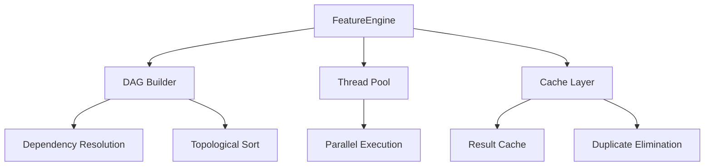
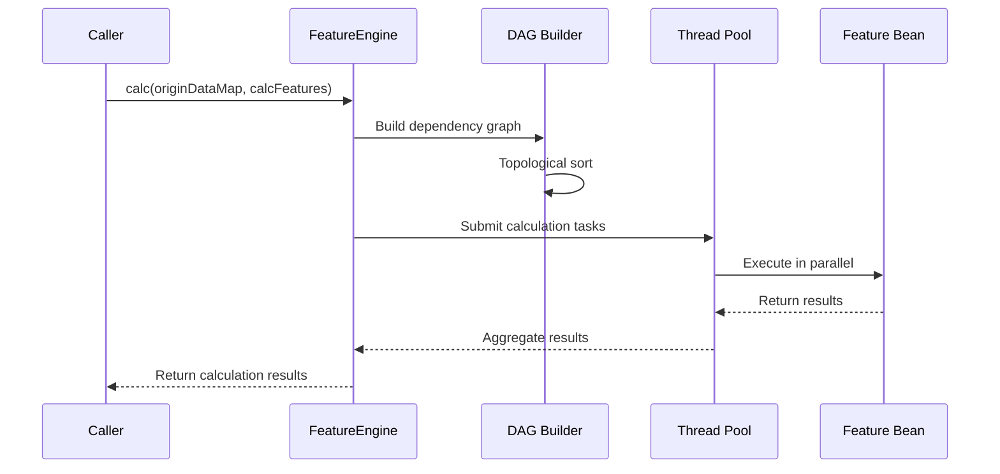
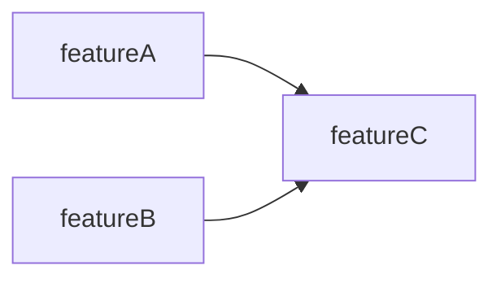
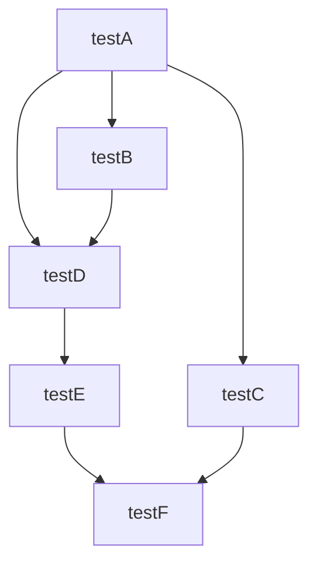

# Feature Engine

**Lightweight Function Calculation Orchestration Engine** — Making Complex Calculations Simple


---

## Have You Encountered These Problems?

In business development, we often need to calculate various metrics, features, and variables. As business complexity increases, the dependencies between these calculation functions become increasingly difficult to manage:

| Pain Point | Description |
|------------|-------------|
| 🔗 **Complex Dependency Management** | Functions have complex dependencies; manual call order management is error-prone and hard to maintain |
| 🐢 **Inefficient Serial Execution** | Want to parallelize independent tasks for better performance, but manual thread management is too complex |
| 🔄 **Redundant Calls** | Multiple functions call the same external API or depend on the same intermediate results, causing performance waste |
| 🔁 **Circular Dependencies** | Circular dependencies may exist between functions, hard to detect during development |
| 📝 **Verbose Orchestration Code** | Want to declaratively define calculation flow instead of writing extensive orchestration and scheduling code |

---

## How Feature Engine Solves It

Feature Engine is a **DAG (Directed Acyclic Graph)** based function calculation orchestration engine. You only need to declare functions and their dependencies via annotations. The engine automatically builds the dependency graph, intelligently schedules execution order, parallelizes independent tasks, and caches calculation results — letting you focus on business logic itself.

---

## Core Advantages

| Advantage | Description |
|-----------|-------------|
| 📋 **Declarative Orchestration** | Declare function dependencies via `@Feature` annotation, zero orchestration code |
| 🔀 **Automatic DAG Building** | Engine automatically analyzes dependencies based on parameter names, builds DAG |
| ⚡ **Intelligent Parallel Execution** | Functions without dependencies automatically execute in parallel, maximizing CPU utilization |
| 🎯 **Duplicate Call Elimination** | Same function executes only once, results automatically cached and reused |
| 🔍 **Circular Dependency Detection** | Automatically detects circular dependencies at startup, exposing problems early |
| 🍃 **Seamless Spring Boot Integration** | Zero-configuration starter, works out of the box |
| 🔧 **Highly Extensible** | Supports external Bean injection, post-processors for custom logic |

---

## Architecture Diagram


```mermaid
graph TD
    A[FeatureEngine] --> B[DAG Builder]
    A --> C[Thread Pool]
    A --> D[Cache Layer]
    B --> E[Dependency Resolution]
    B --> F[Topological Sort]
    C --> G[Parallel Execution]
    D --> H[Result Cache]
    D --> I[Duplicate Elimination]
```

### Execution Flow


```mermaid
sequenceDiagram
    participant Client as Caller
    participant Engine as FeatureEngine
    participant DAG as DAG Builder
    participant Pool as Thread Pool
    participant Feature as Feature Bean

    Client->>Engine: calc(originDataMap, calcFeatures)
    Engine->>DAG: Build dependency graph
    DAG->>DAG: Topological sort
    Engine->>Pool: Submit calculation tasks
    Pool->>Feature: Execute in parallel
    Feature-->>Pool: Return results
    Pool-->>Engine: Aggregate results
    Engine-->>Client: Return calculation results
```

---

## Quick Start

### Requirements

- JDK 8+
- Spring Boot 2.x

### 1. Add Maven Dependency

```xml
<dependency>
    <groupId>top.volusus</groupId>
    <artifactId>feature-spring-boot-starter</artifactId>
    <version>2.2.0</version>
</dependency>
```

### 2. Define Feature Class

```java
@FeatureClass
@Component
public class MyFeatures {

    // Basic function without dependencies
    @Feature
    public Integer baseValue() {
        return 5;
    }

    // Function depending on baseValue (parameter name = depended function name)
    @Feature
    public Integer derivedValue(Integer baseValue) {
        return baseValue + 1;
    }

    // Function with multiple dependencies
    @Feature
    public Integer finalResult(Integer baseValue, Integer derivedValue) {
        return baseValue + derivedValue;
    }
}
```

### 3. Call the Calculation Engine

```java
@Service
public class FeatureService {

    @Autowired
    private FeatureEngine featureEngine;

    public Map<String, Object> calculate() {
        // Specify target functions to calculate
        Set<String> calcFeatures = Set.of("finalResult");
        
        // Engine automatically resolves dependencies, executes in parallel, returns results
        return featureEngine.calc(null, calcFeatures);
    }
}
```

**Output**:
```json
{
  "baseValue": 5,
  "derivedValue": 6,
  "finalResult": 11
}
```

---

## Core Concepts

### @FeatureClass

Marks a class as a feature container, must be used with `@Component` to make it a Spring Bean.

```java
@FeatureClass
@Component
public class MyFeatures { ... }
```

### @Feature

Marks a method as a feature function.

| Attribute | Type | Default | Description |
|-----------|------|---------|-------------|
| `name` | String | Method name | Unique identifier for the feature |
| `output` | boolean | `true` | Whether to output to results |

```java
@Feature(name = "customName", output = true)
public Integer myFeature() { ... }
```

### Dependency Resolution Rules

The engine automatically identifies dependencies through **method parameter names**:

```java
@Feature
public Integer featureC(Integer featureA, Integer featureB) {
    // featureC depends on featureA and featureB
    return featureA + featureB;
}
```

Dependency diagram:


```mermaid
graph LR
    A[featureA] --> C[featureC]
    B[featureB] --> C
```

---

## Usage Examples

### Simple Dependency Example

```java
@FeatureClass
@Component
public class SimpleFeatures {

    @Feature
    public Integer step1() {
        return 10;
    }

    @Feature
    public Integer step2(Integer step1) {
        return step1 * 2;
    }
}
```

### Complex Dependency (Multi-level) Example

```java
@FeatureClass
@Component
public class ComplexFeatures {

    @Feature
    public Integer testA() {
        return 5;
    }

    @Feature(output = false)  // Intermediate result, not output
    public Integer testB(Integer testA) {
        return testA + 1;
    }

    @Feature(output = false)
    public Integer testC(Integer testA) {
        return testA + 1;
    }

    @Feature
    public Integer testD(Integer testB, Integer testA) {
        return testB + testA;  // 6 + 5 = 11
    }

    @Feature
    public Map<String, Integer> testE(Integer testD) {
        return Map.of("testD", testD);
    }

    @Feature
    public Integer testF(Map<String, Integer> testE, Integer testC) {
        return 1;
    }
}
```

Dependency graph:


```mermaid
graph TD
    A[testA] --> B[testB]
    A --> C[testC]
    A --> D[testD]
    B --> D
    D --> E[testE]
    E --> F[testF]
    C --> F
```

### External Bean Integration Example

Dynamically inject external calculation logic:

```java
public class OuterFeatureBean extends AbstractFeatureBean {
    @Override
    public Object execute(Object[] args) {
        // Custom calculation logic
        return args[0];
    }
}

// Using external Bean
@Service
public class FeatureService {

    @Autowired
    private FeatureEngine featureEngine;

    public Map<String, Object> calcWithOuter() {
        Map<String, AbstractFeatureBean> outerBeans = new HashMap<>();
        
        OuterFeatureBean outer = new OuterFeatureBean();
        outer.setName("outerFeature");
        outer.setParents(List.of("testE"));  // Depends on testE
        outer.setOutput(true);
        outerBeans.put(outer.getName(), outer);
        
        return featureEngine.calcWithOuterFeatureBean(
            null, 
            Set.of("testF"), 
            outerBeans
        );
    }
}
```

### Post-Processor Example

Custom processing after feature Bean initialization:

```java
@Component
public class MyPostProcessor implements FeatureBeanPostProcessor<NativeFeatureBean> {

    @Override
    public NativeFeatureBean postProcessAfterInitializationFeature(NativeFeatureBean bean) {
        // Custom processing logic
        System.out.println("Processing: " + bean.getName());
        return bean;
    }

    @Override
    public Class<?> returnClass() {
        return NativeFeatureBean.class;
    }
}
```

---

## Configuration Parameters

Configure in `application.yml`:

```yaml
top:
  volusus:
    engine:
      feature:
        featureThreadPoolSize: 16
        featureThreadPoolMaxSize: 32
        calcTimeout: 10000
        threadPoolNamePrefix: "feature-pool-"
```

| Configuration | Type | Default | Description |
|---------------|------|---------|-------------|
| `featureThreadPoolSize` | Integer | CPU cores × 2 | Thread pool core size |
| `featureThreadPoolMaxSize` | Integer | CPU cores × 2 | Thread pool max size |
| `calcTimeout` | Integer | 10000 (ms) | Calculation timeout |
| `threadPoolNamePrefix` | String | "feature-pool-" | Thread pool name prefix |

### Thread Pool Configuration Recommendations

| Scenario | Core Threads | Max Threads | Description |
|----------|--------------|-------------|-------------|
| CPU-bound | CPU cores | CPU cores | Avoid excessive context switching |
| IO-bound | CPU cores × 2 | CPU cores × 4 | Utilize IO wait time |
| Mixed | CPU cores | CPU cores × 2 | Balance both |

---

## Build Configuration

> **Important**: Enable `-parameters` compiler argument to retain method parameter names for dependency resolution.

```xml
<plugin>
    <groupId>org.apache.maven.plugins</groupId>
    <artifactId>maven-compiler-plugin</artifactId>
    <version>3.8.1</version>
    <configuration>
        <source>8</source>
        <target>8</target>
        <encoding>UTF-8</encoding>
        <compilerArgs>
            <arg>-parameters</arg>
        </compilerArgs>
    </configuration>
</plugin>
```

---

## Troubleshooting

### 1. Resolution Failure Due to Missing `-parameters`

**Symptom**: Exception at runtime indicating missing parameter names like `arg0`, `arg1`.

**Cause**: Java compiler doesn't retain method parameter names by default.

**Solution**:
- Add the above build configuration to `pom.xml`
- If using IntelliJ IDEA, add `-parameters` in `Settings` → `Build, Execution, Deployment` → `Compiler` → `Java Compiler`

### 2. Exceptions Due to Circular Dependencies

**Symptom**: Circular dependency detection exception at startup, or infinite loop/stack overflow during calculation.

**Cause**: Circular dependencies exist between Features (A → B → C → A).

**Solution**:
- Check Feature method parameter dependencies to ensure no cycles
- Provide raw data via `originDataMap` at a node in the cycle to break it

### 3. Calculation Timeout

**Symptom**: Calculation timeout exception thrown.

**Solution**:
- Check execution time of individual Features
- Adjust `calcTimeout` configuration appropriately
- Optimize long-running Feature implementations

---

## API Reference

### FeatureEngine Main Methods

| Method | Description |
|--------|-------------|
| `calc(originDataMap, calcFeatures)` | Basic calculation method |
| `calc(originDataMap, calcFeatures, timeout)` | Calculation with timeout |
| `calc(originDataMap, calcFeatures, debug)` | Returns all intermediate results when debug=true |
| `calcWithOuterFeatureBean(...)` | Calculation combined with external Beans |

---

## Contributing

Contributions are welcome! See [CONTRIBUTING.md](CONTRIBUTING.md) for details.

## License

This project is licensed under the [MIT](LICENSE) License.
