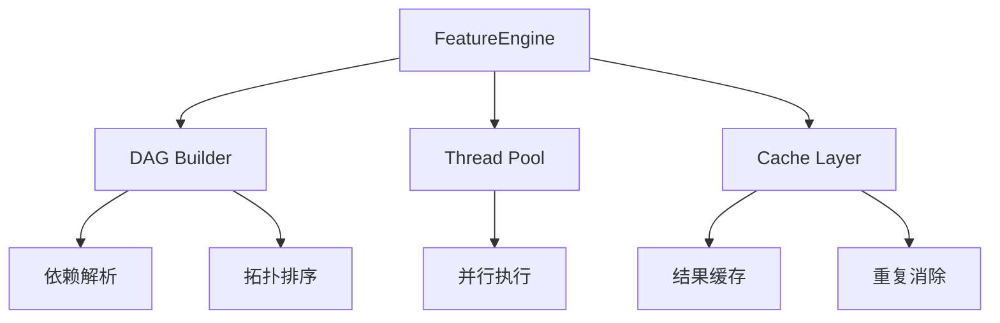
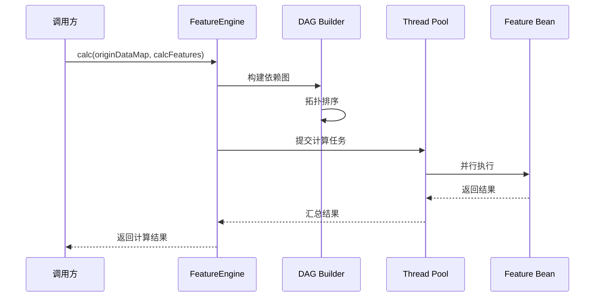
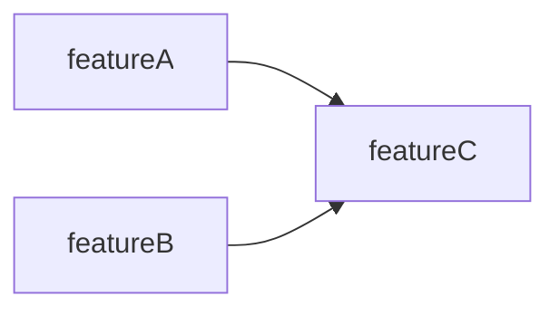
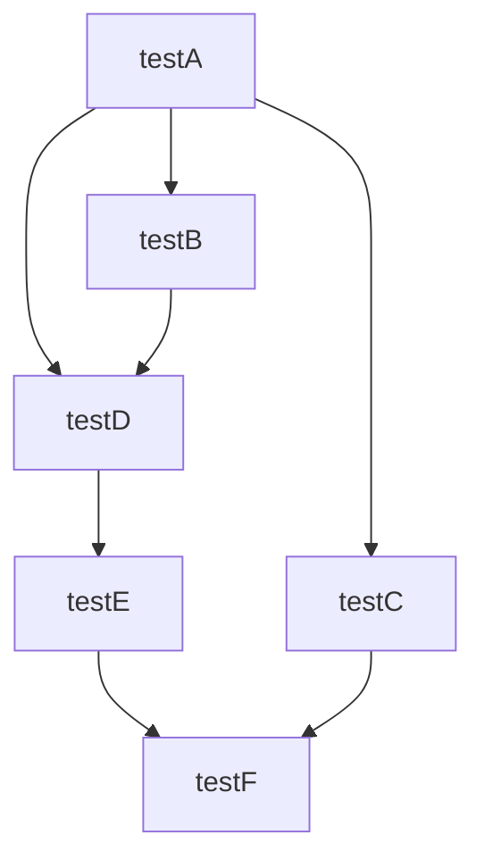

# Feature Engine

**轻量级函数计算编排引擎** —— 让复杂计算变得简单


---

## 你是否遇到过这些问题？

在业务开发中，我们经常需要计算各种指标、特征、变量。随着业务复杂度增加，这些计算函数之间的依赖关系变得越来越难以管理：

| 痛点 | 描述 |
|------|------|
| 🔗 **依赖管理混乱** | 大量函数之间有复杂的依赖关系，手动管理调用顺序容易出错、难以维护 |
| 🐢 **串行执行低效** | 想并行执行独立计算任务以提升性能，但手动管理线程太复杂 |
| 🔄 **重复调用浪费** | 多个函数调用同一个外部 API 或依赖相同的中间结果，造成性能浪费 |
| 🔁 **循环依赖难查** | 函数之间可能存在循环依赖，难以在开发阶段发现 |
| 📝 **编排代码冗长** | 想要声明式地定义计算流程，而不是写大量的编排和调度代码 |

---

## Feature Engine 如何解决？

Feature Engine 是一个基于 **DAG（有向无环图）** 的函数计算编排引擎。你只需通过注解声明函数及其依赖关系，引擎会自动构建依赖图、智能调度执行顺序、并行执行无依赖任务、缓存计算结果 —— 让你专注于业务逻辑本身。

---

## 核心优势

| 优势 | 说明 |
|------|------|
| 📋 **声明式编排** | 通过 `@Feature` 注解声明函数依赖，零编排代码 |
| 🔀 **自动 DAG 构建** | 引擎根据参数名自动分析依赖关系，构建有向无环图 |
| ⚡ **智能并行执行** | 无依赖的函数自动并行，最大化利用 CPU 资源 |
| 🎯 **重复调用消除** | 同一函数只执行一次，结果自动缓存复用 |
| 🔍 **循环依赖检测** | 启动时自动检测循环依赖，提前暴露问题 |
| 🍃 **Spring Boot 无缝集成** | Starter 方式零配置接入，开箱即用 |
| 🔧 **高度可扩展** | 支持外部 Bean 注入、后置处理器自定义逻辑 |

---

## 架构图



### 执行流程



---

## 快速开始

### 环境要求

- JDK 8+
- Spring Boot 2.x

### 1. 添加 Maven 依赖

```xml
<dependency>
    <groupId>top.volusus</groupId>
    <artifactId>feature-spring-boot-starter</artifactId>
    <version>2.1.0</version>
</dependency>
```

### 2. 定义特征类

```java
@FeatureClass
@Component
public class MyFeatures {

    // 无依赖的基础函数
    @Feature
    public Integer baseValue() {
        return 5;
    }

    // 依赖 baseValue 的函数（参数名 = 依赖的函数名）
    @Feature
    public Integer derivedValue(Integer baseValue) {
        return baseValue + 1;
    }

    // 多依赖的函数
    @Feature
    public Integer finalResult(Integer baseValue, Integer derivedValue) {
        return baseValue + derivedValue;
    }
}
```

### 3. 调用计算引擎

```java
@Service
public class FeatureService {

    @Autowired
    private FeatureEngine featureEngine;

    public Map<String, Object> calculate() {
        // 指定要计算的目标函数
        Set<String> calcFeatures = Set.of("finalResult");
        
        // 引擎自动解析依赖、并行执行、返回结果
        return featureEngine.calc(null, calcFeatures);
    }
}
```

**输出结果**：
```json
{
  "baseValue": 5,
  "derivedValue": 6,
  "finalResult": 11
}
```

---

## 核心概念

### @FeatureClass

标识一个类为特征容器，需配合 `@Component` 使用，使其成为 Spring Bean。

```java
@FeatureClass
@Component
public class MyFeatures { ... }
```

### @Feature

标识方法为特征函数。

| 属性 | 类型 | 默认值 | 说明 |
|------|------|--------|------|
| `name` | String | 方法名 | 特征的唯一名称 |
| `output` | boolean | `true` | 是否输出到结果中 |

```java
@Feature(name = "customName", output = true)
public Integer myFeature() { ... }
```

### 依赖解析规则

引擎通过 **方法参数名** 自动识别依赖关系：

```java
@Feature
public Integer featureC(Integer featureA, Integer featureB) {
    // featureC 依赖 featureA 和 featureB
    return featureA + featureB;
}
```

依赖关系示意：



---

## 使用示例

### 简单依赖示例

```java
@FeatureClass
@Component
public class SimpleFeatures {

    @Feature
    public Integer step1() {
        return 10;
    }

    @Feature
    public Integer step2(Integer step1) {
        return step1 * 2;
    }
}
```

### 复杂依赖（多层级）示例

```java
@FeatureClass
@Component
public class ComplexFeatures {

    @Feature
    public Integer testA() {
        return 5;
    }

    @Feature(output = false)  // 中间结果，不输出
    public Integer testB(Integer testA) {
        return testA + 1;
    }

    @Feature(output = false)
    public Integer testC(Integer testA) {
        return testA + 1;
    }

    @Feature
    public Integer testD(Integer testB, Integer testA) {
        return testB + testA;  // 6 + 5 = 11
    }

    @Feature
    public Map<String, Integer> testE(Integer testD) {
        return Map.of("testD", testD);
    }

    @Feature
    public Integer testF(Map<String, Integer> testE, Integer testC) {
        return 1;
    }
}
```

依赖关系图：



### 外部 Bean 集成示例

动态注入外部计算逻辑：

```java
public class OuterFeatureBean extends AbstractFeatureBean {
    @Override
    public Object execute(Object[] args) {
        // 自定义计算逻辑
        return args[0];
    }
}

// 使用外部 Bean
@Service
public class FeatureService {

    @Autowired
    private FeatureEngine featureEngine;

    public Map<String, Object> calcWithOuter() {
        Map<String, AbstractFeatureBean> outerBeans = new HashMap<>();
        
        OuterFeatureBean outer = new OuterFeatureBean();
        outer.setName("outerFeature");
        outer.setParents(List.of("testE"));  // 依赖 testE
        outer.setOutput(true);
        outerBeans.put(outer.getName(), outer);
        
        return featureEngine.calcWithOuterFeatureBean(
            null, 
            Set.of("testF"), 
            outerBeans
        );
    }
}
```

### 后置处理器示例

在特征 Bean 初始化后进行自定义处理：

```java
@Component
public class MyPostProcessor implements FeatureBeanPostProcessor<NativeFeatureBean> {

    @Override
    public NativeFeatureBean postProcessAfterInitializationFeature(NativeFeatureBean bean) {
        // 自定义处理逻辑
        System.out.println("Processing: " + bean.getName());
        return bean;
    }

    @Override
    public Class<?> returnClass() {
        return NativeFeatureBean.class;
    }
}
```

---

## 配置参数

在 `application.yml` 中配置：

```yaml
top:
  volusus:
    engine:
      feature:
        featureThreadPoolSize: 16
        featureThreadPoolMaxSize: 32
        calcTimeout: 10000
        threadPoolNamePrefix: "feature-pool-"
```

| 配置项 | 类型 | 默认值 | 说明 |
|--------|------|--------|------|
| `featureThreadPoolSize` | Integer | CPU 核心数 × 2 | 线程池核心线程数 |
| `featureThreadPoolMaxSize` | Integer | CPU 核心数 × 2 | 线程池最大线程数 |
| `calcTimeout` | Integer | 10000 (ms) | 计算超时时间 |
| `threadPoolNamePrefix` | String | "feature-pool-" | 线程池名称前缀 |

### 线程池配置建议

| 场景 | 核心线程数 | 最大线程数 | 说明 |
|------|-----------|-----------|------|
| CPU 密集型 | CPU 核心数 | CPU 核心数 | 避免过多线程切换 |
| IO 密集型 | CPU 核心数 × 2 | CPU 核心数 × 4 | 利用 IO 等待时间 |
| 混合型 | CPU 核心数 | CPU 核心数 × 2 | 平衡两者 |

---

## 编译配置

> **重要**：需要在项目中启用 `-parameters` 编译参数，以保留方法参数名用于依赖解析。

```xml
<plugin>
    <groupId>org.apache.maven.plugins</groupId>
    <artifactId>maven-compiler-plugin</artifactId>
    <version>3.8.1</version>
    <configuration>
        <source>8</source>
        <target>8</target>
        <encoding>UTF-8</encoding>
        <compilerArgs>
            <arg>-parameters</arg>
        </compilerArgs>
    </configuration>
</plugin>
```

---

## Troubleshooting

### 1. 编译参数 `-parameters` 未启用导致的解析失败

**症状**：运行时抛出异常，提示找不到 `arg0`、`arg1` 等参数名。

**原因**：Java 编译器默认不保留方法参数名。

**解决方案**：
- 在 `pom.xml` 中添加上述编译配置
- 如果使用 IntelliJ IDEA，在 `Settings` → `Build, Execution, Deployment` → `Compiler` → `Java Compiler` 中添加 `-parameters` 参数

### 2. 循环依赖导致的异常

**症状**：启动时抛出循环依赖检测异常，或计算时出现死循环/栈溢出。

**原因**：Feature 之间存在循环依赖关系（A → B → C → A）。

**解决方案**：
- 检查 Feature 方法的参数依赖关系，确保不形成环
- 在环中的某个节点通过 `originDataMap` 提供原始数据，打破循环

### 3. 计算超时

**症状**：抛出计算超时异常。

**解决方案**：
- 检查单个 Feature 的执行时间
- 适当调整 `calcTimeout` 配置
- 优化耗时较长的 Feature 实现

---

## API 参考

### FeatureEngine 主要方法

| 方法 | 说明 |
|------|------|
| `calc(originDataMap, calcFeatures)` | 基础计算方法 |
| `calc(originDataMap, calcFeatures, timeout)` | 带超时时间的计算 |
| `calc(originDataMap, calcFeatures, debug)` | debug=true 时返回所有中间结果 |
| `calcWithOuterFeatureBean(...)` | 结合外部 Bean 计算 |

---

## Contributing

欢迎贡献代码！请参阅 [CONTRIBUTING.md](CONTRIBUTING.md) 了解详情。

## License

本项目基于 [AGPL-3.0](LICENSE) 许可证开源。
